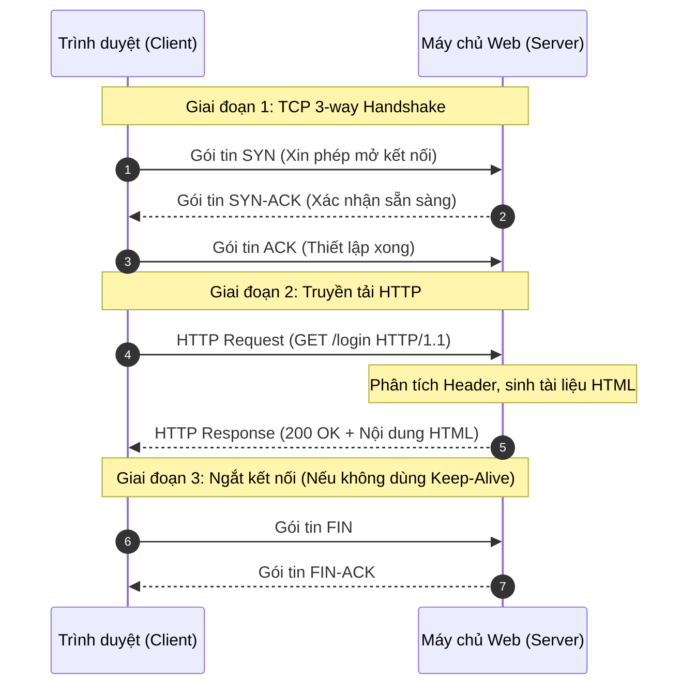

# Lesson 1: HTTP (HyperText Transfer Protocol)

> [!NOTE]
> **Category:** Theory (Lý thuyết)
> **Goal:** Nắm vững cấu trúc cốt lõi của giao thức HTTP, hiểu rõ bản chất không trạng thái (stateless) và lý do việc truyền dữ liệu dạng văn bản thuần túy đặt ra rủi ro chí mạng cho các hệ thống bảo mật IAM.

## 1. Lý thuyết chuyên sâu (Detailed Theory)

### 1.1. Bản chất của giao thức HTTP
HTTP (HyperText Transfer Protocol) là giao thức tầng ứng dụng (Application Layer) cốt lõi của World Wide Web, hoạt động dựa trên mô hình Client-Server. Trình duyệt (Client) gửi một `Request` và máy chủ (Server) trả về một `Response`.

Đặc điểm quan trọng nhất của HTTP là **không trạng thái (Stateless)**. Nghĩa là máy chủ xử lý từng `Request` một cách hoàn toàn độc lập, không giữ lại bất kỳ bộ nhớ nào về các `Request` trước đó của cùng một người dùng. Trong hệ thống Identity Access Management (IAM), điều này có nghĩa là nếu không có cơ chế phụ trợ (như Cookie hay Token), người dùng sẽ phải gửi lại Username và Password trong mọi cú click chuột.

### 1.2. Cấu trúc của một HTTP Request
Một `HTTP Request` tiêu chuẩn được chia làm 3 phần phân biệt rõ ràng:
1. **Request Line (Dòng yêu cầu):** Chứa `HTTP Verb` (phương thức GET, POST, PUT, DELETE), `URI` (đường dẫn tài nguyên đích), và phiên bản giao thức (`HTTP/1.1` hoặc `HTTP/2`).
2. **Headers (Phần đầu):** Bao gồm các cặp `Key-Value` truyền tải metadata. Các header mang tính sống còn trong IAM bao gồm:
   - `Authorization`: Nơi chứa `Bearer Token` hoặc thông tin xác thực Basic.
   - `Cookie`: Chứa `Session ID` do máy chủ cấp phát trước đó.
   - `Host`: Xác định tên miền đích (quan trọng cho định tuyến Reverse Proxy).
3. **Body (Payload - Phần thân):** Chứa dữ liệu thực tế được gửi đi. Trong luồng `Authorization Code Flow` của OAuth2, đây là nơi chứa `client_id`, `client_secret`, và `code` được định dạng dưới dạng `application/x-www-form-urlencoded`.

**Vấn đề bảo mật cốt lõi của HTTP thuần:**
Dữ liệu truyền tải qua HTTP (bao gồm toàn bộ Header và Payload) hoàn toàn là văn bản thuần túy (Plain text). Bất kỳ ai kiểm soát một router trung gian hoặc sử dụng chung mạng Wi-Fi đều có thể sử dụng kỹ thuật Packet Sniffing (đánh hơi gói tin) để đọc trộm toàn bộ thông tin xác thực nhạy cảm.

---

## 2. Luồng nội bộ & Cơ chế cấp thấp (Internal Workflow & Low-level Mechanisms)

HTTP không tự nó truyền tải dữ liệu; nó dựa vào giao thức tầng giao vận TCP (Transmission Control Protocol) để đảm bảo dữ liệu đến đích một cách toàn vẹn theo đúng thứ tự. 

Quy trình giao tiếp HTTP cấp thấp diễn ra qua các bước:



---

## 3. Thực hành tốt nhất & Bảo mật (Best Practices & Security)

> [!CAUTION]
> **Tuyệt đối không sử dụng HTTP thuần cho API bảo mật**
> Trong kiến trúc Enterprise, bất kỳ API nào có xử lý Token, Password, hoặc PII (Thông tin định danh cá nhân) đều BẮT BUỘC phải cấm hoàn toàn truy cập qua HTTP (Port 80) và phải ép buộc chuyển hướng (Redirect 301) sang HTTPS. 

> [!TIP]
> **Sử dụng cấu hình Keep-Alive**
> Quá trình thiết lập `TCP 3-way handshake` rất tốn thời gian (Network Latency). Ở môi trường Production, luôn đảm bảo cấu hình `Connection: keep-alive` được kích hoạt trên Reverse Proxy để tái sử dụng các kết nối TCP đã mở cho nhiều `HTTP Request` liên tiếp, giảm thiểu tối đa độ trễ.

---

## 4. Cấu hình minh họa thực tế (Configuration Examples)

Ví dụ cấu hình Nginx để ép buộc (force) toàn bộ lưu lượng HTTP thuần túy chuyển hướng sang giao thức an toàn:

```nginx
server {
    # Lắng nghe lưu lượng HTTP thuần không mã hóa
    listen 80;
    server_name auth.enterprise.com;

    # Thực hành tốt nhất: Trả về mã 301 (Moved Permanently) 
    # để yêu cầu Client gọi lại bằng HTTPS
    location / {
        return 301 https://$host$request_uri;
    }
}
```

---

## 5. Trường hợp ngoại lệ (Edge Cases)

- **Lỗi `Mixed Content` (Nội dung hỗn hợp):** Xảy ra khi một trang web được tải qua kết nối an toàn (HTTPS), nhưng trong mã HTML lại chứa các tài nguyên (như file JavaScript, CSS, hoặc hình ảnh) được nhúng qua các URL HTTP thuần (ví dụ `<script src="http://cdn.example.com/app.js">`). Trình duyệt hiện đại sẽ ngay lập tức **chặn đứng** (block) các tài nguyên này vì chúng có thể bị kẻ tấn công can thiệp, làm thay đổi hành vi của trang bảo mật.
  - **Khắc phục:** Đảm bảo toàn bộ các biến cấu hình URL (như `Frontend URL` trong Keycloak) đều mang scheme `https://`.
- **Giới hạn kích thước Header (Header Size Limit):** Trong hệ sinh thái microservices, `Bearer Token` (JWT) mang theo nhiều quyền hạn (roles, groups) có thể phình to lên tới vài Kilobyte. Nhiều máy chủ web (như Nginx, Tomcat) mặc định giới hạn dung lượng một `HTTP Header` ở mức 4KB hoặc 8KB. Nếu `Request` vượt quá, máy chủ sẽ trả về lỗi `431 Request Header Fields Too Large` và từ chối xử lý, khiến người dùng không thể đăng nhập.

---

## 6. Câu hỏi Phỏng vấn (Interview Questions)

**1. Giải thích đặc điểm "Không trạng thái" (Stateless) của HTTP và cách các hệ thống vượt qua giới hạn này?**
- **Junior:** HTTP không nhớ người dùng là ai sau khi gửi trả kết quả. Ta dùng Cookie để máy chủ nhớ người dùng.
- **Senior:** "Stateless" nghĩa là không có ngữ cảnh nào được giữ lại ở cấp độ giao thức giữa hai `Request` liên tiếp. Điều này giúp máy chủ dễ dàng mở rộng theo chiều ngang (Horizontal Scaling) vì bất kỳ node nào cũng có thể xử lý `Request` độc lập. Để quản lý xác thực trong hệ thống IAM, ta vượt qua giới hạn này bằng cách sử dụng cơ chế truyền trạng thái ở tầng ứng dụng, cụ thể là nhúng `Session ID` vào Header `Cookie` đối với Web App, hoặc nhúng `JWT` vào Header `Authorization` đối với Stateless API.

**2. Quá trình `TCP 3-way handshake` diễn ra như thế nào trước khi một `HTTP Request` được gửi đi?**
- **Junior:** Máy khách gọi máy chủ, máy chủ trả lời ok, rồi máy khách báo lại đã sẵn sàng.
- **Senior:** Nó gồm 3 bước: Client gửi cờ `SYN` cùng số thứ tự ngẫu nhiên. Server nhận được, cấp phát bộ nhớ đệm, rồi phản hồi cờ `SYN-ACK` kèm số thứ tự của nó. Client nhận được và gửi cờ `ACK` xác nhận. Chỉ sau khi chu trình này hoàn tất, kênh truyền tải byte stream tin cậy mới hình thành và Client mới có thể đẩy `Payload` chứa `HTTP Request` vào đường truyền.

**3. Sự khác biệt giữa `HTTP GET` và `HTTP POST` dưới góc nhìn bảo mật là gì? Tại sao luồng trao đổi Token của OAuth2 bắt buộc dùng POST?**
- **Junior:** GET dùng để lấy dữ liệu, POST dùng để gửi dữ liệu. POST bảo mật hơn vì giấu dữ liệu trong Body.
- **Senior:** GET truyền tham số qua `URI` (Query String). Dữ liệu này bị lưu lại trong lịch sử trình duyệt, Proxy logs, và Referer headers, do đó cực kỳ rủi ro nếu chứa `Access Token` hay mật khẩu. POST truyền dữ liệu trong phần `Body`, không bị log lại trên các thiết bị mạng trung gian. Luồng OAuth2 bắt buộc gọi Token Endpoint bằng phương thức POST với định dạng `application/x-www-form-urlencoded` để bảo vệ `client_secret` và `authorization_code` khỏi bị lộ lọt qua Log.

**4. Mã trạng thái (Status Code) HTTP 401 và 403 khác nhau như thế nào trong bối cảnh phân quyền?**
- **Junior:** 401 là chưa đăng nhập, 403 là không có quyền truy cập.
- **Senior:** Mã `401 Unauthorized` thực chất có nghĩa là "Unauthenticated" (Chưa được xác thực); Server không biết bạn là ai, hoặc Token bạn cung cấp không hợp lệ/đã hết hạn. Server thường kèm theo Header `WWW-Authenticate`. Mã `403 Forbidden` nghĩa là "Unauthorized" (Chưa được phân quyền); Server đã biết chính xác bạn là ai (xác thực thành công), nhưng tài khoản của bạn thiếu Role hoặc Policy cần thiết để thực thi hành động này trên tài nguyên đích.

**5. Tại sao lỗi `431 Request Header Fields Too Large` thường là ác mộng trong hệ thống IAM sử dụng JWT kích thước lớn? Cách khắc phục ở tầng hạ tầng?**
- **Junior:** Do Token quá dài. Khắc phục bằng cách tăng dung lượng Header trong cấu hình Server.
- **Senior:** Khi Keycloak nhét quá nhiều Claims (ví dụ danh sách hàng trăm Groups/Roles của người dùng Enterprise) vào Access Token, Token này sẽ vượt quá giới hạn cấu hình bộ đệm đọc Header mặc định của Reverse Proxy (như `large_client_header_buffers` trong Nginx, mặc định là 8KB). Khi đó Nginx chặn ngay tại cửa với mã 431. Cách khắc phục tầng hạ tầng là tinh chỉnh tăng bộ đệm này trong Nginx. Cách khắc phục cốt lõi ở tầng kiến trúc là không nhét toàn bộ Roles vào Token, mà chỉ trả về các quyền tối thiểu, hoặc API tự gọi lại Keycloak qua UserInfo endpoint để lấy quyền chi tiết.

---

## 7. Tài liệu tham khảo (References)
- **RFC 7230:** Hypertext Transfer Protocol (HTTP/1.1): Message Syntax and Routing. (https://datatracker.ietf.org/doc/html/rfc7230)
- **RFC 7231:** Hypertext Transfer Protocol (HTTP/1.1): Semantics and Content. (https://datatracker.ietf.org/doc/html/rfc7231)
- **MDN Web Docs:** HTTP Overview. (https://developer.mozilla.org/en-US/docs/Web/HTTP/Overview)
