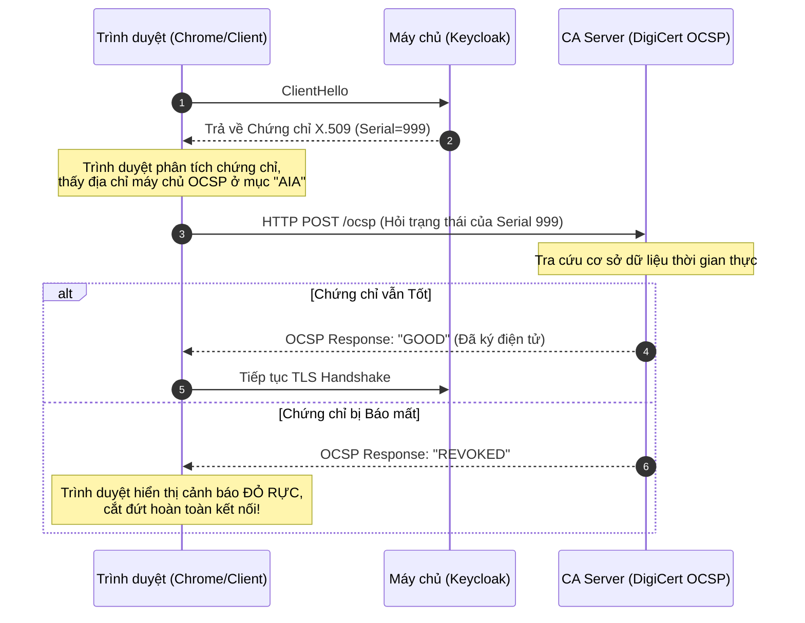

# Lesson 10: Certificates (Chứng chỉ số X.509)

> [!NOTE]
> **Category:** Theory (Lý thuyết)
> **Goal:** Giải phẫu cấu trúc thực tế của một chứng chỉ số X.509, làm chủ khái niệm SAN (Subject Alternative Name), và nắm rõ các cơ chế thu hồi chứng chỉ (CRL/OCSP) khi hệ thống bị xâm nhập.

## 1. Lý thuyết chuyên sâu (Detailed Theory)

### 1.1. Chứng chỉ số X.509 là gì?
Nếu `Public Key` (Khóa công khai) là "con số toán học" dùng để mã hóa, thì **Chứng chỉ số X.509** giống như cái "Hộ chiếu" bọc bên ngoài con số toán học đó. Nó cung cấp siêu dữ liệu (Metadata) để gắn kết tính sở hữu của Public Key với một Danh tính thực (như tên miền `auth.enterprise.com` hoặc công ty `Enterprise LLC`), và được đóng dấu pháp lý bởi Tổ chức phát hành (CA).

### 1.2. Giải phẫu cấu trúc file X.509 (Chuẩn RFC 5280)
Một file chứng chỉ tiêu chuẩn bao gồm các khối dữ liệu cốt lõi sau:
1. **Version & Serial Number:** Phiên bản (thường là v3) và số định danh duy nhất do CA cấp. Dùng để theo dõi và thu hồi.
2. **Issuer (Người phát hành):** Danh tính của CA đã ký chứng chỉ (VD: `CN=DigiCert TLS RSA SHA256 2020 CA1`).
3. **Validity (Thời hạn):** Khung thời gian `Not Before` (Ngày bắt đầu) và `Not After` (Ngày hết hạn). Mọi giao dịch ngoài khung thời gian này đều bị từ chối ngay lập tức.
4. **Subject (Chủ thể):** Danh tính của chủ sở hữu. Trong quá khứ, tên miền web được lưu ở trường `Common Name (CN)`. Tuy nhiên, thực hành này đã LỖI THỜI.
5. **Subject Public Key Info:** Dữ liệu kỹ thuật quan trọng nhất. Chứa thuật toán mã hóa (VD: RSA) và bản thân dữ liệu chuỗi Public Key.
6. **X.509v3 Extensions (Phần mở rộng v3):**
   - **Subject Alternative Name (SAN):** (Quan trọng nhất hiện nay) Đây là nơi CHÍNH THỨC chứa danh sách các tên miền, subdomain, hoặc IP mà chứng chỉ này đại diện. Trình duyệt hiện đại như Chrome sẽ **hoàn toàn phớt lờ** trường `Common Name (CN)` và chỉ đọc `SAN`.
   - **Key Usage / Extended Key Usage:** Quy định mục đích sử dụng khóa (Ví dụ: `Server Authentication` để làm HTTPS, hoặc `Digital Signature` để ký Document).

---

## 2. Luồng nội bộ & Cơ chế cấp thấp (Internal Workflow & Low-level Mechanisms)

Khi Private Key của máy chủ bị đánh cắp (bị Hack), thời hạn (`Validity`) của chứng chỉ có thể vẫn còn tới 1 năm. Làm sao để thông báo cho toàn bộ trình duyệt trên thế giới NGỪNG tin tưởng chứng chỉ đó NGAY LẬP TỨC? Đó là nhiệm vụ của cơ chế Thu hồi (Revocation).



---

## 3. Thực hành tốt nhất & Bảo mật (Best Practices & Security)

> [!CAUTION]
> **Kết thúc kỷ nguyên của Wildcard Certificates**
> Chứng chỉ Wildcard (`*.enterprise.com`) rất tiện lợi vì mua 1 cái dùng được cho hàng trăm Subdomain, nhưng về mặt bảo mật Enterprise nó là một thảm họa (SPOF - Single Point of Failure). Nếu hacker hack được máy chủ dev (`test.enterprise.com`) và trộm được Private Key của chứng chỉ Wildcard, hắn có thể dùng chính khóa đó để lập ra máy chủ giả mạo trang `auth.enterprise.com` hợp lệ.
>
> **Best Practice:** Triển khai **Tự động hóa Chứng chỉ (Automated Certificate Rotation)** (ví dụ dùng giao thức ACME/Certbot với Let's Encrypt) để mỗi máy chủ có một chứng chỉ độc lập với thời hạn cực ngắn (90 ngày). Hết hạn tự động gia hạn.

> [!IMPORTANT]
> **OCSP Stapling (Dập ghim OCSP)**
> Việc trình duyệt phải hỏi server CA (OCSP) mỗi lần kết nối gây ra độ trễ mạng cực lớn và lộ lọt quyền riêng tư (CA biết user đang lướt web nào). `OCSP Stapling` giải quyết bằng cách: Máy chủ Keycloak (hoặc Nginx) định kỳ tự động hỏi CA lấy giấy chứng nhận "Good", rồi dập ghim (Staple) giấy chứng nhận đó đi kèm với Chứng chỉ X.509 gửi cho Client trong lúc Handshake. Client không cần phải tự hỏi CA nữa, tăng tốc toàn diện kết nối.

---

## 4. Cấu hình minh họa thực tế (Configuration Examples)

Lệnh OpenSSL tiêu chuẩn dùng để tạo ra một **CSR (Certificate Signing Request)** - tức là file Đơn xin cấp chứng chỉ để gửi cho CA, với việc khai báo chuẩn xác cấu trúc `SAN` (Subject Alternative Name) cho một cụm máy chủ Keycloak:

```bash
# Tạo file cấu hình tạm (san_config.cnf)
cat > san_config.cnf <<EOF
[req]
default_bits       = 2048
prompt             = no
default_md         = sha256
req_extensions     = req_ext
distinguished_name = dn

[dn]
C  = VN
ST = Hanoi
L  = Hanoi
O  = Enterprise LLC
OU = Identity Management
CN = auth.enterprise.com # Common Name (Giữ lại cho tương thích ngược)

[req_ext]
subjectAltName = @alt_names

[alt_names]
# Định nghĩa TẤT CẢ các tên miền mà cụm Keycloak sẽ phục vụ
DNS.1 = auth.enterprise.com
DNS.2 = sso.enterprise.com
IP.1  = 192.168.1.10
EOF

# Chạy lệnh sinh Private Key bí mật (auth.key) và Đơn CSR (auth.csr)
openssl req -new -nodes -keyout auth.key -out auth.csr -config san_config.cnf

# Mang file auth.csr gửi cho CA (DigiCert/Private CA) để họ ký và trả về file .crt
```

---

## 5. Trường hợp ngoại lệ (Edge Cases)

- **Root CA hết hạn (Root CA Expiration):** Một sự kiện chấn động Internet năm 2021 là khi chứng chỉ Root CA "DST Root CA X3" của Let's Encrypt hết hạn. Mặc dù chứng chỉ Leaf của các website vẫn còn hạn, nhưng vì Root CA ở hệ điều hành của Client (đặc biệt là các thiết bị cũ, Android đời thấp) đã hết hạn, toàn bộ chuỗi niềm tin (Chain of Trust) sụp đổ. Hàng triệu API rớt mạng với lỗi `Certificate has expired`. 
  - **Bài học:** Việc quản lý chứng chỉ không chỉ là nhìn vào thời hạn của server mình, mà phải giám sát tuổi thọ của cả Root và Intermediate CA. Nếu phục vụ thiết bị IoT/Android đời cũ, phải chủ động chọn nhà cung cấp CA (như DigiCert) có Root CA tuổi thọ cực cao trên các thiết bị cổ.
- **CRL (Danh sách Thu hồi) Quá Lớn:** Trước OCSP, cơ chế thu hồi sử dụng CRL (Certificate Revocation List). Trình duyệt tải về nguyên một cuốn "Sổ bìa đen" dung lượng hàng chục Megabyte chứa danh sách hàng triệu số Serial bị thu hồi. Điều này gây tắc nghẽn băng thông khủng khiếp. Ngày nay, các hệ thống bắt buộc chuyển sang OCSP (Hỏi đáp nhanh gọn).

---

## 6. Câu hỏi Phỏng vấn (Interview Questions)

**1. Khác biệt cốt lõi giữa `Private Key`, `Certificate` (Chứng chỉ) và `CSR` (Certificate Signing Request) là gì?**
- **Junior:** Private Key là mật khẩu để mã hóa. CSR là đơn xin xỏ. Certificate là cái giấy chứng nhận lấy về để đưa vào Nginx.
- **Senior:** `Private Key` (Khóa riêng) là tài sản mật mã gốc dùng để giải mã và ký chữ ký số, bắt buộc giữ bí mật tuyệt đối trên máy chủ. `CSR` là một gói dữ liệu bao gồm `Public Key` (Khóa công khai) của máy chủ và thông tin định danh (Tên miền, Tổ chức), được ký bằng chính Private Key đó để chứng minh tính toàn vẹn, dùng để nộp cho CA. `Certificate` (X.509) là sản phẩm cuối cùng do CA sinh ra sau khi duyệt CSR, nó chứa Public Key và thông tin của bạn, nhưng giờ được ĐÓNG DẤU CHỮ KÝ của CA bằng Private Key của CA, và được công khai cho cả thế giới tải về.

**2. Nếu hệ thống của bạn nhận được phản hồi lỗi `Subject Alternative Name missing`, nguyên nhân kỹ thuật là gì?**
- **Junior:** Do quên điền trường Common Name (CN) lúc tạo chứng chỉ.
- **Senior:** Lỗi này xảy ra khi sử dụng một chứng chỉ được tạo theo chuẩn cũ (chỉ khai báo tên miền ở trường `Common Name`). Kể từ năm 2017 (RFC 2818), Google Chrome và hầu hết các trình duyệt, thư viện HTTP (như Java `HttpClient`) đã ngừng hỗ trợ việc kiểm tra định danh qua `Common Name`. Hệ thống BẮT BUỘC phải đọc trường mở rộng `Subject Alternative Name` (SAN) để đối chiếu tên miền. Lỗi xuất hiện vì chứng chỉ của bạn (thường là tự ký qua OpenSSL sơ sài) hoàn toàn vắng bóng trường SAN mở rộng này. 

**3. Làm sao để giải quyết tình huống thiết kế mạng đóng (Air-gapped Network) khiến máy chủ Backend bị treo (Timeout) khi xác thực chứng chỉ của API bên ngoài?**
- **Junior:** Thêm quy tắc tường lửa (Firewall) cho phép Backend gọi API ngoài.
- **Senior:** Lỗi treo máy không phải do API đích bị chặn, mà do thư viện TLS của Backend (ví dụ Java/Spring) tự động gọi giao thức HTTP(s) đi ra ngoài Internet để truy vấn máy chủ OCSP (hoặc tải tệp CRL) của CA (ví dụ: `ocsp.digicert.com`) nhằm kiểm tra xem chứng chỉ của API đích có bị thu hồi hay không. Do mạng nội bộ Air-gapped cấm kết nối Internet, truy vấn OCSP bị Firewall chặn, dẫn đến trạng thái treo chờ (Timeout) rồi sập kết nối. Giải pháp là thiết lập Proxy nội bộ cho cấu hình JVM (`-Dhttp.proxyHost`), hoặc tắt kiểm tra OCSP ở cấp độ ngôn ngữ lập trình (không khuyến khích), hoặc tốt nhất là cấu hình Firewall cho phép thông tuyến riêng đến các máy chủ OCSP/CRL do CA cung cấp.

**4. OCSP Stapling (Dập ghim) mang lại lợi ích kép về Bảo mật và Hiệu năng như thế nào?**
- **Junior:** Nó làm kết nối nhanh hơn vì Client không phải tự đi kiểm tra CA.
- **Senior:** Về hiệu năng: Nó loại bỏ 1 lượt Round-Trip Time (RTT) nặng nề và độ trễ DNS khi Client phải tự mở kết nối riêng lẻ sang máy chủ OCSP của CA. Trách nhiệm tải OCSP được chuyển sang cho máy chủ Web (có đường truyền cực mạnh), và kết quả được dập ghim gửi kèm luôn trong TLS Handshake. Về bảo mật/quyền riêng tư (Privacy): Nó ngăn chặn việc CA biết được chính xác địa chỉ IP của Client và thời gian họ truy cập vào Website nào (điều từng gây ra cuộc khủng hoảng lộ lọt thói quen lướt web). Máy chủ Web tải OCSP định kỳ nên CA chỉ thấy IP của Web Server.

**5. Điều gì xảy ra nếu chứng chỉ X.509 bị hết hạn (Expired)? Có thể cứu vãn dữ liệu đã mã hóa không?**
- **Junior:** Hết hạn thì web sập, không ai vào được. Phải mua mới và thay thế.
- **Senior:** Khi hết hạn (`Not After`), các kết nối TLS **mới** sẽ bị từ chối thiết lập do trình duyệt báo lỗi `NET::ERR_CERT_DATE_INVALID`. Tuy nhiên, về mặt toán học mật mã học, cặp khóa Public/Private Key không hề bị hư hỏng hay mất tác dụng. Bạn vẫn hoàn toàn có thể dùng Private Key đó để giải mã các gói tin cũ, hoặc thậm chí bỏ qua cảnh báo trình duyệt để kết nối. Thời hạn chứng chỉ chỉ là một công cụ Quản trị rủi ro (Risk Management) do con người quy định, ép buộc hệ thống phải xoay vòng khóa (Key Rotation) định kỳ, giảm thiểu cơ hội hacker bẻ khóa (Brute-force) một khóa tĩnh theo thời gian.

---

## 7. Tài liệu tham khảo (References)
- **RFC 5280:** Internet X.509 Public Key Infrastructure Certificate and Certificate Revocation List (CRL) Profile. (https://datatracker.ietf.org/doc/html/rfc5280)
- **RFC 6960:** X.509 Internet Public Key Infrastructure Online Certificate Status Protocol - OCSP.
- **Let's Encrypt:** How It Works. (https://letsencrypt.org/howitworks/)
