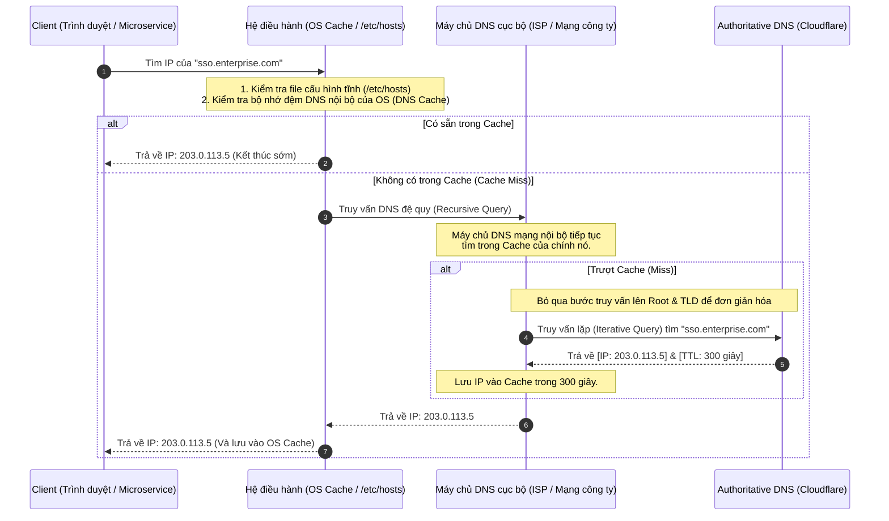

# Lesson 11: DNS (Domain Name System)

> [!NOTE]
> **Category:** Theory (Lý thuyết)
> **Goal:** Làm chủ hệ thống phân giải tên miền (DNS). Hiểu rõ các luồng truy vấn bộ đệm (Caching) và cách vận dụng tối đa sức mạnh của bản ghi CNAME, A Record để triển khai kiến trúc Cân bằng tải (Load Balancing) và Chống chịu thảm họa (Disaster Recovery) cho hệ thống Keycloak.

## 1. Lý thuyết chuyên sâu (Detailed Theory)

### 1.1. DNS là gì? (Danh bạ của Internet)
Máy tính chỉ có thể định tuyến và giao tiếp thông qua Địa chỉ IP (ví dụ: IPv4 `192.168.1.1` hoặc IPv6). Con người thì chỉ có thể ghi nhớ ngôn ngữ tự nhiên (ví dụ: `auth.enterprise.com`). 
**DNS (Domain Name System)** là hệ thống cơ sở dữ liệu phân tán toàn cầu, làm nhiệm vụ phiên dịch tên miền sang địa chỉ IP.

Kiến trúc DNS là kiến trúc phân cấp hình cây rễ ngược (Hierarchical Tree):
1. **Root Nameservers (`.`):** Đỉnh của chóp, chứa danh sách các máy chủ quản lý các đuôi miền (TLD).
2. **TLD Nameservers (Top-Level Domain):** Quản lý các đuôi `.com`, `.net`, `.vn`. Chúng biết ai quản lý `enterprise.com`.
3. **Authoritative Nameservers:** Máy chủ uy quyền cuối cùng do doanh nghiệp (hoặc Cloudflare, Route53 AWS) quản lý. Nắm giữ tệp Zone chứa cấu hình chính xác `auth.enterprise.com` trỏ về IP nào.

### 1.2. Các loại Bản ghi (DNS Records) cốt yếu trong IAM
- **A Record (Address):** Ánh xạ trực tiếp 1 tên miền sang 1 địa chỉ IPv4 cố định. (VD: `auth.enterprise.com -> 203.0.113.10`).
- **AAAA Record:** Tương tự như A Record nhưng dành cho địa chỉ IPv6.
- **CNAME (Canonical Name):** Bản ghi "Bí danh". Nó không trỏ về IP, mà trỏ tên miền này sang một tên miền khác. Cực kỳ quan trọng khi dùng dịch vụ Cloud. (VD: `auth.enterprise.com -> keycloak-alb-xyz.us-east-1.elb.amazonaws.com`).
- **TXT Record:** Bản ghi dạng văn bản, không dùng để định tuyến IP. Thường dùng cho các cấu hình bảo mật xác minh quyền sở hữu tên miền (như SPF, DKIM chống giả mạo Email, hoặc thử thách xác thực của Let's Encrypt cấp chứng chỉ).

---

## 2. Luồng nội bộ & Cơ chế cấp thấp (Internal Workflow & Low-level Mechanisms)

Khi một Microservice hoặc trình duyệt muốn gọi API đến `sso.enterprise.com`, quá trình truy vấn DNS (DNS Resolution) phải trải qua một mê cung bộ đệm (Cache) phức tạp trước khi ra đến Internet.



---

## 3. Thực hành tốt nhất & Bảo mật (Best Practices & Security)

> [!CAUTION]
> **Rủi ro Caching lâu (DNS Propagation Delay)**
> Thuộc tính `TTL` (Time To Live) định nghĩa thời gian tính bằng giây mà các máy chủ trung gian (ISP, OS) được phép "nhớ" (cache) địa chỉ IP. Nếu bạn đặt TTL = `86400` (24 giờ), và máy chủ Keycloak chết, bạn đổi IP trên bảng quản trị DNS, người dùng trên toàn thế giới sẽ **không thể truy cập được hệ thống trong suốt 24 giờ tiếp theo** do máy tính của họ cứ cứng đầu dùng IP cũ đã chết từ trong Cache.
> 
> **Best Practice:** Đối với hệ thống Cốt lõi như IAM/Keycloak, cấu hình DNS phải để TTL cực ngắn (ví dụ `60 giây` hoặc `300 giây` - 5 phút). Nó đổi lấy một chút độ trễ phân giải (phần nghìn giây) để lấy sự linh hoạt thay đổi IP gần như tức thời khi xảy ra thảm họa đứt cáp (Failover Routing).

> [!IMPORTANT]
> **Split-Brain DNS (DNS nội bộ và bên ngoài)**
> Trong môi trường Enterprise, người dùng ở nhà (truy cập qua Internet) và nhân viên ở công ty (truy cập mạng LAN) đều gõ `auth.enterprise.com`. 
> Nếu giải quyết bằng 1 Public DNS duy nhất, nhân viên ở công ty gọi API sẽ bị định tuyến vòng ra Internet rồi quay ngược lại VPN (Tốn băng thông và tăng độ trễ mạng). Cần cấu hình một **Internal DNS Server**. Nội bộ công ty phân giải `auth.enterprise.com` trỏ thẳng vào IP Private LAN (`10.0.0.5`), trong khi máy chủ Public DNS của Cloudflare trỏ vào IP Public Load Balancer (`203.0.113.5`).

---

## 4. Cấu hình minh họa thực tế (Configuration Examples)

Làm thế nào để môi trường Development trên máy tính của Lập trình viên có thể giả lập tên miền Enterprise (để test HTTPS/Cookie SameSite) mà không cần thay đổi cấu hình DNS thật của công ty? Bằng cách can thiệp vào tầng cao nhất của luồng độ ưu tiên DNS: **Tệp Hosts cục bộ**.

Cấu hình tệp `/etc/hosts` (Linux/macOS) hoặc `C:\Windows\System32\drivers\etc\hosts` (Windows):

```text
# Localhost Routing
127.0.0.1   localhost

# [TẦNG CAO NHẤT ĐỘ ƯU TIÊN]
# Khi trình duyệt trên máy CỦA BẠN gọi tên miền auth.enterprise.com,
# Hệ điều hành sẽ CHẶN đứng luồng truy vấn DNS ra Internet,
# và lập tức trả về IP 127.0.0.1 (Docker container Keycloak trên máy local của bạn).
127.0.0.1   auth.enterprise.com
```

---

## 5. Trường hợp ngoại lệ (Edge Cases)

- **Ngộ độc bộ đệm DNS (DNS Spoofing / Cache Poisoning):** Hacker bằng cách nào đó ép máy chủ DNS cục bộ của quán Cà phê (hoặc ISP lỏng lẻo) nhận một gói tin phản hồi DNS giả mạo. Từ đó, bộ đệm của DNS quán Cà phê ghi nhớ: `auth.enterprise.com = IP của máy Hacker`. Toàn bộ nhân viên ngồi tại quán sẽ bị định tuyến vào trang đăng nhập Keycloak giả mạo để trộm mật khẩu (Phishing) mặc dù URL hiển thị trên trình duyệt hoàn toàn chính xác. 
  - **Khắc phục:** Hệ thống mạng hiện đại triển khai giao thức `DNSSEC` (Ký chữ ký điện tử lên các bản ghi DNS) để máy tính xác minh được IP trả về là hàng thật do chính công ty cung cấp. Và tất nhiên, TLS/HTTPS sẽ làm chốt chặn cuối cùng (Hacker không có chứng chỉ TLS hợp lệ).
- **Hạn chế CNAME ở Root Domain (Apex Domain):** Theo tiêu chuẩn RFC của DNS, bạn **KHÔNG ĐƯỢC PHÉP** tạo một bản ghi `CNAME` nằm ở gốc của tên miền chính (ví dụ `enterprise.com` CNAME tới Cloud LB). CNAME chỉ hợp lệ ở các tên miền phụ (Subdomain như `auth.enterprise.com`). Nếu cố tình đặt, nó sẽ làm hỏng toàn bộ luồng nhận Email (MX Records) của tên miền đó. (Các nền tảng đám mây lớn giải quyết bằng các kỹ thuật phi chuẩn như `ALIAS record` hoặc `CNAME Flattening`).

---

## 6. Câu hỏi Phỏng vấn (Interview Questions)

**1. Tại sao trong môi trường triển khai Cloud (như AWS, Azure), quản trị viên hệ thống thường dùng bản ghi CNAME để trỏ tên miền thay vì bản ghi A?**
- **Junior:** Vì IP đám mây thay đổi liên tục, nên dùng CNAME trỏ thẳng vào cái tên miền mà nhà cung cấp cho.
- **Senior:** Các dịch vụ Cloud Load Balancer (ELB của AWS) không cung cấp một IP tĩnh (Static IP). Dựa vào tải lưu lượng của người dùng, AWS có thể tự động co giãn Load Balancer bằng cách sinh ra thêm nhiều IP ảo (Dynamic IP allocation) đằng sau hạ tầng của họ. Nếu ta cố định một bản ghi A (A Record) trỏ vào một IP hiện tại của ELB, lúc AWS đổi IP, hệ thống sẽ sập. Khi ta dùng `CNAME` trỏ đến DNS do ELB cấp (ví dụ: `my-alb.aws.com`), trình duyệt sẽ phân giải CNAME đó, và hệ thống DNS của chính AWS sẽ linh hoạt trả về các IP thực tế đang chạy khỏe tại thời điểm đó.

**2. Nếu tôi đổi địa chỉ IP của cụm Keycloak vào nửa đêm, nhưng sáng hôm sau người dùng ở một vài quốc gia báo lỗi vẫn vào trang cũ, nguyên nhân là gì?**
- **Junior:** Do DNS bị lag, chưa cập nhật trên toàn thế giới.
- **Senior:** Sự cố này xuất phát từ hiện tượng Caching của DNS ở nhiều tầng khác nhau, chịu sự chi phối của chỉ số TTL (Time To Live) cấu hình trên bản ghi ban đầu. Máy chủ DNS tại các ISP (nhà mạng) địa phương hoặc bộ đệm hệ điều hành của người dùng vẫn đang lưu trữ địa chỉ IP cũ do TTL chưa hết hạn đếm ngược. Nếu bản ghi trước đó thiết lập TTL quá dài (ví dụ 86400 giây - 24 giờ), quản trị viên mạng đành "bó tay" đứng nhìn cho đến khi Cache tự hết hạn. Bài học kinh nghiệm trong quy trình Migration (chuyển đổi hạ tầng) là phải vào cấu hình DNS hạ TTL xuống mức 5 phút (300s) từ vài ngày trước thời điểm chuyển đổi, để ép toàn thế giới nạp IP mới nhanh nhất.

**3. Làm thế nào JVM (Java Virtual Machine) của microservice kết nối với Keycloak bị ảnh hưởng bởi DNS Cache nội tại?**
- **Junior:** Java dùng chung DNS của Windows nên bị lưu cache giống trình duyệt.
- **Senior:** Mặc định, máy ảo JVM tự thực thi và lưu trữ bộ đệm DNS riêng của nó (độc lập với hệ điều hành) để tăng tốc độ khởi tạo Socket. Tuy nhiên, theo lịch sử cấu hình (như trên Java 8), giá trị `networkaddress.cache.ttl` đôi khi được đặt là "vô hạn" (-1) mặc định do các ràng buộc security manager. Nghĩa là, một khi microservice (chạy Spring Boot) đã phân giải IP của Keycloak lần đầu tiên lúc khởi động, nó sẽ dùng IP đó MÃI MÃI, mặc kệ sự kiện Keycloak đã được Load Balancer đổi sang IP khác. Lập trình viên phải ý thức ghi đè (override) tham số bảo mật `java.security` này, set cache TTL xuống mức thấp (ví dụ 10-30 giây) để cho phép kiến trúc Microservices co giãn động linh hoạt.

**4. Khi trình duyệt gửi truy vấn "Tìm IP của `auth.enterprise.com`" cho ISP, đây là truy vấn Lặp (Iterative) hay Đệ quy (Recursive)? Tại sao?**
- **Junior:** Là đệ quy vì nó cứ lặp đi lặp lại tìm cho tới khi ra kết quả.
- **Senior:** Trình duyệt Client gửi truy vấn **Đệ quy (Recursive)** đến DNS Server của ISP. Truy vấn Đệ quy có nghĩa là: "Tôi giao khoán toàn bộ nhiệm vụ cho anh, anh làm ơn trả về cho tôi câu trả lời cuối cùng (IP) hoặc lỗi, tôi không quan tâm quá trình". Máy chủ ISP lúc này đóng vai trò Resolver, nó gánh việc nặng, và nó sẽ đi thực hiện một chuỗi các truy vấn **Lặp (Iterative)** (giao tiếp với Root Server, rồi đến TLD, rồi đến Authoritative) để tự lắp ráp câu trả lời. Cơ chế này giúp Client (ví dụ điện thoại) tiết kiệm tài nguyên xử lý và băng thông mạng.

**5. Lệnh ping trả về đúng IP, nhưng cURL hoặc trình duyệt lại không kết nối được hệ thống Keycloak HTTPS. Hãy phân tích lỗi?**
- **Junior:** Do cổng mạng chưa mở, ping là kiểm tra mạng, duyệt web dùng cổng khác.
- **Senior:** `Ping` sử dụng giao thức ICMP ở tầng Network (Tầng 3), chỉ chứng minh được rằng máy chủ đích đang sống, phân giải DNS ra IP chính xác, và đường truyền ICMP không bị Tường lửa chặn. Tuy nhiên, luồng web lại chạy trên giao thức TCP, cụ thể là HTTPS trên Port 443 (Tầng 4 và Tầng 7). Sự cố có thể đến từ việc: (1) Firewall (Security Group) cấm Port 443 TCP; (2) Tiến trình Nginx (Reverse Proxy) đã sập (Process dead); hoặc (3) Lỗi cấu hình SSL/TLS (hết hạn chứng chỉ, lệch cấu hình mã hóa Cipher Suite) khiến `TLS Handshake` bị trình duyệt tự cắt đứt ngay trước khi thực hiện luồng truyền tải HTTP.

---

## 7. Tài liệu tham khảo (References)
- **RFC 1034:** Domain Names - Concepts and Facilities. (https://datatracker.ietf.org/doc/html/rfc1034)
- **RFC 1035:** Domain Names - Implementation and Specification. (https://datatracker.ietf.org/doc/html/rfc1035)
- **AWS Route 53 Documentation:** Choosing between alias and non-alias records.
