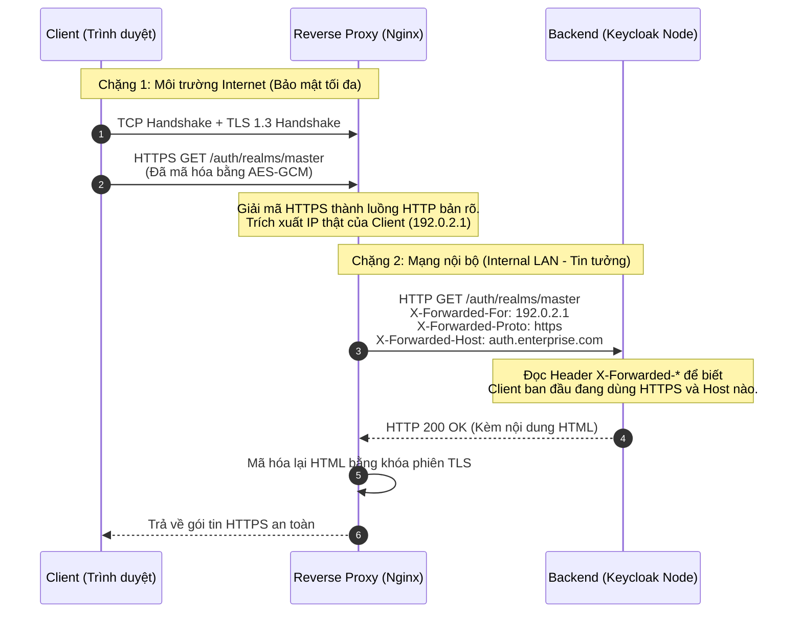

# Lesson 12: Reverse Proxy (Máy chủ Ủy quyền Ngược)

> [!NOTE]
> **Category:** Theory (Lý thuyết)
> **Goal:** Hiểu rõ bản chất kiến trúc của Reverse Proxy. Nắm vững kỹ thuật TLS Termination, cách "che giấu" mạng nội bộ, và nguyên tắc truyền tải các HTTP Header sống còn để hệ thống Keycloak đứng phía sau hoạt động chính xác.

## 1. Lý thuyết chuyên sâu (Detailed Theory)

### 1.1. Khái niệm Proxy
Proxy là một máy chủ trung gian đứng giữa hai điểm giao tiếp mạng.
- **Forward Proxy (Ủy quyền Xuôi):** Đại diện cho **Client**. Ví dụ: Nhân viên công ty truy cập mạng thông qua một Proxy của công ty để vượt tường lửa, hoặc dùng VPN/Proxy để fake IP ẩn danh lướt web. Máy chủ web đích không biết người dùng thật là ai, chỉ thấy IP của Proxy.
- **Reverse Proxy (Ủy quyền Ngược):** Đại diện cho **Server**. Ví dụ: Nginx, HAProxy, AWS ALB. Khi người dùng truy cập `https://auth.enterprise.com`, họ thực chất đang kết nối đến Reverse Proxy. Proxy này sẽ nhận Request, kiểm tra, rồi thay mặt người dùng gửi Request đó vào cho Keycloak nằm sâu trong mạng nội bộ. Người dùng không bao giờ biết địa chỉ IP thật của máy chủ Keycloak.

### 1.2. Vai trò của Reverse Proxy trong kiến trúc IAM
1. **Che giấu cấu trúc mạng (Topology Hiding):** Bảo vệ các Node Keycloak khỏi bị tấn công trực tiếp từ Internet (DDoS, quét cổng).
2. **TLS Termination (Kết thúc TLS):** Proxy đóng vai trò là "người gác cổng" mã hóa. Nó nhận kết nối HTTPS phức tạp, giải mã (Decrypt) bằng phần cứng chuyên biệt, rồi đẩy dữ liệu dưới dạng HTTP thuần (nhẹ nhàng hơn nhiều) vào mạng nội bộ cho Keycloak xử lý.
3. **Bộ đệm (Caching) và Nén dữ liệu (Compression):** Giảm tải cho Keycloak bằng cách tự động lưu cache các file tĩnh (CSS, JS, Fonts của trang Login) và nén bằng Gzip/Brotli trước khi trả về cho Client.

---

## 2. Luồng nội bộ & Cơ chế cấp thấp (Internal Workflow & Low-level Mechanisms)

Khi áp dụng TLS Termination, luồng giao tiếp mạng bị chia làm hai chặng (Two-leg connection).



---

## 3. Thực hành tốt nhất & Bảo mật (Best Practices & Security)

> [!IMPORTANT]
> **Bộ 3 Header Định tuyến Bắt buộc (X-Forwarded-*)**
> Vì Keycloak bị mất liên lạc trực tiếp với Client, nếu Reverse Proxy không truyền ngữ cảnh xuống, Keycloak sẽ sinh ra các URL lỗi (ví dụ sinh link `http://10.0.0.5/login` thay vì `https://auth.enterprise.com/login`).
> Reverse Proxy BẮT BUỘC phải chèn 3 Header sau vào mọi Request đẩy xuống Keycloak:
> 1. `X-Forwarded-For`: IP thật của người dùng (dùng để Audit Log và chống Brute Force).
> 2. `X-Forwarded-Proto`: Giao thức ban đầu (`https`), để Keycloak biết luồng đi vào là an toàn.
> 3. `X-Forwarded-Host`: Tên miền ban đầu (`auth.enterprise.com`), dùng để Keycloak dựng lại Base URL.

> [!WARNING]
> **Rủi ro giả mạo IP (IP Spoofing) qua Header**
> Nếu Hacker gửi sẵn Header `X-Forwarded-For: 127.0.0.1` lên Reverse Proxy, và Proxy ngây thơ nối thêm IP thực của Hacker vào (hoặc pass nguyên văn), Backend có thể bị lừa rằng luồng truy cập đến từ mạng nội bộ (Trusted IP). Reverse Proxy ở mép mạng (Edge) phải được cấu hình để XÓA (Strip) mọi Header `X-Forwarded-For` do Client tự gửi, và thiết lập lại từ đầu bằng IP thật ở tầng TCP.

---

## 4. Cấu hình minh họa thực tế (Configuration Examples)

Cấu hình chuẩn mực của Nginx khi làm Reverse Proxy (có TLS Termination) đứng trước Keycloak:

```nginx
server {
    listen 443 ssl;
    server_name sso.enterprise.com;

    # Cấu hình chứng chỉ TLS ở đây...

    location / {
        proxy_pass http://keycloak_backend:8080;
        
        # Các Header tối quan trọng
        proxy_set_header Host $host;
        # Ghi lại IP thực của client ở tầng TCP
        proxy_set_header X-Real-IP $remote_addr;
        # Nếu có nhiều proxy nối tiếp, thêm IP hiện tại vào danh sách
        proxy_set_header X-Forwarded-For $proxy_add_x_forwarded_for;
        proxy_set_header X-Forwarded-Proto $scheme;
        proxy_set_header X-Forwarded-Host $host;
        proxy_set_header X-Forwarded-Port $server_port;

        # Cấu hình Timeout để không làm đứt luồng đăng nhập chậm
        proxy_connect_timeout 60s;
        proxy_read_timeout 60s;
        
        # Cho phép các Header lớn (Quan trọng cho JWT / Cookies khổng lồ)
        proxy_buffer_size 128k;
        proxy_buffers 4 256k;
        proxy_busy_buffers_size 256k;
    }
}
```
*Lưu ý ở phía Keycloak:* Bạn phải bật biến môi trường `KC_PROXY=edge` để Keycloak tin tưởng và phân tích các Header `X-Forwarded-*` này.

---

## 5. Trường hợp ngoại lệ (Edge Cases)

- **Proxy loại bỏ Header `Authorization` ngầm:** Một số cấu hình mặc định của Apache HTTP Server hoặc các CDN (như Cloudflare) sẽ âm thầm loại bỏ (Drop) Header `Authorization: Bearer <token>` vì lý do bảo mật trước khi đẩy xuống Backend. Điều này khiến Frontend kêu gào lỗi "401 Unauthorized" dù Token hoàn toàn hợp lệ và đã được gửi đi.
  - **Khắc phục:** Phải cấu hình tường minh cho phép Pass-through các Header bảo mật (Ví dụ Apache cần `CGIPassAuth On`).
- **WebSocket Timeout:** Các luồng truyền thông thời gian thực bằng WebSocket (ví dụ hệ thống log thời gian thực) là kết nối liên tục (Long-lived connection). Reverse Proxy mặc định (như Nginx) sẽ tự động ngắt kết nối nếu không có dữ liệu trao đổi trong 60 giây. Bắt buộc phải cấu hình `proxy_read_timeout` cao hơn và cấu hình Upgrade HTTP/1.1 cho các endpoint WebSocket.

---

## 6. Câu hỏi Phỏng vấn (Interview Questions)

**1. Trong kiến trúc Microservices, bạn chọn đặt Reverse Proxy ở đâu?**
- **Junior:** Đặt ở đằng trước mạng Internet để bảo vệ toàn bộ ứng dụng bên trong.
- **Senior:** Reverse Proxy (như Nginx) thường đặt ở DMZ (DeMilitarized Zone - Vùng phi quân sự) tiếp giáp Internet để làm API Gateway/Ingress Controller. Nhiệm vụ của nó là TLS Termination, WAF (Web Application Firewall), và Rate Limiting. Toàn bộ các dịch vụ nội bộ (như Keycloak, User Service) được giấu kín hoàn toàn trong Private Subnet không có IP Public. Các Microservice nội bộ gọi nhau qua mạng LAN thì không cần đi qua Reverse Proxy này (hoặc có thể dùng Service Mesh proxy nội bộ riêng).

**2. Giải thích cơ chế `TLS Termination` và rủi ro bảo mật tiềm ẩn của nó?**
- **Junior:** Là giải mã HTTPS thành HTTP ở proxy. Rủi ro là nếu ai hack được mạng nội bộ thì đọc được hết.
- **Senior:** TLS Termination Offloading giúp giảm tải CPU mật mã cho cụm Backend và tập trung quản trị chứng chỉ tại một điểm (Edge). Tuy nhiên, rủi ro (Zero-Trust Violation) nằm ở chỗ chặng thứ 2 (từ Proxy vào Backend) truyền dữ liệu dạng văn bản rõ (Plaintext). Bất kỳ tác nhân xấu nào (kể cả nhân viên DevOps nội bộ) có quyền truy cập vào mạng LAN đều có thể Sniff toàn bộ Access Token và Password. Nếu hệ thống yêu cầu tuân thủ PCI-DSS khắt khe, ta không được dùng Termination, mà phải cấu hình `TLS Passthrough` (Proxy chỉ đẩy luồng TCP đi, không giải mã) hoặc `End-to-End Encryption` (Proxy giải mã xong lại dùng chứng chỉ nội bộ mã hóa lại một lần nữa trước khi đẩy xuống Backend).

**3. Tại sao Keycloak lại block địa chỉ IP thật của người dùng nếu cấu hình Proxy bị sai?**
- **Junior:** Vì Keycloak nhận IP của cái Proxy nên tưởng Proxy là người dùng đang spam mật khẩu.
- **Senior:** Đây là rủi ro của cơ chế phòng thủ Brute-Force nội tại. Nếu Nginx không truyền IP qua header `X-Forwarded-For`, hoặc Keycloak không được cấu hình `KC_PROXY=edge` để lắng nghe header đó, thì Keycloak sẽ đọc `Socket.getRemoteAddress()` là IP tầng TCP. IP tầng TCP lúc này là của chính Nginx. Khi hàng ngàn người dùng đăng nhập qua Nginx, Keycloak thấy "một IP duy nhất" đang thực hiện hàng ngàn luồng xác thực mỗi phút. Nó kích hoạt tính năng chống Brute-Force, lập tức khóa (Ban) IP của Nginx. Hậu quả là toàn bộ hệ thống sập với mọi khách hàng.

**4. Kẻ tấn công thực hiện kỹ thuật `IP Spoofing` qua Header như thế nào?**
- **Junior:** Hacker tự tạo header sửa IP của mình thành IP khác để giấu thân phận.
- **Senior:** Kẻ tấn công sử dụng công cụ như Postman để chèn trực tiếp Header `X-Forwarded-For: 10.0.0.5` (một IP đáng tin cậy trong mạng nội bộ) vào HTTP Request. Nếu Reverse Proxy cấu hình ngây ngô kiểu "Nối thêm vào Header hiện có" thay vì "Xóa trắng và dùng IP TCP", thì Request bay xuống Backend sẽ mang 2 IP. Backend thường có thói quen đọc IP đầu tiên trong chuỗi, thế là nó tưởng Request đến từ IP `10.0.0.5` và cấp quyền truy cập Admin không cần xác thực (IP Whitelisting Bypass). Proxy ở biên Internet phải luôn ghi đè cứng (Override) Header này.

**5. Cơ chế `Large Client Header Buffers` của Nginx có ảnh hưởng gì đến OAuth2/OIDC?**
- **Junior:** Để nó cho phép gửi File bự lên.
- **Senior:** Header Buffer không liên quan đến File (File nằm ở Body). Nginx thiết lập một bộ đệm RAM giới hạn (thường là 4KB hoặc 8KB) để đọc HTTP Headers. Trong kiến trúc OIDC, `Access Token` (JWT) mang theo hàng trăm Roles và Claims có thể phình to lên 10KB. Khi Client gửi Header `Authorization: Bearer <Token_Bự>`, dung lượng của luồng Header vượt quá bộ đệm của Nginx. Nginx ngay lập tức ném lỗi `431 Request Header Fields Too Large` và cắt đứt luồng trước khi nó kịp đến Backend. Cấu hình Reverse Proxy cho IAM bắt buộc phải tăng tham số `proxy_buffer_size` lên mức an toàn (VD: 32KB).

---

## 7. Tài liệu tham khảo (References)
- **NGINX:** NGINX Reverse Proxy. (https://docs.nginx.com/nginx/admin-guide/web-server/reverse-proxy/)
- **Keycloak Official Documentation:** Using a reverse proxy.
- **MDN Web Docs:** X-Forwarded-For.
