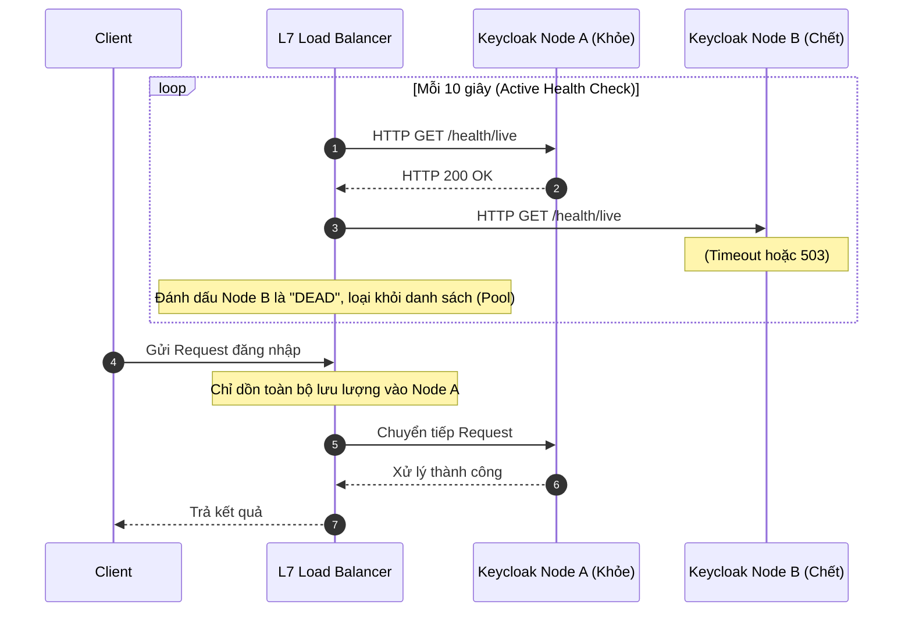

# Lesson 13: Load Balancer (Bộ Cân bằng Tải)

> [!NOTE]
> **Category:** Theory (Lý thuyết)
> **Goal:** Nắm vững vai trò sinh tử của Bộ cân bằng tải trong việc phân phối lưu lượng, chống sập hệ thống (High Availability). Đặc biệt, hiểu rõ sự khác biệt giữa L4/L7 và lý do cấu hình Sticky Sessions là bắt buộc với cụm Keycloak.

## 1. Lý thuyết chuyên sâu (Detailed Theory)

### 1.1. Bộ cân bằng tải là gì?
Nếu Reverse Proxy là "người gác cổng", thì **Load Balancer (Bộ cân bằng tải - LB)** là "người điều phối giao thông". Khi hàng triệu luồng `HTTP Request` đổ về, một máy chủ đơn lẻ sẽ quá tải và cháy CPU. Kiến trúc mở rộng theo chiều ngang (Horizontal Scaling) yêu cầu ta mua thêm 10 máy chủ rẻ tiền ghép lại thành một Cụm (Cluster).
- **Nhiệm vụ của LB:** Nó đứng trước Cụm, nhận toàn bộ Request từ Internet, và áp dụng các thuật toán toán học để "chia bài" (phân phối lượng Request) đều đặn cho 10 máy chủ đằng sau.
- Nếu một máy chủ chết (Crash), LB phát hiện ra và ngay lập tức loại nó khỏi danh sách, dồn việc sang 9 máy còn lại. Tính năng này gọi là **Độ sẵn sàng cao (High Availability - HA)**.

### 1.2. Phân loại theo Mô hình OSI
- **Layer 4 Load Balancer (L4 LB):** Hoạt động ở Tầng Giao vận (Transport Layer). Nó chỉ phân tích địa chỉ IP (Source/Destination) và số cổng TCP/UDP. Nó hoàn toàn "mù" về nội dung giao tiếp (Không biết đó là HTTP, HTTPS, hay Database). Nó siêu nhanh nhưng không thông minh. (Ví dụ: AWS Network Load Balancer).
- **Layer 7 Load Balancer (L7 LB):** Hoạt động ở Tầng Ứng dụng (Application Layer). Nó chờ hoàn tất kết nối TCP, thậm chí giải mã TLS, để ĐỌC TRỘM nội dung HTTP bên trong (ví dụ đọc URL, Cookie, HTTP Header). Dựa vào nội dung đó, nó mới quyết định ném đi đâu. Nó chậm hơn một chút nhưng cực kỳ thông minh. (Ví dụ: AWS Application Load Balancer, Nginx).

### 1.3. Các thuật toán Cân bằng tải phổ biến
1. **Round Robin (Luân phiên):** Cứ chia bài tuần tự. Đứa thứ 1 vào Node 1, đứa 2 vào Node 2, đứa 3 vào Node 3...
2. **Least Connections (Ít kết nối nhất):** Ai đang rảnh nhất (có ít luồng kết nối đang xử lý nhất) thì tống việc cho người đó. Phù hợp cho các hệ thống có request thời gian xử lý không đều.
3. **IP Hash (Băm địa chỉ IP):** Băm công thức toán học cái địa chỉ IP của khách hàng. Kết quả luôn ra cùng một Node cố định. Đảm bảo người dùng A mãi mãi chỉ làm việc với Node A.

---

## 2. Luồng nội bộ & Cơ chế cấp thấp (Internal Workflow & Low-level Mechanisms)

Một chức năng cốt lõi của Load Balancer là giám sát sức khỏe (Health Check).



---

## 3. Thực hành tốt nhất & Bảo mật (Best Practices & Security)

> [!IMPORTANT]
> **Sticky Sessions (Phiên Dính) trong Keycloak Cluster**
> Trong quy trình OIDC Authorization Code Flow, người dùng phải trải qua nhiều bước nhảy (Redirects) qua lại với Keycloak. Nếu dùng thuật toán `Round Robin`, Request số 1 vào Node A, Request số 2 lại bị LB ném sang Node B. Nếu dữ liệu Session (Lưu trong Infinispan Cache) chưa kịp đồng bộ (Replicate) từ Node A sang Node B do độ trễ mạng, Node B sẽ báo lỗi "Invalid Session" và đuổi cổ người dùng.
> 
> **Giải pháp BẮT BUỘC:** Khi chạy Keycloak Cluster nhiều Node, cấu hình Load Balancer (ở Layer 7) phải kích hoạt tính năng **Session Affinity (Sticky Sessions)**. Bằng cách chèn thêm một Cookie điều hướng (ví dụ `AUTH_SESSION_ROUTE=NodeA`), LB sẽ luôn nhận diện người dùng cũ và định tuyến TẤT CẢ các bước trong cùng một phiên đăng nhập vào đúng một Node cố định, loại bỏ hoàn toàn lỗi Race Condition của Cache.

> [!CAUTION]
> **Thắt cổ chai (Bottleneck) ở chính Load Balancer**
> Đừng quên rằng toàn bộ lưu lượng của hệ thống đều đi qua một điểm duy nhất là Load Balancer. LB là điểm chết cục bộ (Single Point of Failure). Để khắc phục, hệ thống lớn phải triển khai ít nhất 2 Load Balancer chạy mô hình `Active-Passive` hoặc `Active-Active` kết hợp với giao thức VRRP (Keepalived) để luân chuyển IP công cộng (Floating IP) nếu 1 LB bị cháy phần cứng.

---

## 4. Cấu hình minh họa thực tế (Configuration Examples)

Ví dụ cấu hình Nginx làm Layer 7 Load Balancer với thuật toán `ip_hash` (Một cách triển khai Sticky Sessions dựa trên IP nguồn) để phân tải cho 3 Node Keycloak:

```nginx
# Định nghĩa Cụm máy chủ (Upstream Pool)
upstream keycloak_cluster {
    # Thuật toán Băm IP: Đảm bảo cùng một dải IP luôn vào cùng 1 Node (Sticky)
    ip_hash;
    
    # Danh sách các Node backend
    server 10.0.1.11:8080 weight=3; # Node mạnh nhất, gánh x3 tải
    server 10.0.1.12:8080 max_fails=3 fail_timeout=30s; # Rớt 3 lần là đánh dấu DEAD trong 30s
    server 10.0.1.13:8080 backup; # Node dự phòng, chỉ kích hoạt khi 2 node kia chết hết
    
    # Cấu hình Keep-alive connection nội bộ để tăng tốc
    keepalive 64;
}

server {
    listen 443 ssl http2;
    server_name sso.enterprise.com;

    location / {
        proxy_pass http://keycloak_cluster;
        proxy_http_version 1.1;
        proxy_set_header Connection ""; # Cần thiết cho tính năng keepalive upstream
        
        # Truyền Headers...
    }
}
```

---

## 5. Trường hợp ngoại lệ (Edge Cases)

- **Đứt gãy mạng nội bộ phân mảnh (Network Partition / Split-Brain):** Khi triển khai 2 cụm Keycloak ở 2 Data Center (DC) khác nhau (Multi-Site). Nếu đường truyền cáp quang nối 2 DC bị đứt cáp, mỗi nửa của hệ thống lầm tưởng nửa kia đã chết. Chúng tự phong mình làm Master và tiếp tục cấp phát Session/Token độc lập (Split-Brain). Khi cáp quang nối lại, dữ liệu Database và Cache của 2 bên xung đột dữ dội không thể hợp nhất. (Chương Multi-Site Architecture sẽ giải quyết bằng Cross-Datacenter Replication).
- **IP Hash mất tác dụng do NAT (Network Address Translation):** Nếu dùng thuật toán `ip_hash` để làm Sticky Session, nhưng công ty khách hàng của bạn có 10,000 nhân viên đều lướt web qua một chiếc Cổng mạng VPN/NAT duy nhất (Tất cả có chung 1 Public IP). Lúc này, `ip_hash` sẽ tính ra cùng một mã Hash, và tống toàn bộ 10,000 nhân viên vào dập nát một Node duy nhất (Node A), trong khi Node B, C ngồi chơi. 
  - **Khắc phục:** Không dùng `ip_hash`. Chuyển sang dùng tính năng chèn Cookie của L7 Load Balancer (Cookie-based Session Affinity). LB sẽ cấp cho mỗi trình duyệt một cái Cookie riêng để phân biệt luồng routing.

---

## 6. Câu hỏi Phỏng vấn (Interview Questions)

**1. Sự khác biệt giữa cơ chế Active Health Check và Passive Health Check của Load Balancer?**
- **Junior:** Active là LB chủ động kiểm tra, Passive là chờ xem có lỗi không.
- **Senior:** Active Health Check (như HAProxy gửi tín hiệu `HTTP GET /health` định kỳ mỗi 5s) là cơ chế chủ động thăm dò. Nó phát hiện Node chết trước khi có Request thật của người dùng được phân phối vào, giúp tỷ lệ lỗi bằng 0 (Zero Downtime). Passive Health Check (như Nginx bản Open-source mặc định) là kiểm tra thụ động: LB cứ tống Request của người dùng vào Node, nếu Node ném ra lỗi Timeout/502 (nghĩa là 1 người dùng đã lãnh hậu quả rớt mạng), thì LB mới đánh dấu Node đó chết và ngừng gửi. Ở quy mô Enterprise, luôn phải cấu hình Active Health Check (hoặc dùng Nginx Plus/HAProxy).

**2. Nếu hệ thống Keycloak đứng sau AWS ALB (Application Load Balancer), bạn cấu hình Sticky Sessions bằng IP Hash hay bằng Cookie? Tại sao?**
- **Junior:** Bằng Cookie vì AWS không cho dùng IP Hash.
- **Senior:** Phải dùng Application-based Cookie (Session Affinity). Trong kỷ nguyên di động, IP của người dùng liên tục thay đổi (Từ 4G chuyển sang Wifi, hoặc di chuyển qua các trạm viễn thông). Thuật toán IP Hash vô dụng vì IP nguồn thay đổi liên tục, khiến Request bị ném sang Node khác làm gãy luồng xác thực (Invalid Session). Application Load Balancer (L7) có khả năng đọc được Cookie, nó chèn một Cookie định tuyến riêng (như `AWSALB`) chứa mã số của Node xử lý, và dù người dùng đổi mạng IP, Cookie vẫn nguyên vẹn trên trình duyệt, đảm bảo họ luôn trở lại đúng Node ban đầu.

**3. Làm sao Layer 4 Load Balancer phân tán tải được luồng HTTPS khi mà toàn bộ gói tin đã bị mã hóa, nó không đọc được gì cả?**
- **Junior:** Nó cứ chia bừa theo Round Robin thôi.
- **Senior:** L4 LB (như AWS Network Load Balancer, HAProxy chế độ TCP) hoạt động tại tầng Giao vận (Transport). Nó không cần biết dữ liệu bên trong là HTTPS mã hóa hay là gói tin Database. Nó chỉ cần đọc thông tin ở Tầng IP và Tầng TCP (IP Đích, IP Nguồn, Port 443). Khi gói tin tới, nó băm các thông số TCP này và thiết lập trực tiếp một đường ống (TCP Connection Passthrough) từ máy khách thẳng vào Node Backend. Nhờ không phải dừng lại giải mã chứng chỉ TLS (Offloading), L4 LB có thể gánh hàng triệu kết nối đồng thời với độ trễ tính bằng Micro-second, phù hợp cho các luồng gánh tải siêu nặng.

**4. Khái niệm "Zero Downtime Deployment" (Triển khai không gián đoạn) liên quan mật thiết thế nào đến Load Balancer?**
- **Junior:** LB sẽ chặn người dùng vào lúc mình update code.
- **Senior:** LB là chìa khóa của chiến thuật Rolling Update hoặc Blue/Green Deployment. Thay vì sập toàn bộ hệ thống để cài phiên bản Keycloak mới, DevOps sẽ ra lệnh cho LB "Rút" dần trọng số (Drain connection) của Node 1 về 0. LB ngừng gửi luồng người dùng mới vào Node 1, nhưng vẫn cho các Session cũ hoàn thành. Khi Node 1 rảnh, ta update code, khởi động lại. LB thấy `health_check` xanh trở lại, nó đưa Node 1 vào vòng xoay, và ta tiếp tục làm thế với các Node tiếp theo. Toàn bộ quá trình người dùng không hề hay biết hệ thống đang được cập nhật phần mềm.

**5. Lỗi 502 Bad Gateway và 504 Gateway Timeout khác nhau ra sao dưới góc nhìn của Load Balancer?**
- **Junior:** Cả hai đều là Backend chết, không kết nối được.
- **Senior:** `502 Bad Gateway` xảy ra khi Load Balancer đã chạm tới cửa của Backend (Node Keycloak), nhưng Backend từ chối kết nối thẳng thừng (Connection Refused), cấu hình Proxy sai port, hoặc Backend sập hoàn toàn không thể thiết lập TCP socket. `504 Gateway Timeout` lại chứng minh rằng kết nối TCP đã thành công, LB đã gửi gói tin HTTP Request vào Backend, nhưng Backend phản hồi QUÁ CHẬM (có thể do kẹt Deadlock ở Database hoặc hết luồng xử lý Thread Pool). Thời gian chờ vượt quá cấu hình `proxy_read_timeout` nên LB đành cắt đứt kết nối và ném 504 về cho người dùng.

---

## 7. Tài liệu tham khảo (References)
- **NGINX:** What Is Load Balancing? (https://www.nginx.com/resources/glossary/load-balancing/)
- **HAProxy Documentation:** Load Balancing Algorithms.
- **AWS Documentation:** Application Load Balancer Routing.
