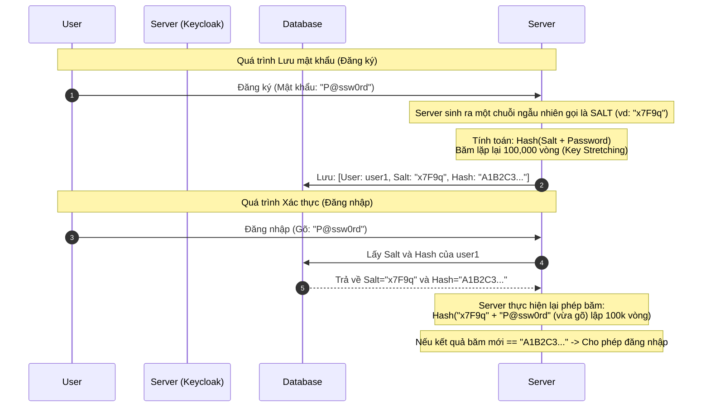

# Lesson 15: Hash (Hàm Băm Mật Mã Học)

> [!NOTE]
> **Category:** Theory (Lý thuyết)
> **Goal:** Hiểu sâu sắc 5 đặc tính toán học của hàm băm (Cryptographic Hash Function). Nắm vững cơ chế băm mật khẩu hiện đại (Password Hashing) để giải thích lý do cơ sở dữ liệu của Keycloak hoàn toàn an toàn ngay cả khi bị tin tặc đánh cắp.

## 1. Lý thuyết chuyên sâu (Detailed Theory)

### 1.1. Khái niệm Hàm băm
**Hàm băm (Hash Function)** là một thuật toán toán học (ví dụ: `SHA-256`, `MD5`) nhận đầu vào (Input) là một khối dữ liệu có kích thước bất kỳ (1 chữ cái hoặc 1 bộ phim 4GB) và nghiền nát nó để tạo ra một đầu ra (Output) là một chuỗi ký tự có kích thước CỐ ĐỊNH (ví dụ luôn là 256-bit).

### 1.2. 5 Đặc tính Sinh tử của Hàm băm mật mã học
Để một hàm băm được coi là an toàn (Cryptographically Secure), nó PHẢI thỏa mãn 5 định lý toán học sau:
1. **Tính tất định (Deterministic):** Cùng một đầu vào `A`, luôn luôn phải băm ra kết quả `B`. Không bao giờ sai lệch.
2. **Kích thước cố định (Fixed Length):** Đầu vào dù dài ngắn ra sao, đầu ra luôn cố định chiều dài.
3. **Hiệu ứng tuyết lở (Avalanche Effect):** Chỉ cần thay đổi ĐÚNG 1 BIT ở đầu vào (ví dụ đổi một dấu phẩy), toàn bộ kết quả băm đầu ra phải thay đổi hoàn toàn (không có bất kỳ sự liên quan nào với kết quả cũ).
4. **Một chiều (Pre-image Resistance / One-way):** Nếu có kết quả băm `B`, không có bất kỳ phương trình toán học nào có thể giải ngược ra dữ liệu gốc `A`. Cách duy nhất là thử hàng tỷ đáp án (Brute-force).
5. **Chống va chạm (Collision Resistance):** Cực kỳ khó (gần như không thể về mặt thống kê) để tìm ra hai đầu vào khác nhau `A` và `X` mà lại băm ra cùng một kết quả `B`.

---

## 2. Luồng nội bộ & Cơ chế cấp thấp (Internal Workflow & Low-level Mechanisms)

Hàm băm sinh ra ban đầu để kiểm tra tính toàn vẹn của tập tin. Nhưng trong IAM (Identity and Access Management), ứng dụng tối thượng của nó là **Bảo vệ Mật khẩu**.

Nếu chỉ dùng hàm băm thuần túy (`Hash("123456") = "8d969ee..."`), kẻ tấn công có thể tính trước mã băm của mọi mật khẩu phổ biến (Tạo ra Bảng cầu vồng - Rainbow Table) và so khớp nhanh chóng để phá giải mật khẩu khi trộm được Database.

**Giải pháp cấp thấp: Kỹ thuật Băm Mật Khẩu (Password Hashing Workflow)**

---

## 3. Thực hành tốt nhất & Bảo mật (Best Practices & Security)

> [!IMPORTANT]
> **Tuyệt đối không dùng MD5, SHA-1 hay SHA-256 thuần để lưu mật khẩu**
> Các hàm băm phổ thông (như SHA-256) được thiết kế để chạy CÀNG NHANH CÀNG TỐT. Điều này là thảm họa khi lưu mật khẩu, vì card đồ họa (GPU) của hacker có thể đoán thử hàng tỷ mật khẩu mỗi giây.
>
> **Quy tắc Enterprise:** Mật khẩu bắt buộc phải được băm bằng thuật toán CỐ TÌNH CHẠY CHẬM (Key Stretching Algorithms) như **PBKDF2**, **bcrypt**, hoặc **Argon2** (Hiện đại nhất). Các thuật toán này buộc CPU/RAM phải tiêu tốn một lượng tài nguyên/thời gian cố định (VD: 500ms) cho mỗi lần băm, khiến tốc độ Brute-force của hacker giảm từ 1 tỷ lần/giây xuống còn vài chục lần/giây.

> [!WARNING]
> **Tầm quan trọng của SALT**
> Mỗi người dùng trong Database BẮT BUỘC phải có một hạt muối (Salt) sinh ngẫu nhiên và hoàn toàn khác nhau, dù họ có đặt chung mật khẩu là `123456`. Salt làm vô hiệu hóa hoàn toàn sức mạnh của Bảng Cầu Vồng (Rainbow Tables) vì hacker không thể tính toán trước mã băm.

---

## 4. Cấu hình minh họa thực tế (Configuration Examples)

Keycloak mặc định sử dụng thuật toán PBKDF2 với 27,500 vòng lặp (Iterations). Tùy vào sức mạnh phần cứng của máy chủ ở thời điểm hiện tại, bạn cần nâng số vòng lặp này lên (Password Policy) để tăng độ trễ tính toán, thách thức Hacker.

Cách cấu hình **Password Policy** trong Keycloak Admin Console:
1. Vào mục `Authentication` -> Tab `Policies` -> `Password Policy`.
2. Thêm policy `Hashing Algorithm` = `pbkdf2-sha512` (Hoặc argon2 nếu có custom provider).
3. Thêm policy `Hashing Iterations` = `210000` (Theo chuẩn OWASP mới nhất cho PBKDF2-SHA512).

---

## 5. Trường hợp ngoại lệ (Edge Cases)

- **Lỗi tràn RAM do thuật toán băm quá mạnh:** Argon2id (Người chiến thắng cuộc thi Password Hashing Competition) cho phép cấu hình "Độ tốn RAM" (Memory Cost). Để chống các máy đào coin ASIC giải mật khẩu, Argon2 bắt buộc phải nạp một mảng dữ liệu cực lớn vào RAM khi băm. Nếu bạn cấu hình thuật toán tốn 1GB RAM mỗi lần băm, và có 10 user login cùng lúc, Keycloak sẽ chiếm 10GB RAM trong nháy mắt và bị hệ điều hành Linux "giết chết" (OOM Killer). Cần cân bằng (Benchmark) kỹ lưỡng cấu hình thuật toán với tài nguyên máy chủ.

---

## 6. Câu hỏi Phỏng vấn (Interview Questions)

**1. "Tính chống va chạm" (Collision Resistance) của hàm băm là gì? Tại sao SHA-1 bị khai tử?**
- **Junior:** Chống va chạm là để không có 2 file bị trùng mã băm. SHA-1 bị cũ nên cấm xài.
- **Senior:** Chống va chạm là tính chất đảm bảo tính bất khả thi về mặt toán học để tìm ra 2 đầu vào $x_1$ và $x_2$ ($x_1 \neq x_2$) mà $Hash(x_1) == Hash(x_2)$. SHA-1 bị Google khai tử (Sự kiện SHAttered năm 2017) vì họ đã chứng minh được (và thực hành tạo ra) 2 file PDF có nội dung khác nhau hoàn toàn nhưng lại băm ra cùng một mã SHA-1. Nếu dùng thuật toán bị thủng va chạm để ký Chứng chỉ điện tử, hacker có thể tạo ra một chứng chỉ giả mạo nhưng mang chữ ký hợp lệ y hệt chứng chỉ thật của Google.

**2. Salt (Hạt muối) có cần phải giữ bí mật không? Tại sao?**
- **Junior:** Phải giữ bí mật tuyệt đối giống như Password, nếu lộ thì hacker sẽ hack được.
- **Senior:** Salt hoàn toàn KHÔNG CẦN và KHÔNG PHẢI là thông tin bí mật. Nó được lưu ở dạng văn bản rõ (Plaintext) ngay trong cột kế bên cột Password Hash trong Database. Mục đích duy nhất của Salt là đảm bảo "Tính Duy Nhất" (Uniqueness) cho mỗi kết quả băm, khiến mã băm của password `123456` của người A không bị trùng lặp với người B, từ đó tiêu diệt toàn bộ hiệu quả của việc dùng Bảng cầu vồng (Rainbow Table) tính sẵn. Việc giấu một chuỗi bí mật cấp toàn hệ thống để băm gọi là `Pepper` (Tiêu), chứ không phải Salt.

**3. Argon2, bcrypt, và PBKDF2 khác gì với SHA-256? Tại sao IAM System bắt buộc xài nhóm đầu?**
- **Junior:** Nhóm đầu là thuật toán chuyên băm mật khẩu, mã hóa phức tạp hơn SHA-256.
- **Senior:** SHA-256 là hàm băm tốc độ cao (Fast Hash), thiết kế để xử lý dữ liệu lớn (như file ISO) càng nhanh càng tốt. Ngược lại, Argon2/bcrypt là thuật toán băm tốn kém (Key Stretching / Slow Hash). Chúng được thiết kế CỐ TÌNH làm tiêu hao hàng chục nghìn chu kỳ CPU và dung lượng RAM lớn cho một lần băm (Work factor). Mục đích là làm cạn kiệt tài nguyên của Hacker nếu hắn cố gắng Brute-force/Dictionary Attack. Với tốc độ tính toán phần cứng ngày nay, dùng SHA-256 lưu mật khẩu bị coi là lỗ hổng bảo mật đặc biệt nghiêm trọng.

**4. Một hacker ăn trộm được Data file của Keycloak, hắn chạy thuật toán băm lấy được toàn bộ Database nhưng vẫn không thể giải mã các Hash. Bằng cách nào hệ thống của bạn chống lại hắn?**
- **Junior:** Vì hàm băm không thể giải mã ngược lại được.
- **Senior:** Mặc dù không thể giải ngược (One-way), hacker có thể dùng Dictionary Attack (Thử liên tục danh sách các mật khẩu phổ biến). Cấu hình Keycloak chống lại hắn ở 2 khía cạnh: (1) Cấu hình Iterations cực cao (ví dụ 300,000 vòng lặp) khiến tốc độ quét của hacker tốn hàng trăm năm. (2) Cấu hình Password Policy phức tạp (Bắt buộc user dùng mật khẩu dài > 12 ký tự, đa dạng). Mật khẩu gốc càng dài, entropy càng lớn, hacker càng tuyệt vọng trong việc thử mò.

**5. Nếu người dùng tạo một file ZIP chứa 1 byte, sau đó nén 1 triệu lần (Zip Bomb), và hệ thống băm file đó, chuyện gì xảy ra với kết quả băm?**
- **Junior:** Hệ thống bị lỗi hoặc ra mã băm siêu to khổng lồ.
- **Senior:** Tính chất của Hàm băm mật mã học là "Kích thước đầu ra luôn cố định" (Fixed Length). Dù file đầu vào có là 1 byte, hay là 1 PetaByte dữ liệu rác, thì sau khi chạy qua hàm SHA-256, đầu ra LUÔN LUÔN là một chuỗi nhị phân dài chính xác 256 bit (biểu diễn dạng hex là 64 ký tự). Sự thay đổi kích thước file không hề ảnh hưởng đến định dạng của chuỗi băm đầu ra, đảm bảo tính nhất quán cho không gian lưu trữ Database.

---

## 7. Tài liệu tham khảo (References)
- **OWASP:** Password Storage Cheat Sheet. (https://cheatsheetseries.owasp.org/cheatsheets/Password_Storage_Cheat_Sheet.html)
- **NIST:** SP 800-132 - Recommendation for Password-Based Key Derivation.
- **Keycloak Documentation:** Password Policies.
