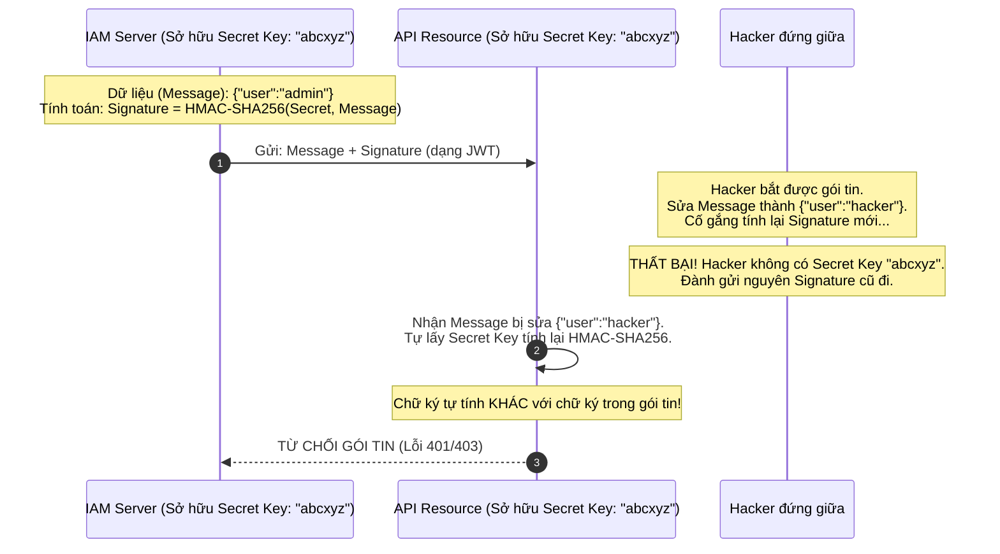

# Lesson 16: HMAC (Hash-based Message Authentication Code)

> [!NOTE]
> **Category:** Theory (Lý thuyết)
> **Goal:** Nắm vững cấu trúc toán học của thuật toán HMAC. Hiểu cách kết hợp sức mạnh của Hàm Băm với một Khóa Bí Mật để tạo ra cơ chế chữ ký số siêu tốc. Đây là nền tảng kỹ thuật trực tiếp cấu thành nên chữ ký `HS256` của chuẩn JSON Web Token (JWT).

## 1. Lý thuyết chuyên sâu (Detailed Theory)

### 1.1. MAC là gì? Vượt qua giới hạn của Hash thuần túy
Hàm băm (như SHA-256) đảm bảo **Tính Toàn Vẹn (Integrity)**: nếu file bị sửa, mã Hash thay đổi.
Nhưng, điều gì xảy ra nếu Hacker can thiệp (Man-in-the-Middle) trên đường truyền mạng? Hắn có thể sửa nội dung File gốc, sau đó TỰ TÍNH LẠI mã SHA-256 mới cho file đó, rồi gửi cả cụm giả mạo cho bạn. Bạn nhận được, băm ra thấy khớp với SHA-256 mới, bạn tin là file nguyên vẹn, nhưng thực ra nó đã bị tráo.

**Vấn đề:** Hash thuần túy không đảm bảo **Tính Xác Thực Nguồn Gốc (Authenticity)**.
**Giải pháp:** MAC (Message Authentication Code) - Mã Xác Thực Thông Điệp. Nó kết hợp gói dữ liệu (Message) với một **Khóa bí mật (Secret Key)** mà chỉ người gửi và người nhận mới biết, tạo ra một chữ ký. Hacker không có khóa, nên dù sửa được File, hắn cũng không thể tạo lại chữ ký mới.

### 1.2. HMAC hoạt động ra sao?
HMAC (Hash-based MAC) là một kiểu thiết kế đặc thù của MAC, sử dụng bên trong nó một hàm băm mật mã học (như SHA-256 -> gọi là `HMAC-SHA256`).
- Thuật toán HMAC không đơn giản là nối Chuỗi Bí mật và Dữ liệu lại rồi băm (`Hash(Secret + Message)`). Kiểu thiết kế ngây ngô đó đã bị phá giải bởi cuộc tấn công có tên *Length Extension Attack*.
- HMAC giải quyết bằng cách áp dụng một phép toán đệm lặp (Padding) rất tinh xảo, băm dữ liệu thông qua 2 lớp mặt nạ độc lập (Inner Pad và Outer Pad).

---

## 2. Luồng nội bộ & Cơ chế cấp thấp (Internal Workflow & Low-level Mechanisms)

Công thức toán học nguyên thủy của HMAC (theo chuẩn RFC 2104):
`HMAC(K, m) = Hash((K ⊕ opad) || Hash((K ⊕ ipad) || m))`

*Trong đó:*
- `K`: Secret Key.
- `m`: Message (Dữ liệu cần ký).
- `Hash`: Hàm băm (vd SHA-256).
- `ipad / opad`: Các chuỗi đệm hằng số cố định trong thuật toán.
- `||`: Phép nối chuỗi (Concatenation).
- `⊕`: Phép toán XOR (Exclusive OR) ở mức bit.



---

## 3. Thực hành tốt nhất & Bảo mật (Best Practices & Security)

> [!IMPORTANT]
> **Chiều dài tối thiểu của Secret Key**
> Đặc tả bảo mật của IETF quy định: Khóa bí mật (Secret Key) dùng cho thuật toán HMAC BẮT BUỘC phải có độ dài ít nhất bằng với kích thước đầu ra của hàm băm cơ sở.
> Ví dụ: Với thuật toán **HS256** (HMAC-SHA256 dùng trong JWT), đầu ra là 256-bit. Do đó, Secret Key của bạn bắt buộc phải dài tối thiểu **256 bit** (tức là một chuỗi ít nhất 32 ký tự alphanumeric phức tạp). Nếu bạn dùng một khóa quá ngắn (ví dụ mật khẩu "123456"), hacker có thể dùng thuật toán Brute-force ngoại tuyến (Offline) bẻ khóa cụm HMAC cực kỳ dễ dàng.

> [!CAUTION]
> **Tấn công theo thời gian (Timing Attacks) khi so sánh Chữ ký**
> Lỗ hổng nghiêm trọng nhất khi Lập trình viên tự viết code xác thực HMAC là sử dụng hàm so sánh chuỗi mặc định của ngôn ngữ (ví dụ `if (signature == expected)` hoặc `String.equals()`). Hàm so sánh mặc định sẽ dừng lại (return false) NGAY LẬP TỨC tại ký tự sai đầu tiên. Kẻ tấn công có thể đo thời gian phản hồi máy chủ chênh lệch vài phần triệu giây để biết chữ ký của chúng đã đoán đúng được bao nhiêu ký tự đầu tiên. 
> 
> **Thực hành tốt nhất:** Bắt buộc dùng hàm So sánh Thời gian Hằng số (Constant-Time String Comparison - VD: `MessageDigest.isEqual()`). Dù chuỗi sai ở chữ cái đầu tiên hay cuối cùng, hàm vẫn tốn đúng ngần ấy thời gian xử lý.

---

## 4. Cấu hình minh họa thực tế (Configuration Examples)

Đoạn code Java siêu chuẩn mực (Bảo mật Enterprise) để ký và xác thực mã HMAC-SHA256, áp dụng ngay trong việc tự custom xác thực JWT.

```java
import javax.crypto.Mac;
import javax.crypto.spec.SecretKeySpec;
import java.security.MessageDigest;
import java.util.Base64;

public class HmacSecurity {

    // 1. Tạo Chữ ký điện tử (Signing)
    public static String generateHmac(String data, String secretKey) throws Exception {
        // Chỉ định chuẩn HMAC-SHA256
        Mac mac = Mac.getInstance("HmacSHA256");
        SecretKeySpec secretKeySpec = new SecretKeySpec(secretKey.getBytes(), "HmacSHA256");
        mac.init(secretKeySpec);
        
        // Tiến hành băm qua 2 lớp (Toán học xử lý nội bộ)
        byte[] hmacBytes = mac.doFinal(data.getBytes());
        // Biểu diễn nhị phân thành văn bản an toàn (Encoding)
        return Base64.getUrlEncoder().withoutPadding().encodeToString(hmacBytes);
    }

    // 2. Xác thực Chữ ký (Verifying) AN TOÀN TUYỆT ĐỐI
    public static boolean verifyHmac(String data, String receivedSignature, String secretKey) throws Exception {
        // Tự tính lại chữ ký bằng khóa của Server
        String calculatedSignature = generateHmac(data, secretKey);
        
        // LỖI CHÍ MẠNG: return calculatedSignature.equals(receivedSignature); -> Gây Timing Attack
        
        // BEST PRACTICE: So sánh hằng số thời gian (Constant-time comparison)
        return MessageDigest.isEqual(
            calculatedSignature.getBytes(), 
            receivedSignature.getBytes()
        );
    }
}
```

---

## 5. Trường hợp ngoại lệ (Edge Cases)

- **Chia sẻ khóa (Key Distribution Problem):** Vấn đề chí mạng của thuật toán HMAC là nó yêu cầu một khóa Bí mật đối xứng (Symmetric Key). Nghĩa là máy chủ ủy quyền (Keycloak) và mọi máy chủ tài nguyên (Microservices) đều phải LƯU GIỮ CHUNG một chiếc chìa khóa này ở dạng bản rõ trong cấu hình để kiểm tra Token. Nếu một Microservice nhỏ lẻ bị hack và lộ Khóa Bí mật, hacker có thể tự sinh ra (Forge) các JWT giả mạo mang quyền Admin để xâm nhập mọi Microservice khác trong cụm (Bao gồm cả Keycloak). 
  - **Khắc phục:** Hệ thống IAM phân tán (Zero Trust) KHÔNG NÊN dùng thuật toán HMAC (`HS256`) để ký JWT. Bắt buộc phải chuyển sang cấu trúc Bất đối xứng (Asymmetric) như `RS256` hoặc `ES256`.

---

## 6. Câu hỏi Phỏng vấn (Interview Questions)

**1. HMAC giải quyết được điểm yếu chí mạng nào của Hàm băm (Hash) thông thường trên đường truyền mạng?**
- **Junior:** Hàm băm bình thường hacker có thể tạo lại. HMAC dùng thêm mật khẩu nên hacker không tạo lại được.
- **Senior:** Hàm băm thuần túy chỉ cung cấp tính chất Toàn vẹn (Integrity). Một kẻ tấn công đứng giữa (Man-in-the-Middle) có thể thay đổi Payload (ví dụ: tiền chuyển), tự băm lại bằng SHA-256, và gửi gói tin mới đi. Đầu nhận kiểm tra hash thấy khớp, tưởng file là thật. Thuật toán HMAC kết hợp tính Toàn vẹn và Xác thực nguồn gốc (Authenticity). Bằng cách đưa một Khóa bí mật (Pre-shared Key) tham gia vào thuật toán băm (làm nhiễu 2 lớp), kẻ tấn công bị tước quyền tính toán lại mã Hash hợp lệ do hắn hoàn toàn mù mờ về khóa bí mật. Gói tin bị sửa sẽ lập tức bị máy chủ từ chối vì chữ ký không khớp.

**2. Tại sao người ta không thiết kế hàm ký đơn giản kiểu `Hash(Secret_Key + Message)` cho nhanh mà phải sinh ra cấu trúc HMAC lằng nhằng phức tạp?**
- **Junior:** Làm vậy cho nó phức tạp, hacker mất nhiều thời gian phá hơn.
- **Senior:** Cấu trúc ngây thơ `Hash(Key || Message)` mắc một lỗ hổng nghiêm trọng gọi là `Length Extension Attack` (Tấn công nối dài). Với các hàm băm dựa trên họ Merkle-Damgård (như MD5, SHA-1, SHA-256), kẻ tấn công dù không biết `Key`, nhưng nếu bắt được chữ ký của `Message_1`, hắn có thể dùng chính trạng thái thuật toán đang băm dở đó để nối thêm một đoạn mã độc (Padding) thành `Message_1 + Malicious_Code` và xuất ra một chữ ký hoàn toàn hợp lệ cho chuỗi mới đó. Thuật toán HMAC băm qua 2 lớp (Inner Pad và Outer Pad lồng nhau) triệt tiêu hoàn toàn khả năng nối dài trạng thái này.

**3. Khái niệm `Timing Attack` khi xác thực mã HMAC là gì và phòng thủ nó ở cấp độ Code như thế nào?**
- **Junior:** Hacker đo thời gian mạng để tìm mật khẩu. Cần dùng hàm so sánh xịn hơn để chặn.
- **Senior:** Lỗ hổng tấn công theo thời gian (Timing Attack) lợi dụng điểm yếu tối ưu hóa của CPU. Hàm `==` hoặc `String.equals()` sẽ bóc từng byte của chữ ký nhận được so sánh với chữ ký tính toán, nếu lệch ở Byte đầu tiên, nó lập tức `return false` tốn 1ms. Nếu khớp 10 Byte đầu và sai ở Byte 11, nó tốn 1.5ms. Hacker dùng thống kê để đoán từng Byte một của chữ ký cho đến khi đúng hoàn toàn (Rò rỉ thông tin qua Side-Channel). Để phòng thủ, lập trình viên bắt buộc phải dùng các hàm so sánh Hằng số Thời gian (Constant-time comparison) sử dụng phép toán bitwise (XOR) trên toàn bộ mảng byte. Dù sai hay đúng, hàm luôn chạy hết chiều dài mảng, thời gian xử lý không bao giờ biến động.

**4. Khi triển khai SSO bằng JWT giữa Keycloak và 10 Microservices, tại sao thuật toán HS256 (Dựa trên HMAC) lại bị từ chối ở quy mô Enterprise?**
- **Junior:** Vì HS256 mã hóa yếu, dễ bị giải mã.
- **Senior:** HS256 (HMAC-SHA256) không hề yếu về mặt mật mã học, nó cực kỳ khó bị phá giải nếu khóa đủ dài (>=256 bit). Vấn đề của nó là giới hạn mô hình quản trị. Thuật toán HMAC là thuật toán Đối xứng (Symmetric); cần CÙNG MỘT KHÓA BÍ MẬT để tạo chữ ký (ở Keycloak) và xác minh chữ ký (ở Microservices). Việc phải sao chép, cấu hình và chia sẻ một khóa cực kỳ bí mật cho 10 đội Dev khác nhau quản lý 10 microservices mở ra một điểm yếu rò rỉ (Key Compromise). Ở quy mô Enterprise, ta bắt buộc phải dùng chữ ký Bất đối xứng (RS256). Keycloak giữ Private Key (bí mật tuyệt đối) để ký Token. 10 Microservices tải Public Key (công khai) về để kiểm tra, đảm bảo kiến trúc Zero Trust.

**5. Lỗi rò rỉ bộ nhớ có thể xảy ra nếu xử lý dữ liệu để ký HMAC như thế nào?**
- **Junior:** Do file bự quá làm đứng máy.
- **Senior:** Quá trình tính toán HMAC không đòi hỏi nhiều RAM vì hàm băm xử lý theo dạng Stream (từng khối nhỏ 64 bytes - Chunking). Lỗi xảy ra do thói quen của Lập trình viên nạp toàn bộ File/Dữ liệu (ví dụ file ISO 10GB) vào một biến mảng `byte[]` trong RAM rồi mới gọi lệnh `mac.doFinal(dataBytes)`. Điều này lập tức gây `OutOfMemoryError`. Giải pháp đúng chuẩn cơ sở hạ tầng là tạo luồng đọc (InputStream), đọc tuần tự từng khối buffer nhỏ, liên tục cập nhật trạng thái thuật toán bằng lệnh `mac.update(buffer)` và cuối cùng mới gọi `doFinal()`.

---

## 7. Tài liệu tham khảo (References)
- **RFC 2104:** HMAC: Keyed-Hashing for Message Authentication. (https://datatracker.ietf.org/doc/html/rfc2104)
- **OWASP:** Cryptographic Storage Cheat Sheet (Constant Time String Comparison).
- **JWT (JSON Web Token) Specification:** RFC 7519.
