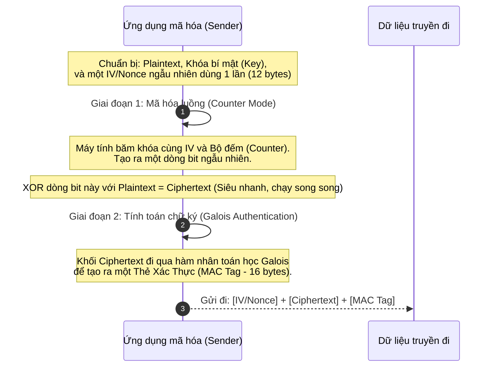

# Lesson 17: Symmetric Encryption (Mã hóa Đối xứng)

> [!NOTE]
> **Category:** Theory (Lý thuyết)
> **Goal:** Làm chủ kỹ thuật Mã hóa Đối xứng. Phân tích các chế độ hoạt động mã hóa khối (Block Cipher Modes), tìm ra lỗ hổng của các mô hình cổ điển (ECB, CBC) và hiểu được sự thống trị tuyệt đối của chuẩn AES-GCM (Mã hóa xác thực) trong giao thức TLS hiện đại.

## 1. Lý thuyết chuyên sâu (Detailed Theory)

### 1.1. Mã hóa Đối xứng là gì?
Trong mật mã học, thuật toán **Mã hóa Đối xứng (Symmetric Encryption)** sử dụng **CÙNG MỘT CHIẾC CHÌA KHÓA** duy nhất cho cả hai quá trình: Mã hóa (Encryption) bản rõ (Plaintext) thành bản mã (Ciphertext), và Giải mã (Decryption) bản mã ngược lại thành bản rõ.

- **Ưu điểm:** Tốc độ thực thi toán học nhanh kinh hoàng, tiêu tốn phần cứng CPU cực thấp, đặc biệt phù hợp để mã hóa lượng dữ liệu khổng lồ (Streaming Video, Bulk Data Transfer).
- **Nhược điểm:** Bài toán chia sẻ khóa (Key Distribution Problem). Làm sao để 2 người ở 2 đầu đại dương chia sẻ được chiếc chìa khóa chung này cho nhau một cách an toàn mà không bị kẻ đứng giữa lấy cắp? (Phải nhờ đến Mã hóa Bất đối xứng hỗ trợ).

### 1.2. Các thuật toán phổ biến
- **DES / 3DES (Lỗi thời):** Cực kỳ chậm, độ dài khóa siêu nhỏ (56-bit). Đã bị bẻ khóa hoàn toàn, cấm dùng ở mọi cấp độ.
- **AES (Advanced Encryption Standard):** Tiêu chuẩn vàng của chính phủ Mỹ và ngành công nghiệp phần mềm thế giới. Khóa cực mạnh (128, 192, hoặc 256-bit). Cấu trúc vòng lặp hoán vị thay thế (Substitution-Permutation Network) an toàn đến mức ngay cả máy tính lượng tử cũng phải nản lòng trước khóa 256-bit.
- **ChaCha20:** Thuật toán mã hóa dòng (Stream Cipher) siêu tốc thiết kế riêng cho các thiết bị di động yếu (không có chip xử lý AES phần cứng). 

---

## 2. Luồng nội bộ & Cơ chế cấp thấp (Internal Workflow & Low-level Mechanisms)

AES là dạng "Mã hóa Khối" (Block Cipher). Nó không mã hóa file nguyên cục, mà nó chặt file thành các khối đúng 16-byte (128-bit) rồi mã hóa từng khối. Cách các khối này liên kết với nhau được gọi là **Mode of Operation** (Chế độ hoạt động).

### Thảm họa của chế độ ECB (Electronic Codebook)
Chế độ ngây ngô nhất: Lấy từng khối 16-byte, mã hóa độc lập, rồi nối lại.
- **Lỗ hổng (Pattern Leakage):** Hai khối dữ liệu giống hệt nhau sẽ mã hóa ra hai khối kết quả giống hệt nhau. Kẻ tấn công phân tích thống kê có thể "nhìn xuyên thấu" nội dung của bức ảnh dù nó đã được mã hóa.

### Chế độ GCM (Galois/Counter Mode) - Chuẩn mực hiện đại
GCM giải quyết hoàn toàn vấn đề rò rỉ của ECB bằng cách biến Mã hóa Khối thành Mã hóa Dòng, và quan trọng nhất: Nó tích hợp sẵn cơ chế **AEAD** (Authenticated Encryption with Associated Data - Mã hóa kèm Xác thực).


Người nhận không chỉ giải mã được nội dung, mà khi kiểm tra `MAC Tag`, họ còn chắc chắn 100% gói tin chưa bị thay đổi 1 bit nào dọc đường.

---

## 3. Thực hành tốt nhất & Bảo mật (Best Practices & Security)

> [!CAUTION]
> **Điều cấm kỵ: Dùng lại Nonce (IV Reuse)**
> Thuật toán AES-GCM cung cấp bảo mật thần thánh, NHƯNG nó có một gót chân Achilles: Cùng một Khóa bí mật (Key), nếu bạn lười biếng và dùng chung một cái `IV (Initialization Vector - Vector Khởi tạo)` cho 2 văn bản khác nhau, toán học mã hóa sẽ bị sụp đổ. Hacker chỉ cần làm một phép tính XOR trên 2 bản mã là có thể tìm ra được chìa khóa bí mật AES (Key Recovery Attack). 
> 
> **Quy tắc Vàng:** `IV` / `Nonce` PHẢI là chuỗi sinh ngẫu nhiên ngẫu nhiên bằng `SecureRandom` cho MỖI LẦN GỌI hàm mã hóa. Nó được ghép công khai vào chung với file đã mã hóa, không cần giữ bí mật.

> [!IMPORTANT]
> **Tuyệt đối không dùng chế độ CBC (Cipher Block Chaining) cho các kết nối mạng**
> Chế độ CBC (AES-CBC) rất phổ biến trong quá khứ. Tuy nhiên, nó mắc một lỗ hổng thiết kế cấp độ kiến trúc gọi là "Padding Oracle Attack". Lỗ hổng này cho phép hacker khai thác các thông báo lỗi liên đới đến việc cắt gọt (Padding Error) của máy chủ để giải mã trộm dữ liệu mà không cần biết khóa bí mật (Tấn công POODLE/Lucky13 là ví dụ). Các chuẩn công nghiệp (TLS 1.3) đã thẳng tay khai tử AES-CBC, chỉ giữ lại AES-GCM và ChaCha20-Poly1305.

---

## 4. Cấu hình minh họa thực tế (Configuration Examples)

Đoạn code Java chuẩn mực Enterprise, mô phỏng quá trình mã hóa một dữ liệu nhạy cảm bằng **AES-GCM-256** (Tuyệt đối không dùng `AES/ECB` hay `AES/CBC`):

```java
import javax.crypto.Cipher;
import javax.crypto.KeyGenerator;
import javax.crypto.SecretKey;
import javax.crypto.spec.GCMParameterSpec;
import java.security.SecureRandom;
import java.util.Base64;

public class SymmetricGcmSecurity {
    
    public static void encryptData() throws Exception {
        String plainText = "Thông tin thẻ tín dụng siêu bảo mật";

        // 1. Sinh Khóa Bí mật 256-bit (Làm một lần, giấu vào AWS KMS)
        KeyGenerator keyGen = KeyGenerator.getInstance("AES");
        keyGen.init(256); // Cấp độ tối đa
        SecretKey secretKey = keyGen.generateKey();

        // 2. TẠO NONCE NGẪU NHIÊN 12-Byte (BẮT BUỘC cho mỗi lần mã hóa)
        byte[] nonce = new byte[12];
        new SecureRandom().nextBytes(nonce);

        // 3. Khởi tạo thuật toán chuẩn AES-GCM
        Cipher cipher = Cipher.getInstance("AES/GCM/NoPadding");
        // Tag length chuẩn là 128 bit (16 bytes)
        GCMParameterSpec spec = new GCMParameterSpec(128, nonce); 
        cipher.init(Cipher.ENCRYPT_MODE, secretKey, spec);

        // 4. Thực thi mã hóa
        byte[] cipherText = cipher.doFinal(plainText.getBytes());

        // Môi trường thực tế: Nối Nonce (12 bytes) + CipherText + MAC Tag (16 bytes) 
        // rồi bọc bằng Base64 để lưu vào Database. Không có Nonce thì không giải mã được.
        System.out.println("Mã hóa thành công chuẩn AES-GCM!");
    }
}
```

---

## 5. Trường hợp ngoại lệ (Edge Cases)

- **Bài toán quản lý Khóa (Key Management System):** Mã hóa file thì dễ, nhưng "Lưu cái Khóa AES đó ở đâu?" mới là điểm chết của lập trình viên. Nhiều hệ thống giấu (Hardcode) cái Khóa AES dưới dạng biến chuỗi (String variable) ngay bên trong mã nguồn Java, hoặc file `application.yml`. Khi hacker hack được server hoặc DevOps tải được Source Code về, hacker đọc được cái khóa, toàn bộ kho lưu trữ mật mã sụp đổ.
  - **Khắc phục:** Khóa bí mật BẮT BUỘC phải được mã hóa bọc (Key Wrapping) và lưu ở một phần cứng độc lập (Hardware Security Module - HSM), dịch vụ đám mây AWS KMS, hoặc HashiCorp Vault. Code ứng dụng lúc chạy mới gọi lên Vault xin cấp phép sử dụng khóa vào bộ nhớ RAM.

---

## 6. Câu hỏi Phỏng vấn (Interview Questions)

**1. Trong giao thức HTTPS/TLS 1.3, tại sao lại dùng kết hợp cả hai cơ chế Mã hóa Bất đối xứng (RSA/ECC) và Mã hóa Đối xứng (AES)?**
- **Junior:** Vì Bất đối xứng bảo mật hơn nhưng chạy chậm, nên xài Đối xứng cho dữ liệu bự để hệ thống chạy lẹ.
- **Senior:** Đây là cấu trúc bù trừ khắc phục nhược điểm của nhau. Mã hóa Đối xứng (AES) xử lý dữ liệu với hiệu năng cực đỉnh nhưng gặp vấn đề về chia sẻ khóa (Làm sao Client và Server cùng có khóa chung khi đường truyền đầy rẫy hacker đứng giữa). Mã hóa Bất đối xứng giải quyết hoàn hảo bài toán Trao đổi khóa qua kênh hở bằng cặp khóa Public/Private Key, nhưng toán học đường cong Elliptic/RSA đòi hỏi quá nhiều sức mạnh CPU. Do đó, môi trường TLS chia làm 2 pha: Pha Bắt tay (Handshake) dùng Bất đối xứng để "bỏ túi" bí mật trao đổi ra một cái Khóa Phiên (Session Key), từ đó về sau, pha Chuyển tải (Transport) toàn bộ Payload HTTP sẽ được khóa chặt bằng AES-GCM với cái Khóa Phiên vừa chốt sổ.

**2. AEAD (Authenticated Encryption with Associated Data) là tiêu chuẩn vàng. Nó bổ sung thêm tính năng cực mạnh nào mà các thuật toán thuần túy như AES-CBC không có?**
- **Junior:** Nó vừa mã hóa chống nhìn trộm, vừa kiểm tra xem file có bị hacker sửa lén không.
- **Senior:** Các thuật toán mã hóa cổ điển (như AES-CBC) chỉ làm đúng một việc: Xóa mù nội dung (Confidentiality). Kẻ tấn công dù không đọc được nhưng có thể ác ý đảo lộn/cắt ghép các khối bit mã hóa lại với nhau. Khi máy chủ giải mã, nó ra một mớ rác, và máy chủ dùng mớ rác đó để chạy lệnh Database gây lỗi hệ thống (như trong kỹ thuật tấn công Padding Oracle). Các chế độ AEAD (như AES-GCM) khi mã hóa sẽ tự động chèn thêm hàm toán học sinh ra một Thẻ xác thực (Authentication Tag - 16 bytes). Ở chiều giải mã, máy tính kiểm tra Thẻ xác thực này trước, nếu gói tin bị suy suyển (Mất Integrity), máy chủ báo lỗi ngay lập tức, vứt bỏ gói tin mà không cần thử giải mã.

**3. Khái niệm IV (Initialization Vector) hay Nonce là gì? Nếu vô tình lộ cái IV này cho Hacker thì sao?**
- **Junior:** Nó giống như mật khẩu phụ. Phải giấu nó đi kẻo hacker biết được.
- **Senior:** IV (hay Nonce) là Vector Khởi tạo, là một chuỗi byte mồi (seed) ngẫu nhiên bơm vào thuật toán ở khối đầu tiên để đảm bảo rằng: Dù mã hóa cùng một nội dung file "Xin chào" 10 lần, kết quả đầu ra sẽ là 10 cục mã hóa hoàn toàn khác biệt nhau, phá vỡ mọi mẫu số (Pattern) chống lại tấn công thống kê. Việc lộ IV cho Hacker là bình thường và KHÔNG gây ra bất kỳ rủi ro bảo mật nào (IV mặc định luôn được đính kèm ở dạng bản rõ ghép với Ciphertext để máy giải mã biết cách đọc). Rủi ro duy nhất và là tử huyệt của AES-GCM: Bạn **DÙNG LẠI (Reuse)** cùng một cái IV cho hai lần mã hóa khác nhau cùng một Khóa. 

**4. Tại sao các chuyên gia mật mã học luôn cảnh báo mạnh mẽ không bao giờ được dùng chế độ `AES-ECB` (Electronic Codebook)?**
- **Junior:** Chế độ này bị lỗi bảo mật dễ hack.
- **Senior:** Chế độ ECB là cách mã hóa ngây thơ nhất. Nó băm nhỏ dữ liệu thành các khối 16-byte, và mã hóa từng khối một cách hoàn toàn ĐỘC LẬP (Không trộn khối trước với khối sau bằng hàm XOR). Điều này vi phạm nghiêm trọng tính phân tán. Nếu bạn có một bức ảnh đen trắng (các khối byte giống hệt nhau), sau khi mã hóa bằng AES-ECB, các khối mã hóa đầu ra cũng giống hệt nhau. Hacker chỉ cần sắp xếp lại các điểm pixel trên không gian ảnh là có thể nhìn thấy lờ mờ hoàn toàn nội dung ban đầu mà không cần cái Khóa nào (Kinh điển nhất là hình ảnh Mã hóa Chú Chim Cánh Cụt Linux Tux).

**5. Nếu công ty phát triển App Mobile có phần mã hóa lưu dữ liệu cục bộ vào điện thoại. Việc "Hardcode" (Gắn cứng) Khóa AES 256-bit thẳng vào mã nguồn Java Android có được phép không?**
- **Junior:** Được, app compile ra file .apk bị biên dịch rồi hacker không đọc code được.
- **Senior:** Đây là lỗ hổng sơ đẳng cấp nghiệp dư. Các file ứng dụng đã biên dịch (APK, IPA, hay Bytecode Java) hoàn toàn có thể bị dịch ngược (Decompile) ra mã nguồn gốc (Smali hoặc Java Source) chỉ bằng các tool miễn phí bấm 1 nút. Việc ném Khóa Bí Mật tĩnh vào trong code chẳng khác nào dán mật khẩu ATM lên thẻ. Kiến trúc chuẩn cho Mobile/Local Storage phải là dùng hệ thống Keystore vật lý chuyên dụng (Android Keystore System hoặc Apple Secure Enclave) để sinh và cất giữ khóa trên một con chip phần cứng biệt lập. Hệ điều hành cấm tuyệt đối mọi quyền trích xuất cái khóa đó ra RAM ứng dụng, ứng dụng chỉ được đẩy data vào chip để chip chạy mã hóa rồi đẩy kết quả ra.

---

## 7. Tài liệu tham khảo (References)
- **NIST:** SP 800-38D - Recommendation for Block Cipher Modes of Operation: Galois/Counter Mode (GCM) and GMAC.
- **OWASP:** Cryptographic Storage Cheat Sheet.
- **Keycloak Documentation:** JWE (JSON Web Encryption) setup guidelines.
