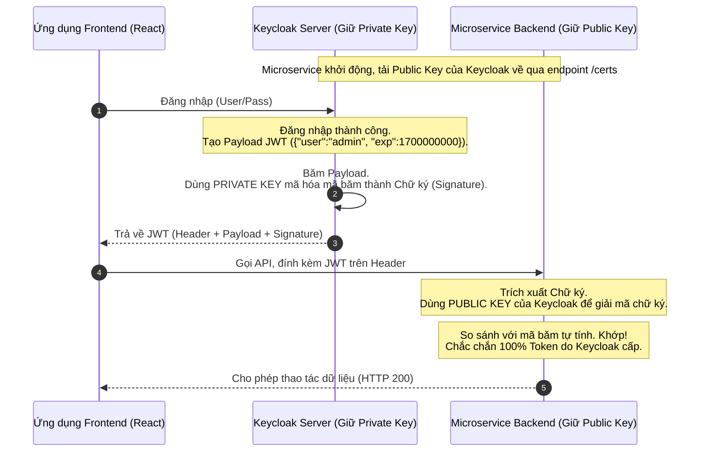

# Lesson 18: Asymmetric Encryption (Mã hóa Bất đối xứng)

> [!NOTE]
> **Category:** Theory (Lý thuyết)
> **Goal:** Nắm vững triết lý vĩ đại nhất của mật mã học thế kỷ 20. Phân biệt rõ ràng hai luồng ứng dụng có chiều vận hành ngược nhau hoàn toàn của cặp khóa Public/Private Key: Bảo vệ dữ liệu (Encryption) và Xác thực danh tính (Digital Signature).

## 1. Lý thuyết chuyên sâu (Detailed Theory)

### 1.1. Giải quyết bài toán "Trao đổi khóa"
Mã hóa Đối xứng (AES) cực nhanh, nhưng nó đòi hỏi 2 bên phải chia sẻ chung một Khóa Bí mật. Làm sao để gửi Khóa Bí mật đó qua Internet mà không bị kẻ đứng giữa lấy cắp?
Năm 1976, khái niệm **Mã hóa Bất đối xứng (Khóa Công Khai - Public Key Cryptography)** ra đời. Thay vì dùng chung 1 khóa, hệ thống sinh ra một cặp khóa (Keypair) dính liền với nhau về mặt toán học:
1. **Public Key (Khóa Công khai):** Bạn công khai nó cho toàn thế giới. Ai muốn giao tiếp với bạn hãy lấy cái khóa này.
2. **Private Key (Khóa Bí mật):** Cực kỳ bí mật, chỉ một mình bạn (hoặc máy chủ Keycloak) cất giữ.

**Nguyên lý Sinh tử:** Một dữ liệu được "khóa" bằng Khóa này, CHỈ CÓ THỂ được "mở" bằng Khóa kia của cùng cặp đó, và ngược lại. Khóa Công khai KHÔNG THỂ giải mã được dữ liệu do chính nó vừa mã hóa.

### 1.2. Hai Luồng Ứng Dụng Đảo Ngược
Đây là kiến thức quan trọng nhất cần ghi nhớ:

- **Ứng dụng 1: Mã hóa Dữ liệu (Encryption - Đảm bảo Tính Bí Mật)**
  - *Câu hỏi:* Làm sao để gửi tin nhắn cho Bob mà chỉ Bob đọc được?
  - *Hành động:* Alice lấy `Public Key` của Bob để mã hóa tin nhắn. Gửi cho Bob.
  - *Giải mã:* Chỉ có Bob (người giữ `Private Key` của Bob) mới mở ra xem được.

- **Ứng dụng 2: Chữ ký Điện tử (Digital Signature - Đảm bảo Xác Thực & Chống chối bỏ)**
  - *Câu hỏi:* Làm sao để chứng minh văn bản này CHẮC CHẮN do chính máy chủ Keycloak phát hành chứ không phải do hacker làm giả?
  - *Hành động:* Keycloak băm văn bản đó, rồi dùng `Private Key` của chính Keycloak để mã hóa (Ký). Gửi đi.
  - *Giải mã:* Client lấy `Public Key` của Keycloak (có sẵn công khai) để giải mã chữ ký. Nếu giải mã thành công ra bản Hash khớp với văn bản, chứng tỏ 100% nó xuất phát từ tay Keycloak (vì chỉ Keycloak mới có Private Key để tạo ra chữ ký đó). Kiến trúc này là TÓM TẮT CỦA CÁCH HOẠT ĐỘNG JSON WEB TOKEN (JWT).

---

## 2. Luồng nội bộ & Cơ chế cấp thấp (Internal Workflow & Low-level Mechanisms)

Quá trình luân chuyển chứng thực trong kiến trúc OIDC (OpenID Connect) sử dụng Chữ ký điện tử:



---

## 3. Thực hành tốt nhất & Bảo mật (Best Practices & Security)

> [!CAUTION]
> **Giới hạn kích thước mã hóa**
> Một sai lầm kinh điển của lập trình viên Junior là dùng mã hóa Bất đối xứng (ví dụ RSA) để mã hóa toàn bộ một file hình ảnh hoặc file PDF. Toán học Bất đối xứng CHỈ CÓ THỂ mã hóa được khối dữ liệu có kích thước bằng hoặc nhỏ hơn chiều dài của cái Khóa (Trừ đi vài byte Padding). Ví dụ Khóa RSA 2048-bit chỉ mã hóa được tối đa khoảng 245 bytes dữ liệu.
> 
> **Thực hành đúng (Hybrid Cryptography):** Khi cần mã hóa dữ liệu lớn an toàn, ta dùng một khóa AES ngẫu nhiên để mã hóa file đó. Sau đó, ta dùng `Public Key` (RSA) để mã hóa CÁI KHÓA AES đó. Gửi cả File (mã hóa AES) + Khóa AES (mã hóa RSA) đi. Đây cũng chính là cách giao thức HTTPS hoạt động.

> [!IMPORTANT]
> **Key Rotation (Xoay vòng khóa định kỳ)**
> Không có Private Key nào an toàn mãi mãi (do lộ lọt nội bộ hoặc sức mạnh giải mã của máy tính tăng lên). Trong Keycloak, bạn phải cấu hình hệ thống tự động sinh ra Cặp Khóa mới (Active Key) sau mỗi 90 ngày (hoặc ngắn hơn). Các Khóa cũ sẽ chuyển sang trạng thái Passive (Chỉ dùng để giải mã các Token cũ chưa hết hạn) rồi mới xóa bỏ hoàn toàn.

---

## 4. Cấu hình minh họa thực tế (Configuration Examples)

Cách Keycloak công bố các `Public Key` của mình cho các Microservices khác kiểm chứng.
Keycloak cung cấp một Endpoint chuẩn OIDC là JWKS (JSON Web Key Set). Mọi thông tin Khóa Công khai được định dạng bằng JSON:

- Endpoint: `https://auth.enterprise.com/realms/master/protocol/openid-connect/certs`
- Kết quả trả về (Cấu trúc JWK):

```json
{
  "keys": [
    {
      "kid": "8f2a...19e", // Mã định danh Khóa (Key ID)
      "kty": "RSA",       // Loại thuật toán (Key Type)
      "alg": "RS256",     // Thuật toán Ký (RS256)
      "use": "sig",       // Mục đích: Xác thực Chữ ký (Signature)
      "n": "vXvR...xyz",  // Modulus toán học cấu thành Public Key
      "e": "AQAB"         // Exponent toán học cấu thành Public Key
    }
  ]
}
```
*Lưu ý:* Mã định danh `kid` (Key ID) được in ở phần Header của chuỗi JWT. Microservice đọc `kid` ở JWT, sau đó đối chiếu vào danh sách JWKS này để lấy đúng Public Key ra kiểm tra.

---

## 5. Trường hợp ngoại lệ (Edge Cases)

- **Mất kiểm soát Khóa Bí Mật (Private Key Compromise):** Nếu Hacker xâm nhập được hệ điều hành của Keycloak và copy được file Keystore chứa Private Key. Hắn có thể TỰ SINH RA hàng ngàn JWT hợp lệ cho tài khoản Admin mà không cần vào trang đăng nhập. Lỗ hổng này chí mạng vì 100% Microservices backend vẫn sẽ kiểm tra ra chữ ký hợp lệ (vì đúng là ký bằng khóa thật của hệ thống). 
  - **Khắc phục:** Quản trị viên phải lập tức vào Keycloak xóa bỏ cặp khóa đó (Revoke), khởi tạo cặp khóa mới. Sau đó, **BẮT BUỘC** phải gọi lệnh xỏa bỏ bộ đệm (Flush Cache) Public Key ở toàn bộ 10 Microservices để chúng ngừng tin tưởng các JWT được ký bởi khóa cũ.

---

## 6. Câu hỏi Phỏng vấn (Interview Questions)

**1. Trong giao tiếp bảo mật, khái niệm "Mã hóa để giấu thông tin" khác biệt "Ký điện tử" ở yếu tố kỹ thuật nào?**
- **Junior:** Giấu thông tin thì cần giải mã, còn ký thì không cần.
- **Senior:** Sự khác biệt nằm ở chiều sử dụng của cặp khóa Bất đối xứng. Để "Giấu thông tin" (Confidentiality), ta sử dụng Public Key của NGƯỜI NHẬN để mã hóa, đảm bảo chỉ người nhận (giữ Private Key tương ứng) mới giải mã được. Để "Ký điện tử" (Non-repudiation), ta sử dụng Private Key của NGƯỜI GỬI để mã hóa hàm băm (ký), và bất kỳ ai cũng có thể dùng Public Key của người gửi để giải mã (xác minh tính chính danh của người gửi). JSON Web Token (JWT) trong IAM chủ yếu áp dụng luồng thứ 2.

**2. Làm sao một Microservice (như Service Thanh toán) biết được Keycloak vừa đổi Public Key mới để nó lấy về cấu hình lại?**
- **Junior:** Phải gọi ông Dev của thanh toán cập nhật file public key mới rồi restart server.
- **Senior:** Kiến trúc đó không đáp ứng được tính Tự động hóa ở quy mô Microservices. Khi Microservice (ví dụ dùng Spring Security) nhận được một Token chứa trường `kid` (Key ID) lạ mà bộ nhớ đệm (Cache) của nó chưa biết, nó sẽ tự động kích hoạt một luồng Network Request (HTTP GET) gọi lên Endpoint `/certs` (JWKS) của Keycloak để fetch danh sách Public Keys mới nhất về máy, nạp vào RAM và xác thực tiếp. Quá trình xoay khóa (Key Rotation) là hoàn toàn trong suốt với hệ thống và không đòi hỏi bất kỳ sự can thiệp thủ công hay Restart nào.

**3. Tại sao cấu trúc dữ liệu JSON Web Key (JWK) lại công khai luôn cả số học (Modulus `n` và Exponent `e`) của thuật toán mã hóa lên Internet? Điều đó có an toàn không?**
- **Junior:** Vì JWT không mã hóa nên lộ thông số không sao.
- **Senior:** Thông số Modulus `n` và Exponent `e` CẤU THÀNH nên khóa công khai (Public Key) của thuật toán RSA. Bản chất của khóa công khai là phải được công bố rộng rãi để ai cũng có thể thực hiện phép toán kiểm tra chữ ký. Việc phơi bày `n` và `e` là cốt lõi của tính minh bạch trong mật mã học bất đối xứng. Tính bảo mật của hệ thống nằm ở chỗ: Kẻ thù biết `n`, nhưng toán học chứng minh không thể nào phân tích `n` (một số khổng lồ 2048-bit) ngược lại thành hai thừa số nguyên tố cấu thành nên Private Key trong khoảng thời gian trước khi vũ trụ sụp đổ. Nên nó tuyệt đối an toàn.

**4. Hybrid Cryptography (Mật mã Lai) là gì và tại sao TLS (HTTPS) phải dùng nó?**
- **Junior:** Là pha trộn cả mã hóa nhanh và mã hóa chậm để bảo mật hơn.
- **Senior:** Mật mã Lai là kiến trúc sử dụng Mã hóa Bất đối xứng (chậm) để thiết lập một Khóa Mã hóa Đối xứng (nhanh) giữa 2 điểm mạng. Giao thức TLS bắt buộc dùng nó vì thuật toán Bất đối xứng (RSA/ECC) tốn quá nhiều tài nguyên CPU và bị giới hạn kích thước Payload (không thể mã hóa stream video hoặc HTTP body lớn). Do đó, TLS dùng RSA/ECC ở phase Handshake (Bắt tay) ban đầu chỉ để các bên xác thực danh tính và thỏa thuận an toàn ra một Khóa phiên (Session Key - AES). Sau khi chốt được Khóa AES, chúng đóng gói mọi dữ liệu về sau bằng thuật toán AES thần tốc. Sự kết hợp này mang lại cả Bảo mật tuyệt đối lẫn Hiệu năng tối đa.

**5. Mặc dù Keycloak mã hóa (ký) Token rất an toàn, nhưng vì Payload của Token (JWT) là dạng bản rõ Base64, hacker bắt được có thể đọc được Email/Roles bên trong. Làm sao để giải quyết nếu dữ liệu đó quá nhạy cảm?**
- **Junior:** Mình mã hóa Token đó bằng SSL/HTTPS là được.
- **Senior:** HTTPS chỉ bảo vệ Token trên đường truyền mạng (In Transit). Khi Token đã nằm ở trình duyệt Client (LocalStorage/Cookies), hacker hoặc mã độc XSS vẫn đọc được Payload. Nếu bên trong Payload có chứa các số định danh nhạy cảm theo chuẩn GDPR/HIPAA (như số bệnh án, mã số thuế nội bộ), ta không được dùng chữ ký đơn thuần JWS (JSON Web Signature). Bắt buộc phải chuyển kiến trúc Keycloak sang cấp phát **JWE (JSON Web Encryption)**. JWE sử dụng cấu trúc Hybrid Cryptography bọc Token thành 5 phần lồng nhau, trong đó Payload bị mã hóa hoàn toàn thành Ciphertext. Frontend không thể đọc được nội dung JWE, chỉ có Backend API giữ Private Key mới có khả năng giải nén nó.

---

## 7. Tài liệu tham khảo (References)
- **RFC 7517:** JSON Web Key (JWK).
- **RFC 7515:** JSON Web Signature (JWS).
- **NIST:** SP 800-56B Rev. 2 - Recommendation for Pair-Wise Key-Establishment Schemes Using Integer Factorization Cryptography.
