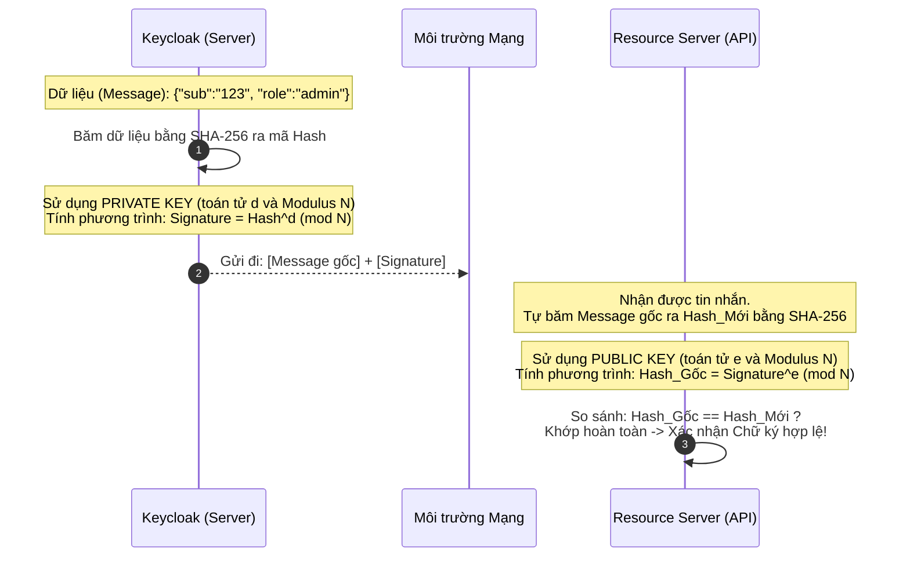

# Lesson 19: Thuật toán RSA (Rivest–Shamir–Adleman)

> [!NOTE]
> **Category:** Theory (Lý thuyết)
> **Goal:** Giải phẫu chi tiết thuật toán mã hóa quan trọng nhất lịch sử Internet: RSA. Hiểu bản chất nguyên lý "phân tích thừa số nguyên tố" đằng sau nó, giới hạn tốc độ xử lý, và các tiêu chuẩn khắt khe về độ dài khóa / Padding trong IAM.

## 1. Lý thuyết chuyên sâu (Detailed Theory)

### 1.1. Lịch sử và Sự vĩ đại của RSA
Được công bố năm 1977 bởi ba nhà khoa học (Rivest, Shamir, và Adleman), RSA là thuật toán mã hóa Bất đối xứng đầu tiên có khả năng thực tiễn áp dụng cho cả hai bài toán: Mã hóa dữ liệu và Chữ ký số. Kể từ đó, nó trở thành xương sống của mọi giao thức bảo mật toàn cầu (từ TLS/SSL cho đến SSH, VPN, PGP và JWT).

### 1.2. Trái tim toán học: Phân tích Thừa số Nguyên tố
Tính bảo mật của RSA hoàn toàn phụ thuộc vào việc giải một bài toán mà học sinh tiểu học cũng hiểu: Phân tích ra thừa số nguyên tố.
- **Thực tế:** Thật dễ dàng để lấy hai số nguyên tố rất lớn ($P$ và $Q$), sau đó nhân chúng lại với nhau để ra kết quả khổng lồ $N$. ($N = P \times Q$).
- **Mã hóa:** Máy tính công khai con số kết quả khổng lồ $N$ này cho toàn thế giới (Đây là lõi của **Public Key**).
- **Bảo mật:** Theo định lý toán học, không có cách nào hiệu quả để đi từ kết quả $N$ đó tìm ngược lại được $P$ và $Q$ là hai số nào (Trừ phi dùng phương pháp thử sai Brute-force). Bộ số $P$ và $Q$ này chính là nguyên liệu tạo nên **Private Key**.

Khi $N$ đủ lớn (dài 2048-bit), việc tìm ngược lại 2 số $P$ và $Q$ đòi hỏi siêu máy tính mạnh nhất thế giới chạy liên tục trong hàng tỷ năm.

---

## 2. Luồng nội bộ & Cơ chế cấp thấp (Internal Workflow & Low-level Mechanisms)

Khi Keycloak dùng RSA để ký điện tử (Thuật toán chuẩn `RS256`), luồng toán học diễn ra như sau:


*Lưu ý:* Phép tính hàm mũ Modulo (`^ mod N`) với các con số siêu lớn tốn rất nhiều chu kỳ xử lý của CPU. Đó là lý do RSA luôn bị phàn nàn là "Quá chậm".

---

## 3. Thực hành tốt nhất & Bảo mật (Best Practices & Security)

> [!CAUTION]
> **Độ dài Khóa tối thiểu (Key Size)**
> Sức mạnh máy tính tăng theo định luật Moore. Khóa RSA 512-bit và 1024-bit đã bị các nhóm chuyên gia bẻ gãy hoàn toàn.
> **Tiêu chuẩn công nghiệp hiện tại (NIST):** Độ dài khóa RSA BẮT BUỘC phải lớn hơn hoặc bằng **2048-bit** để đảm bảo an toàn cho dữ liệu đến năm 2030. Đối với các dữ liệu Tối mật hoặc chữ ký Root CA, phải dùng RSA **4096-bit**. (Nhưng khóa càng dài, tốc độ máy chủ xử lý đăng nhập càng bị chậm lại theo cấp số mũ).

> [!IMPORTANT]
> **Vấn đề PADDING (Lấp khoảng trống)**
> Toán học RSA thuần túy rất nguy hiểm vì nó có tính Tất định (Mã hóa cùng 1 chữ "Hello" luôn ra kết quả giống nhau). Để an toàn, người ta BẮT BUỘC phải độn thêm một chuỗi nhiễu ngẫu nhiên (Padding) vào dữ liệu trước khi mã hóa RSA.
> - **Tuyệt đối cấm:** Sử dụng Padding chuẩn cũ `PKCS#1 v1.5`. Nó dễ bị tổn thương nặng nề bởi kiểu tấn công Bleichenbacher (Lợi dụng lỗi trả về của server để dò bản mã).
> - **Tiêu chuẩn vàng:** Chỉ được phép sử dụng Padding chuẩn `OAEP` (Cho mã hóa) và `PSS` (Cho chữ ký). Thuật toán JWT an toàn nhất của RSA lúc này gọi là **PS256** (RSA-PSS với SHA-256) thay vì RS256 thông thường.

---

## 4. Cấu hình minh họa thực tế (Configuration Examples)

Lệnh tiêu chuẩn dùng OpenSSL để sinh ra cặp khóa RSA (2048-bit) dùng cho kiểm thử nội bộ hoặc cấu hình chữ ký JWT tự chế:

```bash
# 1. Sinh Private Key RSA kích thước 2048-bit chuẩn mã hóa an toàn
openssl genrsa -out private_key.pem 2048

# 2. Sinh Public Key từ Private Key vừa tạo (Dùng để chia sẻ cho Microservices)
openssl rsa -in private_key.pem -pubout -out public_key.pem

# 3. (Optional) Nếu ứng dụng Java cần Private Key, bắt buộc phải convert từ định dạng PKCS#1 sang PKCS#8
openssl pkcs8 -topk8 -inform PEM -outform PEM -nocrypt -in private_key.pem -out private_key_pkcs8.pem
```
Trong Keycloak, tính năng tạo và xoay khóa này được tự động hóa hoàn toàn ở phần `Realm Settings` -> `Keys` -> `Providers`.

---

## 5. Trường hợp ngoại lệ (Edge Cases)

- **Nguy cơ cạn kiệt tài nguyên Server (CPU Exhaustion):** Ở phía Client, việc xác thực chữ ký (dùng Public Key - số mũ `e` nhỏ) diễn ra cực nhanh. Nhưng ở phía Server (Keycloak), việc tạo ra chữ ký (dùng Private Key - số mũ `d` cực lớn) lại tốn lượng CPU khủng khiếp. Nếu một botnet tống 10,000 Request đăng nhập/giây vào Keycloak, CPU máy chủ sẽ chạm mức 100% trong nháy mắt và hệ thống sập toàn diện vì không đủ sức tính toán ma trận RSA. 
  - **Khắc phục:** Hệ thống tải lớn bắt buộc phải Offload phần mã hóa RSA sang các thiết bị phần cứng chuyên dụng (HSM Card gắn ở PCIe của máy chủ) hoặc cân nhắc chuyển sang thuật toán đường cong Elliptic (ECC) để tiết kiệm CPU.

---

## 6. Câu hỏi Phỏng vấn (Interview Questions)

**1. Một lập trình viên Junior set khóa RSA kích thước 8192-bit để "Bảo mật tuyệt đối không ai hack được". Bạn là Technical Lead, đánh giá quyết định này thế nào?**
- **Junior:** Khóa càng dài càng bảo mật, nên làm thế là rất tốt.
- **Senior:** Quyết định này là sai lầm chết người trong thiết kế hệ thống thực tế (Over-engineering). Độ phức tạp tính toán của RSA tăng theo cấp số mũ so với độ dài khóa. Khi tăng từ 2048 lên 8192-bit, tốc độ ký Token của Keycloak sẽ chậm đi hàng chục (thậm chí hàng trăm) lần, gây ra thắt cổ chai cực lớn ở CPU, làm chết đứng hệ thống Login khi có lượng truy cập đồng thời. Chuẩn 2048-bit đã được NIST chứng minh đủ an toàn cho mục đích thương mại hiện tại. Nếu cần bảo mật cực đoan tương đương RSA 8192-bit mà vẫn muốn nhanh, ta buộc phải rời bỏ RSA để chuyển sang thuật toán Đường cong Elliptic (ECC).

**2. Tại sao chuẩn JWT hiện đại thường khuyến nghị chuyển từ `RS256` sang `PS256` dù cả hai đều dựa trên mã hóa RSA?**
- **Junior:** Vì PS256 là thuật toán mã hóa chuẩn mới hơn, ra mắt sau.
- **Senior:** Điểm khác biệt nằm ở thuật toán Padding. `RS256` sử dụng cấu trúc nhồi padding cổ điển là `PKCS#1 v1.5`, có tính chất tất định (deterministic) ở cấp độ khối ký, lịch sử đã chứng minh nó dễ bị tổn thương bởi các cuộc tấn công nhắm vào Oracle (Bleichenbacher attacks). Chuẩn `PS256` sử dụng cấu trúc đệm RSA-PSS (Probabilistic Signature Scheme). PSS đưa tính ngẫu nhiên (salt) vào trong quá trình tạo cấu trúc khối trước khi mã hóa RSA, khiến các chữ ký tạo ra là hoàn toàn xác suất (Cùng 1 data, ký 2 lần ra 2 chữ ký khác biệt). Toán học đã chứng minh toán chặt chẽ PSS miễn nhiễm với mọi cuộc tấn công bản rõ đã biết. 

**3. Làm sao một cuộc tấn công "Mã hóa Lượng Tử" (Shor's Algorithm) có thể tiêu diệt RSA trong tương lai?**
- **Junior:** Máy tính lượng tử cực mạnh có thể đoán mật khẩu rất nhanh.
- **Senior:** Máy tính lượng tử không "đoán" nhanh hơn bằng Brute-force, mà nó giải quyết bài toán gốc rễ của RSA bằng một cách tư duy khác. RSA tồn tại dựa trên niềm tin rằng việc "Phân tích thừa số nguyên tố" của một số N khổng lồ là bài toán không có lời giải bằng thuật toán đa thức. Thuật toán Shor chạy trên máy tính lượng tử lý tưởng có khả năng phân tích thừa số nguyên tố này trong thời gian đa thức (tức là chỉ tốn vài phút thay vì hàng tỷ năm). Ngay khi phần cứng lượng tử đạt đủ số lượng Qubits ổn định, khóa RSA 2048 hay 4096-bit sẽ bị bóc tách Private Key trong chớp mắt. Hệ thống lúc đó phải chuyển sang các thuật toán Mật mã Hậu lượng tử (PQC) dựa trên mạng tinh thể (Lattice-based).

**4. Khái niệm `Perfect Forward Secrecy` (PFS) có thể thực hiện được bằng RSA thuần túy không? Tại sao?**
- **Junior:** Có, vì mã hóa RSA an toàn tuyệt đối.
- **Senior:** Không. RSA theo cách cấu hình chuẩn cổ điển dùng Khóa RSA tĩnh (Static RSA Key Exchange) để trao đổi khóa phiên (Session Key). Nghĩa là Session Key được mã hóa bằng Public Key của Server, và đi qua mạng. Nếu hacker ghi lại toàn bộ cục dữ liệu đó cất đi 5 năm. 5 năm sau hắn đánh cắp được Private Key của Server, hắn đem ra giải mã lấy được Session Key và đọc lại toàn bộ đoạn chat từ 5 năm trước. Để đạt được PFS (Bảo mật hoàn hảo về sau), hệ thống KHÔNG ĐƯỢC PHÉP dùng RSA để trao đổi khóa, mà phải dùng cơ chế sinh khóa Phù du (dùng một lần) như Diffie-Hellman (DHE) hoặc Elliptic Curve (ECDHE). TLS 1.3 đã loại bỏ hoàn toàn khả năng trao đổi khóa bằng RSA vì lý do này.

**5. Lỗi `java.security.InvalidKeyException: Illegal key size` xảy ra trong môi trường Java nghĩa là gì và cách khắc phục?**
- **Junior:** Khóa bị sai format hoặc đánh máy sai.
- **Senior:** Lỗi này xảy ra do JVM mặc định (đặc biệt là các bản Java 8 đời cũ) bị giới hạn bởi Chính sách Luật Xuất khẩu Mật mã của Mỹ (US Export Control Laws). Theo luật cũ, các nền tảng công nghệ không được phép mã hóa bằng khóa AES > 128-bit hoặc RSA quá mạnh để xuất khẩu ra khỏi nước Mỹ. Khi Keycloak/Spring cố nạp một khóa AES-256 hoặc RSA bự, JVM chặn lại văng lỗi. Giải pháp: Cập nhật Java lên các phiên bản mới nhất, hoặc tải và cài đặt đè gói thư viện mở rộng an ninh JCE Unlimited Strength Jurisdiction Policy Files vào thư mục cấu hình của JRE.

---

## 7. Tài liệu tham khảo (References)
- **RFC 8017:** PKCS #1: RSA Cryptography Specifications Version 2.2.
- **NIST:** SP 800-56B Rev. 2.
- **Keycloak Documentation:** Supported algorithms in JWS (RS256 vs PS256).
