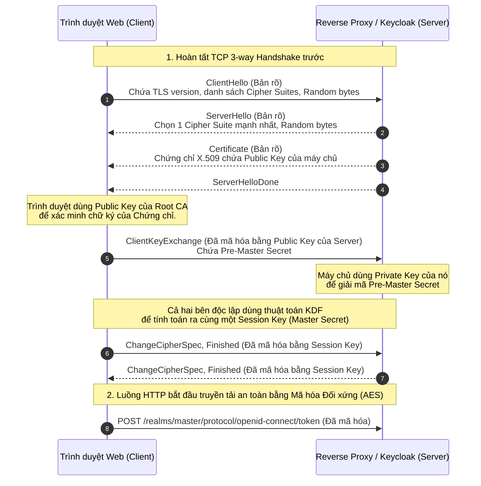

# Lesson 2: HTTPS (HTTP Secure)

> [!NOTE]
> **Category:** Theory (Lý thuyết)
> **Goal:** Hiểu sâu sắc cơ chế bảo mật của HTTPS, làm nền tảng để triển khai Keycloak trong môi trường Enterprise an toàn. Nhận thức rõ tại sao HTTPS là bắt buộc tuyệt đối.

## 1. Lý thuyết chuyên sâu (Detailed Theory)

### 1.1. HTTPS là gì?
HTTPS (HyperText Transfer Protocol Secure) không phải là một giao thức mới độc lập. Về bản chất, nó chính là giao thức HTTP quen thuộc, nhưng các `Request` và `Response` được bao bọc và truyền tải bên trong một đường hầm mã hóa bảo mật do giao thức SSL/TLS (Secure Sockets Layer / Transport Layer Security) cung cấp.

- **Vị trí trong mô hình OSI:** HTTPS hoạt động ở Tầng 7 (Application Layer), nhưng quá trình mã hóa (TLS) diễn ra ở Tầng 4 (Transport Layer) ngay phía trên TCP.
- **Cổng mặc định:** HTTPS giao tiếp qua Port `443`, trong khi HTTP thuần dùng Port `80`.

### 1.2. Ba mục tiêu cốt lõi của HTTPS
HTTPS được sinh ra để giải quyết 3 lỗ hổng chí mạng của HTTP, đặc biệt quan trọng đối với các luồng truyền tải Identity (như OAuth2/OIDC):
1. **Mã hóa (Encryption):** Che giấu hoàn toàn nội dung trao đổi (Headers, Body) khỏi những kẻ nghe lén trên đường truyền mạng (Packet Sniffers). Ngay cả ISP cũng chỉ thấy kết nối đến IP đích chứ không thể đọc nội dung.
2. **Tính toàn vẹn của dữ liệu (Data Integrity):** Ngăn chặn việc dữ liệu bị giả mạo, cắt xén, hoặc chỉnh sửa bởi kẻ tấn công đứng giữa (Man-in-the-Middle) trong quá trình truyền tải. Bất kỳ sự thay đổi nhỏ nào cũng sẽ làm hỏng hàm băm (Hash) và ngắt kết nối ngay lập tức.
3. **Xác thực (Authentication):** Chứng minh với trình duyệt (Client) rằng máy chủ họ đang kết nối thực sự là `auth.enterprise.com` chứ không phải là một máy chủ giả mạo do kẻ tấn công dựng lên, thông qua Chứng chỉ số (Digital Certificates).

---

## 2. Luồng nội bộ & Cơ chế cấp thấp (Internal Workflow & Low-level Mechanisms)

Quá trình chuyển đổi từ kết nối TCP thuần sang luồng HTTPS an toàn yêu cầu một quá trình đàm phán cực kỳ tinh vi gọi là `TLS Handshake` (Bắt tay TLS).



---

## 3. Thực hành tốt nhất & Bảo mật (Best Practices & Security)

> [!IMPORTANT]
> **Tuyệt đối không vô hiệu hóa kiểm tra Chứng chỉ (Disable Certificate Validation)**
> Khi viết code cho Microservices gọi đến Keycloak, lập trình viên thường dùng mẹo "Trust All Certificates" (Tắt xác thực SSL) để bỏ qua lỗi chứng chỉ tự ký (Self-signed) ở môi trường Dev. Tuy nhiên, hành động này vô hiệu hóa hoàn toàn mục tiêu "Xác thực" của HTTPS, biến kết nối của bạn trở thành mồi ngon cho tấn công Man-in-the-Middle ngay cả khi dữ liệu có được mã hóa. Bắt buộc phải thêm chứng chỉ Root CA vào Truststore của ứng dụng thay vì tắt xác thực.

> [!WARNING]
> **HSTS và SSL Stripping**
> HTTPS chỉ an toàn khi Client THỰC SỰ dùng HTTPS. Trong tấn công `SSL Stripping`, kẻ tấn công đứng giữa sẽ chủ động hạ cấp kết nối của nạn nhân từ HTTPS xuống HTTP. Để khóa chặn, máy chủ cấu hình Keycloak phải thiết lập HTTP Header `Strict-Transport-Security` (HSTS). Header này lệnh cho trình duyệt: "Luôn luôn kết nối đến tôi bằng HTTPS, không bao giờ dùng HTTP, dù người dùng có gõ sai url".

---

## 4. Cấu hình minh họa thực tế (Configuration Examples)

Ví dụ cấu hình Nginx thiết lập HSTS và bảo mật HTTPS tầng cao nhất (Loại bỏ các giao thức TLS cũ nát):

```nginx
server {
    listen 443 ssl http2;
    server_name auth.enterprise.com;

    # Trỏ đến file chứng chỉ và khóa riêng
    ssl_certificate /etc/ssl/certs/auth_enterprise.crt;
    ssl_certificate_key /etc/ssl/private/auth_enterprise.key;

    # Thực hành tốt nhất: Chỉ bật TLS 1.2 và TLS 1.3
    # Vô hiệu hóa SSLv2, SSLv3, TLS 1.0, TLS 1.1 vì đã có lỗ hổng
    ssl_protocols TLSv1.2 TLSv1.3;
    
    # Ưu tiên các Cipher Suite của máy chủ (Server Cipher Preference)
    ssl_prefer_server_ciphers on;
    ssl_ciphers ECDHE-ECDSA-AES128-GCM-SHA256:ECDHE-RSA-AES128-GCM-SHA256...;

    # Ép buộc HSTS
    add_header Strict-Transport-Security "max-age=63072000; includeSubDomains; preload" always;

    location / {
        proxy_pass http://keycloak_upstream;
        # Báo cho Keycloak biết luồng đi vào là HTTPS
        proxy_set_header X-Forwarded-Proto https;
    }
}
```

---

## 5. Trường hợp ngoại lệ (Edge Cases)

- **Lệch cấu hình `X-Forwarded-Proto`:** Khi Keycloak đứng sau Reverse Proxy (TLS Termination), luồng mạng từ Proxy vào Keycloak là HTTP thuần. Nếu Proxy quên cấu hình header `X-Forwarded-Proto: https`, Keycloak sẽ tưởng rằng Client đang truy cập bằng kết nối không an toàn. Nó sẽ tạo ra các chuỗi URL nội bộ (như link xác thực email, issuer url) bắt đầu bằng `http://`, gây ra lỗi `Mixed Content` và làm hỏng toàn bộ quy trình SSO.
- **SNI (Server Name Indication) Routing lỗi:** Nếu một Load Balancer (1 IP duy nhất) phục vụ nhiều tên miền HTTPS khác nhau, nó cần biết Client muốn truy cập tên miền nào ĐỂ TRẢ VỀ ĐÚNG CHỨNG CHỈ. Vì HTTP Header `Host` đã bị mã hóa, giao thức TLS bổ sung một Extension tên là `SNI` trong gói tin `ClientHello` ở dạng bản rõ. Nếu Client (ví dụ: máy chủ Java đời cũ) không gửi SNI, Load Balancer sẽ trả về chứng chỉ mặc định (có thể sai domain), khiến kết nối bị từ chối với lỗi "Certificate Mismatch".

---

## 6. Câu hỏi Phỏng vấn (Interview Questions)

**1. HTTPS bảo vệ bạn khỏi lỗ hổng bảo mật nào trong mô hình mạng?**
- **Junior:** Nó mã hóa dữ liệu nên hacker không thể đọc được mật khẩu khi dùng Wi-Fi công cộng.
- **Senior:** HTTPS mitigates Man-in-the-Middle (MitM) attacks và Packet Sniffing. Bằng cách sử dụng TLS, nó cung cấp mã hóa toàn vẹn (Confidentiality) chống nghe lén, kiểm tra tính toàn vẹn (Integrity) thông qua MAC/HMAC để chống giả mạo gói tin, và cung cấp khả năng xác thực danh tính máy chủ (Authentication) thông qua PKI và X.509 Certificates.

**2. Tại sao quy trình TLS Handshake phải sử dụng cả hai loại Mã hóa Bất đối xứng và Mã hóa Đối xứng?**
- **Junior:** Vì Bất đối xứng bảo mật hơn nhưng chạy quá chậm, nên phải dùng Đối xứng cho nhanh.
- **Senior:** Mã hóa Bất đối xứng (như RSA) giải quyết bài toán cốt lõi: Làm sao chia sẻ khóa bí mật qua một kênh truyền hở mà không bị đánh cắp. Tuy nhiên, nó tiêu tốn quá nhiều tài nguyên CPU. Nếu mã hóa toàn bộ luồng Video/HTML bằng RSA thì máy chủ sẽ sập ngay lập tức. Ngược lại, Mã hóa Đối xứng (như AES) mã hóa cực nhanh nhưng yêu cầu hai bên phải có cùng một chìa khóa. Do đó, TLS kết hợp cả hai: Dùng thuật toán Bất đối xứng ở khâu Handshake để đàm phán an toàn một Session Key, sau đó dùng Session Key đó cùng thuật toán Đối xứng để mã hóa dữ liệu thực tế.

**3. Làm thế nào để giải quyết lỗi "PKIX path building failed" khi một Microservice gọi sang Keycloak HTTPS?**
- **Junior:** Tắt xác thực SSL trong code bằng cách tạo một TrustManager rỗng.
- **Senior:** Tuyệt đối không được tắt xác thực SSL vì nó phá vỡ hoàn toàn kiến trúc bảo mật. Lỗi `PKIX path building failed` xảy ra do môi trường JVM của Microservice không nhận diện được CA (Certificate Authority) đã phát hành chứng chỉ cho Keycloak (điều rất hay xảy ra trong mạng nội bộ dùng Private CA). Giải pháp đúng đắn là trích xuất chứng chỉ Root CA nội bộ, sau đó import nó vào tệp `cacerts` của JVM bằng công cụ `keytool`, hoặc mount một custom Truststore qua tham số JVM `-Djavax.net.ssl.trustStore`.

**4. Kỹ thuật TLS Termination là gì và tại sao lại đặt trước Keycloak?**
- **Junior:** Là việc giải mã HTTPS thành HTTP ở Nginx rồi mới đưa vào Keycloak để Keycloak chạy nhẹ hơn.
- **Senior:** TLS Termination (hoặc Offloading) là kiến trúc mà ở đó Reverse Proxy hoặc API Gateway đóng vai trò làm điểm kết thúc cho các kết nối mã hóa. Lưu lượng từ mạng Internet vào tới Proxy là HTTPS, sau khi Proxy giải mã, nó gửi vào Keycloak trong mạng nội bộ (Internal Network) dưới dạng HTTP thuần. Kiến trúc này mang lại lợi ích: Quản lý chứng chỉ tập trung ở Proxy thay vì cài vào từng Node của Keycloak, tận dụng tối đa phần cứng giải mã TLS chuyên biệt của Proxy, và giải phóng hoàn toàn CPU của Keycloak để tập trung vào nghiệp vụ cốt lõi là ký JWT.

**5. Lỗ hổng SSL Stripping là gì?**
- **Junior:** Hacker chuyển đường link từ https thành http để lừa người dùng.
- **Senior:** Kẻ tấn công MitM can thiệp vào Request đầu tiên của người dùng (thường là HTTP thuần khi gõ tên miền) trước khi nó bị Redirect sang HTTPS. Hacker tự động thiết lập kết nối HTTPS với Server, nhưng lại duy trì kết nối HTTP với Client. Hậu quả là mọi dữ liệu (bao gồm Password) đều là văn bản rõ đối với hacker. Để khóa chặn, Server phải trả về Header `Strict-Transport-Security` (HSTS), chỉ thị trình duyệt lưu vào cache bắt buộc MỌI kết nối tương lai đến domain này đều phải đi thẳng bằng HTTPS từ trình duyệt.

---

## 7. Tài liệu tham khảo (References)
- **RFC 2818:** HTTP Over TLS. (https://datatracker.ietf.org/doc/html/rfc2818)
- **RFC 8446:** The Transport Layer Security (TLS) Protocol Version 1.3. (https://datatracker.ietf.org/doc/html/rfc8446)
- **OWASP:** Transport Layer Protection Cheat Sheet.
