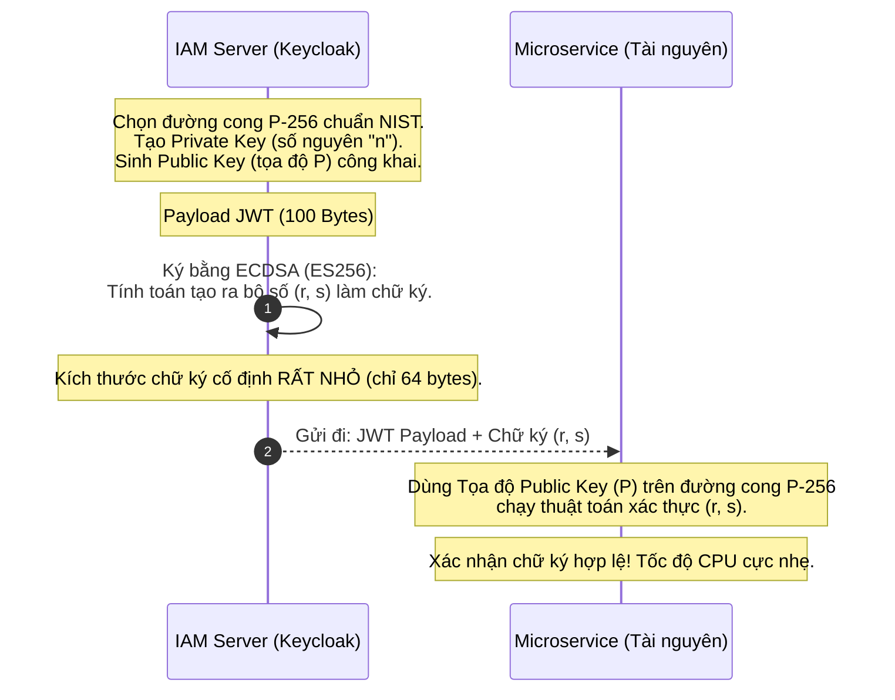

# Lesson 20: ECC (Elliptic-Curve Cryptography)

> [!NOTE]
> **Category:** Theory (Lý thuyết)
> **Goal:** Tiếp cận công nghệ mật mã học hiện đại bậc nhất: Mã hóa Đường cong Elliptic (ECC). Hiểu nguyên lý toán học ưu việt giúp ECC đánh bại RSA toàn diện (tốc độ, kích thước) và trở thành chuẩn mực tối thượng cho Token JWT trong môi trường Mobile và Microservices.

## 1. Lý thuyết chuyên sâu (Detailed Theory)

### 1.1. Tại sao phải từ bỏ RSA?
RSA là một nền tảng vĩ đại, nhưng nó có một tử huyệt: Kích thước khóa.
Để duy trì độ bảo mật chống lại sức mạnh phần cứng ngày càng tăng, khóa RSA phải phình to lên (từ 1024-bit lên 2048, rồi 4096-bit). Khóa càng to, tốc độ CPU xử lý càng rùa bò, băng thông mạng truyền tải chứng chỉ càng bị quá tải, và pin của thiết bị di động (Smartphones/IoT) bị rút cạn nhanh chóng.
Thế giới cần một thuật toán vừa an toàn như RSA 3072-bit, nhưng kích thước khóa chỉ bằng một phần mười. Đó là lúc ECC lên ngôi.

### 1.2. Mật mã Đường cong Elliptic (ECC) là gì?
Thay vì dựa vào bài toán phân tích thừa số nguyên tố khổng lồ, ECC dựa trên một phương trình toán học phức tạp vẽ ra đồ thị hình cong trên mặt phẳng 2D: $y^2 = x^3 + ax + b$.

- **Phép toán cốt lõi:** Nếu bạn có một Điểm gốc $G$ trên đường cong, và cộng điểm đó với chính nó $n$ lần để ra một Điểm đích $P$. Bài toán là: Nếu công khai Điểm $P$ và Điểm $G$, không một siêu máy tính nào có thể tìm ngược lại được $n$ (Số lần đã cộng).
- Trong đó: Số $n$ chính là **Private Key** (Chỉ là một con số nguyên 256-bit vô cùng nhỏ gọn). Điểm $P$ (Tọa độ X, Y) chính là **Public Key**.

**Sức mạnh áp đảo:** Một chiếc khóa ECC **256-bit** cung cấp mức độ bảo mật tương đương hoàn toàn với một chiếc khóa RSA **3072-bit**. Kích thước giảm 12 lần!

---

## 2. Luồng nội bộ & Cơ chế cấp thấp (Internal Workflow & Low-level Mechanisms)

Trong kiến trúc Keycloak/OAuth2, thuật toán chữ ký phổ biến nhất dựa trên ECC là **ECDSA** (Elliptic Curve Digital Signature Algorithm) - Chuẩn `ES256`.

---

## 3. Thực hành tốt nhất & Bảo mật (Best Practices & Security)

> [!IMPORTANT]
> **Chuyển đổi từ `RS256` sang `ES256` cho JWT**
> Nếu hệ thống của bạn cấp phát hàng triệu Token mỗi ngày cho thiết bị Mobile, hãy vứt bỏ RSA và cấu hình ngay Keycloak để dùng ES256 (ECDSA dùng đường cong P-256). 
> - Lợi ích 1: Chữ ký của JWT nhỏ hơn khoảng 75% so với RSA. Giảm nghẽn băng thông và giảm dung lượng HTTP Header.
> - Lợi ích 2: Hiệu năng CPU của máy chủ (Microservice) khi thực hiện phép xác thực chữ ký và giải mã (Decryption) cao hơn gấp nhiều lần.

> [!CAUTION]
> **Rủi ro Số ngẫu nhiên (RNG Risk)**
> Phương trình toán học tạo chữ ký của ECDSA yêu cầu một con số sinh ngẫu nhiên tạm thời (Nonce $k$) cho MỖI LẦN KÝ. Nếu máy chủ của bạn bị lỗi hàm sinh số ngẫu nhiên (Poor RNG) dẫn đến việc **dùng lại** con số $k$ này hai lần cho hai Payload khác nhau, hacker có thể dùng phép trừ toán học cấp hai để suy ngược ra cái Private Key gốc (Số $n$). 
> (Đây là cách nhóm hacker fail0ver đã bẻ khóa máy Sony PS3 năm 2010 vì Sony tái sử dụng Nonce tĩnh trong code ECDSA).

---

## 4. Cấu hình minh họa thực tế (Configuration Examples)

Thiết lập trong Keycloak để chuyển đổi thuật toán cấp Token sang công nghệ tương lai:
1. Đăng nhập Admin Console -> Realm Settings -> Tab **Keys**.
2. Tab `Providers` -> Nút `Add Keystore` -> Chọn `ecdsa-generated`.
3. Điền cấu hình:
   - Priority: `100` (Để nó trở thành khóa Ưu tiên số 1 - Active).
   - Elliptic Curve: `P-256` (Tiêu chuẩn cân bằng nhất về độ an toàn và độ phổ biến).
   - Algorithm: `ES256`.
4. Vô hiệu hóa tính năng Active của các key RSA cũ.
Từ giờ, toàn bộ `Access Token` và `ID Token` Keycloak cấp phát sẽ bé xíu và mang chữ ký siêu nhẹ `ES256`.

---

## 5. Trường hợp ngoại lệ (Edge Cases)

- **Tranh cãi "Cửa hậu" của NIST:** Đường cong phổ biến nhất thế giới `secp256r1` (P-256) được chuẩn hóa bởi NIST (Viện Tiêu chuẩn Mỹ) và giới tình báo NSA. Nhiều chuyên gia mật mã học cực đoan lo ngại rằng NSA có thể đã cấy một Cửa hậu (Backdoor) toán học ẩn giấu dưới các hằng số của đường cong này, cho phép họ giải mã lén. Sự bất tín nhiệm này dẫn đến sự ra đời của **Ed25519** (Sử dụng đường cong Edwards) - Một thuật toán ECC độc lập hoàn toàn, minh bạch, siêu tốc và miễn nhiễm cấu trúc với các đòn tấn công bảo mật. `EdDSA` (Ed25519) hiện đang được tích hợp sâu rộng vào các hệ thống Blockchain và OpenSSH hiện đại. (Keycloak bắt đầu hỗ trợ EdDSA từ các phiên bản rất mới).

---

## 6. Câu hỏi Phỏng vấn (Interview Questions)

**1. Giải thích sự ưu việt của Mật mã Đường cong Elliptic (ECC) so với RSA bằng con số trực quan?**
- **Junior:** ECC dùng công thức toán học đời mới nên khóa bé xíu mà bảo mật vẫn ngang ngửa RSA to khổng lồ.
- **Senior:** Lợi thế cốt lõi của ECC nằm ở tỷ lệ Kích thước Khóa và Sức mạnh Bảo mật (Key size to security ratio). Để chống lại các siêu máy tính hiện tại, RSA đòi hỏi khóa bèo nhất là 2048-bit hoặc 3072-bit (vài trăm bytes văn bản). Việc tính toán toán học trên các khối số bự chà bá này gây lãng phí CPU khổng lồ và ngốn bộ nhớ. ECC giải quyết bài toán Logarit rời rạc (Discrete Logarithm Problem) trên đồ thị toán học khó hơn bài toán phân tích thừa số nguyên tố của RSA rất nhiều. Do đó, ECC chỉ cần độ dài khóa 256-bit (32 bytes) là tạo ra mức bảo mật tương đương RSA 3072-bit, tiết kiệm băng thông và tăng tốc xử lý CPU gấp nhiều lần, là lựa chọn số 1 cho các chip IoT yếu ớt.

**2. Nếu tôi phân tích Headers của một JSON Web Token (JWT) và thấy trường `alg` mang giá trị `ES256`. Điều đó có nghĩa là gì về mặt kỹ thuật?**
- **Junior:** Nó xài mã hóa ECC thay cho RSA để ký Token.
- **Senior:** `ES256` là thuật ngữ quy ước (Specification) của chuẩn IETF. Nó mang ý nghĩa: Chuỗi JWT này được ký xác thực (Signature) bằng thuật toán Bất đối xứng ECDSA (Elliptic Curve Digital Signature Algorithm). Chữ "E" chỉ định Elliptic Curve, chữ "S" chỉ định Signature. Cụm "256" chỉ định rằng thuật toán ECDSA này đã được áp dụng trên đường cong tiêu chuẩn `P-256` và kết hợp với hàm băm `SHA-256`. Client nhận Token này phải lên mạng lấy bộ Tọa độ Public Key (Curve P-256) về để xác thực chữ ký.

**3. Tại sao lỗ hổng Sinh số Ngẫu nhiên (Random Number Generation) lại bị coi là đòn chí mạng có thể giết chết ECDSA ngay tức khắc?**
- **Junior:** Vì nó sinh số dễ đoán quá nên hacker lấy được.
- **Senior:** Phương trình tạo chữ ký số của ECDSA đòi hỏi một tham số ngẫu nhiên $k$ (Nonce) chỉ được dùng một lần duy nhất. Phương trình tính toán có sự liên kết chặt chẽ giữa Chữ ký $S$, Nonce $k$, và Private Key $d$. Nếu do lỗi lập trình (hoặc do thiết bị cạn kiệt Entropy) mà hai gói dữ liệu khác nhau lại sinh ra chung một con số $k$, thì Hacker bắt được 2 chữ ký đó có thể làm toán trừ phương trình đại số cơ bản. Con số bí ẩn $k$ bị triệt tiêu, và hệ phương trình sẽ lòi thẳng ra biến $d$ (Private Key gốc của máy chủ). Toàn bộ hệ thống sập đổ. Do đó, các phiên bản như EdDSA (Ed25519) ra đời để sinh tham số $k$ theo cách Tất định (Deterministic) từ chính dữ liệu gốc, xóa bỏ hoàn toàn rủi ro dựa dẫm vào phần cứng sinh số ngẫu nhiên.

**4. Khái niệm trao đổi khóa Diffie-Hellman truyền thống (DHE) và phiên bản đường cong Elliptic của nó (ECDHE) khác nhau ở điểm nào trong giao thức TLS 1.3?**
- **Junior:** ECDHE chạy nhanh hơn DHE vì nó dùng khóa ngắn hơn.
- **Senior:** Thuật toán Diffie-Hellman sinh ra để giải quyết bài toán thiết lập Session Key qua kênh mạng bị nghe lén. DHE (Diffie-Hellman Ephemeral) sử dụng nền tảng số học hữu hạn (Finite Field) với kích thước nhóm số khổng lồ (giống như RSA), gây chậm trễ cho quá trình TLS Handshake. Phiên bản nâng cấp ECDHE (Elliptic Curve DHE) chuyển phương trình tính toán lên đồ thị không gian của đường cong Elliptic. Điều này mang lại tốc độ trao đổi khóa thần tốc (giảm thời gian bắt tay), khóa cực nhỏ gọn, mà vẫn duy trì được cơ chế Forward Secrecy (Khóa phù du, sinh xong vứt bỏ). TLS 1.3 mặc định ưu tiên tối cao cho ECDHE.

**5. Mặc dù ECC ưu việt như vậy, tại sao trong rất nhiều tổ chức Tài chính - Ngân hàng, các tiêu chuẩn bảo mật cũ (như EMV Card) vẫn bám víu vào cấu trúc mã hóa RSA?**
- **Junior:** Vì máy chủ cũ quá nên không cài được thuật toán mới.
- **Senior:** Chướng ngại vật lớn nhất là khả năng Tương thích ngược hệ thống (Legacy Compatibility) và Chứng nhận bảo mật (Compliance/Certifications). Cấu trúc phần cứng của máy chủ Mainframe, lõi của Thẻ chíp tín dụng (Smart Cards), hoặc máy ATM đã được nung chảy phần cứng chip mã hóa bằng cấu trúc của RSA từ thập kỷ trước. Việc update phần mềm để hỗ trợ ECC đôi khi bất khả thi trên các kiến trúc vật lý kín (Air-gapped). Ngoài ra, chi phí đánh giá lại rủi ro, tái chứng nhận tiêu chuẩn pháp lý bảo mật của quốc gia để chuyển đổi thuật toán mã hóa trung tâm là một bài toán kinh tế khổng lồ khiến họ phải duy trì RSA lâu nhất có thể.

---

## 7. Tài liệu tham khảo (References)
- **RFC 6090:** Fundamental Elliptic Curve Cryptography Algorithms.
- **RFC 7518:** JSON Web Algorithms (JWA) - section 3.4 (ECDSA).
- **Keycloak Documentation:** Key providers (ECDSA/EdDSA).
