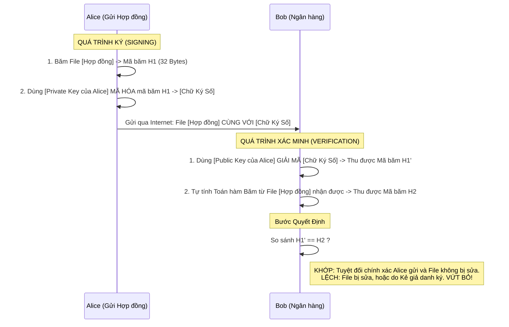

# Lesson 22: Chữ ký số (Digital Signature)

> [!NOTE]
> **Category:** Theory & Security (Lý thuyết & Bảo mật)
> **Goal:** Giải phẫu cơ chế Chữ ký số điện tử. Hiểu cách kết hợp Thuật toán Băm (Hash) và Mã hóa Bất đối xứng (Asymmetric) để tạo ra cơ chế định danh tàn khốc nhất: Tính Toàn vẹn (Integrity) và Chống chối bỏ (Non-repudiation).

## 1. Lý thuyết chuyên sâu (Detailed Theory)

### 1.1. Bản chất của Chữ ký số
Trong thế giới thực, bạn ký tên lên Hợp đồng để chứng minh: (1) Chính bạn là người viết hợp đồng, và (2) Hợp đồng đó không bị sửa đổi sau khi bạn ký.
Trong máy tính, Chữ ký số làm nhiệm vụ y hệt, nhưng bằng Toán học.

Chữ ký số ra đời dựa trên **Mã hóa Bất đối xứng (Asymmetric Cryptography - RSA/ECC)**. Khác với mã hóa thông thường (Dùng Public Key để bọc lại, Private Key để mở ra). Chữ ký số ĐẢO NGƯỢC QUÁ TRÌNH NÀY:
- Người ký dùng **Khóa Bí Mật (Private Key)** của họ để mã hóa một con dấu. (Chỉ họ mới có Private Key, nên không ai giả mạo được).
- Mọi người trên thế giới có thể dùng **Khóa Công Khai (Public Key)** của người đó để Mở con dấu. Nếu mở thành công, chứng tỏ 100% con dấu đó do chính chủ đóng xuống.

### 1.2. Tại sao phải Băm (Hash) trước khi Ký?
Mã hóa RSA chạy RẤT CHẬM và chỉ có thể mã hóa được các gói dữ liệu rất nhỏ (Bằng kích thước khóa, VD: 2048 bit ~ 256 Bytes). Nếu bạn có một hợp đồng dài 50 Trang, bạn không thể dùng RSA để "ký" toàn bộ hợp đồng được.
- **Giải pháp:** Bạn dùng hàm Băm (SHA-256) chạy qua 50 trang hợp đồng, nặn ra một chuỗi băm siêu ngắn (32 Bytes).
- Sau đó, bạn chỉ cần lấy `Private Key` để KÝ LÊN CHUỖI BĂM ĐÓ (Nhanh như chớp).

---

## 2. Luồng nội bộ & Cơ chế cấp thấp (Internal Workflow & Low-level Mechanisms)

Toàn cảnh luồng Tạo (Sign) và Xác minh (Verify) Chữ ký số:



---

## 3. Thực hành tốt nhất & Bảo mật (Best Practices & Security)

> [!IMPORTANT]
> **Vấn đề Chống chối bỏ (Non-repudiation)**
> Tính năng độc nhất vô nhị của Chữ ký số so với Mã hóa Đối xứng (AES/HMAC) là: **Sự chối bỏ (Repudiation)**.
> Nếu Alice và Ngân hàng xài chung 1 chìa khóa HMAC (Mã hóa đối xứng). Khi Alice chuyển 1 tỷ, sau đó Alice kiện: *"Tao không chuyển, máy chủ Ngân hàng tự cầm chìa khóa chung đó sinh ra giao dịch khống"*. Tòa án sẽ bế tắc vì cả 2 đều cầm chìa khóa đó.
> Bằng RSA (Chữ ký số), Ngân hàng KHÔNG CÓ Private Key của Alice. Nên Ngân hàng không bao giờ có thể tự làm giả chữ ký của Alice được. Trước tòa án, nếu chữ ký hợp lệ, Alice KHÔNG THỂ CHỐI BỎ trách nhiệm của mình (Trừ khi Alice báo mất Private Key từ trước).

> [!CAUTION]
> **Lỗ hổng Suy đồi Thuật toán (Algorithm Downgrade / Confusion Attack)**
> Trong các hệ thống JWT cũ, Hacker thường lợi dụng điểm yếu của việc Backend chấp nhận thuật toán linh hoạt. Hacker lấy 1 Token đã ký bằng RS256 (RSA). Hacker dùng chính cái **Public Key** của hệ thống (Vốn công khai), biến cái Public Key đó thành một Mật khẩu bí mật Đối xứng, rồi đổi thuật toán trên Header Token thành HS256 (HMAC). Backend lôi hàm giải mã HMAC ra xài, và khớp hoàn hảo.
> **Thực hành chuẩn:** Mọi API và Máy chủ (Như Keycloak) BẮT BUỘC phải Đóng Cứng (Hardcode) Thuật toán dự kiến (VD: Chỉ chấp nhận RS256/RS256). Mọi Request mang Header thuật toán lạ phải bị chém ngay lập tức.

---

## 4. Cấu hình minh họa thực tế (Configuration Examples)

Ví dụ Code Java mô phỏng Lõi của quá trình Ký và Xác minh trong Keycloak/OIDC:

```java
import java.security.*;
import java.util.Base64;

public class DigitalSignatureDemo {
    public static void main(String[] args) throws Exception {
        String data = "Lenh chuyen tien: 1,000,000 USD";

        // 1. Khởi tạo cặp Khóa RSA
        KeyPairGenerator keyGen = KeyPairGenerator.getInstance("RSA");
        keyGen.initialize(2048);
        KeyPair pair = keyGen.generateKeyPair();

        // 2. KÝ DỮ LIỆU (Bởi người gửi) - Thuật toán SHA256withRSA
        Signature rsaSign = Signature.getInstance("SHA256withRSA");
        rsaSign.initSign(pair.getPrivate());
        rsaSign.update(data.getBytes());
        byte[] signatureBytes = rsaSign.sign();
        String base64Signature = Base64.getEncoder().encodeToString(signatureBytes);
        System.out.println("Chữ ký (Nằm trong JWT Signature): " + base64Signature);

        // 3. XÁC MINH DỮ LIỆU (Bởi Máy chủ)
        Signature rsaVerify = Signature.getInstance("SHA256withRSA");
        rsaVerify.initVerify(pair.getPublic());
        
        // Hacker thử sửa chữ "1" thành "9" -> dataHack
        String dataHack = "Lenh chuyen tien: 9,000,000 USD";
        rsaVerify.update(dataHack.getBytes());
        
        boolean isCorrect = rsaVerify.verify(signatureBytes);
        System.out.println("Kết quả xác minh (Khớp?): " + isCorrect); // Sẽ in ra FALSE
    }
}
```

---

## 5. Trường hợp ngoại lệ (Edge Cases)

- **Vòng đời của Chữ ký (Key Compromise):** Chữ ký số gắn liền với sinh mệnh của Private Key. Giả sử 1 bản Hợp đồng điện tử (Ký năm 2020) có giá trị 10 năm. Nhưng đến năm 2023, máy tính Alice bị hack và mất Private Key. Hacker dùng Private Key đó ký hàng loạt hợp đồng giả năm 2023. Làm sao tòa án phân biệt hợp đồng 2020 là thật, hợp đồng 2023 là giả do hacker ký?
  - **Khắc phục:** Chữ ký số dài hạn BẮT BUỘC phải đi kèm với **Timestamp (Dấu thời gian)** do một Cơ quan Độc lập (TSA - Time Stamping Authority) cấp để niêm phong khoảnh khắc Ký. Hợp đồng 2020 có mốc thời gian TSA bảo chứng, hợp đồng giả 2023 sẽ có mốc thời gian TSA nằm SAU THỜI ĐIỂM BÁO MẤT KHÓA -> Bị bác bỏ.

---

## 6. Câu hỏi Phỏng vấn (Interview Questions)

**1. Trong các chuẩn JWT, thuật toán `RS256` và `ES256` đều là Mã hóa Bất đối xứng dùng để tạo chữ ký số. Vậy tại sao ES256 lại được các nền tảng Mobile/IoT ưu tiên sử dụng hơn?**
- **Junior:** Chắc ES256 nó an toàn hơn, thuật toán mới hơn.
- **Senior:** Vấn đề nằm ở Hiệu năng phần cứng và Kích thước Token. 
`RS256` dựa trên hệ mật RSA (Toán học số nguyên tố). Để đạt chuẩn an toàn hiện nay, chiều dài khóa RSA phải từ 2048-bit trở lên. Điều này làm cho Chữ ký (Signature) phình to (256 bytes) và tốn rất nhiều CPU để tính toán.
`ES256` dựa trên Đường cong Elliptic (Elliptic Curve Cryptography - ECDSA). Sức mạnh toán học của nó cực đỉnh: Chỉ cần khóa dài 256-bit của ECC đã an toàn TƯƠNG ĐƯƠNG với khóa 3072-bit của RSA. Kích thước Chữ ký siêu nhỏ (64 bytes), Token gọn nhẹ, tiêu thụ điện năng/CPU của các thiết bị Mobile/IoT cực ít nhưng vẫn duy trì độ bảo mật cấp độ Quân đội.

**2. Để máy chủ API kiểm tra Chữ ký JWT Token do Keycloak cấp, API cần Public Key. Nếu Hacker tự tạo một Cặp Khóa (Private/Public) giả mạo, tự ký Token bằng Private của Hacker, và gửi cho API kèm theo cái Public Key của Hacker, API có bị đánh lừa không?**
- **Junior:** API lấy Public Key đó bẻ khóa thành công thì nó sẽ tin tưởng.
- **Senior:** Đây là lỗ hổng Niềm tin Công khai (Trust Anchor). API Tuyệt đối KHÔNG BAO GIỜ nhận Public Key trực tiếp từ phía Trình duyệt/Kẻ gọi gửi lên (Ví dụ trong Header của JWT).
API Backend phải được Cấu hình Cứng (Hardcode) cấu hình URL trỏ thẳng về endpoint `/certs` (JWKS) của Máy chủ Keycloak THẬT SỰ. Khi Hacker gửi Token lên, Backend KHÔNG DÙNG khóa của hacker, nó chạy về nhà (Keycloak) lấy bộ Public Key xịn ra để thử. Public Key xịn không thể mở được Chữ ký do Private Key của Hacker đóng xuống. Chữ ký bị từ chối 100%.

**3. HMAC (HS256) cũng được dùng để Ký JWT. Nó khác biệt chí mạng gì so với RS256 và tại sao không bao giờ dùng HS256 trong môi trường Enterprise Microservices?**
- **Junior:** HMAC mã hóa yếu hơn RSA nên dễ bị hack pass.
- **Senior:** HMAC là chữ ký dựa trên Mã hóa ĐỐI XỨNG (Symmetric). Nó dùng 1 Bí mật (Shared Secret) duy nhất để Vừa Ký Vừa Xác Minh.
Nếu công ty có Máy chủ Keycloak (Nơi sinh Token) và 50 Máy chủ API (Nơi Xác minh Token). Bạn dùng HS256, BẮT BUỘC bạn phải copy cái Shared Secret đó và nhét vào cấu hình của cả 50 máy chủ API.
Lỗ hổng chí mạng: Chỉ cần 1 máy chủ API Kế toán bị Hack, lộ cái Shared Secret đó, Hacker cầm cái Shared Secret đó và TỰ KÝ (Giả mạo) được Access Token của Admin (Vì nó là khóa Đối xứng - Dùng mở cũng là nó, mà dùng Ký cũng là nó). Trong kiến trúc Enterprise, RS256 chia cắt quyền lực tuyệt đối: Keycloak chỉ giữ Private Key (Khả năng tạo Token), 50 Máy chủ API chỉ cầm Public Key (Chỉ có Khả năng kiểm tra, không thể tạo giả Token). Nếu 1 API bị hack Public Key, không ai bị thương cả.

**4. Khái niệm "Xác minh Chữ ký mù" (Blind Signature) là gì trong hệ thống bỏ phiếu điện tử hoặc tiền điện tử?**
- **Junior:** Là ký xong không cho ai đọc nội dung bên trong.
- **Senior:** Chữ ký mù được sáng chế bởi David Chaum. Nó là kỹ thuật mà bạn (Người dùng) cần một Nhà phát hành (Ví dụ: Ủy ban bầu cử) KÝ chứng thực cho một tờ Phiếu Bầu của bạn (Để chứng minh bạn là công dân hợp lệ). NHƯNG bạn KHÔNG MUỐN Ủy ban Bầu cử BIẾT nội dung bên trong bạn bầu cho ai (Đảm bảo ẩn danh).
Kỹ thuật này dùng phép toán bọc (Blinding factor) che giấu tờ Phiếu lại. Đưa cục Blinding đó cho Ủy ban ký bằng Private Key. Xong bạn đem về, lột cái lớp Blinding ra. Điều kỳ diệu của Toán học là: Chữ ký của Ủy ban Bầu cử VẪN ĐÍNH CHẶT vào tờ Phiếu Bầu bản rõ của bạn (Được công nhận hợp lệ), mà Ủy ban không hề hay biết nội dung tờ phiếu. Đây là nền tảng của ẩn danh tuyệt đối.

**5. Tại sao máy chủ Web (HTTPS) lại phải gửi cả Chứng chỉ (Certificate) chứa Public Key của nó cho Trình duyệt, thay vì chỉ gửi cái Public Key thôi cho nhẹ mạng?**
- **Junior:** Vì quy định của SSL nó gộp chung vô cái file đó.
- **Senior:** Nếu máy chủ chỉ gửi Public Key "trần trụi". Hacker chui vào giữa (Man-in-the-Middle), hắn chặn cái Public Key xịn lại, và ném Public Key của Hacker cho bạn. Bạn ngây thơ cầm Khóa của Hacker mã hóa Mật khẩu ngân hàng và gửi đi. Bùm!
**Chứng chỉ (Certificate)** sinh ra để giải quyết bài toán Định danh Public Key. Cái Certificate đó là một Văn bản chứa Public Key của Ngân hàng, NHƯNG LẠI ĐƯỢC ĐÓNG CHỮ KÝ SỐ BỞI MỘT TỔ CHỨC CA (Certificate Authority - Ví dụ Digicert). Trình duyệt của bạn có cài sẵn các Root Public Key của Digicert trong lõi (Hardcoded OS). Nó sẽ lấy khóa của Digicert ra để KIỂM TRA CHỮ KÝ trên Chứng chỉ đó. Nếu hợp lệ, nó mới Tin Tưởng cái Public Key bên trong là Của Ngân Hàng Thật. Đây là Xương sống của Hạ tầng khóa công khai (PKI).

---

## 7. Tài liệu tham khảo (References)
- **RFC 8017:** PKCS #1: RSA Cryptography Specifications.
- **NIST FIPS 186-4:** Digital Signature Standard (DSS).
- **OWASP:** Cryptographic Storage Cheat Sheet.
