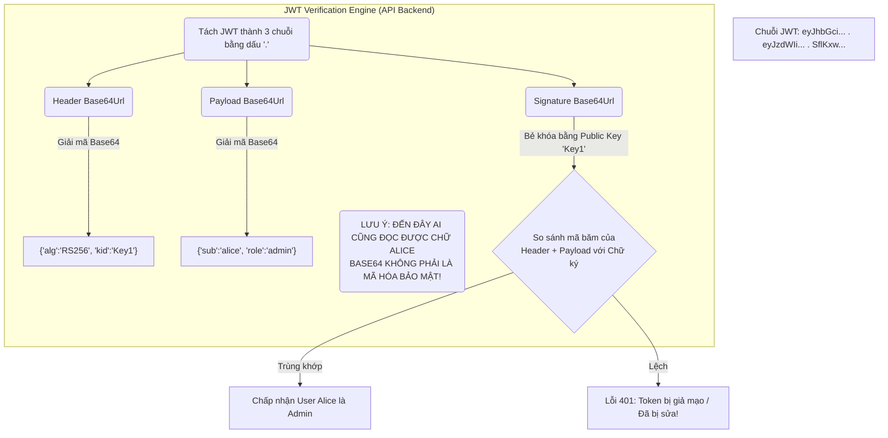

# Lesson 23: JSON Web Token (JWT)

> [!NOTE]
> **Category:** Theory & Architecture (Lý thuyết & Kiến trúc)
> **Goal:** Mổ xẻ cấu trúc vật lý của JWT. Trả lời câu hỏi: Tại sao JWT lại là "Bộ não phi trạng thái" (Stateless) thống trị toàn bộ thế giới API hiện đại, và ranh giới mong manh giữa Encoding (Mã hóa biểu diễn) và Encryption (Mã hóa bảo mật).

## 1. Lý thuyết chuyên sâu (Detailed Theory)

### 1.1. JWT là gì? Tại sao nó lật đổ Session Cookie?
Trong kiến trúc Web cũ (Bài 4), sau khi User login, Server lưu 1 bản ghi vào Database/RAM (Session), và nhả ra 1 cái thẻ ID mỏng dính (Cookie `session_id=123`). Mỗi lần gọi API, Server phải chọc vào DB truy vấn số `123` để biết đó là ai. Khi Server có 10 Triệu người dùng, Database sập vì nghẽn cổ chai (Stateful Bottleneck).

**JWT (JSON Web Token)** ra đời với triết lý: "Gói tất cả mọi thứ vào vali và vứt cho User tự cầm".
- JWT là một chuỗi văn bản cực dài. Nó chứa SẴN Tên tuổi, Chức vụ, Quyền hạn của User.
- Máy chủ Không Cần Lưu Bất Cứ Thứ Gì vào DB. Khi User gọi API nộp JWT, Server chỉ việc bung cái JWT ra, ngó chữ ký (Signature) xem có đúng do mình phát hành lúc trước không. Nếu đúng, cho qua luôn. Khái niệm này gọi là **Phi trạng thái (Stateless)**. Nó giúp kiến trúc Microservices có thể Scale (Nhân bản) lên hàng ngàn máy chủ trong 1 giây mà không cần bận tâm đồng bộ Database.

### 1.2. Giải phẫu JWT (Cấu trúc 3 phần)
Một chuỗi JWT nhìn qua rất đáng sợ: `xxxxx.yyyyy.zzzzz` (Gồm 3 phần cách nhau bằng dấu CHẤM).
Thực chất nó là 3 cục JSON được biến đổi sang chuẩn **Base64Url** (Để không bị lỗi font khi nhét vào URL hoặc Header HTTP).

1. **Header (Đầu):** Chứa thông tin về loại Token và Thuật toán Ký (VD: Dùng thuật toán `RS256`, cái Public Key nào để mở (`kid`)).
2. **Payload (Thân - Claims):** Chứa Dữ liệu nghiệp vụ. Gồm các Claims (Tuyên bố) tiêu chuẩn như `sub` (User ID), `exp` (Giờ hết hạn), `iss` (Người phát hành) và các Claims do lập trình viên tự chế như `role: "admin"`.
3. **Signature (Chữ ký - Đuôi):** Là thành phần bảo vệ. Nó lấy Header + Payload băm lại, sau đó dùng Private Key của Server đóng dấu lên. Tránh bị Hacker chui vào Payload sửa chữ "user" thành "admin".

---

## 2. Luồng nội bộ & Cơ chế cấp thấp (Internal Workflow & Low-level Mechanisms)

Quá trình "Bung" một JWT (Stateless Verification) trên Microservice:



---

## 3. Thực hành tốt nhất & Bảo mật (Best Practices & Security)

> [!CAUTION]
> **Base64Url Không phải là Bảo mật (No Confidentiality)**
> Lỗi kinh điển của lập trình viên là giấu Mật khẩu, Số thẻ Tín dụng, hoặc Dữ liệu nội bộ nhạy cảm vào Payload của JWT (Vì cứ tưởng JWT dài thòng lọng là nó đã mã hóa).
> JWT mặc định (JWS) CHỈ ĐẢM BẢO TÍNH TOÀN VẸN (Không ai sửa được). Nó **KHÔNG ĐẢM BẢO BÍ MẬT**. Bất kỳ ai bắt được JWT, mang ném vào trang `jwt.io` đều có thể giải mã Base64 và đọc rành rọt mọi chữ tiếng Việt bên trong Payload.
> **Thực hành chuẩn:** Chỉ lưu các ID định danh vô hại (User ID, Role, Department). Tuyệt đối không lưu PII (Personally Identifiable Information). Nếu bắt buộc phải giấu kín, phải nâng cấp kiến trúc lên JWE (JSON Web Encryption).

> [!IMPORTANT]
> **Bệnh béo phì Token (Token Bloat)**
> Vì lợi ích Stateless, Dev có xu hướng nén "cả thế giới" vào JWT (Nhét thông tin 50 cái kho hàng của User vào). Hậu quả: Chuỗi JWT phình to lên 16 KB. 
> Mỗi lần Trình duyệt gọi API (Tải ảnh, tải CSS), nó phải vác cái cục tạ 16 KB đó ném vào HTTP Header. Làm nghẽn mạng băng thông, và bị Nginx chém chết vì lỗi `431 Request Header Fields Too Large`.
> **Thực hành chuẩn:** Kích thước JWT tối đa nên < 4 KB. Thông tin chi tiết hãy để Backend dùng User ID truy vấn Database, hoặc sử dụng `UserInfo Endpoint` của OIDC.

---

## 4. Cấu hình minh họa thực tế (Configuration Examples)

Cấu trúc Payload (Claims) chuẩn mực trong các hệ thống doanh nghiệp (OAuth2/OIDC):

```json
{
  // --- CÁC CLAIMS TIÊU CHUẨN (Bảo mật bắt buộc phải có) ---
  "iss": "https://auth.company.com/realms/prod", // Người phát hành (Issuer)
  "sub": "b2f8a1c9-1234-abcd-5678-000000000000",  // Định danh độc nhất của User (Subject)
  "aud": "finance-api-service",                   // Đối tượng được quyền đọc Token này (Audience)
  "exp": 1715000000,                              // Thời điểm hết hạn (Unix Epoch Seconds)
  "nbf": 1714900000,                              // Không được dùng trước mốc thời gian này (Not Before)
  "iat": 1714900000,                              // Thời điểm Token được sinh ra (Issued At)
  "jti": "uuid-token-12345",                      // ID độc nhất của Token (Chống Replay Attack)
  
  // --- CÁC CLAIMS TÙY CHỈNH (Nghiệp vụ) ---
  "preferred_username": "alice_tran",
  "email": "alice@company.com",
  "realm_access": {
    "roles": ["manager", "view_reports"]
  }
}
```

---

## 5. Trường hợp ngoại lệ (Edge Cases)

- **Nguy cơ Tước quyền Phi trạng thái (The Revocation Problem):** Đây là điểm yếu tàn bạo nhất của JWT. Khi Admin bấm nút "Khóa tài khoản Alice" trên Keycloak. Database báo Alice bị khóa. NHƯNG, Alice vẫn đang cầm 1 cái JWT có thời hạn 30 phút. 
Khi Alice gọi API Bán hàng, API Bán hàng theo nguyên lý Stateless CHỈ KIỂM TRA CHỮ KÝ (Khớp) và THỜI HẠN (Chưa tới 30 phút). API không chọc về Keycloak để hỏi trạng thái. Kết quả: Alice vẫn hoành hành trong 30 phút đó.
  - **Khắc phục:** Stateless là một lời nói dối đánh đổi (Trade-off). Muốn đuổi User ngay lập tức, kiến trúc sư BẮT BUỘC phải áp dụng cơ chế **Bán trạng thái (Semi-stateful)**: Máy chủ API phải bảo trì một Blacklist (Danh sách đen) các Token bị thu hồi trên Redis, hoặc thiết lập thời gian Token CỰC NGẮN (Ví dụ 5 phút phải xin Refresh 1 lần).

---

## 6. Câu hỏi Phỏng vấn (Interview Questions)

**1. Base64 và Base64Url khác nhau như thế nào? Tại sao JWT lại bắt buộc dùng Base64Url?**
- **Junior:** Nó giống nhau, giúp biến chữ thành code.
- **Senior:** Bảng mã Base64 gốc sinh ra các chuỗi có chứa ký hiệu `+`, `/` và ký hiệu bằng `=` (Padding). Khi bạn đưa một chuỗi chứa dấu `+` hoặc `/` vào trong Link URL Web (Ví dụ tham số Get `?token=abc+def/xyz`), Máy chủ Web (Tomcat/Nginx) sẽ DỊCH SAI ký tự đó (Dấu `+` bị dịch thành khoảng trắng Không gian, dấu `/` bị dịch thành thư mục con). Token sẽ bị gãy vỡ, giải mã báo lỗi.
`Base64Url` là một chuẩn nâng cấp (RFC 4648). Nó THAY THẾ ký hiệu `+` thành `-` (Dấu trừ), ký hiệu `/` thành `_` (Dấu gạch dưới), và LƯỢC BỎ hoàn toàn dấu `=` ở đuôi. Chuỗi tạo ra hoàn toàn An Toàn Cho URL (URL-Safe), bay tự do trên Internet mà không sợ bị biến dạng.

**2. Nếu tôi không muốn truyền JWT trong HTTP Header `Authorization: Bearer ...` mà tôi bỏ JWT vào Cookie để gửi lên Máy chủ được không? Điều đó ảnh hưởng gì đến Security?**
- **Junior:** Được, bỏ đâu cũng gửi lên server được.
- **Senior:** Chuyển Token vào Cookie là một chiến thuật kiến trúc sâu sắc (BFF Pattern - Backend For Frontend). 
  - Đặt trong Header `Bearer`: Javascript (Local Storage) phải cầm Token để tự gắn vào Header. Nếu web bị lỗi XSS, Hacker sẽ chôm được nguyên Token.
  - Đặt trong `Cookie` (Kèm cờ HttpOnly, Secure): Javascript không thể chạm vào Cookie. Trình duyệt sẽ TỰ ĐỘNG đính kèm Cookie gửi lên Server. Nó miễn nhiễm 100% với XSS. TÍNH BẢO MẬT TĂNG LÊN RẤT CAO. Tuy nhiên, đổi lại, bạn phải gánh chịu rủi ro về CSRF (Hacker dụ User bấm link gọi chéo Web vì Trình duyệt tự nhét Cookie) và phải giải quyết bài toán SameSite.

**3. Concept `jti` (JWT ID) có tác dụng gì trong luồng phòng chống Tấn công Đánh Lại (Replay Attack)?**
- **Junior:** Làm ID cho Database dễ tìm.
- **Senior:** Trong luồng API quan trọng (Ví dụ: Thanh toán 100 USD). Hacker có thể ngửi mạng, bắt được cái HTTP Request kèm cái JWT của bạn. Hacker không thể giải mã, nhưng hắn CHÉP NGUYÊN SI cục HTTP Request đó bắn vào API thêm 5 lần nữa (Replay). Máy chủ API bóc JWT ra, thấy chữ ký đúng, còn hạn sử dụng, nó vui vẻ trừ bạn 500 USD.
Để chống đòn này, Máy chủ API phải bật tính năng Ghi nhớ. Nó sẽ đọc trường `jti` (Mã độc nhất của Token), lưu cái `jti` đó vào bộ nhớ đệm Redis trong 5 phút. Khi Hacker bắn cái Token đó lần 2, API nhìn Redis thấy "Cái JTI này vừa gọi 1 giây trước rồi", nó sẽ cự tuyệt gói tin Đánh Lại ngay lập tức (Idempotent validation).

**4. Sự khác biệt giữa Claim `nbf` (Not Before) và `iat` (Issued At) là gì? Kịch bản nào cần đến `nbf`?**
- **Junior:** Cái trước là không được dùng, cái sau là giờ sinh ra token.
- **Senior:** `iat` (Issued At) mang tính chất THÔNG TIN KẾ TOÁN (Audit). Nó cho biết Token được đẻ ra lúc nào, không có tác dụng khóa tính năng.
`nbf` (Not Before) là một CÔNG TẮC BẢO MẬT. Nó ấn định: Token này TỒN TẠI, nhưng phải đúng GIỜ X mới CÓ HIỆU LỰC (Có thể sử dụng). 
Kịch bản: Một hệ thống vé xem phim bán vé lúc 12:00 trưa. Hệ thống OIDC có thể phát Token hàng loạt cho Hàng Triệu User từ 9:00 sáng, Token có `iat=9:00` và `nbf=12:00`. User nhận Token lúc 9h sáng, mang đi chọc vào API Mua vé. API soi thấy giờ hiện tại chưa tới `nbf`, nó sẽ báo lỗi 401. Đúng 12:00, API tự động mở cửa. Việc này giúp san bằng sức ép (Load Balancing) cho máy chủ Cấp Token (Keycloak) trước giờ G thay vì bắt 1 triệu người cùng xin Token lúc 12:00.

**5. Khái niệm "Chữ ký nhúng" (Embedded Signature - JWS) có khác biệt gì về mặt cấu trúc so với "Chữ ký tách rời" (Detached Signature)? Khi nào dùng loại nào?**
- **Junior:** Nhúng là gom vô chung, tách rời là để riêng.
- **Senior:** JWT truyền thống `Header.Payload.Signature` là chữ ký nhúng (Enveloping/Embedded). Chữ ký bọc lấy dữ liệu và di chuyển cùng nhau. Dễ dùng, phổ biến cho Web API.
"Chữ ký tách rời" (Detached JWS) là khi bạn tạo ra chuỗi `Header..Signature` (Phần Payload bị làm rỗng ở giữa 2 dấu chấm). Bạn gửi cái Payload nguyên bản (File PDF 10 Megabytes) thông qua luồng HTTP Body thường, và bỏ cái chuỗi Detached JWS kia vào HTTP Header `x-jws-signature`. 
Tại sao? Vì nếu dùng JWT truyền thống, bạn phải Base64 encode toàn bộ 10MB file PDF đó làm nó phình to thêm 30%, và tốn CPU encode/decode một cục dữ liệu phi cấu trúc. Detached Signature giúp bảo vệ tính toàn vẹn của Dữ liệu Cực lớn (File streaming) mà vẫn tận dụng được sức mạnh xác minh nhẹ nhàng của thuật toán JWS ở Tầng API Gateway.

---

## 7. Tài liệu tham khảo (References)
- **RFC 7519:** JSON Web Token (JWT).
- **RFC 4648:** Base16, Base32, and Base64 Data Encodings.
- **OWASP:** JSON Web Token (JWT) Cheat Sheet for Security.
