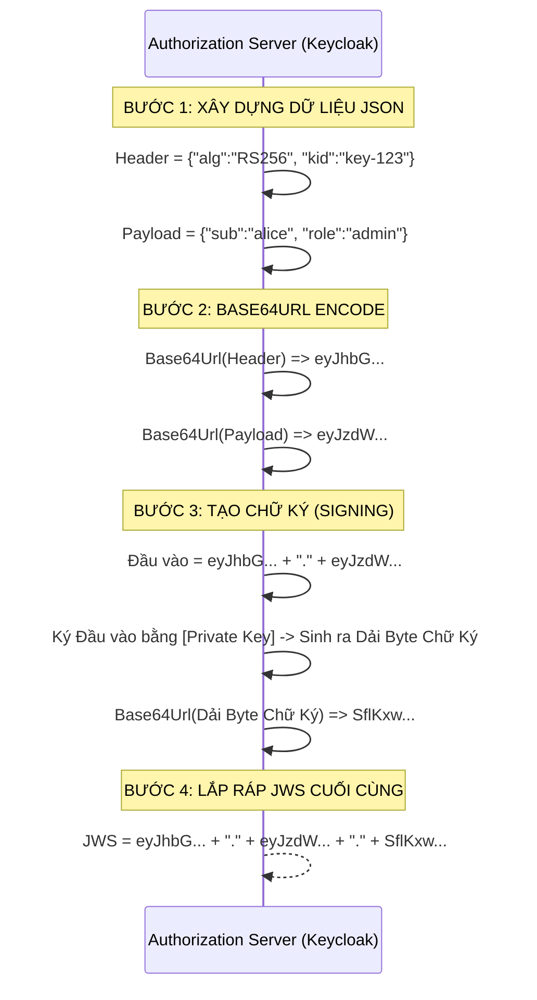

# Lesson 24: JSON Web Signature (JWS)

> [!NOTE]
> **Category:** Theory & Security (Lý thuyết & Bảo mật)
> **Goal:** Phân biệt rõ ranh giới giữa JWT và JWS. Nắm vững cơ chế đóng gói Chữ ký số (Digital Signature) vào cấu trúc JSON để tạo thành tấm khiên bảo vệ tính Toàn vẹn (Integrity) cho Token.

## 1. Lý thuyết chuyên sâu (Detailed Theory)

### 1.1. Sự nhầm lẫn kinh điển giữa JWT và JWS
Trong ngành phần mềm, khi mọi người nói "Tôi dùng JWT", thực chất 99% họ đang nói đến **JWS (JSON Web Signature)**.
- **JWT (JSON Web Token)** chỉ là Khái niệm Trừu tượng (Abstract Concept) về việc biểu diễn dữ liệu bằng JSON (`RFC 7519`). Bản thân JWT không quy định nó phải an toàn như thế nào.
- **JWS (`RFC 7515`)** là một DẠNG CỤ THỂ của JWT. Nó là phương pháp bọc một JWT thông thường lại, sau đó dùng thuật toán (Như RSA hoặc HMAC) đóng Chữ ký số lên đó. JWS đảm bảo rằng cái Payload JSON bên trong KHÔNG THỂ BỊ CHỈNH SỬA trên đường truyền.

### 1.2. Cấu trúc vật lý của JWS
Chuỗi Token quen thuộc `xxxxx.yyyyy.zzzzz` chính xác là cấu trúc của JWS:
1. `xxxxx` (JOSE Header): Định nghĩa thuật toán ký (Ví dụ: `alg: "RS256"`).
2. `yyyyy` (JWS Payload): Chứa JWT Claims (sub, exp, roles...).
3. `zzzzz` (JWS Signature): Con dấu xác thực. Máy chủ lấy phần 1 và phần 2, băm nó, rồi Ký bằng Private Key để tạo ra phần 3.

---

## 2. Luồng nội bộ & Cơ chế cấp thấp (Internal Workflow & Low-level Mechanisms)

Quá trình Lõi của hệ thống đúc ra một chuỗi JWS hoàn chỉnh:



---

## 3. Thực hành tốt nhất & Bảo mật (Best Practices & Security)

> [!CAUTION]
> **Thảm họa thuật toán `none` (None Algorithm Vulnerability)**
> Một lỗ hổng khét tiếng của JWS trong quá khứ là chuẩn này CHO PHÉP lập trình viên cấu hình Header `"alg": "none"`. Tức là Token KHÔNG CÓ CHỮ KÝ (`Header.Payload.` - bỏ trống phần cuối).
> Hacker thông minh đã bắt Token của một người dùng bình thường, sửa Payload thành `"role": "admin"`, sửa Header thành `"alg": "none"`, rồi xóa cái đuôi chữ ký đi và gửi lên Máy chủ. Rất nhiều thư viện JWS cũ thấy chữ `none` liền TỰ ĐỘNG BỎ QUA BƯỚC KIỂM TRA CHỮ KÝ và chấp nhận Token cái rụp.
> **Thực hành chuẩn:** Các thư viện OIDC hiện đại (Spring Security, keycloak-js) đều đã bịt lỗ hổng này. Tuy nhiên, khi tự code API Gateway (NodeJS/Python), kiến trúc sư BẮT BUỘC phải viết luật từ chối thẳng thừng bất kỳ JWT nào mang header `alg: none`.

---

## 4. Cấu hình minh họa thực tế (Configuration Examples)

JOSE Header (JSON Object Signing and Encryption) của một JWS được xuất từ Keycloak thường có dạng:

```json
{
  "alg": "RS256",
  "typ": "JWT",
  "kid": "8f3b...a1c9"
}
```
- `alg`: Thuật toán Ký (Bắt buộc). Đa số hệ thống Enterprise dùng `RS256`.
- `typ`: Khai báo loại Token (Để máy chủ biết nó đang đọc cái gì).
- `kid` (Key ID): Đóng vai trò cực kỳ quan trọng. Keycloak có thể có 5 Cặp Khóa đang hoạt động cùng lúc (Để thay khóa định kỳ). Cái `kid` này giúp API Backend biết CHÍNH XÁC nó phải lấy cái Public Key số mấy trong chùm khóa để mở cái JWS này.

---

## 5. Trường hợp ngoại lệ (Edge Cases)

- **Lỗi nhầm lẫn chữ ký Đối xứng và Bất đối xứng:** Khi lập trình API, một Dev cấu hình thư viện JWT với bí mật (Secret) tĩnh `"MySuperSecret123"`. Backend lúc này tự động hiểu là đang xài **HS256** (HMAC Đối xứng). Nhưng Token do Keycloak cấp lại được ký bằng **RS256** (Bất đối xứng). Khi gói tin đập vào Backend, Backend chửi: `Invalid Signature Algorithm`.
  - **Khắc phục:** Backend của bạn ĐỨNG Ở VỊ TRÍ XÁC MINH (Resource Server). Nó không bao giờ được cấu hình Shared Secret. Nó BẮT BUỘC phải được trỏ đường dẫn tới `JWKS URI` (Giao diện cấp Public Key) của Keycloak để tự động tải Key RSA về và giải mã JWS.

---

## 6. Câu hỏi Phỏng vấn (Interview Questions)

**1. "JWT là một bộ tiêu chuẩn bao trùm cả JWS và JWE". Hãy giải thích phát biểu này.**
- **Junior:** JWS là để ký, JWE là để mã hóa. Hai cái đó là con của JWT.
- **Senior:** JWT là một khái niệm cơ sở quy định cách gói các "Tuyên bố" (Claims) vào trong một cục JSON nhỏ gọn. Bản thân JWT nguyên thủy không có tính bảo mật.
Để mang JWT chạy ra ngoài Internet an toàn, nó PHẢI ĐƯỢC BỌC TRONG một chuẩn bảo mật. 
Nếu bạn bọc JWT bằng một Chữ ký số (Để chống thay đổi dữ liệu), cục đó biến thành **JWS**.
Nếu bạn bọc JWT bằng một Thuật toán Mã hóa toàn thân (Để chống đọc trộm), cục đó biến thành **JWE**. 
Trên thực tế, khi ai đó ném cho bạn 1 Token, cái bạn cầm trên tay chính là một JWS hoặc JWE chứa Payload chuẩn JWT.

**2. Nếu tôi mã hóa Payload bằng JWS. Tại sao tôi vẫn có thể đọc được dữ liệu Claims của nó trên `jwt.io`? Vậy JWS bảo vệ cái gì?**
- **Junior:** JWS nó chỉ ký thôi nên đọc được hết, chừng nào xài JWE mới không đọc được.
- **Senior:** JWS (Signature) không sinh ra để "Giấu giếm" (Confidentiality). JWS sinh ra để bảo vệ **Tính Toàn Vẹn (Integrity)** và **Xác thực Nguồn Gốc (Authenticity)**.
Nó đóng vai trò như một Con dấu giáp lai (Tem niêm phong) trên một tài liệu Công khai. Mọi người đều được phép đọc tài liệu đó, nhưng KHÔNG MỘT AI có thể sửa đổi nội dung (Ví dụ đổi số tiền chuyển khoản từ 100$ thành 900$) mà không làm Rách con tem (Chữ ký bị sai lệch). Vì Trình duyệt/Frontend (SPA) CẦN ĐỌC các thông tin trong Payload để hiện tên User lên màn hình, nên JWS là sự cân bằng hoàn hảo giữa tính Công khai cho Frontend và tính Bảo mật cho Backend.

**3. Thuộc tính `kid` (Key ID) trong Header của JWS giải quyết bài toán cốt lõi nào trong vận hành hệ thống Identity quy mô lớn?**
- **Junior:** Nó là cái ID của chìa khóa để tìm cho nhanh.
- **Senior:** Nó giải quyết bài toán **Key Rotation (Xoay vòng khóa không gián đoạn - Zero Downtime)**.
Trong doanh nghiệp, chính sách bảo mật ép buộc phải đổi Private Key 30 ngày một lần để đề phòng lộ lọt. Nếu không có `kid`, khi Keycloak đổi Private Key mới, 50 hệ thống API vẫn đang xài Public Key cũ sẽ lập tức từ chối mọi Token mới sinh ra (Sập toàn bộ hệ thống).
Với `kid`, Keycloak có thể công bố 2 cái Public Key cùng một lúc (Khóa cũ `kid=1`, Khóa mới `kid=2`). API Backend sẽ tải cả 2 về RAM. Khi đọc Header JWS thấy `kid=2`, API tự động móc đúng chìa số 2 ra để mở. Điều này cho phép các Token cũ (ký bằng khóa 1) vẫn sống nốt quãng đời của nó, trong khi Token mới (ký bằng khóa 2) cũng được phục vụ song song.

**4. Kỹ thuật "JWS Detached Signature" (Chữ ký tách rời) là gì? Tại sao phải gọt bỏ Payload ở giữa đi?**
- **Junior:** Làm cho Token ngắn lại bớt.
- **Senior:** JWS Detached (`Header..Signature` - Lưu ý 2 dấu chấm liên tiếp) được sử dụng để Ký những Dữ liệu Không Phải JSON (Ví dụ: Một file Video 5GB, một luồng nhị phân).
Bạn không thể bọc 5GB Video vào giữa cái JWS được, RAM sẽ nổ tung vì Base64. Do đó, hệ thống giữ nguyên Body HTTP là File Video (Để Stream). Sau đó tính toán ra cái Chữ Ký JWS của File đó. Cắt bỏ Payload, chỉ lấy Header và Signature, rồi nhét cái Detached JWS đó vào Header `x-jws-signature`. Kỹ thuật này giúp JWS mở rộng khả năng từ việc chỉ bảo vệ "JSON Payload" sang bảo vệ "Bất kỳ chuỗi Byte nhị phân nào" trên Internet.

---

## 7. Tài liệu tham khảo (References)
- **RFC 7515:** JSON Web Signature (JWS).
- **RFC 7519:** JSON Web Token (JWT).
- **Keycloak Documentation:** Token Signature and Verification.
