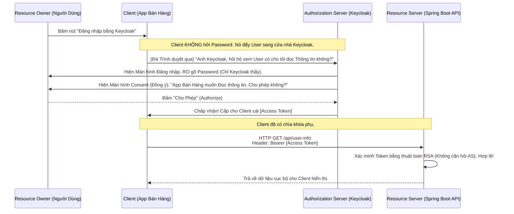

# Lesson 26: Thuật ngữ cốt lõi OAuth 2.0 (Terminology)

> [!NOTE]
> **Category:** Theory & Architecture (Lý thuyết & Kiến trúc)
> **Goal:** Lễ Tốt nghiệp chương Mật mã học, chính thức khai mở cánh cửa Vũ trụ Định danh (Identity). Làm chủ các "Thuật ngữ" (Terminology) nền tảng của OAuth 2.0 - Ngôn ngữ giao tiếp BẮT BUỘC của mọi Kiến trúc sư Phần mềm.

## 1. Lý thuyết chuyên sâu (Detailed Theory)

### 1.1. Bối cảnh ra đời của OAuth 2.0
Ngày xưa, bạn dùng Ứng dụng A (Game Farmville), nó yêu cầu quyền đăng trạng thái lên Facebook của bạn. Nó đòi bạn GÕ PASSWORD FACEBOOK VÀO GAME ĐÓ! Điều này quá sức điên rồ: Game Farmville có thể cầm Password của bạn đổi luôn mật khẩu, đọc trộm tin nhắn, cướp luôn Nick.
**OAuth 2.0 (Open Authorization - RFC 6749)** ra đời để tiêu diệt thảm họa đó. Đó là Giao thức **Ủy quyền (Delegation)**. Bạn có thể trao cho Game một "Chiếc Chìa Khóa Phụ" (Token) chỉ có quyền "Đăng trạng thái", không được làm gì khác, và có thể thu hồi bất cứ lúc nào mà không cần đổi Password chính.

### 1.2. Bộ Tứ Quyền Lực (The Four Actors)
Toàn bộ thế giới OAuth 2.0 xoay quanh 4 Diễn viên chính:
1. **Resource Owner (RO - Chủ tài nguyên):** Chính là BẠN (Người dùng cuối). Bạn sở hữu tài khoản, sở hữu cái Album ảnh trên Facebook.
2. **Client (Ứng dụng Khách):** Cái Game Farmville, hay cái App Bán Hàng (Web/Mobile) đang MUỐN XIN QUYỀN truy cập vào Album ảnh của bạn.
3. **Authorization Server (AS - Máy chủ Cấp Quyền):** Cảnh sát trưởng (Ví dụ: Máy chủ Keycloak, Google Login). Nó là kẻ đứng ra xác minh bạn là ai, hỏi ý kiến bạn, và in ra cái Token (Chìa khóa phụ) đưa cho Client.
4. **Resource Server (RS - Máy chủ Tài nguyên):** Cái Két sắt (Ví dụ: Máy chủ API chứa Ảnh của Facebook, Spring Boot Backend chứa dữ liệu ngân hàng). Nó đứng bảo vệ dữ liệu, ai cầm Token qua đây nó mới cho vào.

---

## 2. Luồng nội bộ & Cơ chế cấp thấp (Internal Workflow & Low-level Mechanisms)

Tương tác của 4 diễn viên trong luồng Ủy quyền cơ bản:

---

## 3. Thực hành tốt nhất & Bảo mật (Best Practices & Security)

> [!CAUTION]
> **Nhầm lẫn chết người giữa `Client` và `Resource Owner`**
> Cực kỳ nhiều Junior Dev khi đọc tài liệu gọi `Client` là "Bên Khách Hàng/Người dùng đang gõ Web". Sai Bét!
> Trong OAuth, BẠN (Con người) là `Resource Owner`. Cái phần mềm React/App iOS nằm trên điện thoại của bạn mới là `Client`. Keycloak (AS) KHÔNG CẤP TOKEN CHO BẠN, nó cấp Token cho CÁI APP (`Client`). Hiểu sai hai khái niệm này sẽ dẫn đến việc thiết kế luồng bảo mật (Flow) sai bét nhè.

> [!IMPORTANT]
> **Đẳng cấp của Quyền hạn (Scope)**
> Scope là cái ranh giới quyền lực (Ví dụ: `read:email`, `write:post`). 
> **Thực hành chuẩn:** Tuyệt đối áp dụng **Nguyên tắc Đặc quyền Tối thiểu (Least Privilege)**. App (Client) chỉ được xin cái Scope mà nó thực sự cần để chạy tính năng hiện tại. Keycloak sẽ vứt thẳng những Scope thừa thãi hoặc chặn giao dịch nếu phát hiện Client có ý đồ "Tham lam quyền lực".

---

## 4. Cấu hình minh họa thực tế (Configuration Examples)

Ánh xạ các thuật ngữ OAuth 2.0 vào hệ thống Công nghệ của bạn (Tech Stack):

| Thuật ngữ OAuth 2.0 | Thành phần thực tế trong Dự án | Vai trò / Tính chất |
| :--- | :--- | :--- |
| **Resource Owner (RO)** | Người dùng cầm Điện thoại, Nhân viên Công ty | Nắm giữ Mật khẩu gốc. Ra quyết định Ủy quyền (Yes/No). |
| **Client** | Ứng dụng Web ReactJS, App iOS Flutter, Backend NodeJS, Curl/Postman | Thực thể Đi Tới Tận Nơi để Vòi Vĩnh Token. |
| **Authorization Server (AS)** | **Keycloak Server** (Cổng 8080) | Thẩm phán. Sinh ra Chữ ký, Đóng dấu JWS/JWE lên JWT. |
| **Resource Server (RS)** | Spring Boot Microservices, Python FastAPI | Vệ sĩ (Guard). Nhận Token, Bóc Base64, Xác minh chữ ký RS256, Soi xem Token có đủ Scope không. |

---

## 5. Trường hợp ngoại lệ (Edge Cases)

- **Khi Client tự thăng cấp thành Resource Owner (Client Credentials Flow):** Luồng ở trên là Client xin quyền thay cho Con người. Nhưng nếu 2 Máy chủ Server tự động nói chuyện với nhau ban đêm (Ví dụ: Job Tự động tính Lương gọi vào API Kế toán). Lúc này KHÔNG CÓ CON NGƯỜI NÀO THỨC ĐỂ BẤM NÚT CHO PHÉP (Consent).
  - **Sự kiện lai tạo:** Trong chuẩn OAuth2, lúc này bản thân `Client` (Job Tính lương) sẽ tự động biến hình thành một `Resource Owner`. Nó tự lấy cái `Client_Secret` của nó (Giống hệt Password) đem nộp cho Keycloak để tự xin Token cho chính nó. (Đây là luồng M2M - Machine to Machine).

---

## 6. Câu hỏi Phỏng vấn (Interview Questions)

**1. Trong OAuth 2.0, "Grant Type" là gì? Kể tên 2 Grant Types kinh điển nhất và trường hợp sử dụng của chúng?**
- **Junior:** Grant Type là loại quyền. Dùng Authorization Code hoặc Implicit.
- **Senior:** "Grant Type" (Loại Cấp phép) là cách thức (Luồng đi) mà Client sử dụng để thương lượng và Vòi vĩnh Token từ Authorization Server.
2 Grant Types đỉnh cao nhất hiện nay:
1. `Authorization Code Grant`: Chuyên dùng cho các Web App hoặc SPA/Mobile (Có màn hình Trình duyệt). Client nhận về 1 cái "Mã tạm thời" (Code) trước, rồi mới lấy Mã tạm đó đổi ngầm lấy Token sau. Rất an toàn vì Token không bị phơi ra Trình duyệt.
2. `Client Credentials Grant`: Chuyên dùng cho Máy chủ gọi Máy chủ (M2M). Không có tương tác người dùng, Máy chủ tự cầm ID/Secret lên đổi thẳng lấy Token.

**2. Khái niệm "Consent" (Đồng thuận) trong OAuth 2.0 được kích hoạt ở đâu? Có phải ứng dụng nội bộ công ty (First-party Client) lúc nào cũng cần Consent không?**
- **Junior:** Có, bảo mật thì phải hiện cái bảng hỏi ý kiến.
- **Senior:** Consent là cái màn hình Keycloak nhảy ra hỏi: "App A muốn truy cập Email của bạn, Đồng Ý hay Hủy?".
Tuy nhiên, nếu App A đó là app nội bộ CỦA CHÍNH CÔNG TY BẠN (First-party Client - Ví dụ App Chấm Công của Công ty). Việc cứ mỗi sáng nhân viên login vào App đều bị hỏi "Bạn có cho App Chấm công đọc tên bạn không" là một trải nghiệm rác.
Trong Keycloak, Admin sẽ cấu hình cái App Chấm Công này Tắt bỏ Consent (Auto-approve). Consent BẮT BUỘC (Và là lý do sống còn của OAuth2) khi Client là của MỘT BÊN THỨ 3 (Third-party Client - Ví dụ: Cho app Zalo bên ngoài truy cập vào dữ liệu Ngân hàng).

**3. Khác biệt cốt lõi giữa OAuth 2.0 và OpenID Connect (OIDC) dựa trên nền tảng Thuật ngữ là gì?**
- **Junior:** Nó giống nhau, OIDC là bản nâng cấp của OAuth.
- **Senior:** Đây là ranh giới Tối cao.
- **OAuth 2.0** LÀ GIAO THỨC ỦY QUYỀN (Authorization). Chiếc Token nó cấp (Access Token) chỉ là Chìa Khóa Mở Cửa (Chỉ báo bạn có quyền vào cổng). API (Resource Server) mở cửa xong KHÔNG HỀ BIẾT MẶT BẠN LÀ AI.
- **OpenID Connect (OIDC)** là một Giao thức XÁC THỰC DANH TÍNH (Authentication) ĐƯỢC XÂY ĐẮP TRÊN ĐỈNH của OAuth 2.0. Nó đẻ ra thêm một khái niệm mới: `ID Token`. Cùng với việc cấp Chìa Khóa Mở Cửa, Keycloak cấp thêm một cái `Chứng minh nhân dân` (ID Token chứa Avatar, Email, Tên họ). Nhờ cái ID Token này, Client (App Bán Hàng) mới hiển thị được câu "Xin chào Alice" lên màn hình. Nếu chỉ xài OAuth 2.0 thuần, App Bán Hàng bị mù thông tin User.

**4. Khái niệm "Resource Server" có thực sự cần thiết phải được bảo vệ bởi mạng nội bộ (VPC/Firewall) hay nó có thể phơi ra Public Internet?**
- **Junior:** Server lưu dữ liệu thì phải giấu sau tường lửa, để public hacker hack mất.
- **Senior:** Triết lý Zero Trust của Cloud Native khẳng định: Resource Server CÓ THỂ (Và thường xuyên) được phơi trực tiếp ra Public Internet. Trái tim bảo vệ của RS không nằm ở Bức Tường Lửa Vật Lý, mà nằm ở Thuật toán **Xác minh Chữ ký JWS** (Đã học ở bài trước).
Bất kỳ một Request nào từ Public Internet đập vào RS, thiếu Access Token, Token bị sửa chữ, Token hết hạn, hay sai Chữ ký, đều bị RS chém rụng (HTTP 401/403) ngay tại Cửa khẩu (API Gateway Filter) trong chưa đầy 1 mili-giây. Đây chính là sức mạnh của kiến trúc Phi Trạng Thái (Stateless) khi kết hợp JWS và OAuth2, biến mọi Endpoints thành các Pháo đài Độc lập.

**5. Nếu một Client là "Single Page Application (SPA)" như ReactJS, nó được gọi là Public Client hay Confidential Client? Khác biệt về cấu hình Keycloak là gì?**
- **Junior:** Nó là public vì ai cũng xài được trên web.
- **Senior:** Đúng, ReactJS/Angular chạy trên Trình duyệt của Máy khách, toàn bộ Source Code của nó (Bao gồm cả cấu hình, biến môi trường) đều phơi bày ra cho User tải về và đọc bằng F12. Do đó nó gọi là **Public Client (Client Công khai)**.
Khác biệt chí mạng: Trên Keycloak, loại Client này TUYỆT ĐỐI KHÔNG ĐƯỢC PHÁT HÀNH `Client Secret` (Mật khẩu của App). Vì nếu phát hành, cái Secret đó sẽ bị lọt xuống Trình duyệt và bị Hacker chôm ngay lập tức. Để xin Token, Public Client bắt buộc phải dùng luồng cao cấp nhất hiện nay: *Authorization Code Flow có gắn bọc thép PKCE (Sẽ học ở Module sau)*. (Trái ngược với `Confidential Client` như Spring Boot Backend - Code giấu kín trên Server, được phép cầm `Client Secret`).

---

## 7. Tài liệu tham khảo (References)
- **RFC 6749:** The OAuth 2.0 Authorization Framework.
- **OAuth 2.0 Threat Model:** RFC 6819.
- **OpenID Connect Core 1.0:** Terminology and Concepts.
