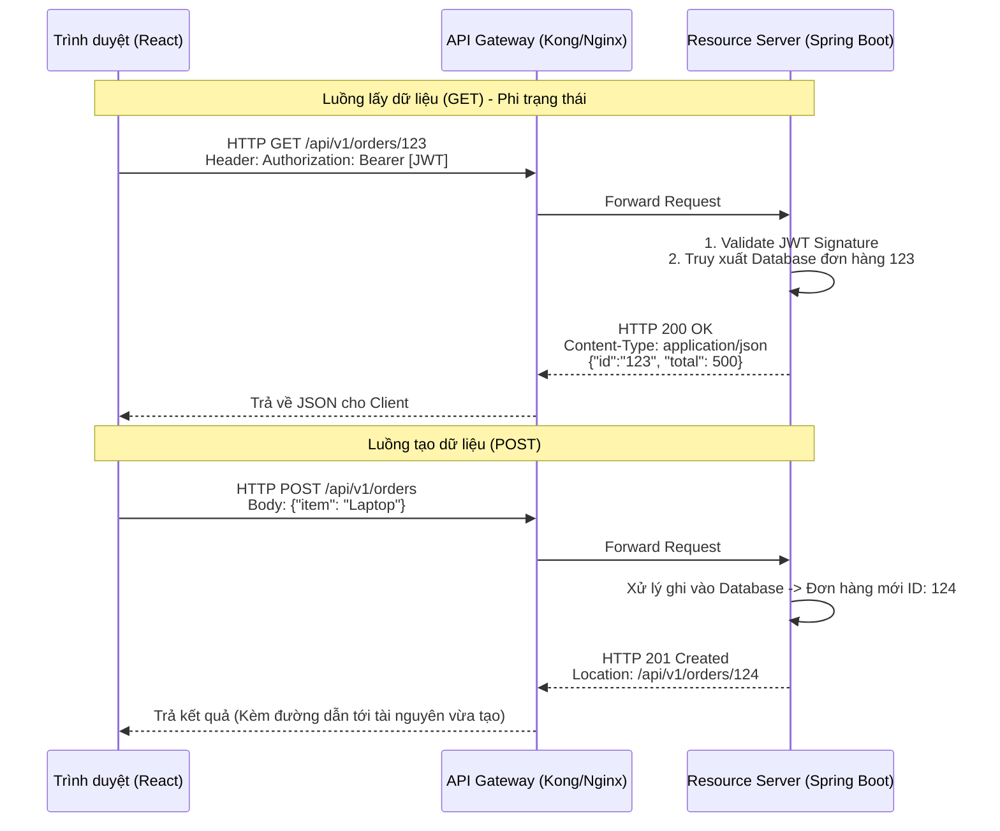

# Lesson 27: Kiến trúc REST API (Representational State Transfer)

> [!NOTE]
> **Category:** Theory & Architecture (Lý thuyết & Kiến trúc)
> **Goal:** Nắm vững triết lý thiết kế REST - bộ xương sống của mọi hệ thống Microservices hiện đại. Hiểu cách Máy chủ Ủy quyền (Như Keycloak) giao tiếp với các Máy chủ Tài nguyên thông qua các tiêu chuẩn khắt khe của REST.

## 1. Lý thuyết chuyên sâu (Detailed Theory)

### 1.1. REST không phải là Giao thức, nó là Phong cách Kiến trúc
Rất nhiều Dev nhầm lẫn REST là một giao thức như HTTP hay FTP. Thực tế, REST (Đề xuất năm 2000 bởi Roy Fielding) là một tập hợp các **Ràng buộc (Constraints)**. Nếu bạn thiết kế một API tuân thủ 6 ràng buộc này, API của bạn được gọi là **RESTful**:
1. **Client-Server:** Tách biệt hoàn toàn Giao diện (Frontend) và Lưu trữ (Backend).
2. **Stateless (Phi trạng thái):** Ràng buộc cốt lõi nhất. Mỗi Request từ Client lên Server phải chứa TOÀN BỘ thông tin cần thiết để Server hiểu (Ví dụ: Chứa JWT). Server TUYỆT ĐỐI KHÔNG LƯU trạng thái (Session) của Client giữa 2 lần gọi.
3. **Cacheable (Khả năng lưu đệm):** Dữ liệu trả về phải dán nhãn là có được Cache hay không.
4. **Uniform Interface (Giao diện đồng nhất):** Dùng chung một quy chuẩn chuẩn mực (Ví dụ: Luôn dùng HTTP GET để lấy dữ liệu, dùng URI `/users` để chỉ tài nguyên Người dùng).
5. **Layered System (Hệ thống phân lớp):** Client không bao giờ biết nó đang kết nối thẳng tới Server cuối hay đang kết nối qua Load Balancer/Proxy.
6. **Code on Demand (Tùy chọn):** Server có thể trả về mã thực thi (như Javascript) cho Client chạy.

### 1.2. Tài nguyên (Resource) và Hành động (HTTP Methods)
Trong REST, mọi thứ đều là **Tài nguyên (Danh từ)**. Bạn không viết API `/taoNguoiDung`, bạn viết API thao tác trên Tài nguyên `/users`.
Các hành động được định nghĩa bởi các HTTP Methods:
- `GET`: Lấy tài nguyên (Chỉ đọc, không làm thay đổi DB).
- `POST`: Tạo mới tài nguyên.
- `PUT`: Cập nhật TOÀN BỘ tài nguyên (Ghi đè hoàn toàn).
- `PATCH`: Cập nhật MỘT PHẦN tài nguyên (Chỉ đổi cái tên, giữ nguyên Email).
- `DELETE`: Xóa tài nguyên.

---

## 2. Luồng nội bộ & Cơ chế cấp thấp (Internal Workflow & Low-level Mechanisms)

Bức tranh tương tác RESTful API được bảo vệ bởi OIDC:



---

## 3. Thực hành tốt nhất & Bảo mật (Best Practices & Security)

> [!IMPORTANT]
> **Tính Độc lập (Idempotency) - Ranh giới giữa Dev giỏi và Dev dở**
> - Hành động **Idempotent** nghĩa là: Dù bạn gọi API đó 1 lần hay 1000 lần, kết quả trong Database cuối cùng VẪN NHƯ NHAU.
> - `GET`, `PUT`, `DELETE` bắt buộc phải là Idempotent. (Ví dụ: Xóa User A 1000 lần thì kết quả vẫn là User A không tồn tại).
> - `POST` **Không phải** là Idempotent. (Bấm POST 1000 lần sẽ tạo ra 1000 User khác nhau).
> - **Lỗi chí mạng:** Khi rớt mạng, App Mobile tự động gọi lại (Retry) lệnh chuyển tiền. Nếu API chuyển tiền viết bằng POST mà không có cơ chế chặn trùng lặp (Idempotency Key), Ngân hàng sẽ bị trừ tiền 2 lần. BẮT BUỘC phải thiết kế cơ chế chống Replay Attack kết hợp với thiết kế REST chuẩn mực.

> [!CAUTION]
> **Rò rỉ dữ liệu qua URI**
> Tuyệt đối không truyền tham số nhạy cảm (Password, Token) vào URI (`GET /users?token=abc`). Vì toàn bộ URI sẽ bị lưu lại trong file **Access Log** của Nginx/Apache dưới dạng văn bản rõ. Các tham số nhạy cảm BẮT BUỘC phải truyền qua HTTP Body (dùng `POST/PUT`) hoặc HTTP Headers.

---

## 4. Cấu hình minh họa thực tế (Configuration Examples)

Keycloak cung cấp một bộ **Admin REST API** cực kỳ đồ sộ để quản trị thay cho Giao diện UI.
Ví dụ: Dùng cURL (HTTP Client) để lấy danh sách Users trong Keycloak.

```bash
# BƯỚC 1: Gọi API cấp Token (Dùng Client Credentials hoặc Password Grant)
export TOKEN=$(curl -s -X POST \
  "https://auth.company.com/realms/master/protocol/openid-connect/token" \
  -H "Content-Type: application/x-www-form-urlencoded" \
  -d "username=admin" \
  -d "password=admin_password" \
  -d "grant_type=password" \
  -d "client_id=admin-cli" | jq -r .access_token)

# BƯỚC 2: Gọi Admin REST API (Sử dụng chuẩn REST)
curl -s -X GET \
  "https://auth.company.com/admin/realms/my-realm/users" \
  -H "Authorization: Bearer $TOKEN" \
  -H "Accept: application/json"
```
*(Đây là minh chứng kinh điển cho Ràng buộc Stateless: API thứ 2 (GET) không hề nhớ bạn đã gọi API thứ 1 (POST). Bạn phải chủ động cầm cái Token do API 1 cấp, nộp vào Header của API 2 thì mới được phục vụ).*

---

## 5. Trường hợp ngoại lệ (Edge Cases)

- **Giới hạn tỷ lệ gọi (Rate Limiting & HTTP 429):** Vì REST API là Phi trạng thái, một Client bị nhiễm Botnet có thể gọi API Login hàng ngàn lần mỗi giây, đánh sập Database (Brute-force/DDoS). 
  - **Khắc phục:** Mọi REST API chuẩn Enterprise BẮT BUỘC phải được bọc sau một Rate Limiter (Bộ giới hạn tần suất). Khi Client gọi quá 100 req/phút, Server sẽ ngừng xử lý và văng trả HTTP Code `429 Too Many Requests`, kèm theo Header `Retry-After: 60` (Báo cho Client biết 60 giây sau hãy gọi lại).

---

## 6. Câu hỏi Phỏng vấn (Interview Questions)

**1. Trong HTTP Status Code, sự khác biệt giữa `401 Unauthorized` và `403 Forbidden` là gì trong hệ thống Identity?**
- **Junior:** 401 là sai pass, 403 là bị chặn không cho vào.
- **Senior:** Hai mã này định nghĩa 2 chốt chặn bảo mật hoàn toàn khác nhau.
- `401 Unauthorized` liên quan đến **Xác thực (Authentication)**. Nó có nghĩa là: "Tôi không biết bạn là ai". Lỗi này trả về khi Request không có JWT, hoặc JWT bị hết hạn, hoặc chữ ký JWS bị sai.
- `403 Forbidden` liên quan đến **Phân quyền (Authorization)**. Nó có nghĩa là: "Tôi biết ĐÚNG bạn là ai (JWT hợp lệ, đã giải mã thành công). NHƯNG, chức vụ (Role) của bạn không đủ đặc quyền để sờ vào tài nguyên này". Ví dụ: Nhân viên thường gọi API xóa CSDL.

**2. Tại sao người ta lại khuyên dùng `PATCH` thay vì `PUT` khi cập nhật Profile của người dùng?**
- **Junior:** PATCH nó chạy nhanh hơn PUT một chút.
- **Senior:** Vấn đề nằm ở Triết lý Cập nhật. Ràng buộc của `PUT` là thay thế TOÀN BỘ tài nguyên. Nếu User chỉ muốn đổi Avatar, nhưng Client lại gọi `PUT` mà quên không gửi kèm thuộc tính `Email` trong Body. Server sẽ ghi đè cái Avatar mới, và XÓA TRẮNG (Null) luôn cái Email cũ trong Database vì nó tưởng ý định của Client là xóa Email.
`PATCH` là Cập nhật Một Phần (Partial Update). Client gửi mỗi cái Avatar lên, Server sẽ chỉ dò đúng cột Avatar trong DB để sửa, giữ nguyên mọi cột khác. Tiết kiệm băng thông và an toàn hơn cho các thao tác cập nhật nhỏ.

**3. Khái niệm "HATEOAS" (Hypermedia As The Engine Of Application State) trong REST là gì? (Kiến thức REST mức cao nhất).**
- **Junior:** Nó là một công cụ giúp API chạy nhanh hơn.
- **Senior:** HATEOAS là Cấp độ 3 (Cấp độ cao nhất) trong thang đo trưởng thành của REST (Richardson Maturity Model). 
Nó giống như việc bạn lướt Web: Bạn bấm vào trang chủ, trang chủ hiện ra các đường Link (Thẻ `<a>`) để bạn bấm tiếp sang trang Con. 
Với HATEOAS API, khi bạn gọi `GET /users/123`. Server không chỉ trả về thông tin User, mà nó trả kèm một khối JSON chứa CÁC ĐƯỜNG LINK (URI) có thể thao tác tiếp theo. (Ví dụ: `{"rel": "delete", "href": "/users/123"}`).
Nhờ HATEOAS, Client không cần phải Hardcode (nhớ cứng) các đường dẫn API trong Source code. Nó chỉ cần đọc gói JSON trả về và nương theo các Link để thao tác, tạo ra sự linh hoạt vô tiền khoáng hậu (Backend đổi URL thì Frontend tự khắc chạy theo mà không cần Deploy lại).

**4. Một lập trình viên viết hàm `GET /users/delete?id=5` để xóa User. Hành động này vi phạm tiêu chuẩn REST nào và gây ra hậu quả thảm khốc gì?**
- **Junior:** Vi phạm tiêu chuẩn đặt tên, phải dùng POST mới đúng.
- **Senior:** Vi phạm nghiêm trọng 2 nguyên tắc:
1. REST yêu cầu dùng **HTTP Methods** để định nghĩa hành động, không dùng Động từ trong URI. Chuẩn phải là `DELETE /users/5`.
2. Hậu quả thảm khốc: `GET` được định nghĩa là thao tác **An toàn (Safe)** và **Khả năng Lưu đệm (Cacheable)**. Các công cụ lướt Web như Google Bot (Spider), hoặc các Proxy Cache, các công cụ quét Virus sẽ tự động gõ hàng loạt các đường link `GET` mà chúng nhìn thấy trên trang để lưu nội dung. 
Nếu bạn gắn lệnh XÓA DỮ LIỆU vào `GET`, con Bot của Google đi ngang qua trang web của bạn, nó sẽ VÔ TÌNH XÓA SẠCH toàn bộ Database của công ty bạn chỉ bằng việc crawl (cào) các đường link đó. Thảm họa này đã từng đánh sập nhiều startup.

**5. GraphQL có phải là kẻ thay thế và sẽ giết chết REST API không? Tại sao Keycloak vẫn dùng REST cho Admin API?**
- **Junior:** Đúng, GraphQL mới ra nên mạnh hơn, lấy được dữ liệu tùy thích.
- **Senior:** Không hề. GraphQL giải quyết bài toán "Over-fetching" (Tải dư dữ liệu) của Frontend bằng cách cho phép Client truy vấn chính xác trường nào nó cần.
Tuy nhiên, GraphQL bị mất đi vũ khí tối thượng của REST: **HTTP Caching** (Bởi vì GraphQL luôn dùng 1 Endpoint `POST /graphql` duy nhất, Proxy không thể cache dựa trên URL được nữa).
Đối với các hệ thống Quản trị (Admin) như Keycloak, cấu trúc dữ liệu rất chuẩn mực, nhu cầu phân quyền Cực kỳ chi tiết cho từng Hành động trên từng Tài nguyên (RBAC). REST API tỏ ra vượt trội nhờ việc bóc tách tài nguyên thành các URI riêng biệt (`/clients`, `/roles`), cho phép Keycloak dễ dàng áp dụng các chính sách bảo mật HTTP (Policy Enforcer) lên từng Endpoints mà không cần phải parse cấu trúc Query phức tạp như GraphQL.

---

## 7. Tài liệu tham khảo (References)
- **Roy Fielding Dissertation (2000):** Architectural Styles and the Design of Network-based Software Architectures.
- **RFC 7231:** HTTP/1.1 Semantics and Content (Methods and Status Codes).
- **Keycloak Documentation:** REST API Reference.
