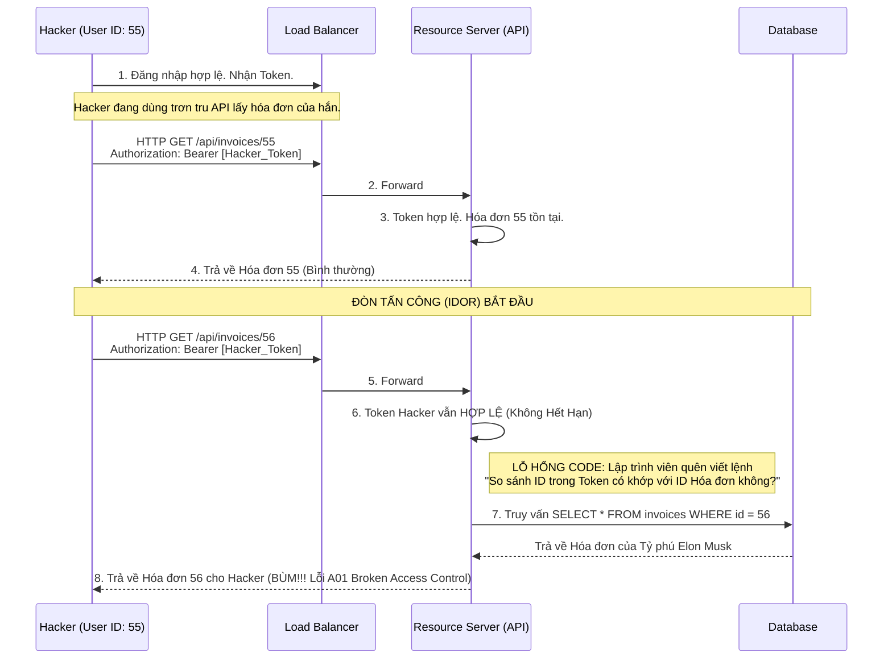

# Lesson 31: Bảng phong thần OWASP Top 10

> [!NOTE]
> **Category:** Theory & Security (Lý thuyết & Bảo mật)
> **Goal:** Hiểu sâu về OWASP - tổ chức định hình các tiêu chuẩn bảo mật toàn cầu. Khám phá 10 nhóm lỗ hổng chí mạng nhất đe dọa trực tiếp các hệ thống IAM và cách thiết lập tư duy phòng thủ Chiều Sâu (Defense in Depth).

## 1. Lý thuyết chuyên sâu (Detailed Theory)

### 1.1. OWASP là gì?
**OWASP (Open Worldwide Application Security Project)** là một tổ chức phi lợi nhuận toàn cầu chuyên nghiên cứu về bảo mật phần mềm.
Khoảng 3-4 năm một lần, dựa trên hàng triệu dữ liệu bị hack thực tế, OWASP phát hành bảng danh sách **OWASP Top 10**. Đây là "Kinh thánh" của giới bảo mật, liệt kê 10 nhóm rủi ro nguy hiểm, phổ biến và để lại hậu quả nặng nề nhất đối với Ứng dụng Web. Mọi hệ thống chứng chỉ bảo mật (ISO 27001, PCI-DSS) đều yêu cầu công ty bạn phải quét sạch OWASP Top 10.

### 1.2. Phân tích Các Lỗ hổng Ngôi Vương (Top 3 năm 2021)
1. **A01: Broken Access Control (Kiểm soát truy cập lỏng lẻo):** Đứng TOP 1. Xảy ra khi một người dùng (Ví dụ: `User A`) có thể xem, sửa tài liệu của `User B`, hoặc tự thăng cấp thành Admin do Máy chủ kiểm tra quyền hạn (Authorization) bị sai. Keycloak ra đời sinh ra để giải quyết triệt để rủi ro này bằng các chính sách UMA và RBAC.
2. **A02: Cryptographic Failures (Lỗi Mật mã học):** Xưa gọi là Rò rỉ Dữ liệu Nhạy cảm. Xảy ra khi lưu Password dưới dạng bản rõ, truyền dữ liệu qua HTTP thay vì HTTPS, dùng thuật toán MD5 cũ rích hoặc cấu hình sai AES (Dùng chế độ ECB).
3. **A03: Injection (Tiêm nhiễm mã độc):** Nổi tiếng nhất là **SQL Injection** và **Command Injection**. Xảy ra khi Máy chủ ngây thơ tin tưởng Dữ liệu Người dùng gửi lên và ném thẳng Dữ liệu đó vào bộ thực thi CSDL mà không làm sạch (Sanitize).

---

## 2. Luồng nội bộ & Cơ chế cấp thấp (Internal Workflow & Low-level Mechanisms)

Phân phẫu đòn **IDOR (Insecure Direct Object Reference)** - một Dạng Kinh điển của Lỗi A01 (Broken Access Control):



---

## 3. Thực hành tốt nhất & Bảo mật (Best Practices & Security)

> [!CAUTION]
> **A06: Vulnerable and Outdated Components (Dùng Thư viện Hết đát)**
> Một nghịch lý là Code bạn viết rất an toàn, nhưng thư viện bạn xài (Ví dụ: Log4j, Jackson) lại dính lỗi RCE Hủy diệt hệ thống cấp độ điểm 10.0 (Log4Shell). 
> **Thực hành chuẩn (Shift-Left Security):** Tuyệt đối không chờ đến lúc Code xong mới Test. Bảo mật phải được đẩy sang "Bên Trái" (Giai đoạn đầu của quy trình CI/CD). Bắt buộc phải tích hợp công cụ SCA (Software Composition Analysis) như OWASP Dependency-Check hoặc Snyk vào luồng build Docker để chặn các thư viện ôi thiu lên Production.

> [!IMPORTANT]
> **A07: Identification and Authentication Failures (Thất bại Định danh)**
> Lỗ hổng xảy ra khi Web cho phép gõ sai mật khẩu 1 triệu lần (Brute-force) mà không khóa nick, hoặc quên không gắn xác thực 2 lớp (MFA).
> **Giải pháp tối thượng:** KHÔNG TỰ CODE MÀN HÌNH LOGIN. Ủy thác (Delegate) toàn bộ quy trình này cho Identity Provider chuyên nghiệp như Keycloak. Nó tự động cung cấp Brute-force Detection, OTP, WebAuthn miễn phí và chuẩn quốc tế.

---

## 4. Cấu hình minh họa thực tế (Configuration Examples)

Tích hợp OWASP Dependency-Check vào dự án Maven (Spring Boot Backend) để phát hiện Lỗi A06. Thêm đoạn sau vào `pom.xml`:

```xml
<plugin>
    <groupId>org.owasp</groupId>
    <artifactId>dependency-check-maven</artifactId>
    <version>8.4.0</version>
    <configuration>
        <!-- Điểm CVSS (Mức độ nghiêm trọng). Nếu >= 7 (High/Critical), Build sẽ THẤT BẠI ngay lập tức -->
        <failBuildOnCVSS>7</failBuildOnCVSS> 
    </configuration>
    <executions>
        <execution>
            <goals>
                <goal>check</goal>
            </goals>
        </execution>
    </executions>
</plugin>
```
*(Lệnh chạy: `mvn verify`. Maven sẽ tự động tải danh sách lỗ hổng toàn cầu (CVE) về, soi vào các thư viện của bạn. Nếu bạn xài bản Log4j lỗi, quá trình Build ra file `.jar` sẽ lập tức bị Bẻ Gãy (Failed), ngăn chặn mã độc lên Server).*

---

## 5. Trường hợp ngoại lệ (Edge Cases)

- **Lỗ hổng Logic Nghiệp vụ (Business Logic Flaws):** Các công cụ Quét tự động (DAST/SAST) của OWASP ZAP hay Burp Suite có thể phát hiện được lỗi Code (Injection) hoặc lỗi Header. NHƯNG nó HOÀN TOÀN MÙ LÒA trước các lỗi Logic.
  - Ví dụ: Web bán điện thoại có tính năng thêm mã Giảm giá. Lập trình viên quên check, cho phép nhập Số âm (Ví dụ Nhập Mã Giảm: `-10,000,000 VND`). Tiền giảm giá bị trừ vào Giá gốc tạo ra Số tiền Mua hàng là Số m. User thanh toán, Hệ thống tự động Chuyển Ngược Tiền cho User. 
  - **Khắc phục:** Lỗi A04 (Insecure Design) này chỉ có thể chặn bằng Kiểm thử Mô hình Đe dọa (Threat Modeling) và Review Code thủ công bởi Kiến trúc sư, máy móc không thể cứu bạn.

---

## 6. Câu hỏi Phỏng vấn (Interview Questions)

**1. Trong SQL Injection (Lỗi A03), kỹ thuật "Prepared Statements" bảo vệ CSDL như thế nào? Tại sao String Concatenation (Nối chuỗi) lại là tự sát?**
- **Junior:** Prepared Statements là mã hóa câu lệnh SQL cho an toàn.
- **Senior:** Prepared Statements KHÔNG MÃ HÓA cái gì cả. Nó dùng cơ chế **Tách biệt Cú pháp (Syntax) và Dữ liệu (Data)**.
Khi bạn nối chuỗi (VD: `SELECT * FROM users WHERE name = '` + userName + `'`), máy chủ DB nhận được 1 câu Văn Bản thuần túy. Nếu userName là `' OR 1=1 --`, câu SQL bị bẻ cong Cú pháp thành luôn đúng, Hacker cướp sạch DB.
Với Prepared Statements, Backend sẽ gửi "Cấu trúc Cú pháp" (`SELECT * FROM users WHERE name = ?`) cho CSDL biên dịch TRƯỚC. Sau đó nó mới gửi "Dữ liệu" của Hacker lên. DB đã Biên Dịch xong khung sườn, nên mọi chữ nháy đơn, lệnh DROP TABLE của Hacker nằm trong Dữ liệu sẽ chỉ bị DB coi là một **Chuỗi Text vô hại (Literal String)**, không thể kích hoạt thực thi được nữa.

**2. OWASP A05: Security Misconfiguration. Lỗi này thường xuyên xảy ra ở tầng Cloud (AWS/GCP). Hãy nêu một ví dụ điển hình có thể rò rỉ hàng Terabytes dữ liệu người dùng?**
- **Junior:** Quên cài tường lửa cho Server.
- **Senior:** Lỗi kinh điển nhất là **Public Amazon S3 Buckets**.
Dev tạo một kho lưu trữ S3 để chứa Hồ sơ xin việc (PDF) của nhân sự. Do làm biếng hoặc cấu hình sai quyền IAM, Dev vô tình (hoặc chủ động để dễ test) mở quyền Public Read cho toàn bộ cái S3 Bucket đó. Cấu hình này không liên quan gì đến Code Backend hay Keycloak, nhưng nó đã làm thủng một lỗ khổng lồ ở Tầng Hạ tầng. Mọi Hacker dùng tool scan Cloud đều có thể tự động tải sạch hàng triệu file PDF mà không cần hack bất cứ dòng code nào.

**3. Khái niệm "SSRF" (Server-Side Request Forgery - A10:2021) là gì? Lỗi này có thể biến Backend của bạn thành vũ khí tấn công Tường lửa Nội bộ như thế nào?**
- **Junior:** Hacker làm quá tải Server.
- **Senior:** Chữ "Forgery" nghĩa là Giả mạo. "Server-Side" nghĩa là Xảy ra ở phía Máy chủ.
**Kịch bản:** Trang web có tính năng: Nhập 1 URL, Server sẽ tải Ảnh từ URL đó về. (VD: `GET /download?url=https://google.com/anh.jpg`).
Hacker không nhập Google. Hắn nhập URL nội bộ: `http://localhost:8080/admin` hoặc `http://169.254.169.254/latest/meta-data/` (Đường dẫn lấy Mật khẩu siêu đặc quyền của máy chủ AWS EC2).
Vì Request này xuất phát TỪ CHÍNH BÊN TRONG (Bởi Backend của bạn), Tường lửa nội bộ (Firewall) hoàn toàn TIN TƯỞNG nó và mở cửa. Backend của bạn ngây ngô lấy cái Mật khẩu siêu đặc quyền đó, gói thành file ảnh và trả về cho Hacker. Máy chủ của bạn đã bị biến thành một con "Ngựa Trojan" phản chủ. Cách chống duy nhất là Lập danh sách trắng (Whitelist) các Tên miền mà Backend được phép gọi ra ngoài.

**4. Khi thiết kế Microservices, việc sử dụng chung một `Client Secret` tĩnh cho tất cả các Services liên lạc với nhau vi phạm nguyên tắc bảo mật nào?**
- **Junior:** Dễ bị hack pass chung.
- **Senior:** Vi phạm nguyên lý cốt lõi của A02 (Cryptographic Failures) và Zero Trust: **Key Compromise Blast Radius (Phạm vi nổ khi mất khóa)**.
Việc dùng 1 Secret "Mẹ" cho hàng chục Services giống như dùng 1 Chìa khóa nhà để mở cửa chính, cửa két sắt, cửa xe hơi. Một khi 1 Microservice râu ria (Ví dụ: Service Gửi Email) bị hack lỗ hổng RCE. Hacker lấy được cái Secret Mẹ đó, hắn sẽ có toàn quyền băm nát 49 Services lõi còn lại (Tài chính, Nhân sự) mà không bị ai cản trở. 
Microservices phải dùng xác thực độc lập (mTLS hoặc Token Exchange của Keycloak) để cô lập rủi ro.

**5. Logging & Monitoring Failures (A09). Việc "Ghi Log đầy đủ" chưa bao giờ là đủ. Tại sao việc KHÔNG GIÁM SÁT (Monitoring) log lại là nguyên nhân khiến các vụ Hack kéo dài trung bình hơn 200 ngày mới bị phát hiện?**
- **Junior:** Tại không ai rảnh ngồi đọc log.
- **Senior:** Hacker giỏi hiếm khi đánh sập Server ngay (Trừ bọn Ransomware). Hacker thường chui vào im lặng (APT - Advanced Persistent Threat). Chúng rà quét lỗ hổng mỗi ngày 1 ít, xuất dữ liệu mỗi ngày 1 MB để khỏi gây chú ý.
Hệ thống của bạn có ghi Log (Mỗi cú Brute-force login thất bại đều được ghi nhận). NHƯNG, bạn ghi nó thành file Text vứt vào một góc ổ cứng. 
Điều còn thiếu là **Giám sát Phản ứng Cảnh báo (Alerting)**. Log sinh ra phải được hút liên tục về một máy chủ trung tâm (SIEM/ELK Stack). Phải có hệ thống Query: "Nếu phát hiện 50 lần Login Failed từ 1 IP trong vòng 1 phút, lập tức gửi Tin nhắn SMS cảnh báo và cấu hình Tường lửa cấm IP đó chặn luồng tấn công". Có Data mà không xử lý thì Data đó vô giá trị trong an toàn thông tin.

---

## 7. Tài liệu tham khảo (References)
- **OWASP:** Top 10 Web Application Security Risks.
- **MITRE ATT&CK:** Enterprise Threat Matrix.
- **Keycloak Documentation:** Server Security.
