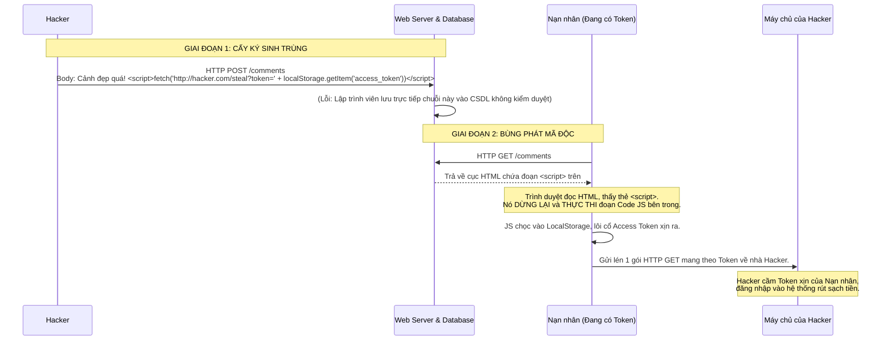

# Lesson 32: Lỗ hổng XSS (Cross-Site Scripting)

> [!NOTE]
> **Category:** Theory & Troubleshooting (Lý thuyết & Khắc phục sự cố)
> **Goal:** Giải phẫu XSS - Kẻ thù truyền kiếp, không bao giờ biến mất của giới Frontend. Hiểu cách Hacker "cấy" mã độc vào Trình duyệt của bạn để chôm JWT Token, đánh cắp Session Cookie, và vũ khí tối thượng để vô hiệu hóa nó.

## 1. Lý thuyết chuyên sâu (Detailed Theory)

### 1.1. Bản chất của XSS
Lỗ hổng Tiêm nhiễm XSS xảy ra khi MỘT ĐOẠN VĂN BẢN (Text) người dùng nhập vào, vô tình bị Trình duyệt Dịch sai thành MÃ LỆNH (Code) và THỰC THI nó.
- Javascript sinh ra để tạo tương tác. Nhưng nếu trang Web (của công ty bạn) lại lấy một mẩu Javascript DO HACKER VIẾT và ép Trình duyệt của Nạn nhân chạy nó, thì đó là thảm họa. 
- Khi mã độc JS của hacker được chạy (bởi chính Nạn nhân trên tên miền của BẠN), Trình duyệt sẽ lầm tưởng đoạn JS đó là do Công ty bạn viết. Tường lửa SOP (Bài 30) HOÀN TOÀN TÊ LIỆT. Đoạn mã độc đó có toàn quyền đọc LocalStorage, chôm JWT, đổi Password.

### 1.2. Phân loại 3 Vị Vua XSS
1. **Reflected XSS (XSS Phản xạ):** Lỗi nằm ở Back-end/Đường dẫn. Hacker dụ nạn nhân bấm vào link có chứa mã độc trên URL (Ví dụ: `/?search=<script>alert('hack')</script>`). Server nhận cục mã độc, và trả (phản xạ) y nguyên cục đó vào trang HTML để hiện kết quả tìm kiếm. Bùm!
2. **Stored XSS (XSS Lưu trữ - Nguy hiểm nhất):** Lỗi nằm ở Back-end & Database. Hacker nhét mã độc vào ô Bình luận, Bảng tin (Post). Server lẳng lặng LƯU mã độc vào Database. Bất kỳ ai, kể cả Admin mở bài viết đó lên đọc, mã độc sẽ tự động kích hoạt chôm sạch Token.
3. **DOM-based XSS (XSS Dựa trên DOM):** Lỗi nằm 100% ở Code Frontend (JS/React/Vue). Server Backend không hề hay biết gì. Mã độc đi từ URL thẳng vào Lõi thực thi Javascript của Frontend và nổ ngay tại trình duyệt.

---

## 2. Luồng nội bộ & Cơ chế cấp thấp (Internal Workflow & Low-level Mechanisms)

Bức tranh: Stored XSS ăn cắp Access Token và chiếm quyền tài khoản (Account Takeover).



---

## 3. Thực hành tốt nhất & Bảo mật (Best Practices & Security)

> [!CAUTION]
> **Lưu trữ Token sai chỗ: Tử huyệt LocalStorage**
> Cực kỳ nhiều bài hướng dẫn ReactJS trên mạng bảo bạn lưu JWT (Access Token & Refresh Token) vào `LocalStorage` hoặc `SessionStorage`.
> Cả 2 kho này ĐỀU MỞ TOANG CỬA cho bất kỳ đoạn Javascript nào có trong trang Web đọc được. Chỉ cần 1 lỗ hổng XSS bé tí (Hoặc bạn xài 1 thư viện npm rác bị cài mã độc), chúng sẽ hút sạch JWT của toàn bộ Users gửi về Tàu mẹ.
> **Thực hành chuẩn:** Tuyệt đối không lưu Token nhạy cảm vào LocalStorage. BẮT BUỘC lưu nó vào `Cookie` và GẮN CỜ `HttpOnly`. Cờ HttpOnly là một điều luật cấm trình duyệt: "Mọi mã Javascript (Kể cả mã độc XSS) không bao giờ được phép thò tay vào đọc cái Cookie này".

> [!IMPORTANT]
> **Output Encoding (Lọc kết xuất) thay vì Input Validation (Lọc đầu vào)**
> Khi chống Stored XSS, cố gắng chặn mã `<script>` ở đầu vào là vô ích (Hacker có hàng ngàn cách Encode để lách).
> **Giải pháp tối thượng:** Hãy áp dụng **Output Encoding (Mã hóa đầu ra)** ngay TRƯỚC KHI kết xuất (Render) chuỗi chữ đó ra màn hình HTML. Biến các ký tự nguy hiểm thành các Ký tự Thực thể vô hại (HTML Entities).
> Ví dụ: Biến dấu `<` thành `&lt;`. Biến dấu `>` thành `&gt;`. 
> Đoạn mã độc sẽ biến thành dạng văn bản: `&lt;script&gt;alert(1)&lt;/script&gt;`. Trình duyệt sẽ CHỈ VẼ CÁC CHỮ ĐÓ RA (Giống như đọc sách) chứ KHÔNG THỰC THI nó nữa. Các thư viện như ReactJS/Angular tự động làm việc này miễn phí.

---

## 4. Cấu hình minh họa thực tế (Configuration Examples)

Thiết lập khiên **Content Security Policy (CSP)** ở tầng HTTP (Ví dụ Nginx hoặc Spring Security). CSP là rào cản cuối cùng ngăn mã độc XSS chạy, DÙ CHO web của bạn đã lỡ chứa mã độc.

```nginx
# Chỉ tải ảnh, script, css từ đúng tên miền hiện tại (self)
# TUYỆT ĐỐI CẤM SỬ DỤNG 'unsafe-inline' (Mã JS viết kẹp trong HTML)
# TUYỆT ĐỐI CẤM SỬ DỤNG 'unsafe-eval' (Hàm eval() của JS)

add_header Content-Security-Policy "default-src 'self'; script-src 'self' https://trusted-cdn.com; object-src 'none'; frame-ancestors 'none';" always;
```
*(Với cấu trúc này, nếu Hacker chèn được đoạn `<script>alert('hack')</script>` vào file HTML. Trình duyệt sẽ phát hiện đây là Script nhúng trực tiếp (Inline). Do bị CSP cấm `unsafe-inline`, Trình duyệt sẽ BÓP CHẾT ĐOẠN MÃ NGAY LẬP TỨC và ném lỗi màu đỏ lên Console, chặn đứng vụ hack).*

---

## 5. Trường hợp ngoại lệ (Edge Cases)

- **XSS Xuyên qua Ảnh SVG:** Bạn cho phép User Upload Avatar, bạn kiểm tra đúng định dạng ảnh `.svg` mới cho lên. An toàn? Không hề.
  - File SVG về bản chất là một file... XML. Và bên trong XML, bạn hoàn toàn có thể viết thẻ `<script>` nhúng Javascript vào. Khi User khác mở cái ảnh SVG đó lên (Bằng thẻ `` thì không sao), nhưng nếu họ mở TRỰC TIẾP link file SVG đó trên thanh địa chỉ, Trình duyệt sẽ render File SVG như một trang HTML, Mã JS bên trong tấm ảnh sẽ thức tỉnh và thực thi đòn XSS. 
  - **Khắc phục:** Mọi kho lưu trữ ảnh người dùng (Cloud S3/Minio) BẮT BUỘC phải nằm trên MỘT TÊN MIỀN KHÁC (Ví dụ: `cdn-company.com`) Tách biệt hoàn toàn với Tên miền chính đang chứa Session/Token (`company.com`) để bức tường SOP vô hiệu hóa sức mạnh của XSS.

---

## 6. Câu hỏi Phỏng vấn (Interview Questions)

**1. Framework Frontend (React, Vue, Angular) tự động áp dụng Output Encoding để chống XSS. Vậy trong trường hợp nào ReactJS lại "Vô tình" mở cửa cho lỗ hổng XSS DOM-based?**
- **Junior:** React an toàn tuyệt đối, lỗi do mình cài bậy thư viện ngoài.
- **Senior:** Lỗ hổng nằm ở hàm `dangerouslySetInnerHTML`.
Khi Backend trả về một đoạn Bài viết có Định dạng Đậm Nhạt (HTML Tags). React mặc định sẽ "Mã hóa" các thẻ đó thành Text vô hại (In nguyên chữ `<b>` ra màn hình chứ không bôi đậm). 
Nếu Dev ép React phải dịch các thẻ HTML đó bằng cách dùng thuộc tính `dangerouslySetInnerHTML={ {__html: backendData} }`. React sẽ TẮT CẦU DAO BẢO VỆ, và đắp thẳng chuỗi đó vào DOM. Nếu `backendData` có chứa đoạn mã độc ``, đòn XSS DOM-based sẽ lập tức nổ. Lỗ hổng này cực kỳ phổ biến ở các Web có trình soạn thảo Rich-Text.

**2. Nếu tôi đã bật cờ `HttpOnly` cho Cookie chứa Token để Javascript không đọc được. Liệu Hacker cấy XSS vào trang của tôi có còn tác dụng gì không?**
- **Junior:** Không tác dụng, Hacker bị phế võ công vì không chôm được Token nữa.
- **Senior:** Rất Tệ. Đòn ăn cắp Token đúng là bị chặn. NHƯNG Hacker **KHÔNG CẦN TOKEN ĐỂ HACK**.
Đoạn mã JS độc hại đang chạy trên Trình duyệt của Nạn Nhân. Nó có thể Tự Động ra lệnh `fetch('/api/delete-user', {method: 'POST'})` (Cố ý thực hiện hành động xóa tài khoản).
Vì Request xuất phát từ trình duyệt nạn nhân, TRÌNH DUYỆT SẼ TỰ ĐỘNG ĐÍNH KÈM CÁI COOKIE HTTPONLY ĐÓ gửi lên Server. (Đây gọi là Session Riding / XSS kết hợp CSRF). Hacker không cần nhìn thấy Token, hắn chỉ cần Xài ké Token thông qua trình duyệt. Ngoài ra, XSS còn có thể vẽ một Cửa sổ Đăng nhập Giả Đè Lên Trang Web Thật (Phishing/Keylogger) để lừa User tự gõ Mật khẩu chuyển cho Hacker. Cờ `HttpOnly` chỉ là một tấm khiên mỏng, XSS vẫn là vị Vua.

**3. Khái niệm `JSON Hijacking` là gì? Tại sao khi trả về một Mảng JSON, Spring Boot hoặc các Framework cũ lại cố tình dán chèn một chuỗi rác như `)]}',\n` vào đầu phản hồi (Response)?**
- **Junior:** Chắc bị lỗi code nên nó dính chuỗi rác.
- **Senior:** Đây là cơ chế phòng thủ Tuyệt Vời chống JSON Hijacking (Một dạng của XSS/CSRF).
Trong quá khứ, nếu Backend trả về 1 Mảng JSON `[{"email":"secret@a.com"}]`. Trang web của Hacker có thể nhúng một thẻ `<script src="https://bank.com/api/get-email"></script>`. 
Trình duyệt lầm tưởng Mảng JSON đó là Mã Javascript Hợp Lệ (Valid Array Statement). Bằng một vài chiêu trò định nghĩa lại Hàm mảng nguyên thủy (Array overriding), Hacker có thể BẮT ĐƯỢC mảng JSON đó.
Để phá vỡ đòn này, Server chèn chuỗi rác (Unexecutable prefix) vào đầu: `)]}',\n [{"email":"secret..."}]`. Khi thẻ `<script>` của hacker tải cục này về và định chạy, cú pháp rác đó làm Trình duyệt Báo Lỗi Cú Pháp (Syntax Error) và Dừng Chạy ngay lập tức. Cục JSON được bảo vệ an toàn. (Khi Frontend xịn dùng `fetch()` lấy dữ liệu, nó sẽ chủ động lột bỏ chuỗi rác này đi trước khi Parse).

**4. Khi thiết lập Content Security Policy (CSP), thuộc tính `nonce` có tác dụng gì trong việc đối phó với `unsafe-inline`?**
- **Junior:** Để mã hóa cái script cho an toàn.
- **Senior:** `nonce` (Number used once) là Chìa khóa giải cứu cho hệ thống lỡ vướng quá nhiều Inline Scripts (Mã JS nằm ngay trong thẻ HTML).
Nếu áp CSP chuẩn, bạn phải CẤM TUYỆT ĐỐI `unsafe-inline`. Nhưng nhiều công cụ cũ không thể sửa code kịp.
Giải pháp: Server mỗi lần Load trang sẽ sinh ra 1 Mã ngẫu nhiên (Ví dụ `nonce-12345`). Nó đẩy mã này vào Header CSP. Sau đó, nó tự động dán thuộc tính `nonce="12345"` vào các thẻ `<script>` HỢP LỆ do công ty viết.
Trình duyệt sẽ CHỈ CHẠY các thẻ Script nào có khớp đúng Mã Nonce. Nếu Hacker nhúng thêm một thẻ `<script>` mã độc vào thân trang web, hắn KHÔNG THỂ biết trước cái mã Nonce ngẫu nhiên của lần load này là gì. Thẻ Script của Hacker sẽ bị Trình duyệt chém rụng vì Không có Nonce hợp lệ.

**5. Lỗ hổng Mutated XSS (mXSS - Tiêm nhiễm đột biến) đánh bại các thư viện lọc rác (Sanitizer) như thế nào?**
- **Junior:** Nó dùng AI để qua mặt lớp lọc rác.
- **Senior:** Rất thâm độc, nó đánh lừa trình duyệt TỰ TẠO RA XSS.
Bạn có một thư viện Lọc rác (DOMPurify). Hacker cố ý gửi 1 đoạn HTML Dị dạng (Rách nát). Thư viện Lọc rác soi vào đoạn đó, thấy không khớp các định dạng thẻ Nguy hiểm -> Nó cho qua.
Nhưng khi đoạn HTML đó được bơm vào Trình duyệt. Lõi Của Trình Duyệt (Browser Rendering Engine) có cơ chế "Tự Động Sửa Lỗi HTML" (Mutation). Quá trình Trình duyệt Hỗ trợ sửa lỗi cái cục rác đó, vô tình Tái tạo (Mutate) và đắp lại nó thành một Cú pháp XSS hoàn chỉnh (``) và Vô tình Kích Hoạt nó. 
mXSS lợi dụng "Lòng Tốt" của trình duyệt để vượt mặt lớp Bảo vệ tĩnh.

---

## 7. Tài liệu tham khảo (References)
- **OWASP:** Cross Site Scripting (XSS).
- **OWASP:** XSS Filter Evasion Cheat Sheet.
- **MDN Web Docs:** Content Security Policy (CSP).
