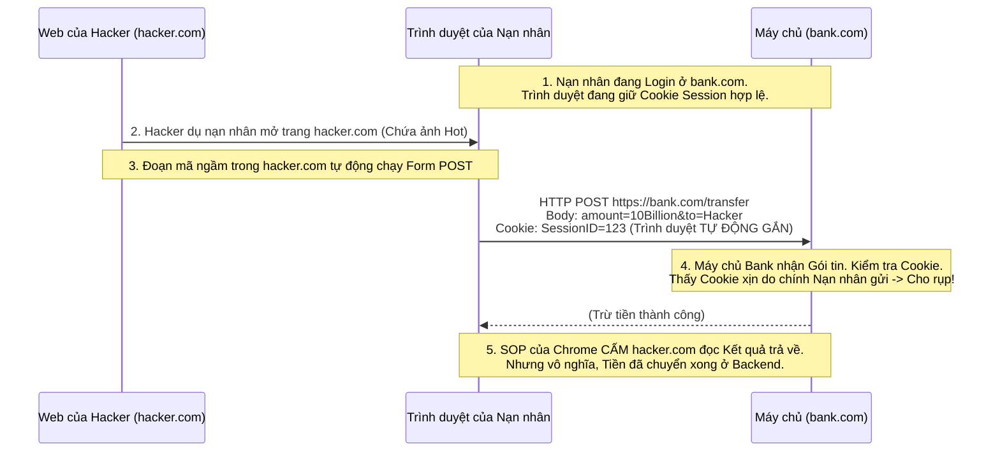

# Lesson 33: Lỗ hổng CSRF (Cross-Site Request Forgery)

> [!NOTE]
> **Category:** Theory & Security (Lý thuyết & Bảo mật)
> **Goal:** Giải phẫu CSRF - Đòn "Mượn dao giết người" tinh vi bậc nhất của thế giới Web. Hiểu cách Hacker mượn Trình duyệt của bạn để lách qua khe hở của Tường lửa SOP, và làm thế nào SameSite Cookie bóp nghẹt đòn tấn công này.

## 1. Lý thuyết chuyên sâu (Detailed Theory)

### 1.1. Bản chất của CSRF
Nếu XSS là việc Hacker "Cấy" mã độc vào Website của Công ty bạn. 
Thì **CSRF (Cross-Site Request Forgery - Giả mạo Yêu cầu Chéo Trang)** hoàn toàn ngược lại. Website của bạn an toàn 100%, code hoàn hảo, không có lỗ hổng nào.
Hacker dụ bạn (Người dùng) mở một trang Web khác của Hacker (`hacker.com`). Từ trang web đó, Hacker ra lệnh cho Trình duyệt của bạn TỰ ĐỘNG GỬI một gói tin ĐĂNG XUẤT, hoặc CHUYỂN TIỀN sang trang Web Công ty bạn.

### 1.2. Tại sao lại gửi được? (Nghịch lý của Cookie và SOP)
Như đã học ở Bài 30, Tường lửa SOP của Trình duyệt **CẤM ĐỌC** dữ liệu chéo trang, nhưng **CHO PHÉP GHI/GỬI** lệnh chéo trang (Ví dụ: Gửi Form HTTP POST).
Đồng thời, Trình duyệt có một tính năng gọi là **Ambient Credentials (Bằng chứng Môi trường xung quanh)**. Nghĩa là: Cứ hễ Trình duyệt gửi gói tin đập vào tên miền `bank.com`, Trình duyệt sẽ TỰ ĐỘNG LỤC LÕI Cookie của `bank.com` trong ổ cứng và GẮN KÈM vào gói tin đó. BẤT CHẤP gói tin đó xuất phát từ Website nào (Kể cả xuất phát từ `hacker.com`). 
Hacker lợi dụng "Lòng tốt" tự động gắn Cookie này của Trình duyệt để thực hiện giao dịch mạo danh bạn.

---

## 2. Luồng nội bộ & Cơ chế cấp thấp (Internal Workflow & Low-level Mechanisms)

Kịch bản Hacker cướp tiền mà không cần biết Mật khẩu hay Cookie của bạn:

---

## 3. Thực hành tốt nhất & Bảo mật (Best Practices & Security)

> [!IMPORTANT]
> **Vũ khí Nguyên thủy: Anti-CSRF Token (Synchronizer Token Pattern)**
> Trước khi các Trình duyệt hiện đại ra đời, để chống CSRF, mỗi khi Mở một Form điền thông tin, Máy chủ phải sinh ra một chuỗi ngẫu nhiên (Ví dụ `Token=xyz`) và giấu vào một thẻ `<input type="hidden">`.
> Khi nhấn Submit, Trình duyệt nộp kèm cái Token đó lên. CSRF bị phá sản vì trang `hacker.com` không thể ĐỌC được trang web của bạn (Nhờ SOP cấm đọc), nên hắn KHÔNG THỂ BIẾT cái Token `xyz` đó là gì để nhúng vào cái Form giả mạo của hắn.
> Trong OAuth 2.0/OIDC, Tham số `state` chính là một dạng Anti-CSRF Token dùng để bảo vệ luồng Chuyển hướng Đăng nhập (Redirect Flow).

> [!CAUTION]
> **Siêu Vũ khí Hiện đại: SameSite Cookie**
> Năm 2020, Google Chrome tung ra bản cập nhật thay đổi lịch sử bảo mật Web. Họ ép buộc mọi Cookie phải tuân thủ thuộc tính **SameSite**.
> `SameSite` cấm Trình duyệt thực hiện hành vi "Tự động đính kèm Cookie" nếu gói tin ĐẾN TỪ MỘT TÊN MIỀN KHÁC (Cross-site).
> - **SameSite=Strict:** Cấm tuyệt đối gửi Cookie nếu đi từ tên miền khác tới (Khắc tinh của CSRF, nhưng làm gãy link WebMail).
> - **SameSite=Lax (Mặc định hiện nay):** Cấm gửi Cookie trong các Request ngầm (POST, AJAX, iFrame). CHỈ CHO PHÉP gửi Cookie nếu Người dùng CLICK VÀO LINK di chuyển thẳng sang trang gốc (Top-level Navigation GET). Lựa chọn hoàn hảo nhất cho đa số Web.

---

## 4. Cấu hình minh họa thực tế (Configuration Examples)

Sự phức tạp của SameSite Cookie trong hệ thống SSO nhiều Tên miền (Cross-domain SSO):

Giả sử Frontend của bạn nằm ở `app.com`, Keycloak nằm ở `auth.com`. Frontend dùng một `<iframe>` ngầm hoặc lệnh `fetch` gọi sang Keycloak để làm tươi Token (Silent Refresh).
Lúc này, vì khác tên miền, Chrome (với `SameSite=Lax`) SẼ CHẶN việc gửi Cookie Session của Keycloak. Keycloak tưởng Frontend chưa đăng nhập, đá văng về lỗi.
**Cấu hình BẮT BUỘC để Cross-domain SSO hoạt động:**
Bạn phải cấu hình Máy chủ OIDC trả về Cookie với cờ:
`Set-Cookie: SESSION=123; SameSite=None; Secure`
*(Chỉ định `SameSite=None` báo cho Chrome biết: "Cứ gửi Cookie chéo tên miền thoải mái đi". TUY NHIÊN, Chrome bắt buộc bạn PHẢI ĐI KÈM cờ `Secure` - tức là phải chạy qua HTTPS. Nếu bạn xài localhost HTTP, Cookie này sẽ bị Chrome tiêu diệt ngay lập tức).*

---

## 5. Trường hợp ngoại lệ (Edge Cases)

- **JWT trong LocalStorage chống được CSRF 100%?** Rất nhiều Dev tranh luận: "Nếu tôi lưu JWT vào LocalStorage, tôi không dùng Cookie, thì Trình duyệt không tự gắn cái gì cả, vậy là web của tôi KHÔNG BAO GIỜ BỊ CSRF".
  - **Câu trả lời:** ĐÚNG 100%. JWT + LocalStorage hoàn toàn miễn nhiễm với CSRF (Do Hacker gọi chéo trang nhưng không có Code JS để móc LocalStorage nộp kèm). Tuy nhiên, bạn lại đang BÁN ĐỨNG toàn bộ hệ thống cho Lỗ hổng XSS (Như đã học ở Bài 32). XSS nguy hiểm gấp ngàn lần CSRF.
  - **Khắc phục:** Kiến trúc sư luôn ưu tiên lưu Token vào `HttpOnly Cookie` (Chấp nhận rủi ro CSRF). Sau đó, dùng `SameSite=Lax` hoặc `Anti-CSRF Token` để vá lỗ hổng CSRF. Đừng đổi 1 bệnh nhẹ lấy 1 bệnh ung thư.

---

## 6. Câu hỏi Phỏng vấn (Interview Questions)

**1. Khác biệt cốt lõi nhất giữa XSS và CSRF là gì theo góc nhìn của Trình duyệt?**
- **Junior:** XSS là trộm Token, CSRF là trộm tiền.
- **Senior:** Góc nhìn nằm ở **Vùng Thực thi (Execution Context)** và **Sự Cấp phép (Authorization)**.
- XSS: Mã độc thực thi BÊN TRONG (Self) Tên miền của nạn nhân. Tường lửa SOP bị vô hiệu hóa vì hệ thống tưởng lầm mã độc là người nhà. Hậu quả: Dữ liệu bị ĐỌC TRỘM (Data Exfiltration).
- CSRF: Mã độc thực thi Ở BÊN NGOÀI (Cross) Tên miền. Tường lửa SOP hoạt động hoàn hảo, chặn đứng mọi cố gắng ĐỌC dữ liệu. Nhưng Hacker lách luật bằng cách KHÔNG CẦN ĐỌC, hắn chỉ GHI (Gửi Lệnh) và lợi dụng tính năng Tự Gắn Cookie của trình duyệt. 

**2. Tham số `state` trong luồng OAuth2 Authorization Code bảo vệ ứng dụng khỏi CSRF Đăng Nhập (Login CSRF) như thế nào?**
- **Junior:** Giữ cho cái trạng thái đăng nhập không bị rớt mạng.
- **Senior:** Đòn Login CSRF cực kỳ thâm độc: Hacker dụ nạn nhân mở web, sau đó âm thầm Gửi Lệnh Đăng Nhập VÀO TÀI KHOẢN CỦA HACKER. Nạn nhân không hề hay biết, tưởng đó là tài khoản của mình, tiến hành nhập Thẻ Tín Dụng. Hacker mở máy của hắn lên và lấy thẻ.
Tham số `state` là một đoạn Mã ngẫu nhiên (Anti-CSRF Token) do Frontend sinh ra và lưu vào LocalStorage TRƯỚC KHI nhảy sang Keycloak. Khi Keycloak đá ngược về Frontend kèm cái `?code=...&state=...`, Frontend lôi LocalStorage ra SO SÁNH.
Nếu Hacker gửi lệnh giả mạo ép luồng chạy về, cái mã `state` của Hacker sẽ KHÔNG KHỚP với `state` nằm trong máy Nạn nhân. Frontend lập tức phát hiện đòn CSRF và chặn việc xử lý mã Code.

**3. Tại sao các API được thiết kế Chuẩn RESTful (GET, PUT, DELETE) lại tự nhiên có khả năng chống được một nửa đòn tấn công CSRF cổ điển?**
- **Junior:** Tại chuẩn REST nó có bảo mật cao sẵn.
- **Senior:** Vấn đề nằm ở các Thẻ HTML (HTML Tags) mà Hacker dùng để tấn công.
Các đòn CSRF cổ điển, không dùng Javascript (Chống lại các Trình duyệt cũ cấm JS), thường lợi dụng thẻ `` (Chỉ tạo ra HTTP GET) hoặc `<form action="...">` (Chỉ tạo ra HTTP GET / POST). Trình duyệt KHÔNG CÓ THẺ HTML NÀO nguyên bản có thể phát ra lệnh `PUT`, `DELETE`, hay `PATCH`.
Nếu API chuyển tiền của bạn viết bằng `GET` (Lỗi kinh điển), cái thẻ `` của Hacker sẽ dễ dàng cướp tiền ngay khi load ảnh. Nếu bạn viết chuẩn RESTful (Ví dụ: Chuyển tiền bằng `POST`, Cập nhật profile bằng `PUT`), Hacker BẮT BUỘC phải dùng Javascript (`fetch/XHR`) để bắn Request. Mà khi dùng Javascript chéo trang, Tường lửa CORS (Sẽ học ở Bài 57) lập tức xuất hiện và CẦM CHÂN đòn tấn công (Trừ khi CORS cấu hình ngu ngốc).

**4. SameSite Cookie = Lax chặn được POST chéo trang. Vậy Hacker dụ nạn nhân dùng Trình duyệt CŨ (Không hỗ trợ SameSite) thì làm sao?**
- **Junior:** Thì bắt họ cập nhật Trình duyệt.
- **Senior:** Nguyên tắc Defense in Depth (Phòng thủ nhiều lớp). Mặc dù SameSite=Lax (Được hỗ trợ từ Chrome 80 năm 2020) đã dập tắt 99% các vụ CSRF. NHƯNG hệ thống Enterprise (Ngân hàng) không được phép chủ quan tin tưởng hoàn toàn vào Trình duyệt.
Nếu Trình duyệt cũ (Ví dụ IE 11) bỏ qua cờ SameSite, nó sẽ gửi Cookie POST chéo trang. Để phòng thủ triệt để, Máy chủ API BẮT BUỘC phải kiểm tra thêm Header `Origin` và `Referer`. Nếu Request mang lệnh POST mà cái Header `Origin` chỉ đến `https://hacker.com` (Khác với Tên miền Ngân hàng), Backend phải nhổ toẹt Request đó ngay lập tức, bất chấp Trình duyệt có đính kèm Cookie hay không.

**5. Khái niệm "Double Submit Cookie" trong phòng thủ CSRF là gì? Nó khắc phục nhược điểm gì của Synchronizer Token Pattern (Anti-CSRF lưu trên Server)?**
- **Junior:** Là gửi cookie 2 lần cho chắc chắn.
- **Senior:** Synchronizer Token Pattern yêu cầu Máy chủ (Backend) sinh ra Token ngẫu nhiên và LƯU NÓ VÀO BỘ NHỚ (Session/Redis) để lát sau check. Điều này phá vỡ hoàn toàn nguyên lý Phi trạng thái (Stateless) của API.
**Double Submit Cookie** cứu vớt sự Phi trạng thái. Khi User Login, Server nén 1 chuỗi ngẫu nhiên vào 1 cái Cookie (Không có cờ HttpOnly). Khi Frontend muốn nộp Form (POST), Javascript móc cái Cookie đó lên, Đọc giá trị của nó, rồi ĐÍNH KÈM nó vào HTTP Header (Ví dụ `X-CSRF-TOKEN: 123`).
Máy chủ Backend KHÔNG CẦN NHỚ Token là gì. Nó chỉ việc lôi cái Cookie ra, lôi cái Header ra, và so sánh XEM CHÚNG CÓ BẰNG NHAU KHÔNG (123 == 123).
Hacker có thể ép Trình duyệt tự gửi Cookie (Đạt vế 1), NHƯNG do luật SOP (Cấm Đọc), Hacker KHÔNG THỂ đọc được cái Cookie đó để chép vào Header (Thất bại vế 2). Đòn tấn công bị bẻ gãy mà Server không tốn 1 byte RAM nào. Đây là kỹ thuật được Spring Security cực kỳ ưa chuộng.

---

## 7. Tài liệu tham khảo (References)
- **OWASP:** Cross-Site Request Forgery (CSRF) Prevention Cheat Sheet.
- **MDN Web Docs:** SameSite cookies.
- **RFC 6749:** OAuth 2.0 (Cross-Site Request Forgery section).
