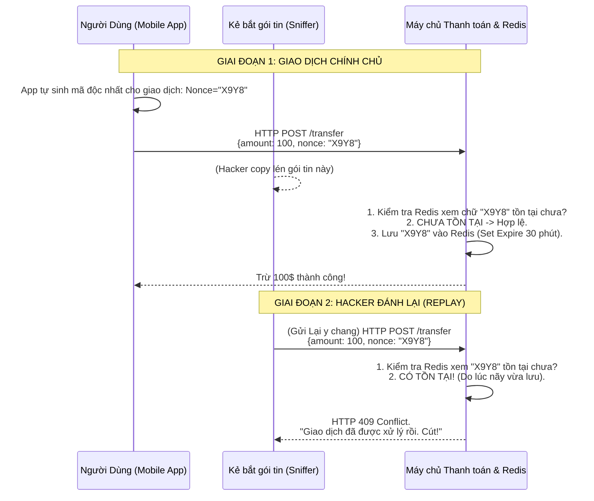

# Lesson 35: Lỗ hổng Replay Attack (Tấn công Đánh Lại)

> [!NOTE]
> **Category:** Theory & Security (Lý thuyết & Bảo mật)
> **Goal:** Nắm vững một nguyên lý cực kỳ đau đớn: "Một gói tin HỢP LỆ 100%, có CHỮ KÝ đúng 100% vẫn có thể là một Vũ khí Hủy diệt". Hiểu cách thiết kế kiến trúc Idempotency, Nonce và JTI để chặn đứng các Giao dịch Bóng ma.

## 1. Lý thuyết chuyên sâu (Detailed Theory)

### 1.1. Replay Attack là gì?
Giả sử bạn gọi cho người hầu: "Hãy mang cho ta 1 ly rượu". Người hầu lập tức làm theo.
Nhưng có một Tên Trộm thu âm lại câu nói đó của bạn. 10 phút sau, Tên trộm bật máy ghi âm phát lại câu: "Hãy mang cho ta 1 ly rượu". Giọng nói đúng 100% là của bạn. Người hầu nghe thấy, lập tức mang rượu ra (Và Tên trộm uống mất).
Đó chính là **Replay Attack (Tấn công Đánh Lại)**. 

Trong thế giới Mạng, Hacker ngồi ở quán Cafe (Dùng Wireshark bắt gói tin mạng). Hắn rình lúc Bạn bấm Nút `POST /api/transfer` (Chuyển 100$ cho Hacker). Cục HTTP Request đó chứa đầy đủ Access Token, Chữ ký JWS hoàn hảo. 
Hacker KHÔNG CẦN GIẢI MÃ BẤT CỨ THỨ GÌ. Hắn chỉ đơn giản là Copy cái cụm Data đó, rồi ấn lệnh "Send" Gửi lại vào máy chủ API 1000 lần. Máy chủ API kiểm tra Token, thấy chữ ký đúng (Giọng nói thật), nó trừ của bạn 100,000$ chuyển cho Hacker.

### 1.2. Idempotency (Tính Độc lập) - Chìa khóa Sinh tử
Replay Attack không chỉ do Hacker. Khi Mạng Internet bị chập chờn, App Mobile của bạn (Vì tưởng Request trước bị lỗi mạng), tự động Gọi Lại (Retry) API thanh toán lần thứ 2. Hậu quả y hệt.
Do đó, các kiến trúc sư phải thiết kế API theo chuẩn **Idempotent**. Nghĩa là: Cùng một Yêu cầu, dù đập vào API 1 lần hay 1 Triệu lần, Kết quả ở Database KHÔNG ĐƯỢC PHÉP thay đổi (Chỉ trừ tiền 1 lần).

---

## 2. Luồng nội bộ & Cơ chế cấp thấp (Internal Workflow & Low-level Mechanisms)

Cơ chế phòng thủ Nonce/JTI chặn đứng Giao dịch Bóng ma:



---

## 3. Thực hành tốt nhất & Bảo mật (Best Practices & Security)

> [!CAUTION]
> **HTTPS (SSL/TLS) có chống được Replay Attack không?**
> Rất nhiều người nghĩ: "Tôi xài HTTPS rồi, mạng đã bị mã hóa, Hacker không bắt được gói tin đâu".
> **Đúng nhưng Sai:** TLS chống Hacker Cắt Ngang Mạng Internet (Man-in-the-Middle). Bọn chúng chỉ thấy rác, không copy được. NHƯNG, nếu Kẻ Tấn Công chính là MỘT QUẢN TRỊ VIÊN MẠNG NỘI BỘ (Insider Threat), hoặc Hacker cắm cờ Proxy lừa bạn cài Cert Giả. Thậm chí đơn giản: App rớt mạng và Tự Động Replay chính nó.
> HTTPS không bảo vệ Lõi API của bạn khỏi các cuộc gọi lặp. BẮT BUỘC phải cài cơ chế Nonce (Number used once) ở Tầng Ứng Dụng (Application Layer).

> [!IMPORTANT]
> **Bộ 3 Vệ sĩ Của JWT: `exp`, `nbf`, và `jti`**
> - Không bao giờ cấp JWT sống quá lâu (Ví dụ sống 30 ngày). Thời gian sống (`exp`) là Ranh giới Đầu tiên. Kẻ trộm bắt được gói tin, nhưng mai hắn mới Replay thì Token đã chết.
> - `nbf` (Not Before): Chống Replay ngược thời gian.
> - `jti` (JWT ID): Chính là cái Nonce (Mã duy nhất). Mọi hệ thống OIDC khắt khe (Như FAPI Ngân hàng) Yêu cầu: API Gateway phải ghi nhớ tất cả các `jti` nó từng gặp. Hễ đụng Token mang `jti` trùng lặp, phải hủy diệt ngay.

---

## 4. Cấu hình minh họa thực tế (Configuration Examples)

Ví dụ cấu hình chống Replay Attack ở mức Client (Khi Frontend sinh Idempotency Key nộp cho Backend). Đoạn Code Axios (React) gọi API thanh toán:

```javascript
import { v4 as uuidv4 } from 'uuid';
import axios from 'axios';

async function submitPayment(amount) {
  // 1. Sinh ra một mã UUID siêu ngẫu nhiên KHÔNG BAO GIỜ TRÙNG
  const idempotencyKey = uuidv4(); 
  
  try {
    const response = await axios.post('/api/v1/payments/transfer', {
      amount: amount,
      to_account: "0123456789"
    }, {
      headers: {
        // 2. Nhét vào HTTP Header chuẩn mực
        'Idempotency-Key': idempotencyKey,
        'Authorization': `Bearer ${localStorage.getItem('token')}`
      }
    });
    console.log("Thanh toán thành công");
  } catch (error) {
    if (error.response.status === 409) {
      console.log("Giao dịch đang được xử lý hoặc bị lặp, vui lòng đợi!");
    }
  }
}
```
*(Lưu ý: Header `Idempotency-Key` là tiêu chuẩn vàng của Stripe API. Khi API nhận key này, nó khóa giao dịch trong Redis, nếu mạng đứt, Frontend gửi lại cái ID đó, Backend biết ngay là lệnh cũ chưa xử lý xong và không tạo thêm đơn mới).*

---

## 5. Trường hợp ngoại lệ (Edge Cases)

- **Đồng hồ Lệch (Clock Skew) phá vỡ Timestamping:** Ngoài `Nonce`, dân bảo mật thích dùng `Timestamp` (Dấu thời gian) để chống Replay. API yêu cầu Frontend gửi lên Unix Time: `timestamp=1715000000`. API check: Nếu Request gửi lên TRỄ HƠN 30 GIÂY so với giờ hiện tại của Server, API ném bỏ (Chống Hacker bắt gói tin để dành ngày mai gửi).
  - **Lỗi chí mạng:** Đồng hồ của Máy tính Người dùng (Frontend) có thể bị CẠN PIN CMOS, hoặc cố tình bị chỉnh lệch 5 phút so với Thế giới. Khi đó, Frontend gửi Timestamp chênh lệch 5 phút. Tường lửa Timestamp của API sẽ TỪ CHỐI MỌI NGƯỜI DÙNG BÌNH THƯỜNG vì lầm tưởng đó là Replay trễ hạn.
  - **Khắc phục:** Không bao giờ dựa 100% vào Timestamp từ Phía Client. Hoặc phải cho phép một độ trễ co giãn (Tolerance) khoảng 2-5 phút, kết hợp với Nonce (JTI) để bù đắp khuyết điểm.

---

## 6. Câu hỏi Phỏng vấn (Interview Questions)

**1. Trong OIDC, thông số `nonce` (Number used once) trên Header gửi lên Keycloak nhằm chống lại đòn tấn công Đánh Lại nào? Và ai là người kiểm tra nó?**
- **Junior:** Giống JTI, ngăn hacker gửi 2 lần.
- **Senior:** `nonce` trong OIDC sinh ra chuyên biệt để bảo vệ **Luồng Xác Thực (Authentication Flow)** và bảo vệ **Frontend (Client)**.
Khi Frontend (React) điều hướng sang Keycloak, nó đính kèm `&nonce=XYZ123` trên URL. Khi Keycloak cấp ra cái `ID Token` (JSON), Keycloak sẽ ĐÓNG DẤU cái chữ `nonce: "XYZ123"` chết cứng vào thân Payload của ID Token đó. 
Trình duyệt nhận Token về. MÁY KHÁCH (React) sẽ mở Token ra và kiểm tra: "Cái Nonce trong Token này CÓ KHỚP VỚI cái Nonce mình vừa gửi đi lúc nãy không?".
Việc này chống đòn Tấn Cống Đánh Lại Bơm Token (Token Injection). Hacker bắt được 1 cái ID Token cũ của bạn, hắn bơm ngược lại vào Web của bạn để lừa Web đăng nhập. Web check Nonce thấy lệch (Vì nó thuộc phiên giao dịch cũ) -> Chém rụng ngay.

**2. Làm thế nào Cache Redis có thể bị "Tràn bộ nhớ" nếu bạn dùng tính năng Lưu JTI (Token ID) để chống Replay Attack trên API Gateway?**
- **Junior:** Lưu nhiều ID quá đầy RAM.
- **Senior:** Lỗi kiến trúc Cấu hình Hết hạn (TTL - Time to Live) bị sai.
Nếu 1 triệu User mỗi ngày sinh ra 10 triệu Token, có 10 triệu cái JTI. Bạn lưu JTI vào Redis để chặn gọi trùng. Nếu bạn KHÔNG CÀI `Expire` (Hạn chót xóa) cho các Key này trên Redis, hoặc bạn cài quá dài (1 năm). Redis sẽ chứa tỷ tỷ bản ghi JTI và nổ RAM.
**Bí quyết Kiến trúc:** Thời hạn lưu JTI (TTL trên Redis) BẮT BUỘC PHẢI BẰNG CHÍNH XÁC với Thời Hạn Sống của cái Token đó (`exp` - Thời điểm Expire).
Tại sao? Vì khi Token hết hạn (Hết `exp`), Tầng JWT Filter của API Gateway sẽ tự động từ chối cái Token đó mà KHÔNG CẦN CHỌC XUỐNG REDIS CHECK JTI NỮA. (Token hết hạn thì Replay cũng vô dụng). Nên Redis chỉ cần ôm JTI trong lúc Token đó còn sống là quá đủ an toàn và dọn sạch RAM liên tục.

**3. Khái niệm "Idempotency Key" khác biệt gì so với "JTI (JWT ID)"? Tại sao có JTI rồi mà Stripe API vẫn bắt lập trình viên tự truyền Idempotency-Key?**
- **Junior:** Nó giống nhau nhưng đặt tên khác nhau thôi.
- **Senior:** Mục tiêu bảo vệ khác nhau (Infrastructure vs Business).
- `JTI` bảo vệ Lớp Mạng (Network/Identity Layer). Chống Hacker bắt cái Token và gửi liên tục. Nhưng trong 1 Token (Sống 5 phút), User HỢP PHÁP có thể thực hiện 10 lần Mua Hàng độc lập (Tạo 10 Hóa đơn).
- `Idempotency-Key` bảo vệ Lớp Nghiệp Vụ (Business Logic Layer). Nó không đi theo Token, nó đi THEO TỪNG GIAO DỊCH (Transaction). User muốn mua Đơn hàng A, Frontend sinh Idempotency Key: `abc`. Nếu rớt mạng bấm nút mua lại Đơn hàng A, Frontend VẪN GỬI Key `abc` -> Hệ thống không trừ tiền 2 lần. Phút tiếp theo, User muốn mua Đơn hàng B, Frontend sinh Key mới `xyz` -> Hệ thống trừ tiền đơn B. `JTI` thì bất lực trong vụ này vì Cùng 1 User cầm 1 Token vẫn có quyền tạo vô số giao dịch mới.

**4. Kịch bản: Máy chủ A (Chạy ở Mỹ) gửi yêu cầu chuyển tiền về Máy chủ B (Chạy ở Việt Nam) kèm chữ ký HMAC và Timestamp để chống Replay. Tuy nhiên, mọi Request đều bị Máy chủ B từ chối. Lỗi Vật Lý nào đang xảy ra?**
- **Junior:** Do ping qua Mỹ xa quá nên quá thời gian (Timeout).
- **Senior:** Đây là lỗi Lệch Đồng bộ Thời gian Hệ thống (System Clock Desynchronization / Clock Drift).
Không giống như Web Browser, Máy chủ Server tự đếm giờ bằng xung nhịp chip thạch anh bên trong (Hardware Clock). Dù có nối mạng, nếu Không cài đặt dịch vụ Đồng bộ Thời gian Mạng (NTP - Network Time Protocol). Máy chủ A ở Mỹ (Sau 1 năm chạy) có thể chạy nhanh hơn Máy chủ B ở Việt Nam tới 3 phút.
Khi Server A phát Request: `Timestamp=10:05`, gửi về Server B. Server B lúc này đồng hồ mới `10:02`. Nó thấy: "Ủa, gói tin này ĐẾN TỪ TƯƠNG LAI (3 phút nữa mới được sinh ra)???". Thuật toán chống Replay lập tức coi gói tin từ tương lai là Mã độc/Lỗi thời gian và Cự tuyệt toàn bộ. Hạ tầng Microservices Cấm Tuyệt Đối việc tắt đồng bộ NTP Daemons (chrony/ntpd).

**5. MAC (Message Authentication Code) kết hợp với Sequence Number (Số thứ tự) là kỹ thuật chống Replay mạnh nhất được áp dụng ở đâu?**
- **Junior:** Dùng ở API chặn tấn công.
- **Senior:** Kỹ thuật này được áp dụng ở Tầng TCP/IP và IPSec (Tầng Mạng Vật Lý), hoặc trên các giao thức Router (BGP/OSPF).
Khác với HTTP API (Nơi các gói tin bay lộn xộn không thứ tự - Stateless). Dữ liệu truyền Stream/Network có Tính Tuần Tự (Stateful).
Máy chủ và Client thỏa thuận: Gói tin 1 gửi lên có `Seq=1`, gói tin 2 `Seq=2`. Chữ ký MAC được băm bao gồm cả Số Thứ Tự này vào ruột.
Hacker bắt gói tin `Seq=2` và Replay. Máy chủ nhận được `Seq=2`, nhưng Máy chủ nhớ "Tao đã nhận gói 2 rồi, tao đang chờ gói 3". Lập tức gói Replay bị vứt sọt rác (Window trượt). Nếu Hacker cố ý sửa con số trong gói tin thành `Seq=3` cho hợp lệ, thì BÙM! Chữ ký MAC bị sai lệch (Vì Nội dung bị đổi). Kẻ thù hoàn toàn bế tắc.

---

## 7. Tài liệu tham khảo (References)
- **Stripe API Documentation:** Idempotent Requests.
- **IETF RFC 7519:** JSON Web Token (JWT) - (Section 4.1.7: "jti" Claim).
- **OWASP:** REST Security Cheat Sheet.
