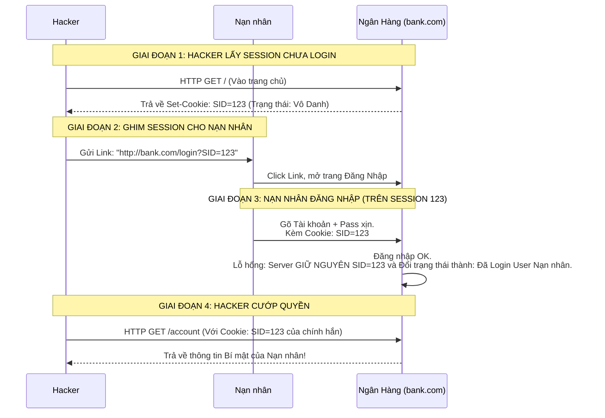

# Lesson 36: Lỗ hổng Session Fixation (Ghim Phiên Đăng Nhập)

> [!NOTE]
> **Category:** Theory & Security (Lý thuyết & Bảo mật)
> **Goal:** Lật tẩy đòn tấn công ngược đời và kỳ lạ nhất Web Security: Thay vì ăn cắp Session của bạn, Hacker lại "TẶNG" Session của hắn cho bạn xài. Nắm vững nguyên lý sống còn: "Làm mới Session khi nâng quyền".

## 1. Lý thuyết chuyên sâu (Detailed Theory)

### 1.1. Session Fixation là gì?
Ở các đòn tấn công thông thường, Hacker rình rập để CƯỚP cái Cookie/Session ID của nạn nhân.
Nhưng với **Session Fixation (Ghim Phiên)**, Hacker chủ động vào trang web Ngân hàng (Dưới tư cách Khách Vô Danh), xin Ngân hàng cấp cho hắn một cái Session ID (Ví dụ: `SID=HACKER_123`). 
Sau đó, Hacker BẮT ÉP Trình duyệt của Nạn nhân phải NHẬN lấy cái `SID=HACKER_123` đó. Bằng cách nhấp vào một link lừa đảo, nạn nhân vào trang Ngân hàng, bấm nút "Đăng Nhập" và nhập tài khoản hợp lệ của nạn nhân.
Do máy chủ nhận được lệnh Đăng nhập kèm cái `SID=HACKER_123`, máy chủ sẽ GẮN CÁI TÀI KHOẢN VỪA ĐĂNG NHẬP đó vào cái SID kia.
Lúc này, Hacker ở nhà, chỉ việc dùng chính cái `SID=HACKER_123` của hắn để Refresh trang web, và bùm: Hắn chui tọt vào tài khoản của Nạn nhân.

### 1.2. Tại sao Nạn nhân lại bị "Ghim" Session?
Ngày xưa (Và nhiều hệ thống cũ bây giờ), Máy chủ thường chấp nhận Session ID truyền qua URL (Ví dụ: `http://bank.com/?PHPSESSID=HACKER_123`). 
Hacker chỉ việc gửi link đó cho nạn nhân. Nạn nhân click vào, Trình duyệt lôi cái SID trên URL gán vào Cookie.
Nếu web xịn không nhận SID qua URL, Hacker có thể dùng XSS (Bài 32) để chạy lệnh `document.cookie="SID=HACKER_123"` trên trình duyệt nạn nhân. 

---

## 2. Luồng nội bộ & Cơ chế cấp thấp (Internal Workflow & Low-level Mechanisms)

Toàn cảnh đòn "Mời ông xơi Session của tôi":



---

## 3. Thực hành tốt nhất & Bảo mật (Best Practices & Security)

> [!IMPORTANT]
> **Nguyên lý Vàng: Session ID Regeneration (Tái tạo Session)**
> Cách chống Session Fixation duy nhất và mạnh mẽ nhất: **HỦY DIỆT SESSION CŨ NGAY KHI ĐĂNG NHẬP**.
> Dù Người dùng mang bất kỳ Session ID nào tới màn hình Login. Miễn là họ Nhập đúng Tài khoản/Mật khẩu (Thực hiện hành động Nâng Quyền - Privilege Escalation). Máy chủ BẮT BUỘC phải làm 2 việc:
> 1. Xóa sổ hoàn toàn cái Session ID cũ trên RAM/Redis.
> 2. Khởi tạo một Session ID MỚI CỨNG (Ví dụ: `SID=NEW_789`) và trả về cho Trình duyệt (`Set-Cookie`).
> Lúc này, cái `SID=HACKER_123` của Hacker sẽ trở thành cục rác vô giá trị.

> [!CAUTION]
> **Tuyệt đối không nhận Session ID từ URL**
> Việc truyền Session ID lên thanh địa chỉ (URL Rewrite) là kỹ thuật Cổ đại dành cho các Trình duyệt cấm Cookie. Ngày nay, mọi Máy chủ phải được cấu hình: **Chỉ chấp nhận Session ID đọc từ HTTP Cookie**. Nếu thấy Session ID nằm trên URL, phải chặn ngay lập tức. Cờ `HttpOnly` và `Secure` luôn phải được bật.

---

## 4. Cấu hình minh họa thực tế (Configuration Examples)

Framework hiện đại bảo vệ bạn như thế nào?
Trong Java Spring Security, tính năng phòng thủ Session Fixation được BẬT MẶC ĐỊNH.

```java
@Configuration
@EnableWebSecurity
public class SecurityConfig {
    @Bean
    public SecurityFilterChain filterChain(HttpSecurity http) throws Exception {
        http
            .sessionManagement(session -> session
                // ĐÂY LÀ LỆNH CHỐNG SESSION FIXATION
                // migrateSession: Giữ lại data giỏ hàng cũ, nhưng CẤP MỘT SESSION ID MỚI.
                .sessionFixation().migrateSession() 
                
                // Nếu muốn gắt gao hơn: Xóa sạch data cũ, cấp Session ID mới hoàn toàn
                // .sessionFixation().newSession() 
            );
        return http.build();
    }
}
```
*(Keycloak là một hệ thống SSO đỉnh cao, nó tự động luân chuyển Session ID (Luồng OIDC Code Flow) mỗi lần nhảy trang, do đó nó hoàn toàn miễn nhiễm với Fixation).*

---

## 5. Trường hợp ngoại lệ (Edge Cases)

- **OIDC "State" - Khi Anti-CSRF cũng chống luôn Fixation:**
  - Trong luồng OAuth 2.0 (OIDC), khi App (Client) đá user sang Keycloak để đăng nhập. Nó sinh ra một tham số `state`.
  - Giả sử Hacker gửi link Keycloak lừa đảo (Có gắn sẵn URL Redirect về App bằng tài khoản của Hacker). Nạn nhân bấm vào, Keycloak trả Code về App, App tự Login nạn nhân vào tài khoản Hacker (Gọi là Login CSRF hoặc OIDC Session Fixation).
  - Lỗ hổng này bị bóp nghẹt vì cái mã `state` mà Keycloak trả về SẼ KHÔNG KHỚP với mã `state` gốc nằm trong LocalStorage của trình duyệt Nạn nhân. App sẽ chém rụng quy trình Login đó.

---

## 6. Câu hỏi Phỏng vấn (Interview Questions)

**1. Trong Session Fixation, tại sao Hacker không chịu ăn cắp Session của Nạn nhân cho nhanh mà phải đi đường vòng "Tặng" Session của mình cho Nạn nhân?**
- **Junior:** Chắc tại khó ăn cắp quá nên phải làm vậy.
- **Senior:** Bạn lọt vào trang Web của Ngân hàng, nhưng Ngân hàng cài cờ `HttpOnly` vào Cookie. Tường lửa XSS chặt đứt toàn bộ hy vọng lấy trộm Cookie của Nạn nhân (Hacker dùng `document.cookie` không trả về gì cả).
Vì không thể ĐỌC (Ăn cắp) Cookie, Hacker đành chuyển sang chiến thuật GHI (Nhồi nhét). Trình duyệt tuy cấm ĐỌC `HttpOnly` Cookie, nhưng một số lỗi Web lại cho phép GHI ĐÈ hoặc Gắn Cookie thông qua URL/Thẻ Meta. Hacker dùng cách đó "Ghim" cái Cookie của hắn vào máy nạn nhân. Đây là Đòn đánh Vòng khi phòng thủ trực diện quá mạnh.

**2. Nếu Web của tôi bán hàng không bắt Đăng Nhập. Khách có thể Thêm vào Giỏ hàng (Bằng Session Guest). Khi Khách bấm Đăng Nhập, tôi dùng hàm `sessionFixation().newSession()` (Xóa sạch Session cũ sinh cái mới). Hậu quả gì sẽ xảy ra?**
- **Junior:** Web bảo mật an toàn 100%.
- **Senior:** Trải nghiệm người dùng (UX) bị Phá nát.
Khách hì hục chọn 20 món hàng vào Giỏ. Giỏ hàng đó được lưu vào `Session A` (Guest). Khi Khách bấm Login, bạn Hủy diệt `Session A` và cấp `Session B`. Đăng nhập xong, Khách nhìn lại Giỏ Hàng TRỐNG TRƠN. Họ sẽ chửi và bỏ sang Web đối thủ.
**Giải pháp Kiến trúc:** Phải dùng chế độ `migrateSession()` (Trong Spring) hoặc tự code thủ công: BẮT BUỘC Đổi cái Session ID (Từ A sang B) để chống Fixation. NHƯNG, dữ liệu 20 món hàng trong Session A phải được COPY SANG Session B trước khi Session A bị hủy. 

**3. Khái niệm "Pre-session" hoặc "Login Session" trong Keycloak sinh ra để giải quyết vấn đề gì?**
- **Junior:** Để nó đếm thời gian cho khỏi timeout.
- **Senior:** Khi bạn mở màn hình Đăng nhập của Keycloak. Dù bạn chưa gõ Pass, Keycloak đã nhét cho bạn 1 cái Cookie tên là `AUTH_SESSION_ID`.
Cái Cookie này KHÔNG PHẢI LÀ TÀI KHOẢN CỦA BẠN. Nó là "Pre-session" (Phiên tiền đăng nhập). Nó chỉ dùng để lưu Trạng thái của cái Form (Ví dụ: Bạn đang ở bước gõ OTP, hay đang ở bước Quét khuôn mặt). 
Khi bạn nhập xong 100% các bước Login, Keycloak lập tức HỦY DIỆT cái `AUTH_SESSION_ID` đó, và sinh ra cho bạn cái Cookie quyền lực nhất: `KEYCLOAK_IDENTITY` (Tương đương Access Token mạng nội bộ). Sự tách biệt này chính là nghệ thuật Chống Session Fixation ở đẳng cấp cao.

**4. Kịch bản: Máy chủ Web nằm sau hệ thống Varnish Cache. Varnish Cache cấu hình sai, vô tình Cache luôn cái Header `Set-Cookie: SID=123` của người dùng đầu tiên vào trang. Thảm họa gì sẽ xảy ra?**
- **Junior:** Mọi người đều vào chậm.
- **Senior:** Thảm họa **Mass Session Fixation (Ghim Phiên Hàng Loạt)** vô tình (Không có Hacker nào cả, tự Server bóp dái).
User A vào trang Web, Server sinh `Set-Cookie: SID=A`. Varnish Cache thấy File tĩnh, nó Cache cmn cái Header đó lại.
1 Triệu User (B, C, D) phía sau mở trang Web lên. Varnish Cache lấy bản lưu trả về, kèm theo TẶNG LUÔN cái Header `Set-Cookie: SID=A` cho CẢ 1 TRIỆU NGƯỜI ĐÓ.
Lúc này 1 Triệu người dùng chung 1 cái Session ID. Chỉ cần 1 người trong đó (User B) bấm Login. Máy chủ Server đánh dấu `SID=A` là của User B. Lập tức, 999,999 người còn lại khi F5 trang Web sẽ TỰ ĐỘNG BIẾN THÀNH USER B (Nhìn thấy số tiền của User B, địa chỉ của User B). Đây là tai nạn cực kỳ nổi tiếng trên các trang Magento/WordPress khi cài Cache mù quáng.

---

## 7. Tài liệu tham khảo (References)
- **OWASP:** Session Fixation.
- **OWASP:** Session Management Cheat Sheet.
- **Spring Security Documentation:** Session Management (Session Fixation Protection).
