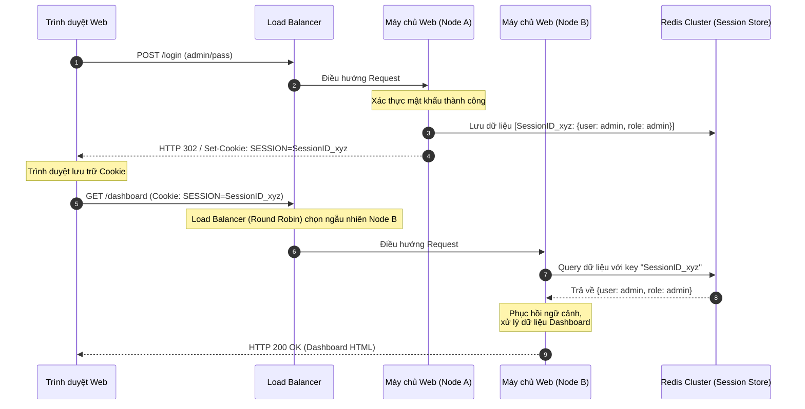

# Lesson 4: Sessions

> [!NOTE]
> **Category:** Theory (Lý thuyết)
> **Goal:** Phân biệt rõ sự khác nhau giữa Session và Cookie. Nắm vững cách kiến trúc máy chủ duy trì trạng thái (Stateful) và lý do tại sao các hệ thống phân tán đám mây lại muốn dịch chuyển sang kiến trúc Phi trạng thái (Stateless).

## 1. Lý thuyết chuyên sâu (Detailed Theory)

### 1.1. Session (Phiên làm việc) là gì?
Nếu Cookie là ngăn chứa đồ trên trình duyệt (Client-side), thì **Session** là bộ nhớ trạng thái nằm ở trên máy chủ (Server-side). 
- Một "Phiên làm việc" đại diện cho một khoảng thời gian giao tiếp liên tục giữa một người dùng cụ thể và máy chủ. 
- Mọi dữ liệu nhạy cảm (như User Profile, Quyền hạn, Giỏ hàng) được lưu giữ an toàn bên trong bộ nhớ RAM của máy chủ hoặc trong cơ sở dữ liệu (Redis/Memcached).

### 1.2. Mối quan hệ cộng sinh giữa Session và Cookie
Máy chủ có thể quản lý hàng triệu Session cùng lúc. Khi một Request HTTP (vốn không có danh tính) bay đến, làm sao máy chủ biết Request này thuộc về Session nào?
- **Khóa định danh (Session ID):** Khi tạo Session, máy chủ sinh ra một chuỗi ký tự ngẫu nhiên cực dài và khó đoán (ví dụ: `JSESSIONID=A1B2C3D4...`).
- Máy chủ gửi `Session ID` này xuống Client thông qua Cookie. Ở các Request tiếp theo, Client gửi lại Cookie này. Máy chủ lấy `Session ID` ra, tra bảng băm (Hash Table) trong RAM để móc nối Request đó với kho dữ liệu Session tương ứng.
- *Kết luận:* Session là nội dung (Nằm ở Server), còn Cookie chỉ là phương tiện vận chuyển chìa khóa (Session ID).

### 1.3. Bài toán mở rộng (Scaling) với Session
Trong kỷ nguyên Microservices và Cloud, kiến trúc Stateful (dùng Session lưu ở RAM máy chủ) trở thành rào cản chí mạng.
- Nếu người dùng đăng nhập tại Server A (Tạo Session ở RAM Server A). Ở Request tiếp theo, Load Balancer điều hướng họ sang Server B. Server B không tìm thấy Session trong RAM của nó -> Bắt người dùng đăng nhập lại.
- Giải pháp truyền thống: Dùng **Sticky Sessions** (Ép Load Balancer luôn gửi người này vào Server A) hoặc dùng **Distributed Cache** (Lưu Session tập trung ở Redis Cluster).

---

## 2. Luồng nội bộ & Cơ chế cấp thấp (Internal Workflow & Low-level Mechanisms)

Luồng xử lý Session qua Distributed Cache (Redis) trong kiến trúc Microservices:



---

## 3. Thực hành tốt nhất & Bảo mật (Best Practices & Security)

> [!IMPORTANT]
> **Vô hiệu hóa Session an toàn (Session Destruction)**
> Khi người dùng bấm "Đăng xuất" (Logout), không được phép chỉ xóa Cookie ở phía trình duyệt (bằng JavaScript). Phải gửi Request lên Server để Server chính thức **hủy bỏ (destroy) object Session** đó trong RAM/Redis. Nếu không, `Session ID` đó vẫn tồn tại vĩnh viễn trên Server (Session Leak) và nếu hacker nhặt được Cookie cũ, chúng vẫn có thể sử dụng lại.

> [!WARNING]
> **Độ ngẫu nhiên của Session ID (Entropy)**
> `Session ID` phải cực kỳ ngẫu nhiên và đủ dài (ít nhất 128 bit) sinh ra từ bộ tạo số giả ngẫu nhiên an toàn mật mã (CSPRNG). Nếu thuật toán sinh ID có quy luật hoặc có thể đoán trước (Predictable Session ID), kẻ tấn công có thể "mò" ra ID của người quản trị để chiếm quyền mà không cần đánh cắp Cookie.

---

## 4. Cấu hình minh họa thực tế (Configuration Examples)

Ví dụ cấu hình Spring Session tích hợp với Redis để giải quyết bài toán Session phân tán cho nhiều cụm máy chủ:

```xml
<!-- pom.xml: Thêm thư viện quản lý session phân tán -->
<dependency>
    <groupId>org.springframework.session</groupId>
    <artifactId>spring-session-data-redis</artifactId>
</dependency>
```

```yaml
# application.yml
spring:
  session:
    store-type: redis # Ép buộc Spring boot không lưu session vào RAM cục bộ (Tomcat)
    redis:
      namespace: "enterprise:iam:sessions"
      flush-mode: on_save
server:
  servlet:
    session:
      timeout: 30m # Session sẽ bị xóa khỏi Redis sau 30 phút không có tương tác
```

---

## 5. Trường hợp ngoại lệ (Edge Cases)

- **Tấn công Session Fixation (Ghim phiên):** Hacker truy cập trang web ẩn danh, Server cấp cho Hacker một `Session ID` (ví dụ: ID = 123). Hacker gửi đường link chứa ID 123 này cho nạn nhân (ví dụ ép ghi đè Cookie). Nạn nhân click link, đăng nhập thành công. Lúc này Server ghi nhận ID 123 = Tài khoản Nạn nhân. Hacker lập tức lấy chính Cookie 123 đang có sẵn trong tay để vào hệ thống với tư cách nạn nhân.
  - **Khắc phục:** Mọi framework chuẩn (như Spring Security, Keycloak) BẮT BUỘC phải thay mới toàn bộ (Rotate/Renew) `Session ID` ngay tại khoảnh khắc quá trình xác thực (Login) thành công.
- **Race Condition khi tái tạo Session:** Nếu Client gửi song song 3 Request AJAX mang cùng một Session ID cũ đúng vào khoảnh khắc Session đó vừa bị Rotate, máy chủ có thể từ chối 2 Request đến sau. 

---

## 6. Câu hỏi Phỏng vấn (Interview Questions)

**1. Điểm khác biệt lớn nhất giữa Cookie-based Session và JWT (JSON Web Token) là gì?**
- **Junior:** Session lưu trên Server, JWT lưu trên Client. JWT không cần dùng database để kiểm tra.
- **Senior:** Session là kiến trúc Stateful (có trạng thái); máy chủ lưu trữ toàn bộ dữ liệu người dùng và gửi một định danh (ID) rỗng nghĩa cho Client. Khi có Request tới, máy chủ phải truy vấn RAM/Database (I/O operation) để lấy thông tin. JWT là kiến trúc Stateless (phi trạng thái); toàn bộ thông tin (Claims) được nén gọn và "ký" (Signed) bằng mật mã ngay trong Token gửi cho Client. Máy chủ không cần lưu gì, chỉ cần dùng khóa công khai (Public Key) để kiểm tra chữ ký là biết Token hợp lệ, giúp tối ưu hóa hiệu năng mở rộng.

**2. Tại sao người ta vẫn dùng Session cho ứng dụng Web truyền thống thay vì chuyển hết sang JWT?**
- **Junior:** Vì Session dễ code hơn và dùng mặc định trong các ngôn ngữ lập trình.
- **Senior:** Khuyết điểm chí mạng của Stateless JWT là không thể dễ dàng thu hồi (Revoke) ngay lập tức khi phát hiện rủi ro (vì Token lưu ở Client và tự thân nó hợp lệ cho tới lúc hết hạn). Đối với Session, vì trạng thái nằm trên Server, quản trị viên chỉ cần xóa đối tượng Session khỏi bộ nhớ, người dùng sẽ bị đăng xuất ngay tắp lự. Đối với các hệ thống Web nội bộ yêu cầu kiểm soát bảo mật thời gian thực, kiến trúc Stateful Session (kết hợp Redis) vẫn an toàn và linh hoạt hơn.

**3. Cơ chế Session Fixation hoạt động như thế nào và làm sao để vá lỗ hổng này?**
- **Junior:** Hacker ép người dùng xài ID của mình. Cách vá là cấp ID mới sau khi đăng nhập.
- **Senior:** Lỗ hổng xảy ra khi hệ thống sử dụng nguyên vẹn một `Session ID` được cấp trước khi xác thực (Anonymous Session) cho trạng thái sau khi xác thực (Authenticated Session). Hacker mồi sẵn `Session ID` độc hại vào máy nạn nhân. Để vá lỗi, hệ thống phải thực hiện hành động `Change Session ID` ngay khi người dùng submit username/password thành công. Dữ liệu ngữ cảnh sẽ được chép sang Session mới, còn ID cũ bị vô hiệu hóa hoàn toàn.

**4. Khi thiết kế Microservices, bạn chọn giải pháp Sticky Sessions hay Distributed Cache để quản lý Session?**
- **Junior:** Chọn Distributed Cache vì nó dùng Redis, hiện đại hơn.
- **Senior:** Sticky Sessions (ghim người dùng vào một máy chủ cố định thông qua Load Balancer) phá vỡ nguyên lý phân tán tải đồng đều và gây mất Session nếu Node đó bị sập. Distributed Cache (như Redis/Hazelcast) tách bạch hoàn toàn kho lưu trữ Session ra khỏi máy chủ xử lý logic. Mặc dù nó phát sinh thêm I/O network, nhưng đây là giải pháp Cloud-Native đúng đắn, giúp các máy chủ Web trở nên hoàn toàn phi trạng thái (Stateless) để dễ dàng Scale-in/Scale-out bằng Kubernetes.

**5. Timeout của Session được tính như thế nào (Absolute Timeout vs Idle Timeout)?**
- **Junior:** Idle timeout là thời gian không làm gì thì bị văng. Absolute là thời gian tối đa được xài.
- **Senior:** `Idle Timeout` (Thời gian rảnh rỗi) sẽ tự động reset (gia hạn thêm) mỗi khi người dùng có thao tác gửi Request lên máy chủ. Tính năng này giúp giữ phiên làm việc liên tục khi đang làm việc. Tuy nhiên, nó sinh ra rủi ro Hacker đánh cắp Session và dùng công cụ ping liên tục để giữ Session sống vĩnh viễn. Để chặn điều này, kiến trúc bảo mật yêu cầu phải áp dụng thêm `Absolute Timeout` (Thời gian sống tuyệt đối) - ví dụ sau đúng 12 giờ, dù người dùng đang tương tác liên tục, Session vẫn BẮT BUỘC phải bị hủy và yêu cầu xác thực lại (Re-authentication) từ đầu.

---

## 7. Tài liệu tham khảo (References)
- **RFC 6265:** HTTP State Management Mechanism. (https://datatracker.ietf.org/doc/html/rfc6265)
- **OWASP:** Session Management Cheat Sheet.
- **Spring Security Reference:** Session Management.
