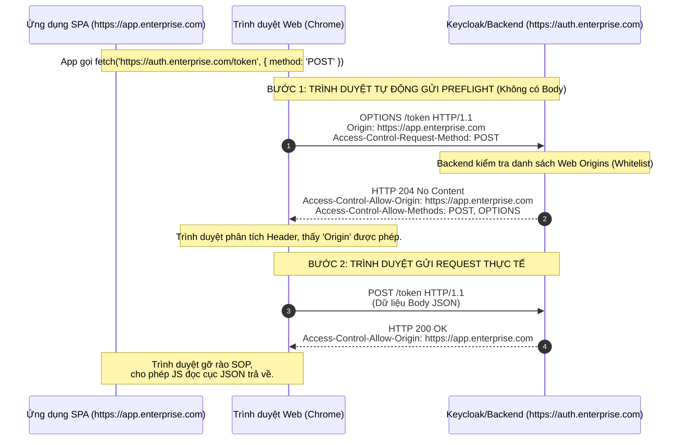

# Lesson 5: CORS (Cross-Origin Resource Sharing)

> [!NOTE]
> **Category:** Theory (Lý thuyết)
> **Goal:** Nắm vững nguồn gốc cơ chế bảo vệ Same-Origin Policy (SOP) của trình duyệt web. Hiểu tường tận cách cấu hình CORS đúng chuẩn để các ứng dụng Single Page Application (SPA) có thể gọi API xác thực đến cụm Keycloak một cách an toàn mà không bị chặn.

## 1. Lý thuyết chuyên sâu (Detailed Theory)

### 1.1. Chính sách Cùng nguồn gốc (Same-Origin Policy - SOP)
Môi trường duyệt web vô cùng nguy hiểm. Khi bạn truy cập vào một trang web báo chí (bị nhiễm mã độc), mã JavaScript trên trang đó hoàn toàn có khả năng bí mật thực hiện HTTP Request đến ngân hàng điện tử (`https://bank.com`) để thực hiện lệnh chuyển tiền. Nếu bạn đang đăng nhập sẵn ở tab ngân hàng (có sẵn Cookie), lệnh chuyển tiền sẽ thành công.
- Để ngăn chặn rủi ro này, trình duyệt thực thi chính sách bảo mật tàn nhẫn gọi là **Same-Origin Policy (SOP)**.
- Trình duyệt sẽ CHẶN ĐỨNG mã JavaScript từ việc đọc dữ liệu phản hồi (Response) của các API khác nguồn (Cross-Origin).
- Hai URL được gọi là "Cùng Nguồn" (Same-Origin) NẾU VÀ CHỈ NẾU chúng có sự trùng khớp tuyệt đối về cả 3 yếu tố: **Giao thức (Protocol)**, **Tên miền (Domain/Host)**, và **Cổng (Port)**.

### 1.2. Bản chất của CORS
Trong kiến trúc Frontend/Backend phân tách hiện đại (Decoupled), Frontend chạy ở `http://localhost:3000`, API chạy ở `https://api.com`. Đây hiển nhiên là Cross-Origin, và SOP sẽ chặn mọi Request.
- **CORS (Cross-Origin Resource Sharing)** ra đời không phải để thắt chặt bảo mật, mà ngược lại, nó là **cơ chế có kiểm soát để NỚI LỎNG SOP**.
- Cơ chế này định nghĩa một quy tắc đàm phán giữa Trình duyệt và Máy chủ thông qua các `HTTP Headers`. Máy chủ (Backend) phải chủ động nói với trình duyệt rằng: "Tôi (Máy chủ) cho phép mã JavaScript chạy trên Tên miền X (Frontend) được phép đọc dữ liệu của tôi". 

---

## 2. Luồng nội bộ & Cơ chế cấp thấp (Internal Workflow & Low-level Mechanisms)

Đối với các `Request` phức tạp mang tính rủi ro cao (như phương thức `POST`, `PUT`, `DELETE` hoặc có đính kèm Header cấu hình riêng như `Authorization: Bearer <Token>`), trình duyệt KHÔNG gửi dữ liệu thật đi ngay lập tức. Nó bắt buộc phải thực hiện lệnh "Bay thử" gọi là **Preflight Request**.



---

## 3. Thực hành tốt nhất & Bảo mật (Best Practices & Security)

> [!CAUTION]
> **Tử huyệt cấu hình Dấu sao (*)**
> Tuyệt đối KHÔNG BAO GIỜ cấu hình `Access-Control-Allow-Origin: *` trên môi trường Production, đặc biệt nếu API đó có xử lý tính năng xác thực (Credentials/Cookies). Nếu bạn đặt `*`, bất kỳ trang web nào của Hacker cũng có thể nhúng mã script để đục API của bạn. 
> 
> *Quy tắc thép:* Luôn luôn dùng danh sách trắng (Whitelist) để ánh xạ chính xác Origin cần cho phép (ví dụ trả về đúng chuỗi `https://app.enterprise.com`).

> [!TIP]
> **Giảm tải máy chủ với Preflight Cache**
> Mỗi lệnh gọi API phức tạp tốn tới 2 Request mạng (1 cái OPTIONS mồi, 1 cái thật). Điều này tăng gấp đôi độ trễ mạng (Network Latency). Máy chủ phải trả về header `Access-Control-Max-Age` (tính bằng giây) trong Response OPTIONS để trình duyệt ghi nhớ quyền CORS trong một khoảng thời gian, loại bỏ hoàn toàn các Request OPTIONS dư thừa tiếp theo.

---

## 4. Cấu hình minh họa thực tế (Configuration Examples)

Ví dụ cấu hình CORS toàn cầu (Global CORS Configuration) đúng chuẩn Enterprise trên Spring Boot Backend, kết nối với Keycloak:

```java
@Configuration
public class WebConfig implements WebMvcConfigurer {

    @Override
    public void addCorsMappings(CorsRegistry registry) {
        registry.addMapping("/api/**") // Áp dụng cho mọi API
                // CHỈ cho phép các domain được Whitelist cụ thể
                .allowedOrigins("https://app.enterprise.com", "https://admin.enterprise.com")
                // Cho phép các phương thức cần thiết
                .allowedMethods("GET", "POST", "PUT", "DELETE", "OPTIONS")
                // Quan trọng: Chỉ định rõ các Header tùy chỉnh được phép gửi lên
                .allowedHeaders("Authorization", "Content-Type", "X-Custom-Header")
                // Cho phép JS ở Frontend truy cập Header tùy chỉnh trả về từ Backend
                .exposedHeaders("X-Total-Count")
                // BẮT BUỘC TRUE nếu Frontend dùng Session Cookie hoặc Authentication
                .allowCredentials(true)
                // Cache kết quả Preflight (OPTIONS) trong 24 giờ (86400 giây)
                .maxAge(86400); 
    }
}
```

---

## 5. Trường hợp ngoại lệ (Edge Cases)

- **Lỗi CORS mạo danh (False CORS Error):** Rất nhiều lập trình viên hiểu lầm khi nhìn thấy dòng chữ đỏ rực "CORS Policy Blocked" trên Console của trình duyệt và điên cuồng sửa code cấu hình CORS. Trên thực tế, nếu Backend bị sập (trả về lỗi `500 Internal Server Error`), bị Reverse Proxy chặn (lỗi `502 Bad Gateway`), hoặc thiếu thư viện, quá trình xử lý HTTP đứt gãy khiến Backend không kịp chèn header `Access-Control-Allow-Origin` vào luồng trả về. Trình duyệt không thấy Header đó, nên nó báo lỗi CORS. Bạn phải phân tích log Backend (hoặc Network Tab kiểm tra status code thực sự) chứ không phải sửa cấu hình CORS.
- **Request không bị chặn gửi đi, chỉ chặn đọc lại:** Một hiểu lầm tai hại khác là cho rằng CORS ngăn cản Request. Hoàn toàn sai. Trong các "Simple Request" (như `POST` form data thuần), trình duyệt **VẪN GỬI dữ liệu đi**. Máy chủ VẪN XỬ LÝ lưu vào cơ sở dữ liệu. SOP/CORS chỉ chặn **KHÔNG CHO MÃ JAVASCRIPT BÊN GỌI ĐỌC ĐƯỢC KẾT QUẢ TRẢ VỀ**. Điều này dẫn đến sự cố: Dữ liệu đã chèn vào DB, nhưng Frontend báo lỗi mạng. 

---

## 6. Câu hỏi Phỏng vấn (Interview Questions)

**1. Same-Origin Policy (SOP) là cơ chế bảo vệ ở phía Máy chủ (Server) hay Trình duyệt (Browser)?**
- **Junior:** Nó bảo vệ Server, Server từ chối các kết nối lạ bằng SOP.
- **Senior:** SOP là cơ sở bảo mật hạt nhân nằm hoàn toàn tại Trình duyệt (Browser). Máy chủ (Backend API) không hề quan tâm đến SOP, máy chủ nhận Request từ POSTMAN, cURL hay bất kỳ đâu đều xử lý bình thường. Trình duyệt là kẻ trực tiếp "phong tỏa" mã JavaScript không cho đọc các phản hồi từ khác Origin để bảo vệ dữ liệu người dùng cuối. 

**2. Quá trình Preflight Request (OPTIONS) sinh ra nhằm mục đích gì?**
- **Junior:** Để kiểm tra xem Backend có sống không trước khi gửi dữ liệu thật.
- **Senior:** Preflight Request (dùng phương thức OPTIONS) là cơ chế trình duyệt dùng để xác minh quyền CORS đối với các Request có khả năng "thay đổi trạng thái" hệ thống (như POST JSON, PUT, DELETE) hoặc có header bảo mật cao (như Authorization). Trình duyệt "hỏi" trước xem Backend có chấp nhận Origin này thực thi phương thức kia không. Nếu không có Preflight, trình duyệt lỡ gửi lệnh DELETE thực tế đi, Backend xóa mất dữ liệu rồi trình duyệt mới chặn CORS thì hậu quả đã xảy ra.

**3. Tại sao cấu hình `Access-Control-Allow-Origin: *` kết hợp với `Access-Control-Allow-Credentials: true` lại gây ra lỗi ứng dụng sập (Crash)?**
- **Junior:** Vì nó tạo ra lỗ hổng bảo mật nghiêm trọng.
- **Senior:** Đây không chỉ là lỗ hổng bảo mật, mà tiêu chuẩn W3C/Fetch quy định cứng (Hardcoded rules) rằng hai cấu hình này KHÔNG ĐƯỢC PHÉP đi chung với nhau. Trình duyệt (Chrome/Firefox) sẽ chủ động từ chối hoàn toàn kết nối và ném ra lỗi Runtime Exception. Nếu bạn yêu cầu xác thực bằng thông tin cá nhân (Cookies/Auth), bạn phải chỉ định ĐÍCH DANH tên miền Origin được cho phép, tuyệt đối không được dùng dấu sao `*`.

**4. Khi tích hợp ReactJS với cụm Keycloak, Frontend gọi lệnh đổi Token và bị lỗi CORS. Làm sao để sửa tận gốc trên Keycloak?**
- **Junior:** Viết thêm code trong ứng dụng React để bỏ qua CORS.
- **Senior:** Lỗi CORS không thể được giải quyết bằng mã Frontend (vì đó là tính năng bảo mật của Browser). Để sửa tận gốc, ta phải đăng nhập vào trang quản trị Admin Console của Keycloak, tìm cấu hình của Client đích, và điền đúng tên miền của ứng dụng React (ví dụ: `http://localhost:3000`) vào trường `Web Origins`. Lúc này, Keycloak sẽ tự động đảm nhiệm vai trò sinh ra các Header CORS hợp chuẩn trong mọi Response trả về cho Frontend.

**5. Giải thích sự khác nhau giữa `Access-Control-Allow-Headers` và `Access-Control-Expose-Headers`?**
- **Junior:** Đều là để cấu hình Header cho CORS, cái đầu cho đi, cái sau cho về.
- **Senior:** `Access-Control-Allow-Headers` dùng trong phản hồi Preflight (OPTIONS), máy chủ nói cho trình duyệt biết mã JavaScript ở Client được phép **gửi lên (send)** những custom headers nào (ví dụ: `Authorization`). Ngược lại, khi máy chủ trả dữ liệu thật về, trình duyệt mắc kẹt bởi SOP sẽ che giấu tất cả các Header phản hồi (ngoại trừ 6 header cơ bản). `Access-Control-Expose-Headers` lệnh cho trình duyệt cho phép mã JavaScript **đọc được (read)** các custom headers do máy chủ trả về (ví dụ: Backend trả về header `X-Pagination-Total`, ta phải expose nó thì code JS mới lấy được số lượng trang).

---

## 7. Tài liệu tham khảo (References)
- **MDN Web Docs:** Same-origin policy. (https://developer.mozilla.org/en-US/docs/Web/Security/Same-origin_policy)
- **MDN Web Docs:** Cross-Origin Resource Sharing (CORS). (https://developer.mozilla.org/en-US/docs/Web/HTTP/CORS)
- **W3C/WHATWG:** Fetch Living Standard (CORS Protocol). (https://fetch.spec.whatwg.org/#cors-protocol)
