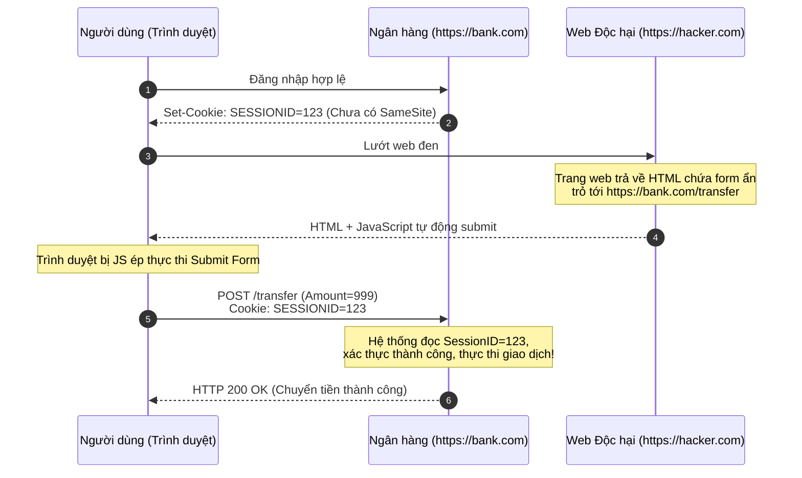

# Lesson 6: CSRF (Cross-Site Request Forgery)

> [!NOTE]
> **Category:** Theory (Lý thuyết)
> **Goal:** Hiểu sâu sắc bản chất của lỗ hổng Giả mạo Yêu cầu Chéo trang (CSRF), nguyên lý kẻ tấn công lợi dụng điểm yếu "tự động đính kèm Cookie" của trình duyệt, và cách thiết lập các lớp phòng thủ vững chắc.

## 1. Lý thuyết chuyên sâu (Detailed Theory)

### 1.1. Bản chất của lỗ hổng CSRF
**CSRF** (Cross-Site Request Forgery) là một lỗ hổng bảo mật cấp độ ứng dụng web. Lỗ hổng này xảy ra khi một trang web độc hại lừa trình duyệt của người dùng thực hiện một lệnh gọi HTTP (Request) không mong muốn tới một trang web khác (nơi người dùng đã đăng nhập và có sẵn Session).

Khác với XSS (kẻ tấn công đánh cắp Cookie), trong kịch bản CSRF, kẻ tấn công **hoàn toàn không cần biết nội dung Cookie của bạn là gì**. Kẻ tấn công chỉ lợi dụng đặc tính thiết kế của giao thức HTTP: Trình duyệt luôn luôn tự động đính kèm toàn bộ Cookie hợp lệ của domain đích vào bất kỳ Request nào hướng đến domain đó, bất kể Request đó được kích hoạt từ đâu.

### 1.2. Kịch bản tấn công điển hình
1. Bạn đăng nhập vào ngân hàng `bank.com` (Trình duyệt lưu Session Cookie của `bank.com`).
2. Bạn mở một tab mới và truy cập vào trang web của Hacker `hacker.com`.
3. Trang `hacker.com` chứa một thẻ ảnh ẩn `` hoặc một form tự động submit (POST).
4. Trình duyệt cố gắng tải ảnh, vô tình thực hiện Request `GET` đến ngân hàng. Vì đích đến là `bank.com`, trình duyệt **tự động đính kèm Cookie của ngân hàng** vào Request.
5. Máy chủ ngân hàng nhận Request, thấy Cookie hợp lệ (của bạn), liền thực hiện lệnh chuyển tiền cho Hacker.

---

## 2. Luồng nội bộ & Cơ chế cấp thấp (Internal Workflow & Low-level Mechanisms)

Luồng mô phỏng kỹ thuật một cuộc tấn công CSRF thông qua phương thức POST (giả mạo form ẩn):



---

## 3. Thực hành tốt nhất & Bảo mật (Best Practices & Security)

Để chống lại CSRF, hệ thống cần áp dụng phòng thủ đa lớp (Defense in Depth):

> [!IMPORTANT]
> **1. Sử dụng Cờ Cookie SameSite (Tầng Trình duyệt)**
> Đây là tấm khiên phòng thủ CSRF hiện đại và mạnh mẽ nhất. Bằng cách thiết lập `Set-Cookie: SESSION=xyz; SameSite=Lax` (hoặc `Strict`), trình duyệt sẽ **từ chối** đính kèm Cookie nếu Request được sinh ra từ một domain bên thứ ba (`hacker.com`) gọi sang domain của bạn.

> [!WARNING]
> **2. Sử dụng Anti-CSRF Token (Tầng Ứng dụng)**
> Nếu không thể dùng SameSite (ví dụ do yêu cầu tích hợp cũ), hệ thống bắt buộc phải triển khai mô hình **Synchronizer Token Pattern**. Khi người dùng truy cập, máy chủ sinh ra một `CSRF Token` ngẫu nhiên và nhúng vào HTML (hidden field). Khi form được submit, máy chủ so sánh Token trong Form với Token lưu trong Session. Vì Hacker (ở domain khác) không thể đọc được HTML của `bank.com` do bị SOP chặn, hắn không thể biết `CSRF Token` là gì để nhúng vào form giả mạo.

---

## 4. Cấu hình minh họa thực tế (Configuration Examples)

Ví dụ cấu hình Spring Security để kích hoạt bảo vệ CSRF và gửi Token về Client dưới dạng Cookie (chuẩn SPA - Single Page Application):

```java
@Configuration
@EnableWebSecurity
public class SecurityConfig {

    @Bean
    public SecurityFilterChain filterChain(HttpSecurity http) throws Exception {
        http
            // Kích hoạt CSRF
            .csrf(csrf -> csrf
                // Sử dụng Cookie để lưu CSRF Token thay vì Session (Giúp các ứng dụng Frontend như Angular tự động đọc và gửi lại)
                .csrfTokenRepository(CookieCsrfTokenRepository.withHttpOnlyFalse())
                // Bảo vệ mọi phương thức thay đổi trạng thái (POST, PUT, DELETE)
                // Các phương thức an toàn (GET, HEAD, OPTIONS) mặc định được bỏ qua
            )
            .authorizeHttpRequests(authz -> authz.anyRequest().authenticated());
        return http.build();
    }
}
```

---

## 5. Trường hợp ngoại lệ (Edge Cases)

- **Kiến trúc Stateless JWT không bị ảnh hưởng trực tiếp:** Nếu hệ thống của bạn là một REST API hoàn toàn phi trạng thái, và Frontend lưu trữ `Access Token` ở Local Storage, sau đó tự chèn Header `Authorization: Bearer <Token>` bằng mã JavaScript, thì hệ thống **miễn nhiễm** với CSRF. Lý do là trình duyệt KHÔNG tự động đính kèm Header Authorization vào các Request chéo trang, kẻ tấn công dù có giả mạo form cũng vô ích. 
  - *Tuy nhiên:* Lưu JWT ở Local Storage lại cực kỳ rủi ro với tấn công XSS. Nếu bạn chuyển sang lưu JWT trong Cookie (để dùng cờ HttpOnly chống XSS), lúc này kiến trúc của bạn lại **trở thành nạn nhân tiềm năng** của CSRF.
- **SameSite=Lax Vẫn Có Kẽ Hở:** Cờ `Lax` cho phép gửi Cookie nếu đó là lệnh điều hướng Top-level (nhấp vào một liên kết). Nếu hệ thống cho phép thao tác thay đổi trạng thái (ví dụ: đổi mật khẩu) thông qua một lệnh `GET` (như `GET /change-password?new=123`), thì cờ `Lax` vô dụng. Kẻ tấn công chỉ cần lừa nạn nhân click vào một cái link. (Vì vậy, tuyệt đối không dùng GET cho các thao tác cập nhật).

---

## 6. Câu hỏi Phỏng vấn (Interview Questions)

**1. Giải thích ngắn gọn cách tấn công CSRF hoạt động?**
- **Junior:** Hacker lừa mình bấm vào cái link. Link đó gọi lệnh chuyển tiền lên server ngân hàng mà mình không biết. Trình duyệt tự gửi Cookie nên server tưởng mình làm.
- **Senior:** CSRF là kỹ thuật lợi dụng sự tin cậy của máy chủ đối với trình duyệt của người dùng (Confused Deputy). Kẻ tấn công thiết kế một trang web độc hại chứa lệnh HTTP tự động thực thi hướng đến máy chủ đích. Kẻ tấn công không cần trộm Cookie, mà tận dụng cơ chế mặc định của trình duyệt là luôn đính kèm Cookie hợp lệ vào các luồng Request chéo trang (Cross-site Request) nếu không có giới hạn `SameSite`.

**2. Điểm khác nhau cơ bản giữa XSS và CSRF là gì?**
- **Junior:** XSS là ăn trộm Cookie bằng code JS. CSRF là lừa bấm nút.
- **Senior:** XSS (Cross-Site Scripting) xảy ra khi Hacker chèn được mã JavaScript độc hại chạy **bên trong** tên miền đích (Same-Origin). XSS có thể đọc được dữ liệu DOM và Cookie. Ngược lại, CSRF xảy ra khi mã của Hacker chạy ở **tên miền của Hacker** (Cross-Origin). Trong CSRF, Hacker hoàn toàn "mù" (không đọc được gì từ đích) do bị Same-Origin Policy chặn, nhưng hắn lợi dụng khả năng "ghi/gửi" (Write/Send) của trình duyệt để ép thực thi luồng logic. Do đó, XSS nguy hiểm và toàn diện hơn CSRF rất nhiều (XSS có thể dễ dàng bypass các cơ chế chống CSRF).

**3. Tại sao cấu hình `CookieCsrfTokenRepository.withHttpOnlyFalse()` trong Spring Boot lại an toàn dù ta đã học rằng Cookie phải có HttpOnly?**
- **Junior:** Vì CSRF token không phải là Session nên không cần bảo mật.
- **Senior:** Đây là cơ chế Double Submit Cookie pattern thiết kế riêng cho SPA (React/Angular). Máy chủ gửi CSRF Token xuống qua một Cookie không có cờ HttpOnly. Mục đích là để mã JavaScript của SPA có thể ĐỌC được Token này, sau đó chèn nó vào HTTP Header (như `X-XSRF-TOKEN`) trong mọi POST Request tiếp theo. Kẻ tấn công dù làm giả được Request gửi đi, nhưng vì mã JS của hắn nằm ở domain khác (bị SOP chặn), hắn không thể đọc được nội dung Cookie này để chèn vào Header. Khi Request bay lên Server, Server kiểm tra Token ở Cookie có khớp với Token ở Header không. Khớp thì cho qua.

**4. Nếu Backend của tôi chỉ là Stateless REST API (sử dụng Header Authorization: Bearer), tôi có cần bật CSRF Protection không?**
- **Junior:** Cần bật để an toàn tuyệt đối.
- **Senior:** Không cần thiết và nên tắt (Disable). Tính năng phòng chống CSRF trong các framework như Spring Security mặc định được thiết kế để bảo vệ các ứng dụng Web truyền thống dựa trên Session/Cookie. Với REST API phi trạng thái sử dụng `Bearer Token` truyền qua Header thủ công, trình duyệt không có cơ chế "tự động đính kèm Token" vào các Request chéo trang. Do đó, lỗ hổng CSRF về mặt logic không tồn tại trong thiết kế kiến trúc này. Việc bật tính năng CSRF chỉ làm tăng độ phức tạp không cần thiết.

**5. Cơ chế SameSite có thể thay thế hoàn toàn Anti-CSRF Token không?**
- **Junior:** Có, cài SameSite=Lax là đủ an toàn rồi.
- **Senior:** Đối với phần lớn các ứng dụng hiện đại, `SameSite=Lax` hoặc `Strict` là đủ để triệt tiêu CSRF ở tầng Browser. Tuy nhiên, ở các hệ thống tài chính (Enterprise/Banking), ta KHÔNG THỂ phụ thuộc hoàn toàn vào SameSite vì: (1) Nó phụ thuộc vào sự hỗ trợ của từng loại trình duyệt (các trình duyệt cũ không hiểu cờ này sẽ phớt lờ nó); (2) Rủi ro cấu hình sai ở cấp độ mạng. Do đó, tiêu chuẩn "Defense in Depth" (Phòng thủ chiều sâu) yêu cầu phải áp dụng cả SameSite ở tầng Network VÀ Anti-CSRF Token ở tầng Application.

---

## 7. Tài liệu tham khảo (References)
- **OWASP:** Cross-Site Request Forgery (CSRF). (https://owasp.org/www-community/attacks/csrf)
- **OWASP:** CSRF Prevention Cheat Sheet.
- **Spring Security Documentation:** Cross Site Request Forgery (CSRF).
