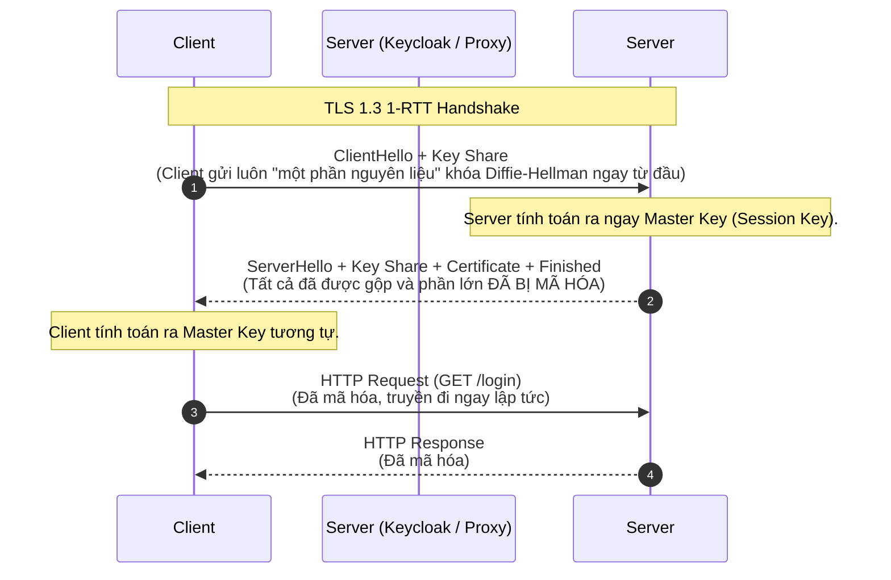

# Lesson 7: TLS (Transport Layer Security)

> [!NOTE]
> **Category:** Theory (Lý thuyết)
> **Goal:** Nghiên cứu kiến trúc chi tiết của giao thức mã hóa TLS hiện đại. Nắm vững cấu trúc của Cipher Suite và khái niệm "Perfect Forward Secrecy", những yếu tố cấu thành nên một kết nối HTTPS chuẩn doanh nghiệp.

## 1. Lý thuyết chuyên sâu (Detailed Theory)

### 1.1. TLS là gì?
**TLS (Transport Layer Security)** là giao thức mật mã thế hệ mới, được IETF (Internet Engineering Task Force) thiết kế để thay thế hoàn toàn giao thức SSL lỗi thời. Nhiệm vụ duy nhất của TLS là thiết lập một kênh truyền tải an toàn (đảm bảo tính Bảo mật, Toàn vẹn, và Xác thực) trên nền tảng của một môi trường mạng không đáng tin cậy.

- **Phiên bản:** Các phiên bản TLS 1.0 và 1.1 đã chính thức bị cấm (deprecated). Hiện tại, chuẩn công nghiệp tối thiểu là **TLS 1.2**, trong khi **TLS 1.3** là tiêu chuẩn kỹ thuật số hiện đại nhất mang tính cách mạng về cả tốc độ lẫn bảo mật.

### 1.2. Giải phẫu một Cipher Suite (Bộ mã hóa)
Trong quá trình `TLS Handshake`, Client và Server phải đàm phán để thống nhất sử dụng một bộ thuật toán mã hóa, gọi là **Cipher Suite**. Một Cipher Suite ở TLS 1.2 luôn được cấu thành bởi 4 thành phần riêng biệt.

Ví dụ: `TLS_ECDHE_RSA_WITH_AES_256_GCM_SHA384`
Phân tách ý nghĩa:
1. **`TLS`**: Tiền tố chỉ định giao thức.
2. **`ECDHE` (Key Exchange):** Thuật toán Trao đổi khóa (Elliptic-Curve Diffie-Hellman Ephemeral). Dùng để Client và Server an toàn sinh ra khóa chung.
3. **`RSA` (Authentication):** Thuật toán Xác thực. Máy chủ dùng khóa RSA để ký và chứng minh danh tính của nó với Client.
4. **`AES_256_GCM` (Bulk Encryption):** Thuật toán Mã hóa đối xứng. Dùng khóa 256-bit AES chế độ GCM để mã hóa thần tốc toàn bộ HTTP Payload (dữ liệu thật).
5. **`SHA384` (Message Authentication Code - MAC):** Thuật toán Băm. Dùng để kiểm tra tính toàn vẹn (Integrity), đảm bảo không một bit dữ liệu nào bị thay đổi dọc đường.

---

## 2. Luồng nội bộ & Cơ chế cấp thấp (Internal Workflow & Low-level Mechanisms)

Bước nhảy vọt về công nghệ từ TLS 1.2 lên TLS 1.3 nằm ở việc cắt giảm số vòng đàm phán (Round-Trip Time - RTT) để tăng tốc độ kết nối và loại bỏ hoàn toàn các thuật toán mã hóa lỗi thời.

### Cuộc cách mạng TLS 1.3 (1-RTT Handshake)
Trong TLS 1.2, Client và Server phải tốn 2 lượt đi-về (2-RTT) mới hoàn tất bắt tay. TLS 1.3 đã gộp chúng lại chỉ còn 1 lượt (1-RTT), và thậm chí hỗ trợ 0-RTT cho các kết nối đã từng thiết lập.



**Sự khác biệt cốt lõi:** Ở TLS 1.3, ngay từ tin nhắn thứ hai (Server trả về), mọi thông tin nhạy cảm (như Certificate của máy chủ) đều **đã được mã hóa**. Kẻ nghe lén không thể phân tích được người dùng đang truy cập đích xác vào website nào thông qua việc soi Chứng chỉ số.

---

## 3. Thực hành tốt nhất & Bảo mật (Best Practices & Security)

> [!IMPORTANT]
> **Perfect Forward Secrecy (PFS - Bảo mật hoàn hảo về sau)**
> Trong quá khứ, nếu Server dùng khóa RSA để trao đổi khóa phiên, thì nếu ngày mai Hacker ăn cắp được Private Key (Khóa riêng) của Server, hắn có thể đem ra giải mã TOÀN BỘ các file log mạng bắt được từ 5 năm trước.
>
> **Giải pháp PFS:** Bắt buộc sử dụng các thuật toán trao đổi khóa có đuôi `E` (Ephemeral - Phù du) như `DHE` hoặc `ECDHE`. Với PFS, cứ mỗi luồng kết nối, một cặp khóa hoàn toàn mới và dùng một lần (Throwaway keys) được sinh ra. Ngay cả khi Hacker có được Private Key gốc của máy chủ, hắn cũng **bất lực** không thể giải mã các luồng dữ liệu cũ trong quá khứ. TLS 1.3 mặc định bắt buộc sử dụng PFS.

> [!WARNING]
> **Vô hiệu hóa toàn bộ Cipher yếu kém**
> Các thuật toán trao đổi khóa bằng `RSA` thuần túy, mã hóa bằng `RC4`, `3DES`, hay thuật toán băm `MD5`, `SHA1` đều đã bị phá giải hoàn toàn. Hệ thống IAM Enterprise phải cắt đứt hoàn toàn sự hỗ trợ cho các Client đời cổ (như IE8, Windows XP) bằng việc từ chối các Cipher này tại lớp Nginx.

---

## 4. Cấu hình minh họa thực tế (Configuration Examples)

Cấu hình Reverse Proxy Nginx ở cấp độ bảo mật cao nhất (Modern Profile của Mozilla), chỉ hỗ trợ TLS 1.3 và TLS 1.2 với các Cipher hỗ trợ PFS mạnh nhất:

```nginx
server {
    listen 443 ssl http2;
    server_name sso.enterprise.com;

    ssl_certificate /path/to/cert.pem;
    ssl_certificate_key /path/to/private.key;

    # Cấm tuyệt đối TLS 1.0 và TLS 1.1
    ssl_protocols TLSv1.2 TLSv1.3;

    # Cấu hình danh sách Cipher ưu tiên (chỉ chứa ECDHE cho PFS và GCM/CHACHA20)
    ssl_ciphers 'ECDHE-ECDSA-AES128-GCM-SHA256:ECDHE-RSA-AES128-GCM-SHA256:ECDHE-ECDSA-AES256-GCM-SHA384:ECDHE-RSA-AES256-GCM-SHA384:ECDHE-ECDSA-CHACHA20-POLY1305:ECDHE-RSA-CHACHA20-POLY1305:DHE-RSA-AES128-GCM-SHA256:DHE-RSA-AES256-GCM-SHA384';
    ssl_prefer_server_ciphers on;

    # Tối ưu hóa bộ nhớ đệm Session (Tiết kiệm CPU cho TLS Handshake)
    ssl_session_cache shared:SSL:10m;
    ssl_session_timeout 1d;
    ssl_session_tickets off;
}
```

---

## 5. Trường hợp ngoại lệ (Edge Cases)

- **0-RTT và Replay Attack:** TLS 1.3 cung cấp tính năng `0-RTT` (Zero Round-Trip Time) cho phép Client từng kết nối mạng trước đó gửi ngay dữ liệu HTTP Payload cùng lúc với gói tin `ClientHello`. Tuy nhiên, gói dữ liệu đầu tiên này dễ bị Hacker chép lại và gửi lên máy chủ nhiều lần (Replay Attack). Do đó, chỉ nên bật tính năng 0-RTT cho các Request an toàn (Idempotent) như `GET`, tuyệt đối không dùng 0-RTT cho các luồng xử lý giao dịch hoặc thay đổi trạng thái (POST/PUT).
- **Hệ thống Legacy (Cổ) không kết nối được:** Nếu ứng dụng của bạn phải phục vụ các hệ thống tích hợp chạy trên Java 7 hoặc thiết bị di động iOS 9, các Client này không hiểu chuẩn TLS 1.2+ hoặc không hỗ trợ các thuật toán `ECDHE`. Khi bạn cấu hình Nginx sang mức "Modern", toàn bộ các hệ thống này sẽ rớt kết nối với lỗi `handshake_failure`. 

---

## 6. Câu hỏi Phỏng vấn (Interview Questions)

**1. Giải thích khái niệm "Perfect Forward Secrecy" (PFS) trong cấu hình HTTPS?**
- **Junior:** Nó bảo vệ máy chủ nếu lỡ máy chủ bị lộ khóa bí mật thì dữ liệu không bị đọc trộm.
- **Senior:** PFS là một tính năng mật mã học đảm bảo rằng một khóa riêng (Private Key) dài hạn bị thỏa hiệp (compromised) trong tương lai sẽ không dẫn đến việc lộ lọt các khóa phiên (Session Keys) đã được thiết lập trong quá khứ. Để đạt được PFS, cấu hình TLS phải vô hiệu hóa kiểu trao đổi khóa RSA truyền thống và bắt buộc sử dụng cơ chế trao đổi khóa Phù du (Ephemeral) như Diffie-Hellman (DHE hoặc ECDHE). Mỗi phiên kết nối sinh ra một khóa riêng biệt và hủy ngay sau đó.

**2. Nếu tôi phân tích gói tin mạng (Wireshark) ở giao thức TLS 1.2, làm sao tôi biết người dùng đang kết nối vào tên miền (Domain) nào trong khi dữ liệu đã được mã hóa?**
- **Junior:** Bằng cách nhìn vào địa chỉ IP đích của gói tin.
- **Senior:** IP đích không giải quyết được vấn đề vì một IP (Load Balancer) có thể host hàng trăm Domain. Trong TLS 1.2 (và cả 1.3), quá trình khởi tạo `TLS Handshake` gửi gói tin `ClientHello` luôn chứa phần mở rộng `SNI (Server Name Indication)`. Gói tin `ClientHello` này hoàn toàn là văn bản thuần túy (Plaintext). Bất kỳ hệ thống DPI (Deep Packet Inspection) hay Firewall nào cũng có thể đọc phần mở rộng SNI này để biết chính xác người dùng đang hướng tới Domain nào (`auth.enterprise.com`). Mới đây chuẩn `ESNI/ECH` ra đời để mã hóa cả SNI, nhưng chưa phổ biến.

**3. Tại sao TLS 1.3 lại nhanh hơn TLS 1.2 một cách đáng kể?**
- **Junior:** Vì TLS 1.3 dùng thuật toán xịn hơn và mã hóa nhanh hơn.
- **Senior:** Vấn đề tốc độ không nằm ở thuật toán mã hóa, mà nằm ở độ trễ vật lý (Network Latency). TLS 1.2 yêu cầu 2 chu kỳ vòng quay (2-RTT) giữa Client và Server chỉ để đàm phán khóa, sau đó mới gửi dữ liệu. TLS 1.3 tái cấu trúc luồng Handshake, Client "đoán" cấu hình phổ biến và gửi ngay nguyên liệu tạo khóa trong gói `ClientHello` đầu tiên. Điều này nén quá trình bắt tay xuống chỉ còn 1-RTT, tiết kiệm được hàng trăm mili-giây (ms) độ trễ, cực kỳ ý nghĩa cho các mạng di động chậm.

**4. Trong chuỗi cấu hình thuật toán `ECDHE-RSA-AES256-GCM-SHA384`, từng thành phần có ý nghĩa gì?**
- **Junior:** Nó là tên của giao thức mã hóa mạnh của HTTPS.
- **Senior:** Đây là cấu trúc của một Cipher Suite. `ECDHE` (Trao đổi khóa bằng đường cong Elliptic phù du) chịu trách nhiệm sinh khóa chung an toàn (hỗ trợ PFS). `RSA` là thuật toán dùng Khóa Công Khai (nằm trong Chứng chỉ X.509) để xác thực danh tính máy chủ. `AES256` là thuật toán mã hóa đối xứng (khóa 256-bit) dùng để mã hóa Payload thật. `GCM` là chế độ hoạt động mã hóa (Galois/Counter Mode) có tích hợp sẵn tính năng xác thực nguyên bản (AEAD). Cuối cùng, `SHA384` thường được dùng làm thuật toán băm cơ sở cho quá trình Phái sinh khóa (Key Derivation Function - PRF).

**5. Lỗi rò rỉ mã hóa (Cryptographic Downgrade Attack) là gì và làm sao để phòng tránh?**
- **Junior:** Hacker lừa máy chủ xài chuẩn cũ bị lỗi để hack. Ta tắt chuẩn cũ đi.
- **Senior:** Downgrade Attack xảy ra khi kẻ tấn công can thiệp vào quá trình Handshake (vốn gửi bằng bản rõ), ép Client và Server tưởng rằng đối phương không hỗ trợ các giao thức mạnh (TLS 1.2), dẫn đến việc cả hai thỏa hiệp lùi về dùng giao thức yếu chứa lỗ hổng (như SSLv3). Để phòng tránh, hệ thống (Reverse Proxy) phải được cấu hình vô hiệu hóa hoàn toàn mọi Cipher Suite và phiên bản TLS đã lỗi thời, không cho phép quyền "thỏa hiệp lùi".

---

## 7. Tài liệu tham khảo (References)
- **RFC 8446:** The Transport Layer Security (TLS) Protocol Version 1.3. (https://datatracker.ietf.org/doc/html/rfc8446)
- **RFC 5246:** The Transport Layer Security (TLS) Protocol Version 1.2. (https://datatracker.ietf.org/doc/html/rfc5246)
- **Mozilla:** Mozilla SSL Configuration Generator. (https://ssl-config.mozilla.org/)
