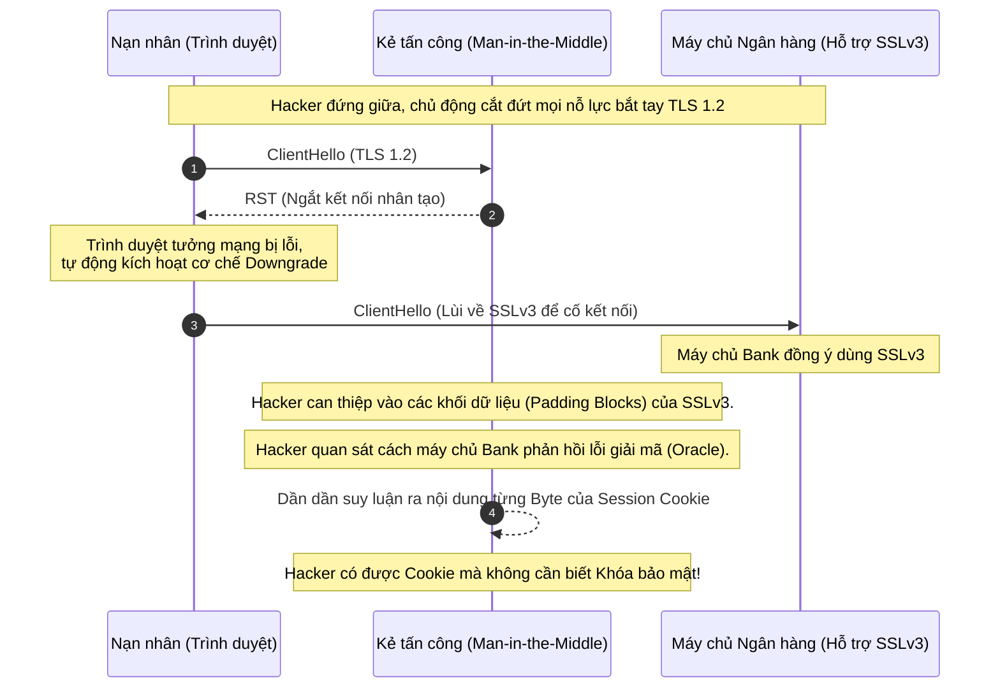

# Lesson 8: SSL (Secure Sockets Layer)

> [!NOTE]
> **Category:** Theory (Lý thuyết)
> **Goal:** Nhìn lại lịch sử và thiết kế kiến trúc của SSL. Phân tích nguyên nhân cốt lõi tại sao công nghệ bảo mật từng phổ biến nhất thế giới này lại bị khai tử hoàn toàn trong môi trường mạng doanh nghiệp hiện đại.

## 1. Lý thuyết chuyên sâu (Detailed Theory)

### 1.1. Lịch sử của SSL
**SSL (Secure Sockets Layer)** là thế hệ đầu tiên của công nghệ mã hóa web, được phát triển bởi tập đoàn Netscape vào giữa thập niên 1990, thời kỳ thương mại điện tử bắt đầu bùng nổ.

- **SSL 1.0:** Không bao giờ được phát hành công khai do chứa các lỗ hổng bảo mật quá nghiêm trọng ngay từ trên bản nháp.
- **SSL 2.0 (1995):** Bản phát hành công khai đầu tiên. Tồn tại nhiều khiếm khuyết trong cách thiết kế thuật toán mã hóa (VD: sử dụng chung một khóa cho cả mã hóa và xác thực). Đã bị cấm hoàn toàn.
- **SSL 3.0 (1996):** Một phiên bản làm lại hoàn toàn, trở thành chuẩn mực bảo mật toàn cầu trong suốt gần một thập kỷ. Đây chính là gốc rễ để IETF phát triển lên giao thức `TLS 1.0` sau này. Tuy nhiên, SSL 3.0 cuối cùng cũng gục ngã trước sự tiến hóa của sức mạnh điện toán và các kỹ thuật tấn công mã hóa học tinh vi.

### 1.2. Vấn đề cốt lõi của SSL
Nguyên nhân gốc rễ dẫn đến sự sụp đổ của SSL không nằm ở độ dài của khóa (Key size), mà nằm ở **thiết kế cấu trúc thuật toán**.
- **Cơ chế MAC-then-Encrypt:** SSL 3.0 sử dụng quy trình: Sinh ra mã xác thực (MAC), đính kèm vào cuối bản rõ (Plaintext), sau đó mã hóa (Encrypt) cả cụm đó lại. Quy trình này sau đó đã được giới toán học chứng minh là ẩn chứa lỗ hổng vật lý logic, tạo tiền đề cho hàng loạt cuộc tấn công trích xuất dữ liệu mà không cần giải mã.

---

## 2. Luồng nội bộ & Cơ chế cấp thấp (Internal Workflow & Low-level Mechanisms)

Sự sụp đổ của SSL 3.0 được đánh dấu bằng sự kiện công bố lỗ hổng **POODLE** (Padding Oracle On Downgraded Legacy Encryption) vào năm 2014.



---

## 3. Thực hành tốt nhất & Bảo mật (Best Practices & Security)

> [!CAUTION]
> **Khủng hoảng Kỹ thuật: Tuyệt đối KHÔNG LƯU LUYẾN SSLv3**
> SSLv3 không còn được coi là "mã hóa an toàn". Một hệ thống (Reverse Proxy, Load Balancer) vẫn còn mở cửa hỗ trợ SSLv3 để tương thích với các trình duyệt quá cũ (như IE6) đồng nghĩa với việc toàn bộ luồng lưu lượng của người dùng hiện đại cũng có thể bị Hacker dùng kỹ thuật `Downgrade Attack` kéo lùi về SSLv3 và xâm nhập. Việc vô hiệu hóa hoàn toàn SSL (v2, v3) là một tiêu chí cấu hình BẮT BUỘC mang tính tuân thủ pháp lý (Compliance - VD: PCI-DSS).

> [!TIP]
> **Thuật ngữ phân định**
> Mặc dù chuẩn giao thức SSL đã chết, nhưng trong văn hóa giao tiếp kỹ thuật công nghiệp, người ta vẫn quen gọi là "Chứng chỉ SSL" (SSL Certificates), "Offloading SSL", "Cổng SSL". Hãy hiểu rằng, về mặt bản chất kỹ thuật đang triển khai, tất cả những từ đó đều ám chỉ công nghệ **TLS**.

---

## 4. Cấu hình minh họa thực tế (Configuration Examples)

Ví dụ cấu hình trên máy chủ Nginx để dập tắt hoàn toàn giao thức SSL và các cơ chế tương thích ngược gây rủi ro:

```nginx
server {
    listen 443 ssl http2;
    server_name portal.enterprise.com;

    # CẤM TUYỆT ĐỐI các chuẩn SSL cổ xưa
    # Cấm luôn TLS 1.0 và TLS 1.1 (vừa bị loại khỏi chuẩn PCI-DSS)
    ssl_protocols TLSv1.2 TLSv1.3;

    # Ngăn chặn trình tự hạ cấp mã hóa (Downgrade) do Client ép buộc
    ssl_prefer_server_ciphers on;
    
    # Block hoàn toàn các Cipher cực yếu gắn liền với thời đại SSL (như RC4, 3DES)
    ssl_ciphers 'HIGH:!aNULL:!MD5:!RC4:!3DES:!SSLv3';

    location / {
        proxy_pass http://backend;
    }
}
```

---

## 5. Trường hợp ngoại lệ (Edge Cases)

- **Tích hợp với phần cứng Legacy:** Tại một số nhà máy công nghiệp hoặc ngân hàng lõi (Core Banking), có những hệ thống phần cứng/Mainframe thế hệ cũ (được lập trình từ 20 năm trước) chỉ hỗ trợ giao tiếp qua chuẩn SSLv3 và không thể nâng cấp phần mềm. 
  - **Khắc phục:** Không được phép hạ cấp cấu hình hệ thống IAM (Keycloak) hiện tại xuống SSLv3. Thay vào đó, kiến trúc sư phải đặt một `Internal Reverse Proxy` cục bộ, hoàn toàn cô lập trong mạng ảo sâu nhất (VLAN riêng biệt). Proxy nhỏ này làm nhiệm vụ "phiên dịch": Nó nhận SSLv3 từ máy chủ cổ, giải mã cục bộ, và thiết lập lại một luồng TLS 1.3 cực mạnh mới để truyền lên Keycloak. Toàn bộ lưu lượng rủi ro bị đóng gói trong khu vực nội bộ cấm xuất mạng.

---

## 6. Câu hỏi Phỏng vấn (Interview Questions)

**1. Sự khác biệt giữa giao thức SSL và TLS là gì? Hệ thống của bạn đang cài đặt loại "Chứng chỉ" nào?**
- **Junior:** TLS là bản nâng cấp của SSL. Hệ thống đang xài Chứng chỉ SSL nhưng chạy trên nền giao thức TLS.
- **Senior:** SSL (Secure Sockets Layer) là giao thức do Netscape thiết kế và đã bị IETF khai tử hoàn toàn từ 2015 do các sai sót cốt lõi trong quy trình mã hóa. TLS (Transport Layer Security) là chuẩn kế nhiệm do IETF xây dựng. Thực chất, Chứng chỉ X.509 (thường gọi nhầm là "Chứng chỉ SSL") không hề bị bó buộc vào giao thức; nó chỉ là một vùng nhớ chứa Khóa Công Khai (Public Key) và Chữ ký của CA. Do đó, chứng chỉ đó hoàn toàn tương thích và phục vụ bình thường cho các luồng đàm phán của giao thức TLS 1.2 hay 1.3.

**2. Lỗ hổng POODLE hoạt động dựa trên cơ chế nào và tại sao nó lại là "cáo chung" của SSL 3.0?**
- **Junior:** Lỗ hổng này làm Hacker có thể giải mã gói tin nếu hệ thống rớt xuống xài SSLv3.
- **Senior:** POODLE (Padding Oracle On Downgraded Legacy Encryption) là đòn chí mạng. Đầu tiên, hacker can thiệp ngắt kết nối mạng để lừa trình duyệt hạ cấp từ TLS xuống SSLv3. SSLv3 sử dụng cơ chế bảo toàn toàn vẹn `MAC-then-Encrypt` và xử lý các khối mã hóa phụ (Padding) cực kỳ lỏng lẻo. Hacker liên tục thay đổi nội dung của khối Padding bị mã hóa và gửi lên Server. Dựa vào cách Server phản hồi (lỗi MAC hay lỗi Padding - gọi là Oracle), hacker có thể dùng thuật toán suy luận từng byte một (byte-by-byte) nội dung của Session Cookie mà không tốn một chút công sức nào để bẻ khóa hệ thống mã hóa AES/DES. Cấu trúc lỏng lẻo này là lỗi ở cấp độ giao thức nền tảng, không thể vá bằng code, buộc phải vứt bỏ giao thức.

**3. Tại sao trong môi trường Enterprise, người ta lại đưa cờ `!RC4` và `!3DES` vào Blacklist của Nginx SSL Ciphers?**
- **Junior:** Vì chúng là các thuật toán mã hóa quá cũ và dễ bị hack.
- **Senior:** RC4 là thuật toán mã hóa dòng (Stream Cipher) từng được sử dụng để chống lại lỗ hổng BEAST trên TLS 1.0, nhưng sau đó toán học đã phát hiện RC4 sinh ra các byte giả ngẫu nhiên có độ sai lệch (Biased), giúp hacker phá mã nếu có đủ lượng bản rõ. 3DES là thuật toán mã hóa khối chậm chạp, dễ tổn thương trước các cuộc tấn công nhắm vào độ phân giải khối 64-bit nhỏ hẹp (như Sweet32). Việc cấm tiệt 2 thuật toán này đảm bảo Server không bao giờ đàm phán ra một Cipher Suite dễ vỡ, ép chuẩn kết nối lên mức GCM (Galois/Counter Mode) như AES-GCM của chuẩn hiện đại.

**4. Kỹ thuật `Downgrade Attack` (Tấn công hạ cấp) đe dọa hệ thống bảo mật như thế nào?**
- **Junior:** Hacker lừa máy tính dùng mã hóa yếu hơn để dễ lấy cắp mật khẩu.
- **Senior:** Kỹ thuật hạ cấp lợi dụng giai đoạn Hello ban đầu của luồng Bắt tay (Handshake) do gói tin đi ở trạng thái bản rõ không được xác thực. Kẻ tấn công đứng giữa sẽ chủ ý chặn đứng hoặc sửa đổi các gói tin đàm phán có cờ báo hiệu hỗ trợ giao thức hiện đại (TLS 1.2/1.3). Khi Server và Client không thấy sự hỗ trợ từ đối phương, chúng sẽ lùi dần mức độ mã hóa xuống mức thấp nhất mà hệ thống cấu hình (fallback) - thường là SSLv3. Khi hệ thống tụt xuống chuẩn yếu, hacker sẽ triển khai các exploit tương ứng (như POODLE). Cấu hình cứng `ssl_protocols TLSv1.2 TLSv1.3` cắt rễ hoàn toàn chiến thuật này.

**5. Giải thích kiến trúc `Defense in Depth` (Phòng thủ chiều sâu) khi triển khai giao tiếp bảo mật cho luồng Authentication?**
- **Junior:** Là cài đặt nhiều lớp bảo vệ như SSL, Tường lửa để chống hack.
- **Senior:** Phòng thủ chiều sâu không dựa dẫm vào một kỹ thuật duy nhất. Trong xác thực, luồng HTTPS/TLS cung cấp lớp vỏ bọc đầu tiên (Mã hóa Network). Nhưng nếu TLS bị giải mã (ví dụ do chứng chỉ Root lạ ở máy công ty), hệ thống áp dụng tiếp lớp bảo vệ thứ hai: Dữ liệu Payload xác thực phải được băm hoặc ký điện tử nội bộ (JWE/JWS). Lớp thứ ba: Cookie bắt buộc gắn cờ `Secure`, `HttpOnly` chống rò rỉ nếu bị tiêm mã độc XSS. Lớp thứ tư: `SameSite` chống lại các lệnh gọi giả mạo ngoài luồng (CSRF). Bất kỳ lớp nào bị xuyên thủng, các lớp bên trong vẫn đứng vững.

---

## 7. Tài liệu tham khảo (References)
- **RFC 7568:** Deprecating Secure Sockets Layer Version 3.0. (https://datatracker.ietf.org/doc/html/rfc7568)
- **OWASP:** Transport Layer Protection Cheat Sheet.
- **NIST:** SP 800-52 Rev. 2 - Guidelines for the Selection, Configuration, and Use of Transport Layer Security (TLS) Implementations.
