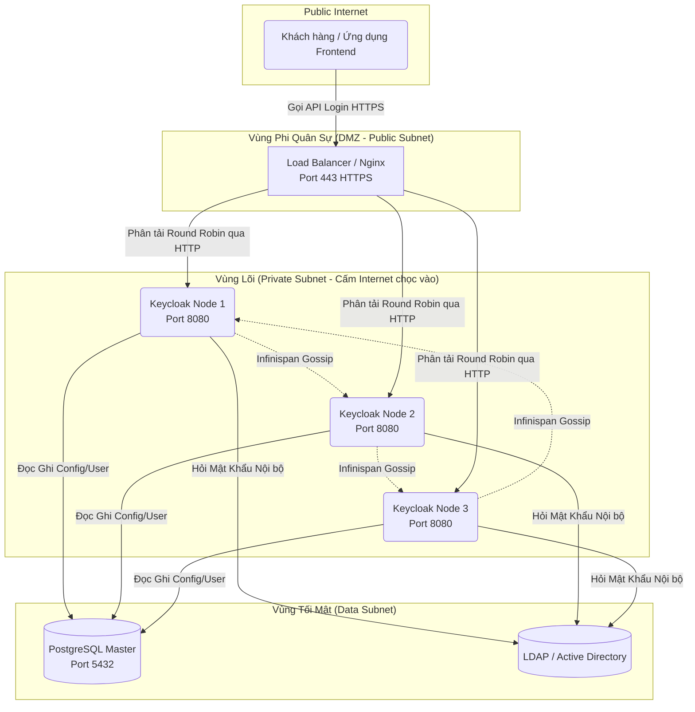

# Lesson 7: Toàn cảnh Kiến trúc (Architecture Overview)

> [!NOTE]
> **Category:** Theory & Architecture (Lý thuyết & Kiến trúc)
> **Goal:** Có được cái nhìn Chim bay (Bird's-eye view) về các Khối linh kiện (Components) cấu thành nên Cỗ máy Keycloak trước khi chính thức đưa tay vào bàn phím Cấu hình (Hands-on).

## 1. Lý thuyết chuyên sâu (Detailed Theory)

Keycloak không phải là một chương trình File `.exe` đơn giản. Nó là một Hệ Sinh Thái thu nhỏ. Một Cụm (Cluster) Keycloak hoàn chỉnh để đưa lên Production bao gồm 4 Tầng Sinh tử:

1. **Tầng Chặn Đứng (Reverse Proxy / Load Balancer):** Nginx, HAProxy, AWS ALB. Nơi hứng chịu đòn DDoS, Nơi kết thúc chứng chỉ SSL (TLS Termination).
2. **Tầng Lõi Thực Thi (Keycloak Server - Quarkus Node):** Não bộ. Nơi chạy các hàm Băm mật khẩu (BCrypt), Nơi tạo ra Chữ ký JWS (RSA), Nơi nói chuyện với Google/Facebook.
3. **Tầng Trạng Thái Bộ Nhớ (Distributed Cache - Infinispan):** Bộ nhớ RAM Tốc độ Siêu Tưởng (In-memory). Nơi lưu trữ trạng thái "Đang Đăng Nhập" (Session) của 1 Triệu Users. Tầng này giúp nhiều Node Keycloak có thể "Đồng cảm" (Sync) với nhau.
4. **Tầng Lưu Trữ Vĩnh Cửu (Relational Database):** PostgreSQL / MySQL. Kho chứa Vàng. Nơi lưu Mật khẩu, Tên tuổi, Chức vụ. (Tuyệt đối Cấm MongoDB, Keycloak chỉ yêu RDBMS).

---

## 2. Luồng nội bộ & Cơ chế cấp thấp (Internal Workflow & Low-level Mechanisms)

Bản vẽ Kiến Trúc Tiêu Chuẩn (Standard Enterprise Architecture) của 1 Cụm Keycloak High Availability (HA):

---

## 3. Thực hành tốt nhất & Bảo mật (Best Practices & Security)

> [!IMPORTANT]
> **Nghệ thuật Hủy diệt SSL (TLS Termination)**
> Nhiều Junior ráng sức gắn chứng chỉ SSL (File .pem, .key) trực tiếp vào máy chủ Keycloak (Làm Keycloak chạy cổng 8443).
> **Thực hành chuẩn:** Tuyệt đối KHÔNG BẮT KEYCLOAK GIẢI MÃ SSL. Việc giải mã thuật toán AES của giao thức HTTPS cực kỳ tốn CPU. Hãy quăng nhiệm vụ "Nặng nhọc dơ bẩn" đó cho Nginx (Load Balancer). 
> User gọi HTTPS đập vào Nginx. Nginx giải mã SSL thành bản rõ, rồi truyền gói tin đó Bằng Giao Thức HTTP Trần (Port 8080) đi trong Mạng Nội Bộ (VPC) kín tới Keycloak. Keycloak lúc này Dành 100% sức mạnh CPU để chạy Mật Mã Học Sinh Token. (Kiến trúc Edge Termination).

> [!CAUTION]
> **Hố Đen Database In-Memory (H2)**
> Khi bạn tải Keycloak về và chạy lệnh gõ `start-dev`. Keycloak sẽ khởi động Siêu Tốc. Bạn tạo User, tạo App chạy ngon ơ. Nhưng Ngày hôm sau bạn Restart máy tính. TOÀN BỘ USER BỐC HƠI SẠCH SẼ.
> Lý do: Chế độ `dev` mặc định xài **H2 Database (Lưu CSDL vào RAM)**. Tắt máy là Mất trí nhớ. 
> Bắt buộc phải gắn CSDL PostgreSQL (Hoặc MySQL/MariaDB) ngay từ Ngày số 1 (Day-1) kể cả lúc Dev để tránh bất ngờ.

---

## 4. Cấu hình minh họa thực tế (Configuration Examples)

Làm sao để Load Balancer (Nginx) biết Node Keycloak nào đang SỐNG hay CHẾT để chia tải?
Keycloak sinh ra 2 Endpoint bí mật dùng cho Cơ chế "Health Check" (Thăm khám sức khỏe) trên Kubernetes:

- **Kiểm tra Sống/Chết cơ bản (Liveness):** `http://<keycloak-ip>:9000/health/live`
  (Trả về 200 OK nếu Lõi Quarkus vẫn đang đập. K8s dựa vào đây để không giết Pod).
- **Kiểm tra Khả năng Nhận Khách (Readiness):** `http://<keycloak-ip>:9000/health/ready`
  (Trả về 200 OK CHỈ KHI kết nối tới Database Postgres THÀNH CÔNG và Infinispan Sync Xong. K8s dựa vào đây để Bắt đầu bơm Traffic Khách Hàng vào Pod).

*(Lưu ý: Các cổng Metrics Health/Ready này chạy ở cổng 9000 Độc Lập hoàn toàn với Cổng Login 8080. Tuyệt đối không phơi cổng 9000 ra ngoài Public Internet).*

---

## 5. Trường hợp ngoại lệ (Edge Cases)

- **Chia rẽ Não bộ (Split-Brain) trong Cluster:**
  Nếu bạn chạy 3 Node Keycloak ở 3 Datacenter khác nhau (VN, Mỹ, Nhật). Mạng bị đứt cáp quang biển. Node VN không nhìn thấy Node Mỹ. 
  Lúc này, Mạng Cache Infinispan bị đứt làm đôi. Node VN tưởng Node Mỹ đã chết, Node Mỹ tưởng Node VN đã chết. Chúng tự bầu mình làm Lãnh đạo (Master) và tự hoạt động Độc lập (Chia rẽ não bộ).
  Hậu quả: 1 User đăng nhập ở VN được cấp Session. Nhưng 1 phút sau bị đẩy sang Node Mỹ, Node Mỹ không có Data đó, chửi User chưa Đăng nhập. Trải nghiệm tồi tệ.
  - **Khắc phục:** Kiến trúc Cluster Bắt buộc phải triển khai ở khoảng cách vật lý GẦN (LAN - Ping < 5ms). Không bao giờ Build 1 Cụm Cluster Keycloak trải dài qua nhiều Châu Lục (Multi-region WAN). Xuyên Châu lục phải dùng tính năng XDC (Cross-Datacenter Replication).

---

## 6. Câu hỏi Phỏng vấn (Interview Questions)

**1. Trong cấu trúc Thư mục của Keycloak (Quarkus), thư mục `providers/` dùng để làm gì? Nêu một ví dụ nếu tôi xóa trắng thư mục đó?**
- **Junior:** Nó chứa các code lõi của hệ thống. Xóa thì lỗi.
- **Senior:** Thư mục `providers/` là nơi Nạp Các Gói Tùy Chỉnh (Custom SPIs - File `.jar`).
Ví dụ: Keycloak mặc định KHÔNG BIẾT CÁCH Gửi tin nhắn Zalo/SMS. Công ty bạn viết 1 đoạn code Java giao tiếp Zalo API, build ra file `zalo-otp.jar`. Bạn vứt cái file `.jar` đó vào thư mục `providers/`. Khi Build lại, Keycloak sẽ "Hút" cái file đó vào Lõi và Bùm: Màn hình Login xuất hiện nút Gửi Zalo.
Nếu bạn xóa thư mục này đi, Keycloak VẪN CHẠY BÌNH THƯỜNG. Nhưng nó sẽ mất hết các tính năng Lai tạo (Custom) mà công ty bạn tự trồng.

**2. Nếu tôi có 1.000.000 (1 Triệu) Users. Tôi phải mua RAM bao nhiêu cho Máy chủ Keycloak để nó Load hết Database User lên?**
- **Junior:** Tầm 16GB RAM là đủ load rồi.
- **Senior:** Keycloak **KHÔNG LƯU USER TRONG RAM**.
Keycloak áp dụng chiến lược Tra cứu RDBMS (Lazy Loading). Khi 1 Triệu Users nằm yên trong Database PostgreSQL, Keycloak hoàn toàn thờ ơ, không tốn 1 byte RAM nào.
Chỉ khi nào Thằng User A BẤM ĐĂNG NHẬP. Keycloak mới lôi User A ra khỏi DB, nhét vào Infinispan Cache (Tốn vài Kilobytes). Do đó, RAM của Keycloak được đo lường bằng SỐ LƯỢNG SESSIONS (Số người ĐANG ĐĂNG NHẬP CÙNG LÚC - Concurrent Sessions) chứ không phải đo bằng Tổng số User có trong DB. Cấu trúc này giúp Keycloak cực kỳ tiết kiệm bộ nhớ.

**3. Tại sao Keycloak cương quyết không hỗ trợ MongoDB hay NoSQL làm cơ sở dữ liệu chính?**
- **Junior:** Vì nó code bằng Java nên xài SQL quen rồi.
- **Senior:** Vấn đề nằm ở **Giao dịch Toàn vẹn (ACID Transactions)**.
Hệ thống Quản trị Định danh đòi hỏi Ràng buộc Dữ liệu Sinh Tử. Ví dụ: Nếu Bạn Xóa User A, thì toàn bộ Danh sách Vai trò (Roles), Bảng Quyền hạn (Permissions), Lịch sử Session CỦA USER A ĐÓ phải XÓA ĐỒNG LOẠT TRONG 1 MILI GIÂY (Cascade Delete/Rollback).
NoSQL (Document-based) sinh ra để đọc ghi siêu tốc, nhưng nó Thất Bại (Hoặc làm rất dở) tính năng Giao dịch ACID Liên Bảng (Cross-table transactions). Việc dữ liệu bị mồ côi (Bảng Role thì báo User A là Admin, nhưng Bảng User thì báo User A bị xóa rồi) là sự Sỉ Nhục Mật Mã Học. Do đó, RDBMS (PostgreSQL) là Chân Ái Vĩnh Cửu của Keycloak.

**4. Khi đặt Nginx đứng trước Keycloak. Nginx gửi lệnh tới Keycloak nhưng Keycloak lại lấy nhầm địa chỉ IP của cái Máy Nginx (192.168.1.1) lưu vào Log bảo mật thay vì lưu IP thật của Kẻ Tấn Công (203.x.x.x). Lỗi ở đâu?**
- **Junior:** Chắc bị che dấu IP.
- **Senior:** Đây là hiện tượng Mất IP gốc qua Proxy.
Vì Nginx là Đứa Đứng Giữa, gói tin đi tới Keycloak mang IP nguồn của Nginx.
**Khắc phục ở 2 phía:**
- Nginx: Bắt buộc cấu hình Header `X-Forwarded-For: $proxy_add_x_forwarded_for;` (Nhét IP của thằng Hacker vào cái phong bì X-Forwarded).
- Keycloak: Bắt buộc chạy lệnh cấu hình: `kc.sh start --proxy=edge` (hoặc `reencrypt/passthrough`). Lệnh này mở Mắt cho Keycloak: "Đừng nhìn vào cái IP Vật lý nữa, hãy Mở cái Phong bì X-Forwarded ra mà đọc". Nếu quên cấu hình này, thuật toán Chặn Brute-force của Keycloak sẽ Chặn Nhầm Cmn luôn cái máy chủ Nginx, đánh sập toàn bộ hệ thống.

---

## 7. Tài liệu tham khảo (References)
- **Keycloak Documentation:** High Availability and Cluster Setup.
- **Infinispan:** Distributed In-Memory Key/Value Data Store.
