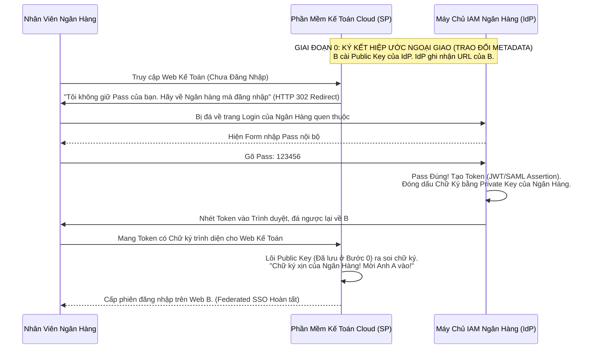

# Lesson 4: Liên minh Danh tính (Identity Federation)

> [!NOTE]
> **Category:** Theory (Lý thuyết)
> **Goal:** Khám phá nghệ thuật "Ngoại Giao" (Diplomacy) trong ngành IAM. Trả lời câu hỏi Trăm Tỷ Đô: Làm sao để Công ty A và Công ty B xài chung hệ thống đăng nhập của nhau mà TUYỆT ĐỐI KHÔNG COPY HAY CHIA SẺ Database Mật khẩu?

## 1. Lý thuyết chuyên sâu (Detailed Theory)

### 1.1. Bóng tối của Hệ thống Biệt lập (Siloed Identities)
Ngày xưa, mỗi công ty tự xây một bức tường thành. Bảng `Users` của Ngân hàng A chỉ sống trong Ngân hàng A.
Khi Ngân hàng A ký hợp đồng sử dụng Phần mềm Kế toán của Công ty B trên Cloud. Ngân hàng A bắt buộc phải Bấm nút XUẤT (Export) danh sách 5000 nhân viên, gửi File Excel đó sang Công ty B để B tạo tài khoản.
Hệ lụy:
1. Ngân hàng bị lộ thông tin Nhân sự cho Công ty B (Vi phạm bảo mật).
2. Khi nhân viên đổi Pass ở A, bên B không biết (Lỗi đồng bộ).
3. Nhân viên phải nhớ 2 cái Pass khác nhau (Gây ra hiện tượng Ghi Pass vào giấy dán lên Màn hình).

### 1.2. Ánh sáng của Liên hiệp (Identity Federation)
**Federation (Liên Minh / Liên Hiệp)** là một Hiệp Ước Niềm Tin (Circle of Trust) giữa các Tổ chức độc lập.
Trong Federation, Database KHÔNG BAO GIỜ DI CHUYỂN. 
Thay vào đó, Công ty B nói với Ngân hàng A: *"Tôi không cần biết nhân viên của anh tên gì, password là gì. Tôi chỉ cần Cài Đặt Chứng Chỉ Chữ Ký Số (Public Key) của anh. Mỗi khi nhân viên anh muốn vào phần mềm của tôi, tôi sẽ ĐÁ HỌ VỀ nhà anh. Anh tự xét hỏi Mật khẩu. Sau đó anh ĐÓNG DẤU CHỮ KÝ (SAML/JWT) xác nhận người này là thật, rồi quăng lại cho tôi. Thấy Dấu Của Anh, Tôi Mở Cửa."*

---

## 2. Luồng nội bộ & Cơ chế cấp thấp (Internal Workflow & Low-level Mechanisms)

Nguyên lý Cốt lõi thiết lập Niềm Tin Liên Hiệp (Trust Establishment):

---

## 3. Thực hành tốt nhất & Bảo mật (Best Practices & Security)

> [!IMPORTANT]
> **Federation Không phải là Copy Dữ Liệu (No Data Syncing)**
> Xin nhắc lại: Identity Federation HOÀN TOÀN TỪ CHỐI việc Giao dịch Dữ liệu ngầm (Database Replication). Mọi thông tin (Email, Tên, Quyền hạn) đều được nhét vào trong Cái Token và truyền đi một lần duy nhất tại Giờ phút Đăng nhập (Just-In-Time).
> Việc này giải quyết Bài toán Bảo mật Tuyệt đối: Tránh lộ Mật khẩu đã Băm (Hash) ra ngoài Vùng An Toàn của Doanh nghiệp.

> [!CAUTION]
> **Quyền Lực Mất Kiểm Soát (Revocation Issue)**
> Nếu Anh A đã vào được Web B (Có Session trên B). Nửa tiếng sau Anh A bị Giám Đốc Ngân Hàng Đuổi Việc. Giám đốc XÓA Tài khoản ở Máy chủ Ngân Hàng.
> Mặc dù Anh A không thể Login vào cái mới. NHƯNG, Web B (Bên Cloud) Hoàn Toàn Mù Tịt về việc này. Anh A vẫn có thể ngồi xài Web B cho đến khi Session ở B hết hạn.
> **Cách vá:** Hệ thống Federation xịn phải cấu hình **Single Logout (Đăng xuất diện rộng)**. Khi Admin bấm Xóa ở Ngân hàng, Ngân hàng lập tức Bắn 1 gói tin HTTP PUSH sang Web B, ép Web B đá đít Anh A ra ngoài ngay tắp lự.

---

## 4. Cấu hình minh họa thực tế (Configuration Examples)

Trong Keycloak, Việc Thiết lập một Liên Hiệp (Federation) dễ đến mức Đáng Kinh Ngạc:

Ví dụ: Bạn muốn Web của bạn (Chạy Keycloak) Liên hiệp với Mạng lưới Microsoft Azure AD của Đối tác.
1. Bạn sang Azure, Tải file `metadata.xml` (Bên trong chứa Public Key, URL Login của Microsoft).
2. Bạn về Keycloak -> Vào Menu `Identity Providers` -> Chọn `Add SAML 2.0`.
3. Bạn Import file `metadata.xml` đó vào. Cắm cờ `Save`.
4. BÙM! Keycloak của bạn và Azure đã lập xong Hiệp Ước Trust. Màn hình Login của bạn tự mọc ra nút "Login bằng Azure Đối Tác". Không cần biết Code Java/C# phức tạp ở dưới.

---

## 5. Trường hợp ngoại lệ (Edge Cases)

- **Liên Minh Vòng Tròn (Federation Hub & Spoke):**
  - Giả sử có 10 Bộ của Chính Phủ (Mỗi bộ có 1 Máy chủ IdP riêng). Có 50 cái Cổng Dịch Vụ Công (App SP riêng).
  - Nếu setup theo Mạng Lưới (Mesh), mỗi cái App phải tự thiết lập Niềm tin với 10 Bộ. Rối nung ninh.
  - **Kiến trúc Vượt Trội:** Đặt Keycloak ở CHÍNH GIỮA (Trở thành Hub Môi Giới - Brokering). 50 cái App CHỈ TIN TƯỞNG 1 mình Keycloak. Keycloak TIN TƯỞNG 10 cái Bộ. Khi App cần Login, nó đẩy cho Keycloak, Keycloak sẽ hiện ra cái Bảng Chọn: *"Bạn là nhân viên Bộ nào?"*, rồi Keycloak đá tiếp về Bộ đó. Kiến trúc Mạng nhện rườm rà biến thành Kiến trúc Hình Sao siêu tốc (Hub-and-Spoke).

---

## 6. Câu hỏi Phỏng vấn (Interview Questions)

**1. Trong Giao thức SAML/OIDC Federation, Khái niệm "Trust" (Niềm tin) thực chất về mặt Toán Học / Mật Mã Học là cái gì?**
- **Junior:** Là việc tụi nó tin tưởng nhau.
- **Senior:** "Trust" trong môi trường Digital 100% được định hình bằng **Hạ Tầng Khóa Công Khai (PKI - Asymmetric Cryptography)** và Cấu hình siêu dữ liệu (Metadata).
Tin tưởng nhau KHÔNG PHẢI là "Nhắn tin qua Zalo tao cho mày quyền". Tin tưởng nghĩa là: 
- Thằng SP đang giữ khư khư cái Khóa Công Khai (Public Key / Chứng chỉ X.509) của thằng IdP. 
- Chỉ những Gói tin (Token/Assertion) nào được Ký Bằng ĐÚNG cái Khóa Bí Mật (Private Key) tương ứng của thằng IdP mới qua được thuật toán giải mã RSA của thằng SP. Đó là Niềm Tin Toán Học. Nếu Khóa Bị Sai, Niềm Tin đổ vỡ ngay lập tức.

**2. Nếu tôi xài "Đăng nhập bằng Facebook" cho trang Web của tôi. Đó có phải là Identity Federation không?**
- **Junior:** Có, nó là Oauth đấy.
- **Senior:** CHÍNH XÁC. "Social Login" (Đăng nhập Google/Facebook) chính là hình thức Identity Federation Cổ Điển Nhất và Phổ Biến Nhất Thế Giới dành cho mô hình B2C (Khách hàng lẻ).
Trong đó, Facebook/Google đóng vai trò là Nhà cung cấp Danh tính (IdP), còn trang Web/App của bạn đóng vai trò là Kẻ Xài Chùa Danh Tính (Service Provider). Luồng chạy hoàn toàn tuân thủ theo nguyên tắc: Web bạn không giữ Pass của User, mà bắt User sang nhà Facebook nhập Pass.

**3. Khái niệm "Home Realm Discovery" (HRD) sinh ra để giải quyết nỗi đau gì trong Federation?**
- **Junior:** Không biết khái niệm này.
- **Senior:** Nó giải quyết Bài toán **"Đứng giữa ngã tư đường"**.
Giả sử Hệ thống Tòa Nhà Vincom (Service Provider) liên hiệp với 10 Công ty Thuê văn phòng (Mỗi công ty có 1 Server IdP riêng).
Nhân viên A vào Web Vincom để đăng nhập. Lúc này Vincom BỊ LÚ: "Tôi không biết phải CÚ ĐÁ (Redirect) ông A về cái Server IdP của Công ty nào trong 10 công ty kia?".
**HRD (Phát hiện Quê hương)** là thuật toán giải quyết: 
- Cách 1: Hiện cái Bảng xổ xuống (Dropdown) cho User tự chọn: "Bạn ở công ty nào?". (Hơi phèn).
- Cách 2 (Pro): User gõ mỗi cái Email: `a@fpt.com.vn`. Hệ thống HRD tóm lấy đuôi Domain `@fpt.com.vn`, tự map vào Database và lập tức Đá User về đúng Server IdP của FPT mà không cần hỏi thêm.

---

## 7. Tài liệu tham khảo (References)
- **OASIS:** Security Assertion Markup Language (SAML) V2.0.
- **OpenID Foundation:** OpenID Connect Core.
