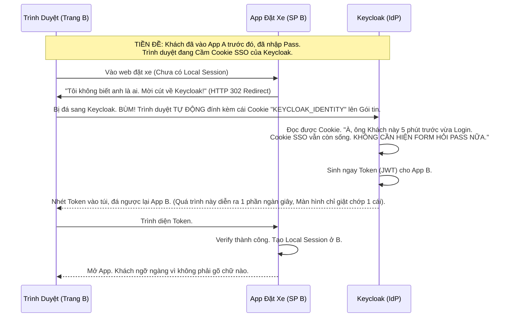

# Lesson 7: Đăng nhập Đơn phương (Single Sign-On - SSO)

> [!NOTE]
> **Category:** Theory (Lý thuyết)
> **Goal:** Giải mã Ma thuật thực sự của Single Sign-On (SSO). Tại sao bạn đăng nhập Gmail xong, mở Youtube ra không cần gõ Pass lại? Hiểu rõ ranh giới sống còn giữa Phiên Cục Bộ (Local Session) và Phiên Toàn Cầu (Global Session).

## 1. Lý thuyết chuyên sâu (Detailed Theory)

### 1.1. Single Sign-On là gì?
Nhấn mạnh lại: SSO KHÔNG PHẢI là "Xài chung 1 cái Password cho 10 trang Web".
**SSO (Đăng nhập Đơn/Đăng nhập 1 Lần)** là trải nghiệm Lướt Sóng Hoàn Hảo:
Bạn vào Trang A (Nhập Pass). Lát sau, bạn mở Tab mới vào Trang B, Trang C, Trang D. HỆ THỐNG KHÔNG HỀ HIỆN RA CÁI FORM NHẬP PASS NỮA. Bạn chui tọt vào trong B, C, D một cách ma thuật. 

### 1.2. Giải phẫu Ma thuật: Hai Loại Session
Sự kỳ diệu này được tạo ra nhờ sự kết hợp của 2 Loại Cookie (Phiên Đăng Nhập):
1. **Local Session (Phiên Cục Bộ):** Nằm ở máy chủ App (SP). (Ví dụ: Cookie `JSESSIONID` của App Kế toán). Cookie này chỉ giúp bạn chơi trong App Kế toán.
2. **Global Session (Phiên Toàn Cầu / SSO Session):** Nằm Cắm Rễ Mộc Thẳng Vào Cửa Khẩu IdP (Keycloak). Nó là cái Cookie tên là `KEYCLOAK_IDENTITY`. Cookie này chính là Chìa Khóa Vạn Năng mở mọi cánh cửa.

---

## 2. Luồng nội bộ & Cơ chế cấp thấp (Internal Workflow & Low-level Mechanisms)

Luồng đi của SSO (Sự Im Lặng Vàng Ngọc):

---

## 3. Thực hành tốt nhất & Bảo mật (Best Practices & Security)

> [!IMPORTANT]
> **Đăng Xuất Diện Rộng (Single Logout - SLO)**
> Có SSO thì Bắt Buộc phải có SLO. Nó là con dao hai lưỡi.
> Khi Khách ở App B bấm nút "LOGOUT". Nếu App B ngu ngốc chỉ Xóa Cái Local Session của App B, Khách tưởng mình đã An Toàn bèn rời khỏi quán Net.
> Thằng Hacker ngồi vào Máy Tính đó, gõ địa chỉ App C (Ví dụ App Chuyển Tiền). Vì cái **Global Session Cookie** của Keycloak VẪN CÒN NẰM ĐÓ (Chưa bị xóa). Keycloak sẽ Tự Động Đăng Nhập cho Hacker vào App C. Thảm Họa Đẫm Máu.
> **Quy tắc:** Nút Logout của mọi App PHẢI ĐÁ KHÁCH VỀ KEYCLOAK. Để Keycloak Tiêu diệt cái Global Cookie, sau đó Keycloak bắn tin nhắn (Backchannel Logout) đi Giết Sạch Local Session của A, B, C, D. Sạch Sẽ Mọi Tàn Dư.

> [!CAUTION]
> **Vấn Nạn Cookie Của Bên Thứ 3 (Third-party Cookies Ban)**
> Trình duyệt Safari (Apple) và Brave hiện nay đã KHÓA HOÀN TOÀN việc trang Web A được phép đọc Cookie của trang Web B thông qua Iframe (ITP - Intelligent Tracking Prevention).
> Ngày xưa, hệ thống IAM dùng Iframe Ẩn chèn trang Keycloak vào trong App A để làm SSO "Im lặng" (Silent Check-SSO). Tính năng này BỊ CHẾT ĐỨNG trên Safari/Macbook.
> **Cách Vá Mạng:** Bỏ Iframe. Chấp nhận sử dụng HTTP Redirect Trực Diện. Trình duyệt bắt buộc phải Nhảy Sang tên miền của Keycloak (Full Page Redirect) rồi Mới Nhảy Về để lấy Cookie (OIDC Authorization Code Flow tiêu chuẩn). 

---

## 4. Cấu hình minh họa thực tế (Configuration Examples)

Sức Mạnh Quản Trị Trung Tâm của Keycloak:

Bạn vào Menu `Sessions` của Keycloak. Bảng Táp-Lô hiện ra:
`Anh Nguyễn Văn A - Đang Online 2 Tiếng - Đã truy cập App Kế Toán, App HR, App Chat.`

Nếu Anh A gọi điện kêu Mất Laptop. Admin IT chỉ cần Bấm 1 Nút Nút Thùng Rác (Revoke Session) CẠNH TÊN ANH A ở Keycloak.
Lập Tức:
- Session Global bị hủy diệt.
- Keycloak phát tín hiệu đi toàn mạng. App Kế Toán đá anh A văng, App Chat báo lỗi 401. Cả công ty an toàn trong 1 cú Click chuột. Không cần phải Log vào 3 cái App khác nhau để ban tay.

---

## 5. Trường hợp ngoại lệ (Edge Cases)

- **Cái chết của Idle Timeout:**
  - `SSO Session Idle`: Người dùng không thao tác gì với Keycloak trong 30 phút -> Logout.
  - Vấn đề: Anh A login xong, ở trong App Kế Toán (Local Session). Anh ấy hì hục Gõ Excel trên Web đó 4 tiếng đồng hồ (Local Session vẫn Sống và Renew liên tục).
  - Khốn thay, Anh ấy KHÔNG HỀ gọi về Keycloak trong 4 tiếng đó. Keycloak đếm 30 phút Idle -> CHO ANH A LOGOUT SẠCH.
  - Lúc Anh A Lưu Bảng Excel, 4 tiếng công sức của Anh A Bị Báo Lỗi 401 do Keycloak đã cắt quyền. 
  - **Khắc phục Kiến Trúc:** Bắt buộc App Kế toán Cứ MỖI 5 PHÚT phải đấm một cái Token lên hàm `Refresh Token Endpoint` của Keycloak ở dưới Nền (Background XHR). Nó gửi tín hiệu "Keep-Alive" cho Lõi Keycloak: *"Ê Ông Già, Anh A đang xài tôi nhé, Đừng Có Đếm Timeout Hủy Global Session của Ảnh"*.

---

## 6. Câu hỏi Phỏng vấn (Interview Questions)

**1. Trong SSO, nếu App A và App B nằm ở 2 Domain khác nhau hoàn toàn (`app.com` và `shop.com`). Trình duyệt cấm Cookie chéo Domain (Same-Origin Policy). Làm sao Keycloak ở `auth.com` truyền được Phép Thuật SSO?**
- **Junior:** Nó dùng Token xài chung.
- **Senior:** Dùng thuật toán **Bóng Bàn (Ping Pong Redirects)**.
- Khi Khách ở `app.com`, Trình duyệt CẤM `app.com` Đọc Cookie `auth.com`. 
- Giải pháp: `app.com` ĐÁ (Redirect 302) cái Trình Duyệt vật lý bay sang hẳn Domain `auth.com`.
- Khi Trình duyệt hạ cánh ở `auth.com`. Lúc này Trình Duyệt RẤT VUI VẺ nhặt Cục Cookie SSO ném cho Server Keycloak (Vì đúng Domain `auth.com`).
- Server Keycloak thấy Cookie, cấp Token, rồi Lại ĐÁ Trình Duyệt văng về `shop.com` kèm Token trên URL.
Bằng việc Lợi Dụng Sự Di Chuyển Của Bản Thân Cái Trình Duyệt (Front-channel), ta Vượt rào Same-Origin một cách hợp pháp.

**2. Giải thích cơ chế OIDC Front-channel Logout vs Back-channel Logout? Tại sao Enterprise ưu tiên Back-channel?**
- **Junior:** Front là frontend gọi, Back là backend gọi.
- **Senior:** Rất chuẩn xác.
- **Front-channel Logout:** Keycloak bắt Trình Duyệt của khách mở 10 cái Iframe ẩn đằng sau, chạy đến 10 cái URL `/logout` của 10 cái App. Nhược điểm: Nếu Mạng của khách chập chờn, bị chặn Iframe, hoặc khách tắt Tab Trình Duyệt Ngay Lập Tức -> 9 App kia SẼ KHÔNG NHẬN ĐƯỢC LỆNH LOGOUT. Vẫn còn sống.
- **Back-channel Logout:** Khi Khách báo Logout ở Keycloak. Keycloak bỏ qua Trình Duyệt. Từ tận sâu bên trong Data Center, Server Keycloak tự bắn 10 cái HTTP POST trực diện thẳng vào IP của 10 Máy chủ App. Đảm bảo 100% tỷ lệ Giao Hàng Thành Công (Guaranteed Delivery), cực kỳ bảo mật (Cắt đường bắt gói tin của Client).

**3. Khái niệm "Remember Me" (Nhớ mật khẩu) trên Keycloak khác với "SSO Session" như thế nào?**
- **Junior:** Ghi nhớ để lần sau vô khỏi gõ pass.
- **Senior:** Cả hai đều cấp Cookie, nhưng khác biệt ở **Sự Tồn Tại Vật Lý (Persistence)**.
- **SSO Session Cookie:** Là một Cookie `Session` (In-memory Cookie). Nếu Khách hàng BẤM DẤU X ĐÓNG TRÌNH DUYỆT (Tắt Chrome), cái Cookie này bốc hơi. Mở Chrome lên lại, PHẢI GÕ PASS.
- **Remember Me Cookie:** Là một Cookie `Persistent` (Ghi cứng vào Ổ SSD). Nó set tham số `Max-Age=30 Ngày`. Khách hàng có Khởi Động Lại Máy Tính (Restart Windows), mở Chrome lên vào Web, cục Cookie này được lôi từ Ổ cứng lên gửi đi -> KHÔNG CẦN GÕ PASS SUỐT 30 NGÀY.
*(Lưu ý: Ngân hàng tuyệt đối cấm nút Remember Me ở các thiết bị công cộng).*

---

## 7. Tài liệu tham khảo (References)
- **OIDC Core:** Session Management.
- **OIDC Specification:** Back-Channel Logout.
