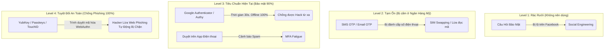

# Lesson 8: Xác thực Đa Yếu Tố (Multi-Factor Authentication - MFA)

> [!NOTE]
> **Category:** Theory (Lý thuyết)
> **Goal:** Chốt chặn cuối cùng bảo vệ vương quốc. Hiểu tại sao Thời đại của Mật khẩu đã Bị Khai Tử. Phân loại và đánh giá các cấp bậc vũ khí MFA từ "Dùng tạm" (SMS OTP) đến Cấp độ "Bất khả xâm phạm" (FIDO2/WebAuthn).

## 1. Lý thuyết chuyên sâu (Detailed Theory)

### 1.1. Mật Khẩu Đã Chết
Bạn nghĩ mật khẩu `A@x8#Kjd912!` là an toàn tuyệt đối?
**Sự Thật:** Kể cả bạn đặt mật khẩu mạnh bằng mã hóa Quân đội, thì nó vẫn Vô Dụng trước 2 Đòn Tấn Công:
1. **Phishing (Lừa đảo):** Hacker làm cái trang Web Giao Diện Y HỆT Ngân Hàng, gửi Email cho bạn. Bạn tự nguyện gõ Cmn cái mật khẩu mạnh đó dâng cho Hacker.
2. **Keylogger (Mã độc lưu bàn phím):** Máy bạn nhiễm Virus. Bạn gõ phím nào, Virus chụp lại phím đó gửi về cho Hacker. Mật khẩu dài 100 chữ cũng bằng Thừa.

### 1.2. Sự Ra Đời của MFA
Để phá thế bí, MFA ra đời với chân lý toán học: `An Toàn = Knowledge + Possession`.
Hacker có lấy được Pass của bạn (Knowledge), hắn VẪN BẤT LỰC vì hắn KHÔNG CẦM CÁI ĐIỆN THOẠI VẬT LÝ của bạn trong tay (Possession). Hắn không thể hoàn tất Đăng nhập. Đây là Cột Mốc thay đổi toàn bộ Lịch Sử Bảo Mật.

---

## 2. Luồng nội bộ & Cơ chế cấp thấp (Internal Workflow & Low-level Mechanisms)

Phân loại Các Loại Vũ Khí MFA từ Rác đến Thần Thánh (Security Spectrum):

---

## 3. Thực hành tốt nhất & Bảo mật (Best Practices & Security)

> [!IMPORTANT]
> **Khai tử SMS OTP (Lỗ Hổng SIM Swapping)**
> Vào năm 2017, Viện Tiêu chuẩn NIST của Mỹ chính thức Đánh Cờ Đỏ từ chối SMS OTP làm giải pháp an toàn.
> **Lý do:** Hacker không thèm hack bạn. Hacker ra Cửa Hàng Viettel, giả vờ báo mất SIM, cầm cái CCCD giả của bạn để xin Cấp Lại Cái SIM Trắng Mang Số Của Bạn. BÙM! Mọi tin nhắn SMS của Ngân hàng bay thẳng vào điện thoại của Hacker. Bạn mất sạch tiền.
> **Giải pháp:** Phải ép Khách hàng cài App Authenticator (Sinh mã Code nhảy 30s) hoặc dùng Thông Báo Đẩy (Push Notifications) mã hóa E2E.

> [!CAUTION]
> **Cơn Bão "Spam Phê Duyệt" (MFA Fatigue)**
> Hacker biết bạn xài tính năng Bấm Nút "ĐỒNG Ý ĐĂNG NHẬP" trên App điện thoại. Hắn dùng Tool chạy Login 1000 lần lúc 2h Sáng.
> Điện thoại của bạn rung chuông 1000 lần. Bạn nửa tỉnh nửa mê, Ức Chế quá Bấm cmn "ĐỒNG Ý" để đi ngủ. Hacker Cười Khẩy Và Trộm Data.
> **Cách Vá (Number Matching):** Màn hình máy tính hiện Số 59. Bạn Mở Điện Thoại, Nhìn App Điện Thoại, BẮT BUỘC PHẢI GÕ SỐ 59 VÀO APP. Chứ không có Nút Bấm Có/Không nữa.

---

## 4. Cấu hình minh họa thực tế (Configuration Examples)

Trong Keycloak, để ép Nhân viên bật Authenticator:
Bạn vào `Authentication` -> `Required Actions` -> Bật `Configure OTP` lên làm Default (Hoặc gắn cho từng User).

Ngày mai Nhân viên đi làm Đăng nhập Mật khẩu xong. Keycloak tự chặn ngang, hiển thị ra MỘT MÃ QR CODE TO ĐÙNG trên màn hình.
Nó ra lệnh: *"Lôi Điện thoại ra Cài Google Auth Quét Mã Kia Ngay"*. Nhân viên tự thân vận động làm từ A-Z mà không cần Bất Kỳ 1 Anh IT Support nào phải cầm tay chỉ việc. Hệ thống Tự Động Hóa 100%.

*(Keycloak hỗ trợ cả 2 thuật toán: TOTP - Dựa trên Thời Gian nhảy 30s 1 lần, và HOTP - Nhảy Mã Dựa Trên Số Lần Bấm - Hiếm dùng hơn).*

---

## 5. Trường hợp ngoại lệ (Edge Cases)

- **Thảm Họa Mất Thiết Bị (Device Loss - Recovery):**
  - Giám Đốc làm rớt Máy Điện thoại chứa Google Authenticator xuống biển. Mất sạch. Ông không thể Đăng nhập vào Email để Phê duyệt Lệnh Rút Tiền Tỷ.
  - Đây là Hố Đen của Kiến Trúc Tự Động Hóa (Self-Service).
  - **Phương Án Khắc Phục:** 
    1. Khi Setup MFA Lần đầu, Keycloak BẮT BUỘC bắt người dùng Sinh và Tải xuống `Recovery Codes` (10 cái Mã Cứng file Txt) in ra bỏ Két sắt. Mất điện thoại thì lôi giấy ra gõ.
    2. IT Admin có Quyền Năng Tối Thượng (God Mode): Vào Keycloak, Xóa cái OTP Device liên kết với Tài khoản Giám Đốc, và Ép Setup lại từ đầu ở lần đăng nhập tiếp theo.

---

## 6. Câu hỏi Phỏng vấn (Interview Questions)

**1. Trong Thuật toán TOTP (Google Authenticator). Điện thoại của tôi Không Có Mạng Wifi/3G (Chế độ Máy bay). Tại sao nó vẫn sinh ra được 6 Số, và Tôi gõ vào Keycloak NÓ VẪN CHẤP NHẬN ĐÚNG?**
- **Junior:** Nó dùng Bluetooth ẩn kết nối với máy tính.
- **Senior:** Lỗi kiến thức cơ bản. TOTP hoạt động OFFLINE 100% nhờ vào Toán Học chứ không phải Mạng Lưới.
**Bí mật (The Seed):** Lúc bạn quét QR Code ngày đầu tiên. Cái Mã QR đó giấu một Đoạn Text Bí Mật (Seed) (Ví dụ: `A1B2C3D4`). Keycloak cất Seed đó vào DB. App Điện thoại giấu Seed đó vào RAM.
**Thuật Toán Toán Học (HMAC-SHA1):** App Điện thoại tự động lấy cái `Thời Gian Hiện Tại Của Hệ Thống (Ví dụ 12h00)` + `Đoạn Seed` băm nhuyễn ra thành Dãy 6 số `123456`.
Ở Máy Chủ, Keycloak cũng tự lấy `Thời gian server 12h00` + `Seed cất trong DB` băm nhuyễn ra cũng được `123456`. 
Hai bên gõ phím khớp nhau Bùm -> OK. Không Cần 1 Byte Mạng Internet nào kết nối Giữa Điện thoại và Keycloak lúc Đăng Nhập Cả.

**2. Điều gì xảy ra nếu Đồng Hồ Máy Tính Của Giám Đốc (Server Keycloak) chạy NHANH HƠN Đồng Hồ Của Cái App Điện thoại 2 Phút? Chuyện gì sẽ xảy ra với TOTP?**
- **Junior:** Lệch giờ thì sai pass, không đăng nhập được.
- **Senior:** Chắc chắn là Không Thể Khớp Số (Vì Mã Số sinh ra dựa trên Giờ). 
Tuy nhiên, Keycloak (Và mọi hệ thống Chuẩn) không Ngu Ngốc So Đúng 1 Giây Đó. Nó có cấu hình **"Time Window / Look Ahead Window" (Cửa Sổ Khoan Hồng)**.
Cấu hình mặc định thường là `1`. Tức là Keycloak không chỉ Tính Mã 6 số của Giây Hiện Tại. Nó Tính Cả Mã 6 Số của 30 giây TRƯỚC, và 30 Giây SAU (Tổng cộng 3 Kết quả). Nếu Giám Đốc gõ 1 Trong 3 Kết quả đó Đều Được Chấp Nhận. Điều này Hấp thụ được Cú Lệch Đồng hồ nhỏ hoặc do Người Nhập Gõ Chậm Phím. (Nhưng lệch 2 phút thì chịu chết, phải cấu hình Sync NTP Server đồng hồ gốc lại).

**3. "Phishing-Resistant MFA" (MFA Chống Lừa Đảo - Cấp độ Thánh) hoạt động trên nguyên lý Tối Cao nào mà ngay cả khi Nạn Nhân TỰ NGUYỆN ĐƯA MÃ OTP CHO HACKER, Hacker vẫn Bất lực?**
- **Junior:** Bị lừa đưa OTP rồi thì chịu thua, hack 100%.
- **Senior:** Bạn chưa biết đến Cảnh Giới Của **FIDO2 / WebAuthn (Security Keys / YubiKey)**.
Với Google Auth (TOTP). Nếu Hacker lừa bạn vào Trang `google-fake.com`. Bạn nhập OTP vào. Hacker lấy Mã OTP Đó đập sang trang xịn (Trong 30 giây). Hacker THÀNH CÔNG. Mã TOTP là dạng Bắt Chước (Phishable).
Với **WebAuthn (Level 4)**: Cục USB Token của bạn Không Bao Giờ Cho Hiện Ra Bất Kỳ Con Số Nào Cho Bạn Đọc.
Thuật toán của nó: Trình Duyệt TỰ ĐỘNG ĐỌC Tên Miền (Domain) của cái trang web bạn đang vào. Nếu Tên Miền là `google-fake.com`. Trình Duyệt Báo với Cục USB: *"Ký cho tao cái Gói Tin ghi rành rành là Đang đăng nhập google-fake.com đi mày"*. Cục USB Ký Chữ Ký đó.
Bạn Gửi Chữ Ký đó về. Thằng Server Google Xịn đọc được, nó Rú Lên: *"MÀY VỪA KÝ MỘT GIAO DỊCH TẠI DOMAIN FAKE LÀ SAO?"*. Nó Lập Tức HỦY DUYỆT Khóa Tài Khoản Lập Tức. Con người bị mờ mắt lừa đảo, nhưng Toán Học Khóa Domain Của WebAuthn Thì Tuyệt Đối Vô Tình và Chính Xác 100%.

---

## 7. Tài liệu tham khảo (References)
- **RFC 6238:** TOTP: Time-Based One-Time Password Algorithm.
- **FIDO Alliance:** FIDO2 and WebAuthn.
