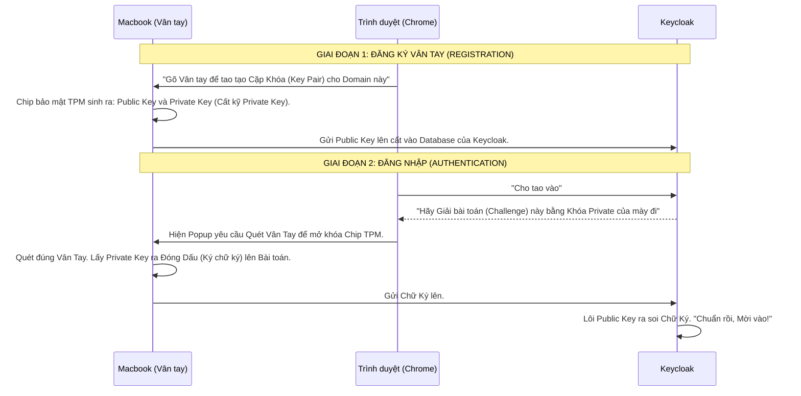

# Lesson 9: Tương lai Không Mật Khẩu (Passwordless)

> [!NOTE]
> **Category:** Theory (Lý thuyết)
> **Goal:** Xóa sổ hoàn toàn khái niệm Mật khẩu ra khỏi não bộ người dùng. Chấm dứt kỷ nguyên của Phishing. Tìm hiểu sự vi diệu của WebAuthn/Passkeys và Đăng nhập Bằng Magic Links.

## 1. Lý thuyết chuyên sâu (Detailed Theory)

### 1.1. Sự Trớ Trêu của Mật Khẩu
Trong ngành Bảo mật, có một nghịch lý đau đớn: *"Để hệ thống an toàn, Mật khẩu phải thật Dài và Phức tạp. Nhưng nếu Dài và Phức tạp, Con người sẽ GHI RA GIẤY dán lên màn hình"*. 
Mật khẩu (Thứ bạn BIẾT) đã chứng minh sự Thất bại Toàn diện.
**Passwordless (Không Mật Khẩu)** ra đời với triết lý: Người dùng KHÔNG CẦN NHỚ BẤT CỨ THỨ GÌ NỮA. Việc Đăng nhập sẽ dựa hoàn toàn vào **Thứ bạn CÓ** (Điện thoại, USB) và **Thứ thuộc về CƠ THỂ bạn** (Vân tay, Khuôn mặt).

### 1.2. Hai Cấp độ của Passwordless
- **Magic Links (Phép thuật qua Email):** Giống Slack hay Notion. Khách nhập Email. Hệ thống gửi 1 cái Link (Chứa Token sống 15 phút) vào Email. Khách bấm Link là chui thẳng vào Web.
- **WebAuthn / Passkeys (Đẳng cấp Thần Thánh):** Không cần Email, Không cần Gõ phím. Khách mở Web lên, Web hỏi: *"Quét vân tay đi"*. Khách quét vân tay cái BÍP trên Macbook/Điện thoại. Khách vào trong. 100% An Toàn Mật Mã Học.

---

## 2. Luồng nội bộ & Cơ chế cấp thấp (Internal Workflow & Low-level Mechanisms)

Bên dưới Nắp Capo của Công nghệ WebAuthn (Passkeys):

---

## 3. Thực hành tốt nhất & Bảo mật (Best Practices & Security)

> [!IMPORTANT]
> **Điểm Yếu Chí Mạng: Phục Hồi Tài Khoản (Account Recovery)**
> Hệ thống Passwordless cực kỳ hoàn hảo cho đến khi... Nạn nhân Làm Rớt Macbook Xuống Sông.
> Vì KHÔNG CÓ MẬT KHẨU, Nạn nhân không thể qua máy tính khác gõ Pass để vào được. Private Key bị chìm dưới sông theo cái Macbook.
> **Kiến trúc Vàng:** Trong hệ thống Passwordless, Khâu Đăng Ký phải bắt buộc Khách Hàng đăng ký TỐI THIỂU 2 THIẾT BỊ (Ví dụ: Macbook và Điện thoại). Nếu mất Macbook, lấy Điện thoại ra đăng nhập để Hủy Cấp Phép cái Macbook cũ. Ngoài ra, bắt buộc Sinh Recovery Codes (in ra giấy cất vào két).

> [!CAUTION]
> **Passkeys và Rủi ro Hệ sinh thái Cấm Cung (Walled Garden)**
> Apple, Google, Microsoft ra mắt chuẩn "Passkeys" (Đồng bộ Khóa Private Key lên iCloud/Google Drive).
> Lợi ích: Mất Macbook, mua Macbook mới đăng nhập iCloud thì Khóa Tự Nhận, không cần đăng ký lại.
> Rủi ro: Khóa Private Key của bạn BỊ ĐẨY LÊN ĐÁM MÂY của Apple/Google. Khóa không còn nằm trong tay bạn nữa. Đối với Quân Đội hoặc Ngân Hàng, Passkeys bị CẤM NGẶT. Họ bắt buộc dùng **Hardware Token Vật Lý** (YubiKey) không thể copy, mất USB là chịu chết, chứ tuyệt đối không cho phép Đám Mây tự động đồng bộ khóa.

---

## 4. Cấu hình minh họa thực tế (Configuration Examples)

Thiết lập WebAuthn Passwordless trên Keycloak 24:
1. Bạn vào `Authentication` -> `Flows` -> Mở `Browser Flow`.
2. Thay vì dùng `Username Password Form`, bạn thêm một bước tên là **`WebAuthn Passwordless Authenticator`**.
3. Bạn cài đặt Bước này thành `REQUIRED` (Bắt buộc).
4. Bạn vô hiệu hóa (Disable) Bước nhập Mật Khẩu đi.
BÙM! Toàn bộ công ty Sáng mai đi làm, khi mở trang Login, Màn hình Mật khẩu biến mất, thay vào đó là cái Icon Vân Tay nhấp nháy. Mọi người đăng nhập siêu tốc trong 1 Giây. Support IT không bao giờ còn nhận được cuộc gọi: "Em ơi chị quên Pass" nữa.

---

## 5. Trường hợp ngoại lệ (Edge Cases)

- **Máy Tính Dùng Chung (Shared Devices):**
  - Môi trường Bệnh Viện: 10 Y tá xài chung 1 Máy Tính ở quầy trực.
  - Nếu dùng WebAuthn của Windows Hello trên máy đó. Lúc bấm đăng nhập, Máy tính sẽ xổ ra danh sách 10 tên Y tá. Ai là người quét vân tay thì người đó sẽ tự động được gán vào cái Tên tương ứng.
  - Vấn đề: Cực kỳ dễ Bấm Lộn tên người khác. 
  - **Cách khắc phục:** Máy dùng chung bắt buộc dùng Thẻ Rời (YubiKey) cắm vào cổng USB, Rút Thẻ Ra Là Tự Động Logout (Proximity Login), tuyệt đối không dùng TouchID/Windows Hello đính kèm trên phần cứng máy.

---

## 6. Câu hỏi Phỏng vấn (Interview Questions)

**1. Trong hệ thống "Magic Link", Khách nhập Email trên Macbook, Máy chủ gửi Link. Nhưng Khách lại Lôi Điện Thoại Mở Gmail ra và Bấm Link trên Điện thoại. Hậu quả là Gì?**
- **Junior:** Vẫn vào được bình thường vì link đó xịn.
- **Senior:** Đăng nhập Thành Công, nhưng Session Cấp Sai Chỗ (Session Hijacking / UX Fail).
Nếu không thiết kế kỹ: Khách bấm link trên Điện thoại -> Web mở ra trên Trình duyệt Điện thoại -> Điện Thoại Được Đăng Nhập. Trong khi cái Macbook (Nơi khởi xướng yêu cầu) Vẫn Đứng Quay Đều Trơ Mỏ Đợi chờ. Khách chửi thề.
**Kiến trúc Chuẩn (Cross-device Magic Link):** Khi Macbook xin Link, Máy chủ Cấp 1 cái Session Tạm (Pending) kèm WebSocket. Khi Điện Thoại Bấm Link, Máy Chủ Nhận Được Lệnh -> Máy Chủ Bắn Lệnh Qua WebSocket Cho Macbook. BÙM! Cả Macbook Lẫn Điện Thoại đều Đăng Nhập Cùng Lúc. Trải nghiệm Thần Tiên.

**2. Tại sao FIDO2/WebAuthn Lại được coi là "Phishing-Resistant" (Miễn nhiễm Lừa Đảo 100%) ngay cả khi nạn nhân CỐ TÌNH muốn dâng Account cho Hacker?**
- **Junior:** Vì vân tay không thể làm giả.
- **Senior:** Lại một hiểu lầm kinh điển. FIDO2 an toàn Không Phải Do Vân Tay, mà Do **Thuật toán Origin Binding (Trói buộc Tên Miền)**.
Giả sử Hacker dụ bạn vào trang lừa đảo `keycloak-vietnam.com` (Giao diện y hệt `keycloak.com`).
Bạn ngây thơ Quét Vân Tay cái Rẹt!
Chip TPM của bạn chạy ngầm, nó lấy cái Tên miền `keycloak-vietnam.com` đưa vào Hàm băm. Nó phát hiện: "Khoan! Cái Tên Miền này Tao chưa từng đăng ký. Chữ ký của nó không khớp!".
Trình duyệt LẬP TỨC từ chối việc Ký Bằng Khóa Private. Giao dịch Thất bại tại chỗ. Kẻ lừa đảo không thu được 1 Byte dữ liệu nào. Dù Nạn nhân có "Muốn" đưa Khóa thì Toán học cũng không cho phép.

**3. Tại sao nói việc Chuyển đổi sang Passwordless là một Cơn Ác Mộng Về Quản Trị Vòng Đời (Lifecycle Management) cho HelpDesk IT?**
- **Junior:** Vì cài khó nên IT mệt.
- **Senior:** Vì Đứt Gãy Chuỗi Tự Phục Vụ (Self-Service).
Khi xài Mật khẩu: Nhân viên Quên Pass -> Bấm Quên Mật khẩu -> Đổi Pass (Tự làm 100%, IT rảnh).
Khi xài Passwordless (Vân tay/USB): Nhân viên BỊ MẤT USB. Làm sao để Chứng Minh cái người đang gọi điện xin cấp USB mới ĐÚNG LÀ NHÂN VIÊN ĐÓ?
IT HelpDesk phải gọi Video Call, bắt nhân viên cầm thẻ Căn Cước giơ lên mặt, đọc Câu hỏi bảo mật, rồi mới dám Phát Cấp Cái USB Mới. Quy trình Phục Hồi cực kỳ tốn công sức con người (Manual Identity Verification). Tiết kiệm được Lỗ hổng Bảo mật nhưng đánh đổi bằng Chi Phí Vận Hành (OpEx) Phục Hồi khổng lồ.

---

## 7. Tài liệu tham khảo (References)
- **FIDO Alliance:** Passkeys.
- **W3C:** Web Authentication: An API for accessing Public Key Credentials.
