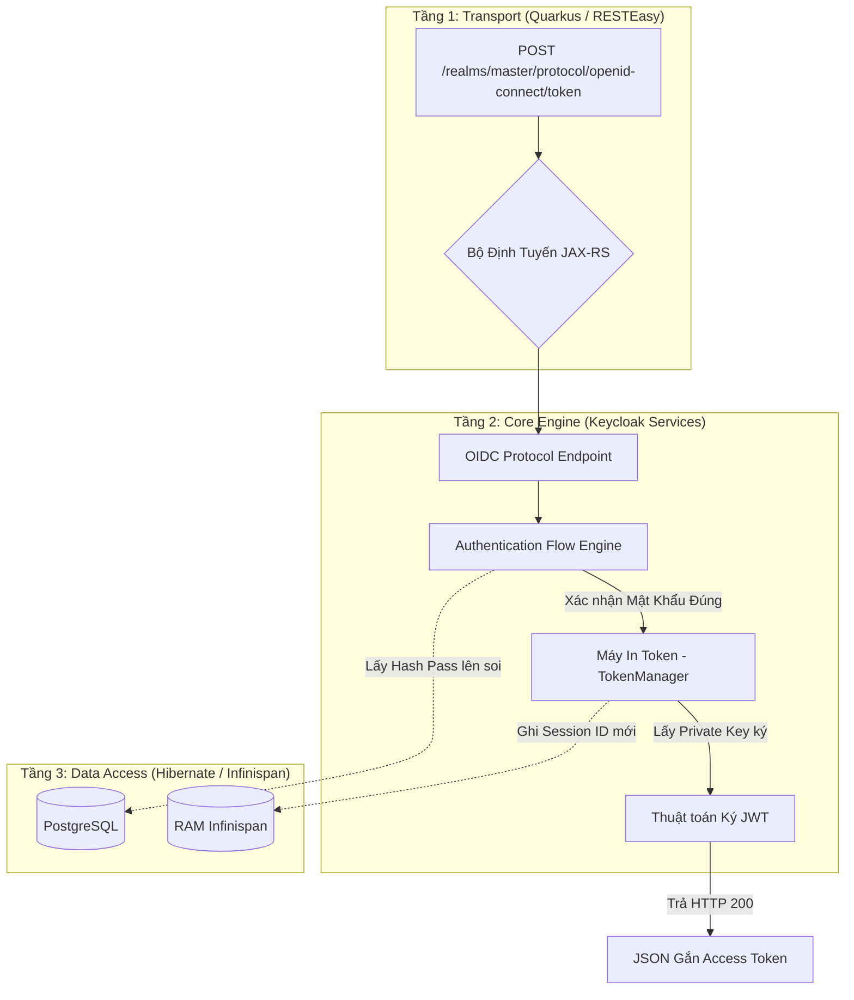

# Lesson 1: Kiến trúc Nội tại (Internal Architecture)

> [!NOTE]
> **Category:** Theory & Architecture (Lý thuyết & Kiến trúc)
> **Goal:** Bóc tách 3 tầng logic bên trong một Node (Máy chủ) Keycloak. Hiểu được một Yêu cầu HTTP (Request) chạy qua các lớp Tường lửa, Phân loại, và Xử lý như thế nào trước khi nhả ra JWT.

## 1. Lý thuyết chuyên sâu (Detailed Theory)

Keycloak không phải là một mớ Code Java viết liền tù tì. Nó được thiết kế theo Mô hình Kiến trúc Phân Tầng (Layered Architecture) cực kỳ nghiêm ngặt, chia làm 3 lớp chính:

1. **Tầng Vành Đai Giao Tiếp (Transport/HTTP Layer):** Nơi Hứng trọn mọi cú Click chuột, mọi API Call từ Internet dội vào. Chịu trách nhiệm mã hóa SSL/TLS, Cân bằng tải nội bộ và Phân luồng Định tuyến (Routing).
2. **Tầng Lõi Não Bộ (Core Engine / Services Layer):** Trái tim của Keycloak. Nơi chứa toàn bộ Các Cây Quyết Định (Authentication Flows), Thuật toán Mật Mã (RSA/EC), và Các Trình Thông dịch Giao thức (SAML/OIDC Protocol Mappers).
3. **Tầng Truy Cập Dữ Liệu (Data Access Layer - JPA/Infinispan):** Bộ rễ Cắm Sâu vào Lòng đất. Nơi Giao tiếp với PostgreSQL để kéo Mật khẩu, và giao tiếp với Infinispan để Ghi Session lên RAM.

---

## 2. Luồng nội bộ & Cơ chế cấp thấp (Internal Workflow & Low-level Mechanisms)

Hành trình của một Yêu cầu Xin Token (Token Request) đi xuyên qua 3 Lớp:



---

## 3. Thực hành tốt nhất & Bảo mật (Best Practices & Security)

> [!IMPORTANT]
> **Phi Trạng Thái Tại Tầng HTTP (Stateless Transport Layer)**
> Ở Tầng 1 và Tầng 2, Keycloak KHÔNG BAO GIỜ lưu Trạng thái (Biến số nội tại) cho từng Người dùng trên RAM nội bộ của Cái Máy Chủ Vật Lý đó. Nghĩa là Request Đăng nhập của Anh A đập vào Máy Chủ Keycloak số 1, Nhưng Lệnh Cấp Token Của Anh A đập vào Máy Chủ Số 2 thì Mọi Thứ Vẫn Chạy Hoàn Hảo. Nhờ kiến trúc này, Bạn có thể Nhân bản (Scale-out) Keycloak từ 1 Node lên 100 Node trong Kubernetes mà không bị rách Data. (Trạng thái duy nhất được Lưu nằm ở Tầng 3 - Cụm Infinispan đồng bộ dữ liệu chéo).

> [!CAUTION]
> **Nút Thắt Cổ Chai Ở Tầng 3 (Database Bottleneck)**
> Vì Tầng 1 (Quarkus) xài I/O Non-blocking (Cực nhanh), và Tầng 2 (Logic) xài CPU (Cực khỏe). Lượng Request đổ xuống Tầng 3 (Database PostgreSQL) là Một Quả Bom Áp Lực.
> **Lỗi Kinh Điển:** Bạn cấu hình Số lượng Kết nối (Connection Pool - Agroal) quá nhỏ (Ví dụ: 20 Connections). Khi có 1000 người Login Cùng Lúc. 20 Connection Bị Kẹt. 980 Người Còn Lại Bị Treo Máy Chờ (Thread Starvation).
> **Best Practice:** Phải Tuning (Tinh chỉnh) song song: Tăng Pool Size của Quarkus JPA, Tăng RAM cho PostgreSQL, và Dùng Infinispan Cache để Đỡ Đạn bớt cho Database.

---

## 4. Cấu hình minh họa thực tế (Configuration Examples)

Sức mạnh Cấu hình Tầng của Quarkus:
Bạn có thể ra lệnh cho Tầng 1 (Transport) tối ưu hóa luồng HTTP Threads ngay trong file `keycloak.conf`:
```properties
# Giới hạn số lượng Luồng công nhân xử lý HTTP (Tránh sập Server vì DDoS)
quarkus.thread-pool.max-threads=200

# Tối ưu hóa Kết nối Data (Tầng 3)
db-pool-initial-size=10
db-pool-max-size=100
```
*(Keycloak xài Quarkus, nên Nó Kế thừa Toàn bộ Siêu Năng Lực cấu hình của Quarkus. Đọc tài liệu Quarkus là hiểu cách tối ưu Keycloak).*

---

## 5. Trường hợp ngoại lệ (Edge Cases)

- **Sự cố Tắc nghẽn SPI Chậm (Slow SPI Starvation):**
  - Tầng 2 (Core) thiết kế để mở rộng bằng SPI. Bạn viết 1 cái SPI Custom (Ví dụ: Lúc Đăng nhập Xong, Bắn 1 Tin nhắn qua Zalo báo cáo).
  - Oái ăm thay, Máy chủ API Zalo bị chậm (Mất 5 giây mới trả lời).
  - Hậu quả: Luồng Thread Của Keycloak bị Giam Giữ Chết Đứng (Blocked) trong 5 giây đó. 100 ông Khách Login -> 100 Luồng bị Giam. Nguyên hệ thống Keycloak BỊ CHẾT ĐỨNG Bốc Khói Mặc dù CPU chỉ chạy 5%.
  - **Bài học xương máu:** Code viết thêm ở Tầng 2 BẮT BUỘC Phải Bắn Bất Đồng Bộ (Async) hoặc Ép TimeOut cực ngắn (Timeout=500ms). Cấm Cản Đường Luồng Chính (Event Loop).

---

## 6. Câu hỏi Phỏng vấn (Interview Questions)

**1. Trong Tầng Data Access của Keycloak, sự khác biệt vai trò giữa PostgreSQL (RDBMS) và Infinispan (In-memory Grid) là gì? Tại sao không gom hết vào Database cho khỏe?**
- **Junior:** Infinispan để cache cho web chạy lẹ. DB để lưu lâu dài.
- **Senior:** Phân tách rạch ròi theo Đặc tính của Dữ liệu (Data Volatility).
- **PostgreSQL:** Lưu trữ Dữ liệu Tĩnh (Cold Data / Persistent). Gồm: Tên User, Mật khẩu Băm, Cấu hình Client. Bọn này Rất Ít Khi Đổi, Đổi 1 phát LÀ PHẢI NẰM CỨNG trên Ổ Đĩa (Để mất điện không mất Mật khẩu). 
- **Infinispan:** Lưu trữ Dữ liệu Động Lực Lớn (Hot Data / Ephemeral). Gồm: Session Đăng nhập, Action Tokens, Code Oauth2. Bọn này Đẻ Ra Và Chết Đi bằng Hàng Triệu Dòng mỗi Phút. Nếu Ghi/Xóa bằng Đĩa Cứng PostgreSQL, Ổ cứng sẽ Nổ Tốc Độ IOPS. Ghi Trên RAM (Infinispan) cho tốc độ O(1), VÀ Nếu Mất Điện Server Chết, Khách Chỉ Việc Login Lại, Không Mất Mát Dữ Liệu Nghiệp Vụ Cốt Lõi (Kế toán/Hóa đơn). Sự chia tách này là Nghệ thuật Hệ Thống Phân Tán (Distributed Systems).

**2. Tầng Transport (Quarkus) xài Mô hình Non-blocking (Reactive). Nghĩa là Keycloak chạy Non-blocking hoàn toàn?**
- **Junior:** Đúng, nó xài Quarkus nên nhanh lắm.
- **Senior:** **SAI CƠ BẢN.**
Quarkus hỗ trợ Non-blocking (Reactive). Nhưng cái Lõi Cũ của Keycloak (Mang từ thời WildFly sang) đa phần vẫn là Đoạn Code **Blocking (Đồng bộ - Imperative)**, đặc biệt là khi tương tác với thư viện JPA (Hibernate) để chọc DB.
Nên ở Tầng 1 (RESTEasy), Request đi vào bằng Thread Reactive, Nhưng Lập tức Bị CHUYỂN GIAO (Dispatch) sang nhóm Worker Threads (Luồng công nhân Blocking) để xử lý Tầng 2 và 3. Việc này Tốn Chi phí Chuyển Ngữ Cảnh (Context Switching). (Hiện tại Team Red Hat đang code lại Dần Dần từng Mô Đun Keycloak Sang Store Non-blocking/MapStorage để tiến tới Tốc độ Ánh sáng, nhưng vẫn chưa hoàn thiện 100%).

---

## 7. Tài liệu tham khảo (References)
- **Keycloak Architecture Documentation:** High-level Architecture.
- **Quarkus:** RESTEasy Reactive vs Classic.
