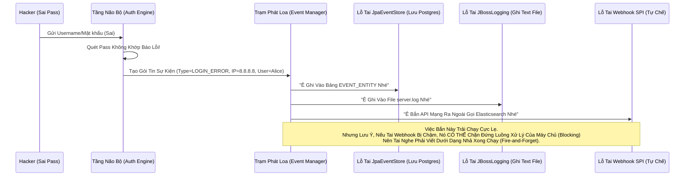

# Lesson 12: Hệ thống Sự kiện (Events & Auditing)

> [!NOTE]
> **Category:** Theory (Lý thuyết)
> **Goal:** Trở thành Đôi Mắt Thần Quan Sát. Hệ thống bảo mật mà không có Nhật ký Sự kiện (Audit Log) thì như nhà băng không lắp Camera. Tìm hiểu cách Keycloak ghi nhận, lắng nghe và Bắn Webhook đi khắp nơi.

## 1. Lý thuyết chuyên sâu (Detailed Theory)

### 1.1. User Events vs Admin Events
Keycloak Phân Định Rạch Ròi 2 Tầng Sự Kiện (Events):
- **User Events (Hành vi Dân Thường):** Anh A Đăng nhập thành công (`LOGIN`), Cô B gõ sai Pass (`LOGIN_ERROR`), Chú C xin Token (`CODE_TO_TOKEN`). Bọn này xảy ra với Tần Xuất Cực Dày (Hàng chục ngàn lần mỗi phút).
- **Admin Events (Hành vi Quan Chức):** Sếp IT vừa Xóa 1 Client (`DELETE_CLIENT`), DevOps vừa đổi Cấu hình Realm (`UPDATE_REALM`). Bọn này Tần Xuất Cực Thấp (Vài lần một tháng) NHƯNG Sát Thương Đảo Lộn Chết Người. Đòi Hỏi Lưu Trữ Vĩnh Viễn Không Xóa.

### 1.2. Mệnh Lệnh Kích Hoạt Tức Thời (Event Listeners)
Keycloak KHÔNG PHẢI chỉ biết ghi Log vào Ổ Cứng hay Bảng DB.
Nó sở hữu Kiến trúc **Event Listeners (Tai Nghe Sự Kiện)** Theo Chuẩn Bất Đồng Bộ (Async). Khi một Sự kiện xảy ra, Khối Động Cơ Sự Kiện (Event Engine) Ném Cục Event Đó Cho Tất Cả Những Cái "Tai Nghe" Đang Cắm Vào Máy Chủ.
Có Thể Là Lỗ Tai Của Thằng Ghi Bảng Database. Lỗ Tai Của Thằng Ghi File Log JBoss. Hoặc Lỗ Tai Của Thằng Bắn Zalo Báo Động Đỏ.

---

## 2. Luồng nội bộ & Cơ chế cấp thấp (Internal Workflow & Low-level Mechanisms)

Chuỗi Sự Kiện Được Bắn Đi Khi Hacker Đập Cửa Gây Cháy Lỗi 401:

---

## 3. Thực hành tốt nhất & Bảo mật (Best Practices & Security)

> [!IMPORTANT]
> **Giải Phóng Database Khỏi Cục Tạ Log (Dừng Ngay Việc Lưu User Events Vào CSDL)**
> **Ác mộng Tăng Trưởng:** Mặc định Keycloak KHÔNG lưu User Event vào DB (Vì nó biết thiết kế đó là Ngu Ngốc). Nhưng nhiều Bạn Junior Mở Admin Console Lên, Bật Công Tắc `Save Events To Database = ON` Của User Event Rồi Đi Ngủ Vui Vẻ.
> **Vỡ Trận:** Bảng `EVENT_ENTITY` Của PostgreSQL Bơm Đầy Tràn Hàng Tỷ Dòng Chỉ Sau 2 Tuần Chạy Production Bị Khách Quẹt Mạng Bơm Code. DB Sụp Ổ Cứng 100%. Các App Rớt Sạch Vì Không Còn Chỗ Ghi Dữ Liệu Rễ Cốt.
> **Luật Sinh Tử:** User Events **CHỈ ĐƯỢC GHI RA ĐUÔI LOG TEXT (JBoss Logging)**. Sau Đó Dùng Phần Mềm Chuyên Dụng Bên Ngoài (Promtail / Filebeat) Quét File Text Đó Bắn Qua Kênh ElasticSearch Hút Log Rời Đi Khỏi Máy Chủ Keycloak Càng Nhanh Càng Tốt. Môi Trường Cơ Sở Dữ Liệu Quan Hệ Chỉ Dùng Cho Dữ Liệu Tĩnh & Mạng Lưới Nhện Có Tổ Chức. (Tuy Nhiên: Admin Events Thì ĐƯỢC PHÉP Bật Lưu DB Vì Lượng Sinh Ra Quá Ít Mức Vài Chục Dòng 1 Tháng Chứa Chẳng Đáng Tốn Nút Nút Kẽ Nào Cả Kép Data Nóng).

> [!CAUTION]
> **Rò Rỉ Token Trong Log Bề Mặt Rõ (PII Leakage)**
> Nếu Bật Ghi Log Sự Kiện Code To Token, Keycloak Ném Ra Các Dữ Liệu Có Đính Kèm Email, IP Mạng, Số Điện Thoại.
> Hãy Chú Ý Luật GDPR Chặn Châu Âu Mạng Rò Rỉ Log Ra Thằng Developer Thấy Hết Data Nhạy Cảm Kín Người Dùng. 
> Phải Dùng Lớp Cắt Filter JBoss Đáy Đóng Format (Hoặc Chỉnh Tham Số Log Ít Thông Tin) Rớt Cắt Lệnh Chữ Rỗng Đi Kéo Bằng Không Sẽ Rơi Rụng Vào Án Phạt Phơi Sáng Bí Mật Quyền Cá Nhân (PII).

---

## 4. Cấu hình minh họa thực tế (Configuration Examples)

Sức Mạnh Tắt Bật Từng Hạt Đậu (Event Filters):
Trong Cài Đặt Events (Events Config). Bạn Thấy Dòng `Saved Types`.
Thay Vì Bật "Lưu Tất Cả". Bạn Có Thể Bấm Chọn Chỉ Lưu Những Tội Phạm Trọng Điểm:
- `LOGIN_ERROR` (Sai Pass Rất Quan Trọng Cần Đếm Số).
- `CLIENT_LOGIN_ERROR` (App Nào Cắm Trộm Key Sai).
- `GRANT_CONSENT` (Đứa Nào Vừa Bấm Nút Phê Duyệt Cấp Đất).
Các Sự Kiện Rác Rưởi Như `REFRESH_TOKEN` (Cứ Nửa Tiếng Gọi 1 Lần) Tuyệt Đối Xóa Tích Tắt Đóng Tắt Bụp Bỏ Không Thèm Thu Nạp Kéo Rác Vào Đám RAM Ghi Mạng DB DB Nghẽn Thủng Băng Thông Cụm Ghi Rễ Lỗi Báo Log.

---

## 5. Trường hợp ngoại lệ (Edge Cases)

- **Hệ Thống Phản Ứng Trái Đảo Cứu Sập Trống (Custom Event Webhooks):**
  - Giám Đốc An Ninh Bắt Buộc: *"Nếu Có Bất Kỳ Ai Khởi Động Sửa Quyền Của Cụm Role KẾ TOÁN TRƯỞNG, Tôi Phải Nhận Được Email Báo Động Ngay Lập Tức Chớp Nháy 2 Giây!"*
  - Keycloak Mặc Định Không Có Tính Năng Bắn Mail Khi Bị Đổi Quyền. 
  - **Hướng Giải Quyết:** Dùng Cơ Khí Mở Rộng SPI (Học Ở Lesson 13 Kế Tiếp). Bạn Mở Code Java Lên Cày 1 Khung EventListener Nắn Nặn Lệnh Dịch Bọc Mạch `if (event.getType() == ADMIN_EVENT && event.getResourcePath().contains("ROLE"))`. Nhét Mã Lệnh Gọi Đánh Chuông Zalo Gửi Ngang Sóng Cắt Mạch Đuôi Nhét Thành File `.jar` Quẳng Vào Bụng Keycloak. 
Nó Biến Keycloak Thành Một Con Robot An Ninh Thép Kéo Dây Không Bỏ Sót Tí Bụi Lọt Chậm.

---

## 6. Câu hỏi Phỏng vấn (Interview Questions)

**1. Công Ty Dùng Đội Ngũ Auditing Soi Log Ở Database Bảng Admin Event Thấy Sếp Vừa Xóa Client. Nhưng Tại Sao Ở Bảng Ghi Nhận Lại Nằm Đuôi Mất Tiêu Thằng IP Máy Của Sếp Mạng Trả Trực Tiếp Trống Trơn Hoặc Lỗi Báo (127.0.0.1)? Khắc Phục Sao?**
- **Junior:** Tự Do sếp đang chạy chung máy server local.
- **Senior:** Lỗi Mất IP Gốc (X-Forwarded-For Trôi Mất Proxy Hắt Cản).
Keycloak Đứng Nấp Đằng Sau Cánh Cửa Nginx / Traefik / AWS ALB (API Gateway Lớp Ngài). Kẻ Tấn Công (Hoặc Sếp) Đâm Mạng Vào Gateway, Gateway Bẻ Cầu Cắm Ngược Mạch Xuống Keycloak Bằng Đường Ống Kép Nối Nội Bộ Kín Đáy IP Bề Mặt Chạy `10.0.0.x`.
Keycloak Lục Đọc Event IP Thấy Thằng Gọi Mình Là Gateway (Chứ Đâu Trông Thấy Thằng Ngoài Đường Nữa).
-> Phải Chỉnh Mạng Đuôi `proxy=edge` Trong Tệp Khởi Động `keycloak.conf`. Ép Nó Phải Banh Bụng Header Kẽ Khung Khách (X-Forwarded-For) Ra Đọc Ngược Dòng Kéo Lấy IP Thật Chèn Vào Dòng Auditing. (Trị Lệnh Chống Mù IP Xương Khí Không Vỡ Sập Tòa Phán Tội Phạm Bắt Láo Địa Chỉ Kẹp Chết Chặn IP Nhầm Ngành Firewall Vỡ Tải Hệ Thống).

---

## 7. Tài liệu tham khảo (References)
- **Keycloak Auditing:** Event Listeners and Logs.
