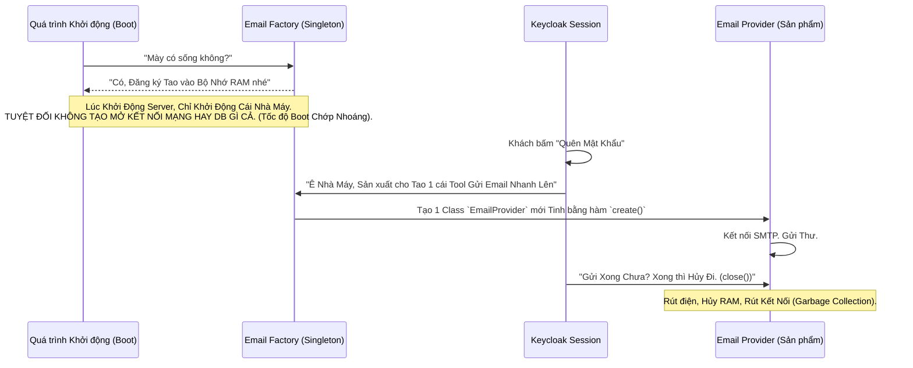

# Lesson 2: Các Linh kiện Cấu thành (Components)

> [!NOTE]
> **Category:** Theory (Lý thuyết)
> **Goal:** Nắm bắt Mô hình Lập trình Hướng Đối Tượng Tối Cáo của Keycloak. Hiểu được Triết lý Lego: Mọi thứ trong Keycloak đều là một "Linh kiện" (Component) cắm vào một cái Bo Mạch Chủ chung. Không có gì là Code Cứng (Hard-coded).

## 1. Lý thuyết chuyên sâu (Detailed Theory)

### 1.1. Triết lý Vạn Vật Là Linh Kiện
Nếu bạn mở Source Code của những App bình thường ra, bạn sẽ thấy Lập trình viên Cứng Ngắc viết: `if (Database == MySQL) { Chạy_Lệnh_SQL } else if (Database == LDAP) { Chạy_Lệnh_LDAP }`.
Cách code đó Rác Rưởi và Phá vỡ Nguyên lý OCP (Open-Closed Principle - Nguyên lý Đóng Mở của SOLID).
**Keycloak không code như vậy.**
Toàn bộ Keycloak là một cái Khung (Framework) Giao diện Rỗng Tuếch.
- Tính năng Gửi Email là một Component.
- Tính năng Lưu Database là một Component.
- Tính năng Hỗ trợ Xác thực Vân tay là một Component.
Khi Khởi động, Keycloak Dò Tìm Toàn Bộ Thư mục, Thấy Component Nào, Nó Tự Động CẮM VÀO (Load) giống như Lắp Ram, Lắp Card Màn Hình Vào Mainboard PC vậy.

### 1.2. Giải Phẫu Component
Một Linh Kiện (Component) hoàn chỉnh bắt buộc phải có 2 Nửa:
1. **Provider Factory (Nhà Máy Sản Xuất):** Thằng này Đứng Ra Khai Báo Với Mainboard: *"Tôi tên là Nhà Máy Gửi Email, ID của tôi là `SMTP`. Tôi có thể sản xuất ra Máy Gửi Email"*. (Nó là cái Khuôn đúc - Singleton).
2. **Provider (Sản Phẩm Thực Thi):** Khi Có Khách Cần Gửi Email Thật. Nhà Máy Tự Chạy Ép Ra 1 Cái Máy Gửi Email (Provider). Cái Máy Này Cầm Data, Mở Kết Nối, Gửi Email, Xong BỊ VỨT VÀO THÙNG RÁC NGAY LẬP TỨC (Per-Request Lifecycle).

---

## 2. Luồng nội bộ & Cơ chế cấp thấp (Internal Workflow & Low-level Mechanisms)

Cơ chế Tải Lười Biếng (Lazy Loading) siêu đẳng của Component Registry:

---

## 3. Thực hành tốt nhất & Bảo mật (Best Practices & Security)

> [!IMPORTANT]
> **Cô Lập Trạng Thái (State Isolation - No Variables in Factory)**
> **Tội ác Lập trình viên:** Khi bạn tự viết thêm Code (Custom Component) cho Keycloak. Bạn Khai Báo một Biến Toàn Cục (Global Variable) Mảng Array Đếm Số Người Truy Cập `count++` NẰM BÊN TRONG THẰNG FACTORY. 
> BÙM! Data Rò Rỉ Đa Luồng (Thread-safety Issue / Race Condition). Lúc Hai Khách Hàng Login Cùng Lúc, Hai Cú `count++` đụng nhau gây sai số. Khủng khiếp hơn, Dữ liệu Khách Này Bị Lộ Sang Khách Kia.
> **Quy Luật Thép:** Factory là Khuôn Đúc, TUYỆT ĐỐI KHÔNG CHỨA DỮ LIỆU. Chỉ có Provider Mới Được Phép Cầm Dữ Liệu (Và Provider Phải Bị Xóa Ngay Khi Xong Việc).

> [!CAUTION]
> **Lỗ Rò Rỉ Bộ Nhớ (Memory Leaks)**
> Trong Provider, bạn Mở File Đọc Log, hoặc Mở Kết Nối Ra API Zalo.
> Xong Việc, bạn QUÊN KHÔNG ĐÓNG (Close connection) trong hàm `close()`.
> Sau 1 Ngày, Keycloak đẻ ra 1 Triệu cái Provider. 1 Triệu Kết Nối Bị Treo Lơ Lửng (Dangling). Hết Sạch Trí Nhớ RAM. Server Chết Cứng Văng Lỗi `Out Of Memory (OOM)`. Hệ Thống Sập Hoàn Toàn Chờ Cấp Cứu Reboot.

---

## 4. Cấu hình minh họa thực tế (Configuration Examples)

Sức mạnh "Tùy Chỉnh Linh Kiện" Bằng Giao Diện (UI Component Configuration):
Vì Mọi thứ là Linh kiện. Bạn muốn Đổi Tính năng? Không cần Sửa Code Java.
1. Bạn vào Admin Console -> Menu **User Federation** (Nơi cắm Linh kiện Lưu trữ User).
2. Bạn thấy có Nút `Add LDAP` và Nút `Add Active Directory`.
3. Khi Bấm Vào, Một Cái Form Hiển Thị Ra Bắt Điền URL, Port, Bind DN.
-> Cái Form đó DO CHÍNH CÁI COMPONENT ĐÓ TỰ ĐỊNH NGHĨA (ConfigProperties). Keycloak Mẹ chỉ Việc Đọc và Vẽ Lên Màn Hình. (Tính Cắm-Là-Chạy - Plug-and-Play Tuyệt Đối).

---

## 5. Trường hợp ngoại lệ (Edge Cases)

- **Chiến Tranh Thư Viện (Dependency Hell / Classloader Issues):**
  - Component của bạn xài Thư Viện Gửi Mail Trọng Lượng Nặng (Ví dụ xài AWS SDK bản 1.0).
  - Lõi của Keycloak LẠI ĐANG XÀI CỨNG AWS SDK Bản 2.0.
  - Khi Cắm Component của Bạn Vào, Trình Chạy Java (Classloader) Của Quarkus Bị Lú: *"Tao nên Lấy Thư viện Của Thằng Nào Bây Giờ?"* -> Quăng Lỗi `NoSuchMethodError` Hoặc `ClassNotFound`. (Lỗi Khét Lẹt Của Dân Dev Java).
  - **Khắc phục:** Ở Thời Đại Quarkus. Trình Xây Dựng (Maven/Gradle) Bắt Buộc Phải Loại Bỏ (Exclude) các thư viện Xung Đột ở Giai Đoạn Build. Component Phải Nhường Nhịn Xài Chung Thư Viện Cốt Lõi (Provided Scope) Với Keycloak Mẹ.

---

## 6. Câu hỏi Phỏng vấn (Interview Questions)

**1. Trong Mô hình Provider/Factory của Keycloak, Phương Thức Khởi Tạo (Lifecycle) nào đảm bảo Rằng Factory Chỉ Chạy Khởi Động Đúng Một Lần Duy Nhất Suốt Vòng Đời Server Mở Chạy?**
- **Junior:** Bỏ lệnh vào hàm `main()`.
- **Senior:** Keycloak Factory áp dụng Mô hình `init()` và `postInit()`.
Khi Server Vừa Lên, Khung sườn Gọi Hàm `init()` Của Toàn Bộ Factory ĐỂ Lấy Tham Số Cấu Hình (Đọc file Config, Đọc Biến Môi Trường `Environment Variables`).
Tiếp Theo, Nó gọi `postInit()`. Ở Đây, Các Factory Được Phép Đi Giao Tiếp Với Các Factory Khác (Ví Dụ Thằng Email Đi Hỏi Thằng Database Xem: Khởi Động Xong Chưa Tao Lấy Tí Data). Hai Hàm Này Chỉ Chạy 1 Lần Duy Nhất, Do Main Thread Của Server Khởi Xướng Nên Đảm Bảo Tuyệt Đối Không Gây Chậm Khi Có Khách Hàng Login.

**2. Nếu Tôi Viết Một Cụm Logic Gọi Là "Tính Điểm Tín Dụng Khách Hàng". Tôi Muốn Component A Tính Xong Chuyền Kết Quả Sang Component B (Ví Dụ B Là Gửi Mail). Làm Sao Hai Cái Component (Xài Cùng 1 Request) Này Giao Tiếp Với Nhau Trong Ruột Keycloak?**
- **Junior:** Lưu vô cái Biến Biến Toàn Cục Static.
- **Senior:** Tuyệt Đối Không. Xài Biến Static Ở Môi Trường Web Đa Luồng Sẽ Dẫn Tới Án Mạng Nhầm Lẫn Data Nhau (Trừ phi xài ThreadLocal, nhưng Rất Khó Duy Trì).
Giải pháp Tiêu Chuẩn Của Kiến Trúc Sư: **Bám Vào Đối Tượng `KeycloakSession`**.
Mọi Yêu Cầu Của Một Người Dùng Mở Ra Đều Đi Kèm 1 Cái `KeycloakSession` Xuyên Suốt Từ Đầu Chí Cuối. Cái Session Này Có 1 Cái Rổ Đựng Đồ Tạm Gọi Là `setAttribute()` và `getAttribute()`.
Thằng A Tính Điểm Xong -> Gắn: `session.setAttribute("DIEM_TIN_DUNG", 100)`.
Thằng B Ở Nhịp Chạy Sau -> Đọc: `session.getAttribute("DIEM_TIN_DUNG")`. Giao Tiếp Trơn Tru, Gọn Gàng, Vô Cùng Sạch Sẽ và Tự Động Bốc Hơi Khi Yêu Cầu Chạy Xong.

**3. Tại Sao Keycloak Phải Tốn Công Chia Làm Factory và Provider? Tại Sao Không Dùng Luôn Kỹ Thuật Dependency Injection (CDI / Spring @Autowired) Có Phải Khỏe Hơn Và Đỡ Tốn Chữ Hơn Không?**
- **Junior:** Vì nó thích vẽ chuyện.
- **Senior:** Một Câu Hỏi Đắt Giá Đụng Chạm Sâu Tới Lịch Sử Phát Triển.
Keycloak Viết Bằng Triết Lý Tự Chủ Siêu Cao (Standalone Framework). Việc Dùng Factory/Provider mang Lại 2 Sức Mạnh Cốt Cán:
1. **Quản Lý Bộ Nhớ Bằng Tay (Manual Lifecycle Management):** Dependency Injection Trông Chờ Vào Khung Sườn Mẹ (Spring/JavaEE) Tự Dọn Dẹp. Keycloak Tự Tay Gọi Hàm `close()`, Chủ Động Ép Dọn Rác Sớm. Điều Này Cứu Sinh Mạng Cho Server Chạy Hàng Trăm Triệu Request Nhỏ Lẻ Mà Không Chết RAM.
2. **Khả Năng Đa Nền Tảng Khởi Tạo (Multi-Environment Context):** Factory Có Quyền Chọn Lựa Trả Về Provider Lõi Này Hay Provider Lõi Khác TÙY THUỘC VÀO CÁI TÊN CỦA VƯƠNG QUỐC (Realm Name) Đang Gọi. (Ví Dụ: Realm A Đang Bật Cờ Bảo Mật Mức 2 -> Trả Ra Máy Gửi Email Siêu Cấp. Realm B Mức 1 -> Trả Ra Máy Bình Thường). CDI Của Spring Cực Kỳ Nhọc Nhằn Mới Giải Quyết Được Bài Toán "Tiêm Động Theo Context Tại Thời Điểm Runtine" Giống Như Này.

---

## 7. Tài liệu tham khảo (References)
- **Keycloak Server Developer Guide:** Providers and SPIs.
- **Java ServiceLoader:** The standard Java mechanism behind Keycloak's plugin system.
