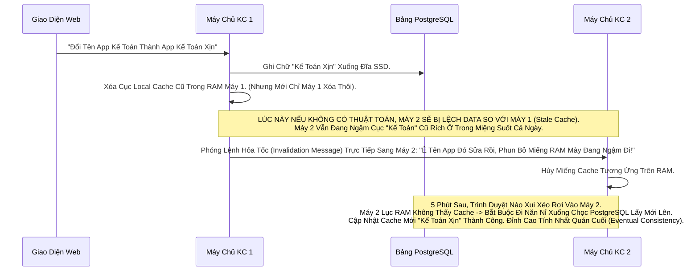

# Lesson 9: Cụm Mạng Lưới Bộ Đệm (Infinispan Cache)

> [!NOTE]
> **Category:** Theory & Architecture (Lý thuyết & Kiến trúc)
> **Goal:** Lột xác sự mù mờ về "Trí Nhớ RAM" của Keycloak. Tại sao Keycloak cấp Token nhanh như điện xẹt mà không làm cháy Database? Bí mật nằm ở Mạng Lưới Dữ Liệu Phân Tán (Infinispan). Phân biệt ranh giới sống còn giữa Local Cache và Distributed Cache.

## 1. Lý thuyết chuyên sâu (Detailed Theory)

### 1.1. Infinispan Không Phải Là Redis
Mọi người hay nghĩ: *"Cache thì dùng Redis cho nhanh"*. Nhưng Keycloak TỪ CHỐI Redis làm Core Cache. Nó nhúng **Infinispan (In-Memory Data Grid)** THẲNG VÀO TRONG BỤNG CỦA MÌNH.
- Nếu xài Redis: Keycloak (App) phải mở Cổng Mạng (Network Call) chạy ra ngoài gọi Server Redis. Tốn 2ms. 
- Xài Infinispan Nhúng (Embedded): Keycloak Đọc Data TRỰC TIẾP TRÊN THANH RAM VẬT LÝ CỦA CHÍNH NÓ (L1 Cache). Tốc độ là 0.0001ms. 

### 1.2. Phân Cực 2 Cấu Trúc Trí Nhớ (Local vs Distributed)
Keycloak Cực Kỳ Cáo Già Khi Chia Bộ Nhớ Ra Làm 2 Nhóm Hành Vi:
1. **Dữ Liệu Tĩnh (Realm, Client, Role, User Profile):** Bọn này Rất Hiếm Khi Đổi. Lâu Lâu Admin mới sửa Tên 1 Lần. 
   -> Nó được nhét vào **LOCAL CACHE (Bộ Đệm Cục Bộ)**. Nghĩa là MÁY CHỦ NÀO ÔM DATA MÁY CHỦ NẤY. Không Truyền Số Liệu Qua Lại Mạng Lưới Cho Tốn Băng Thông. Đọc Trực Tiếp Trên RAM Bằng Tốc Độ Của Lõi CPU.
2. **Dữ Liệu Động Lực Học Lớn (Session Đăng Nhập, Mã Code Trả Về):** 1 Giây Đẻ Ra 1000 Cục. Cục Này Cần Phải Có Mặt Ở Cả Máy A Lẫn Máy B Để Làm Đăng Xuất SSO.
   -> Nó Được Nhét Vào **DISTRIBUTED CACHE (Bộ Đệm Phân Tán)**. Mỗi Lần Sinh Ra, Nó Bắn Sóng Broadcast Sang Các Máy Keycloak Hàng Xóm Để Đồng Bộ RAM Chéo.

---

## 2. Luồng nội bộ & Cơ chế cấp thấp (Internal Workflow & Low-level Mechanisms)

Thảm Kịch Đồng Bộ Khi Admin Sửa Tên App Đột Xuất (Cache Invalidation):

---

## 3. Thực hành tốt nhất & Bảo mật (Best Practices & Security)

> [!IMPORTANT]
> **Tắt Sạch Cache Lúc Đổ Bê Tông (Bulk User Import)**
> **Tội Ác Ngu Đần:** Bạn Dùng Đoạn Script Bắn 1 Triệu Cái Tài Khoản Mới Vào Keycloak Thông Qua Hàm API Tạo Mới Lên DB, Trong Lúc Cụm Cache Vẫn Đang Bật Maximum.
> **Hậu Quả:** Mỗi 1 Lần Bạn Tạo Xong 1 Thằng User Mới Lên Cụm. Cái Thằng Keycloak Chịu Tải Sẽ Bắn 1 Tin Nhắn Rác Báo Cáo Sang Toàn Bộ Máy Chủ Hàng Xóm Để Cập Nhật. Bắn Liên Thanh 1 Triệu Lần Gây Tràn Bộ Nhớ Mạng Trọng Mạch Đệm Tích Dụ Infinispan Cháy CPU Đỏ Lửa (Cache Thrashing).
> **Best Practice:** Nếu Cần Import Giga Data. Tạm Thời Giảm Tham Số Cấu Hình Local Cache Của Realm Chứa Người Dùng Đó Trút Về `Max-Size = 0` (Hoặc Xóa Rỗng Trước). Import Thẳng Lõi Xong, Mới Khởi Động Vòng Cache Nhồi Bật Trở Lại. 

> [!CAUTION]
> **Ác Mộng Hội Chứng Não Trẻ Đôi (Split-Brain)**
> Keycloak Này Chạy Bằng Giao Thức JGroups (UDP/TCP Ping) Để Kết Nối Các Máy Chủ Thành Vòng Tay Hữu Nghị.
> Nếu Công Ty Bạn Bị Đứt Cáp Mạng Ở Giữa. 2 Con Máy Server Nằm Cánh Trái Tưởng Rằng Tụi Nó Là Trùm Cuối (Tự Lập Ra Cụm A Mới Bầu Nhóm Trưởng). 2 Con Server Cánh Phải Cũng Tự Nghĩ Chắc Nhóm Kia Chết Hết Rồi Bèn Bầu Ra Nhóm Trưởng Cụm B.
> Data Lệnh Cắt Kéo Bắt Bớ Session Của Mảng A Mảng B Bị Độc Lập Không Đồng Bộ. User Login Vào Nửa Này Nhưng Chặn Login Bị Văng Ở Nửa Kia.
> **Kiến Trúc Chống Split Brain:** Đừng Dựng Cụm Số Chẵn (Ví Dụ Dựng 2 Con Hay 4 Con). LUÔN LUÔN CHỌN SỐ LẺ (3 CON). Dùng Thuật Toán Kẻ Quyết Định Bầu Chọn Chóp (Quorum). Máy Bầu Nếu 2 Con Bị Đứt Xa Lìa Nhóm Trưởng. Nhóm Trưởng Nhận Thấy Sóng Phiếu Bầu Mất Khung Dưới 50%. Nó Sẽ Đóng Hủy Hết Kết Nối Của Nhóm Az Sụp Mảnh Nhóm Đi Tránh Sai Data Đồng Bộ Lệnh Ràng.

---

## 4. Cấu hình minh họa thực tế (Configuration Examples)

Sức Mạnh Chia Chủ Sở Hữu (Cache Owners) Trong Tệp `cache-ispn.xml`:
Trong Quá Trình Thiết Lập Distributed Cache, Infinispan Chứa Cú Bẻ Lái Gọi Là `owners="2"`.
Điều Này Có Nghĩa Là Gì? 
- Giả Sử Keycloak Có 10 Cụm Máy (Máy 1 Đến 10).
- Khách Tạo Ra 1 Cục Session. Cục RAM Đó SẼ KHÔNG BỊ COPY TỚI TẬN 10 MÁY. Mà Băm Hashing Sẽ Ném Cục Cache Đó Cho MÁY SỐ 3 (Owner 1). Đồng Thời Copy Sang Thêm Máy Số 4 (Owner 2 Backup). Mấy Máy Còn Lại (1,2,5-10) Tuyệt Đối Không Thèm Lưu Miếng Nào (Chỉ Chứa Cục Bản Đồ Hash Map Cân Nặng Để Đi Đòi Lại Khi Bị Xin Tới).
-> Kết Quả Nhồi Lợi Nhuận: Nếu Máy 3 Cháy Máy Nổ, Đã Có Trí Nhớ Ở Máy 4 Đỡ Chặn. Nếu Hệ Thống Scale Thêm Máy Trở Lên Vô Số Ngàn Máy, Lợi Nhuận Tốc Độ RAM Giữ Nguyên Không Rụng Hư Dài Tốn (Linear Scalability Trực Quan).

---

## 5. Trường hợp ngoại lệ (Edge Cases)

- **Cấu Trúc Cụm Khác Múi Mạng Giao Thoa (Cross-Datacenter Replication):**
  - Đỉnh Cao Của High Availability Lại Là Một Kẻ Phản Diện Của Cache.
  - Công Ty Của Bạn Khách Hàng Ở Tận Châu Á. Bạn Dựng Keycloak Châu Á. Cụm DB Lõi Nằm Tận Mỹ. Mạng Bay Xuyên Thái Bình Dương Mất Hơn Tí Độ Trễ Rõ Căng (200ms).
  - Infinispan Hỗ Trợ Đóng Chặn Lệnh **JDG (JBoss Data Grid)** Site-to-Site. Tụi Nó Sẽ Đóng Gói Nhồi Trăm Lệnh Xóa Cache Xong Thay Vì Gửi Liền Từng Cái Đồng Bộ Đứng Đợi (Xài Cái Này Trễ Kéo Sụp Dài Server Châu Á Mãi Gọi Mỹ Trả Code 200). Nó Dùng Chiến Thuật Trả Async Về Background. Gửi Ném Thôi Tự Dọn Không Ép Xếp Lệnh Trả Nhờ Giao Tức Chờ 0 Phút Kép (Active-Active Đa Khoang Nhưng Dữ Liệu Rụng Độ Tươi Đi 1 Tí Không Sao Kéo Đền Sự Rảnh Trả Lệnh Cao Chút Băng Lỗi Lạc Tích Tụ).

---

## 6. Câu hỏi Phỏng vấn (Interview Questions)

**1. Trong Một Hệ Thống Keycloak Tải Rất Lớn Đòi Hỏi Chạy Khung Container K8S Sinh Tử Lên Xuống (Pod Autoscaling) Chết Đi Sống Lại Liên Tục. Infinispan Hoạt Động Theo Chuẩn Embedded Dính Liền Core Có Còn Phù Hợp Nữa Không? Hay Khuyên Đổi Qua Giải Pháp Nào?**
- **Junior:** Nó trong bụng thì K8S rớt pod nó mất luôn data rớt người dùng logout hết.
- **Senior:** Đỉnh Cao Của Vấn Đề State Của Hệ Phân Tán Container Cấp Vĩ Mô!
- Nếu Tần Suất K8S Pod Khai Tử Nở Liên Tục (Horizontal Scaling Sóng Đánh Ác Liệt). Việc Xài Infinispan Dính Vào Bụng Keycloak Rất Tốn Băng Thông Do Phải Vẽ Lại Bản Đồ Bầu Mới Lại (Cluster Rebalancing) Cứ Mỗi 5 Phút 1 Pod Nở Thêm Rụng Giảm. Khách Đang Rơi Gãy Kẹp Rút RAM Sụp Phiên Nếu Số Máy Chết Quá Nhanh (VD Owner=2 Mà Chết Liền 3 Máy Bị OOM Kéo Giết Thì Tèo Sessions).
- **Kiến Trúc Thay Đổi (Remote Cache):** Team Red Hat Khuyến Cáo Tách Hẳn Toàn Bộ Vòng Bộ Nhớ RAM Sang Xài Dịch Vụ Cụm Chuyên Trị **Infinispan Server Rời Ngoại Trú (Remote Infinispan / JDG Độc Lập)**. Lúc Đó Mấy Thằng Pod K8S Của Keycloak Mới Chính Thức Trở Thành Món Đồ Vứt Chết Stateless 100%. Pod Mới Nở Ra Chặn Ngay Vòi Cắm Đi Rút RAM Ra Cụm JDG Xa Xa Xịn Không Nhức Đầu Ôm Rác Dữ Liệu Tự Trọng Bệnh Mình Lại Hơn Đâu Hết Ráo Sạch Bóng Data Liên Phân (Tất Đạt State-offloading Vĩ Nhân Enterprise Chuẩn Kéo Lõi).

**2. Nếu Admin IT Ghi Nhầm Chặn File Cache Thành Lệnh (Thử Kéo Thả `eviction max-entries="50"`) Tại Local Cache Chứa Nhóm Dữ Liệu Realm Của Keycloak. Khung Hoạt Động Sẽ Trở Thành Trọng Tội Nào Cho Hệ Thống Database?**
- **Junior:** Tại Cache giới hạn 50 người xài nên ai vô sau không lấy được.
- **Senior:** Sai Thuật Toán Cơ Chế Ổ Đệm. Cực Căng Thẳng Lõi.
Local Cache Dữ Liệu Trọng (Ví dụ User Profile Hay Realm Info) Mà Cài Max Size Quá Thấp (Eviction Nhỏ). Khi Có Người Dùng Thứ 51 Chọc Tới Màn Hình. Keycloak Bị Đẩy Cục Data Của Người Thứ 1 Rơi Khỏi Rìa Vực Thùng RAM Nhét Vào Hư Không (Evicted).
Đến Khi Lệnh Gắn Quay Lại Hỏi Dữ Người Số 1 Này, Keycloak Chạy Vô Thùng Lục KHÔNG THẤY Móng Nào. Bèn Dội Cú Rên Lên Đập Trực Diện Vào PostgreSQL Bắt Query Trích Rút Lại Thông Tin Của Người 1 Từ Ổ Cứng SSD Sắt Thép Đẩy Trội Lên Ghi Lên RAM (Rồi Ép Kẻ Chót 51 Lại Rơi Khỏi Rìa Xóa Sổ Tiếp). 
Điều Này Tạo Nên Ác Mộng Trọng Bệnh Liên Hoàn Nhét Vào Nhồi Ra Đạp Lên Database Liên Tục 100% Trục Thời Gian. Quạt CPU Bốc Hỏa, Lệnh Query SQL Rên Siết Chạy Nghẽn DB Max Connection 100%. Đâm Thủng Toàn Khối Trái Bộ Đệm Do Việc "Có Cache Nhưng Cài Dung Lượng Ngu Hơn Không Có" (Cache Thrashing Chết Lấp Nhau Tranh Ghế Đi Ngầm Gãy DB Đổ Khốc).

---

## 7. Tài liệu tham khảo (References)
- **Infinispan Data Grid:** Local vs Distributed and Eviction Policies.
- **Keycloak High Availability Guide:** Clustering and Caching.
