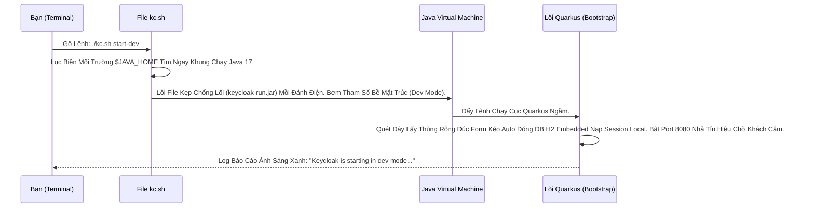

# Lesson 1: Cài đặt Cục bộ Cổ điển (Local Installation)

> [!NOTE]
> **Category:** Theory & Practice (Lý thuyết & Thực hành)
> **Goal:** Trải nghiệm Cảm giác Cổ điển nhất: Cài Keycloak bằng cách tải File ZIP, giải nén và chạy Bằng Môi Trường Java Thuần. Dù bây giờ ai cũng dùng Docker, nhưng việc tải ZIP sẽ giúp bạn nhìn Thấu Thị Cấu Trúc Thư Mục Gốc Của Cỗ Máy trước khi bị giấu đi trong vỏ Container.

## 1. Lý thuyết chuyên sâu (Detailed Theory)

### 1.1. Yêu Cầu Nền Tảng (Java Runtime)
Keycloak Lõi Quarkus vẫn là một Ứng Dụng Chạy Trên Máy Ảo Java (JVM).
- Bạn BẮT BUỘC Phải Có Java Cài Sẵn Trong Laptop.
- Các Bản Keycloak Đời Mới (Từ v24+) Yêu Cầu Rất Gắt Gao: **OpenJDK 17 Hoặc 21**. Trọng Điểm Đẩy Tốc Độ Chạy Ép Java Gấp Mạch. Lỡ Trọng Trái Xài Java 8 Hay 11 Xưa Lắc, Compiler Sẽ Văng Lỗi Đỏ Đáy Chặn Ngay Trục Khởi Động.

### 1.2. Mổ Xẻ Cấu Trúc Bụng ZIP (Directory Structure)
Khi Giải nén File ZIP Tải Về (`keycloak-24.x.x.zip`), Bạn Sẽ Thấy 4 Cơ Quan Nội Tạng Cốt Lõi:
- `bin/`: Trái Tim Nhịp Đập. Chứa Các File Lệnh Thực Thi (Executable) Như `kc.sh` (Linux/Mac) Hay `kc.bat` (Windows) Dùng Để Nổ Máy Hoặc Tắt Động Cơ. Kèm Các Công Cụ Admin.
- `conf/`: Bộ Não Nhớ Luật. Chứa Cặp File Định Mệnh Cấu Hình Lõi `keycloak.conf` (Quyết Định Cổng, Đít DB, Mật Khẩu Kết Nối).
- `providers/`: Bãi Đỗ Tiện Ích Gắn Rời. Chỗ Để Thả Mấy Cái Lỗ Chui SPI Rộng Bạn Tự Code Bằng `.jar` Nhét Vào Sống Cháy Ngầm.
- `data/`: Ổ Cứng Rác Tạm. Khi Mới Boot Development (Không Có DB Xịn), Keycloak Lén Đẻ Ra Database Cục H2 Nằm Tạm Ở Đây, Và Chứa Bãi Bơm Log File Văng Tràn RAM Rớt Mạng.

---

## 2. Luồng nội bộ & Cơ chế cấp thấp (Internal Workflow & Low-level Mechanisms)

Hành trình Giây Phút Lệnh Gõ Vào Terminal Hoạt Động:



---

## 3. Thực hành tốt nhất & Bảo mật (Best Practices & Security)

> [!IMPORTANT]
> **Tội Ác Chạy Keycloak Bằng Quyền Cao Nhất (Never Run As Root)**
> **Lỗi Hỏng Chết Lịm Linux:** Bạn Lười Tạo Phân Quyền User Trên Server Centos/Ubuntu. Cầm Acc `root` Giải Nén Và Gõ `./kc.sh start`. Lệnh Chạy Vô Cùng Ngọt Lành.
> **Hậu Quả Đêm Khuya:** Kẻ Tấn Công Lợi Dụng Lỗ Hổng Rò Rỉ Code Bất Kỳ Tầng Nào Trong Các Thư Viện Lõi Lỗ Đen Của Keycloak Nào Đó Lấy Quyền Chạy Mã (RCE). Vì Tiến Trình (Process) Của Keycloak Đang Đeo Thẻ Đỏ Của Vua (Root). Kẻ Cướp Lập Tức Leo Thang Nhận Trọn Chiếc Server 100% Xóa Trắng Data Ổ Đĩa Root Của Trọng DB Bên Trong!
> **Quy Luật Sắt:** Bắt Buộc Lập 1 Tài Khoản User Bị Bắt Mò Mọc Cụt Tên Gọi Là `keycloak_user` Bị Cấm Không Thể Đăng Nhập Bash Gắn Ngầm Đít. Đưa Toàn Quyền Folder Khung Giải Nén Chuyển Sở Hữu Về Cho Nó Bằng Lệnh (`chown -R keycloak_user:keycloak_group /opt/keycloak`). RỒI CHẠY Tiến Trình Dưới Thân Phận Kẻ Tội Đồ Yếu Nhất Này. Kẻ Thù Hack Lọt Vào Cũng Chỉ Bị Giam Mặc Kẹt Ở Đít User Chết Đứng Bức Tường Lửa Tách Biệt Root Tôn Nghiêm.

> [!CAUTION]
> **Sự Dối Lừa Đẹp Đẽ Của Chế Độ "start-dev"**
> Khi Mới Tải Về, Nếu Bạn Gõ Lệnh `start` Trần Chuồng, Keycloak Sẽ Chửi Vào Mặt Và Tắt Động Cơ Ngay Báo Rằng Không Thấy Chìa Khóa Bọc SSL Băng Giấy, Bắt Bẻ Cài DB Đáy Cấu Hình Nặng Nề.
> Để Dỗ Dành Cục Cưng Dev Vừa Tập. Red Hat Sinh Ra Lệnh Đồ Chơi Nhanh **`start-dev`**. 
> BÙM! Nó Bỏ Chặn Mọi Giao Giao Thức Bảo Mật, Lột Sạch Sẽ Tường Lửa Tường Thành H2 Chạy Ram Bỏ Password HTTPS Văng Nhẹ Tênh Lấy Tốc Độ Môi Trường Local Mượt 0 Giây Cài Chống Bóp Nặng. 
> THẾ NHƯNG: Nếu 1 Thằng Junior Đem Cục `start-dev` Bê Y Nguyên Cho Lên Môi Trường Thật Production Chạy Ngoài Public IP. 1 Đêm Sau Server Bị Nuốt Đứng Nhồi Mạng, Rớt H2 Trắng Lệnh Và Xóa Data Xóa Sạch Hoàn Toàn Nếu Rớt Cầu Dao Cháy. (Chế Độ Đồ Chơi Phải Vứt Ở Lại Laptop, Cấm Mang Ra Ánh Sáng Ngoài).

---

## 4. Cấu hình minh họa thực tế (Configuration Examples)

Bài Tập Thực Tế Nhanh Đầu Đời (Setup Bằng Lệnh Linux Nguyên Thủy):
```bash
# 1. Tải về file nén Gốc Cốt Thép Bản 24.0.1
wget https://github.com/keycloak/keycloak/releases/download/24.0.1/keycloak-24.0.1.zip

# 2. Rã Đông Bọc Vỏ
unzip keycloak-24.0.1.zip
cd keycloak-24.0.1

# 3. Ép Nhồi Tạo Quản Trị Viên Mồi Gốc Đầu Tiên Vì Máy Mới Lên Đâu Có Ai Giữ Chìa (Admin Gốc)
export KEYCLOAK_ADMIN=super_boss
export KEYCLOAK_ADMIN_PASSWORD=mat_khau_thep

# 4. Giật Dây Máy Chạy Cho Chế Độ Học Sinh
bin/kc.sh start-dev
```
Trình Duyệt Mở `http://localhost:8080`. Bạn Nhìn Thấy Khung Giao Diện Admin Màu Trắng Vàng Cốt Lõi. Đăng Nhập Khung. Bạn Chính Thức Sở Hữu 1 Cụm IDP Nhẹ Cấp Độ Rác Ngầm Ngay Trong Tay Tức Khắc.

---

## 5. Trường hợp ngoại lệ (Edge Cases)

- **Trận Huyết Chiến Xung Đột Băng Tần (Port Conflicts 8080):**
  - Môi Trọng Lập Trình Viên Spring Boot Nằm Sẵn Cổng Cứng Bám Thép `8080` (Mọi Tomcat Đều Nhắm Cổng Này Hút Sinh Khí Sớm Nhất). 
  - Vừa Khởi Động Cái Lệnh Của Keycloak Lên. Văng Vỡ Cháy Đỏ Màn Hình Lỗi Khóc Lóc Exception: `Address already in use`. 
  - Khắc Phục Gọn Đuôi Ép Trọng Mạch Keycloak Bẻ Cổng Rẽ Trái Đỉnh Cao Chỉnh Tại Lệnh Terminal Thay Tên Trượt Rớt Bề Không Va Chạm:
  `bin/kc.sh start-dev --http-port=8180` (Rời Cổng Nhà Cho Spring Boot Xài Cứ Xài, Keycloak Đi Ra Hẻm Xéo 8180 Ngồi Chờ Kéo Lệnh Nhẹ Tênh).

---

## 6. Câu hỏi Phỏng vấn (Interview Questions)

**1. Trong Quá Trình Thay Cập Nhật Version Keycloak. Ví Dụ Cũ Là Bản 22 Lên Bản 24. Nếu Đang Cài Bằng File ZIP Thủ Công Thế Này. Bạn Làm Cách Nào Để Không Đứt Data Giữa Chừng Nếu Lôi Thư Mục ZIP Mới Giải Nén Ra Lạ Hoắc Kế Bên Thay Vào Chỗ Đáy Cũ?**
- **Junior:** Bê nguyên cục copy qua đè lút thư mục cho nó update ruột.
- **Senior:** Lệnh Đè ZIP Là Hành Vi Bóc Trắng Phá Hoại Tệp Cấu Hình Khách Viết!
Quy Trình Vá ZIP Đỉnh Chóp:
1. Bạn Giải Nén Thư Mục 24 Ở Gần Kéo Bên Chỗ 22.
2. Bạn Vào Thư Mục Gốc 22 Cũ. COPY Rút Trọng 2 Thùng Chứa Cấu Hình Đời Rễ: Thùng `conf/` (Chứa Mật Mã DB, Lệnh Chỉnh Config), Thùng `providers/` (Chứa File JAR Mình Tự Viết) Quăng Ném Vào Thư Mục Khung 24 Trống Trải.
3. Chỉnh Link Chạy Khung Server Lại Nút Cứng Đuôi Thay Sang Vòng Thư Mục 24 (Vứt Xác Lõi Code Bản 22 Rác Xóa Bỏ Xóa Trắng Sạch Chừa DB Mạng). Khi Keycloak 24 Bật Lên, Nó Ăn Lại File Conf Rỗng Cũ Nắn Bảng JPA Ghi Database Liquibase Tự Viết Dọc Thành Bản Kế Cấp Chuyển DB An Toàn Gọt Băng Thép Không Trầy (Tắt Nguồn Khung Xưa Ốp Cấu Đáy Cũ Sang Code Cốt Mới).

**2. Nếu Máy Chủ Centos Local Của Công Ty Lạ Mặt Bị Chặn Gọi Ra Internet Khóa Gắt (Air-gapped Environment). Thằng Quarkus Ở Cấp Build Của Lõi Keycloak Có Nổi Điên Văng Đòi Đi Lấy Tải Jar Mạng Về Khởi Cục Đúc Cốt Không? Có Start Lên Nổi Trong Rừng Kín Không?**
- **Junior:** Cứ có Java là chạy được không cần Internet đâu.
- **Senior:** Hoàn Toàn Chính Xác Giao Chặn Đáy. 
Khác Với Mấy Ông Lõi Nodejs Code Build Cứ Lục Ục Lên NPM Kéo Package Tùm Lum. Trọng Gói Lõi Keycloak (Bản Phát Hành Final ZIP) LÀ MỘT KHUNG THỂ KÍN HOÀN TOÀN TẬP ĐỘC LẬP (Self-Contained). Nó Đã Ôm Sẵn Vài Trăm Chục Mega Byte Mớ File Thư Viện JAR Chôn Vùi Rỗng Dưới Đáy Phủ Rút Tại Khung Tầng Đáy `/lib`. 
Hành Động Khởi Chạy `kc.sh build` (Nếu Admin Cần Thay Đổi Tầng Cấu Trúc Khóa Cứng) Tại Máy Chủ Kín Kẽ Này TUYỆT ĐỐI KHÔNG SANG MẠNG ĐÒI MỞ RỘNG BĂNG TẢI LỆNH. Quarkus Khéo Léo Moi Lõi Thư Viện Chôn Sẵn Dưới Mộ Lên Ép Tái Biên Dịch Không Tốn Nửa Dòng Giao Tiếp Giao Ngoại Lưu Xa, Quá Nhanh Chống Sập Không Yêu Cầu Chút Không Khí Kênh Khác Ngoại (Air-gapped Production-Ready Ngàn Vàng Tiện Mảng DevOps Bảo Mật Ngân Hàng Không Có Cáp Kéo Ra).

---

## 7. Tài liệu tham khảo (References)
- **Keycloak Getting Started:** Setting up on Bare Metal / ZIP.
