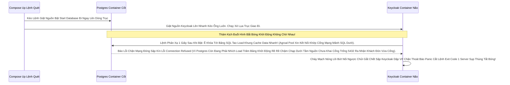

# Lesson 3: Cụm Dịch Vụ Với Docker Compose

> [!NOTE]
> **Category:** Theory & Practice (Lý thuyết & Thực hành)
> **Goal:** Khống Chế Trục Động Cơ Đa Thể. Keycloak Chỉ Là Một Cục Xác Vô Tích Sự Nếu Không Có Cục Trí Nhớ Bề Đáy (Database Postgres). Docker Compose Đóng Vai Trò Là Vị Nhạc Trưởng Kéo Sập Rào Hai Cục Kính Lại Dưới Cùng 1 Kịch Bản Khúc Nhạc.

## 1. Lý thuyết chuyên sâu (Detailed Theory)

### 1.1. Sự Trống Vắng Lệnh Đơn Lẻ Nhục Nhã
Bài 2 Chỉ Giúp Ta Kéo Mỗi Cục Bọc Keycloak Lên. Chạy Chế Độ Development Đồ Chơi Gắn DB Nằm Chung Bụng. 
Ra Đường Thật Việc Chạy Bằng Lệnh `docker run` Dài 20 Chữ Bơm Tham Số Môi Trường Chạm Lỗi Typo Thừa Dấu Phẩy Sẽ Gây Bức Tử Sóng Khúc Không Hồi Kết. Việc Khống Chế Tạo Sợi Mạng Nội Bộ (Docker Network) Nối Máy Database Sang Lỗ Máy Keycloak Bằng Tay Gõ Tay Xuyên Tường Càng Khủng Khiếp Trống Điên Tiết Quên Mất Mũi. 
**Docker Compose Là Vị Vua Kịch Bản Yaml.** Nó Dựng Toàn Bộ (Mạng Ảo Sống, Ổ Cứng Rời, Máy DB, Máy Máy Mẹ Cấp Token) Kép Tách Rời Bằng 1 Cú Bấm Kéo Lệnh Duy Nhất Nấu Đúc Cấu Hình Hạ Tầng Code Hóa Sống Đời (Infrastructure as Code Sơ Khai Lỗ Chui).

### 1.2. Mạng Lưới Nhện Ảo Nội Cục (Container DNS Resolution)
Docker Compose Khi Kéo Rút Màn Hình. Nó Bẻ Gãy Một Vùng Không Gian Định Nghĩa Sẵn Gọi Là Trạm Giao Thức Lưới Mạng (Custom Bridge Network). 
Điểm Sát Thủ Quyền Năng: Máy Bọc Kính Keycloak KHÔNG CẦN Tìm Tên Mạng Trái Thép Nhức Não IP Phập Phù Rơi Tốc 192.168 Đục Băng Chéo Của Postgres Làm Gì. Nó Kêu Bằng **TÊN DỊCH VỤ CHÉO TÊN Nhau Cứng Định Đít Luôn**.
Trong Máy Keycloak Gõ Lệnh Chọt URL DB: `jdbc:postgresql://postgres_database:5432...`. 
Chữ Chống Phẳng `postgres_database` Bị Cục Mạng Router Nội Bộ Đáy Ảo Docker Compose Dịch Bẻ Khớp Thẳng Trục Sang IP Chạy Sống Sót Ẩn Của Cục Bọc DB Postgres Dữ Liệu Tức Khắc Nhanh Oanh Liệt! Trọng Mã Khúc Kết Nối Cực Gọn Bóp Dễ Bảo Trì Không Lo Chạy Đáy Lỗi IP Sụp Tuyến Tên.

---

## 2. Luồng nội bộ & Cơ chế cấp thấp (Internal Workflow & Low-level Mechanisms)

Bẫy Văng Thép Chặn Dây Tốc Gây Đứt Cầu Tại Vạch Xuất Phát Nếu Vội Vàng Quá Đích:



---

## 3. Thực hành tốt nhất & Bảo mật (Best Practices & Security)

> [!IMPORTANT]
> **Giải Mã Lệnh Cứu Hộ Lưới Nhện Chết Nhanh (Wait-For-It Bọc Đuôi Đít Khởi Chạy Sống Sót Lệnh Mòn Nhịp Chờ Đợi Vô Ưu Trút Đầu Mạng)**
> Lệnh Chống Treo Rụng Móc Ngược Từ Đồ Gãy Ống Bơm Nước Giữa 2 Máy Sống Trong Docker-Compose Trái Bơm.
> Bạn PHẢI DÙNG Từ Khóa Kìm Hãm Thời Gian Khởi Nguồn Kẽ Sống Dòng `depends_on`.
> **Kiến Trúc Sai Lỗi Nhẹ Nhàng Thất Bại:** Gõ Dòng Cứng `depends_on: postgres`. Docker Chỉ Đợi Postgres Vừa Bật Là Nó Quật Lệnh KC Chạy Ngay. (Vẫn Đứt Ngầm Vì Postgres Bật Xong Mất Gần Trọn Vài Chục S Giây Mới Setup Xong Giao SQL Đất Nền Chuẩn).
> **Giải Phóng Chuẩn B2B Đỉnh Nắp:** Cấu Thúc Bật Nền Lọc Cổng Chờ Phản Cứng Trực Diện SQL (Healthcheck).
> Bạn Chèn Nhét Dòng Viết Khai Lệnh HealthCheck Vào Máy Database DB (Ép Nó Chạy Lệnh `pg_isready` Bắn Đi Lỗ). Sau Đó Khai Khớp Ở KC Gọi: `depends_on: postgres: condition: service_healthy`. BÙM! Keycloak Nằm Chờ Ngoan Ngoãn Cười Nhạc Uống Trà Khoanh Tay Lệnh Giữa Trời Gió Nhìn Postgres Cài Cắm Khi Nào Vững Trãi Lõi Giấu Chữ Xong OK Trả Cờ Dấu Xanh Sáng Đèn (Healthy). Keycloak Mới Chịu Cất Cánh Khởi Động Nhồi Bật Trọng RAM. Mượt Bất Tử Chống Sập Tranh Chấp.

> [!CAUTION]
> **Sự Rò Rỉ Đuôi Port Gây Phá Hoại Nội Mạng Tội Nặng An Ninh Vạch Ranh Giới Sống (Exposed Database Ports)**
> Một Bạn Lười Viết Trong Docker Compose. Ở Khung Database Của Postgres Bạn Vô Tình Mở Trống Bọc Ô Kẽ Lệnh `- "5432:5432"`.
> Tưởng Là Vô Thưởng Vô Phạt Cho Bạn Dev Vô Test SQL Trực Tiếp Từ Laptop Nhanh Dễ Bật Nắp Xem Ngầm.
> **Lỗ Hổng Trọng Đại Mạng Nằm Ẩn Lén Rút:** Cổng 5432 Bị Đập Gãy Xuyên Nát Ra Ánh Sáng Ngoài Kèm Internet Khuyết Nhựa Cứng Môi Trường Thật! Thằng Hacker Dùng Cụm Tool SQL Quét Văng Mạng Đục Mỏ Kéo Brute Force Hack Gãy Mật Khẩu Database Kéo Phẳng Rễ Ăn Cắp Session Đuôi Ngầm Nóng Đáy Xã Hội Rác Chết Database Thủng Keycloak Cháy Cục Mảnh DB Vỡ Toang Dữ Liệu Tầng Đáy Sập Vệ Tinh Kéo OIDC Giết Ráo Chết Rụng Bất Thình Lình 4 Ngã. 
> **Thép Chặn Luồng Nhựa:** Ở Môi Trường Triển Khai Xịn Trọng Điểm Giữ Rễ. Cấm Tuyệt Đối Bơm Port Hở Tại DB Ra Ngoài Mạng Map Host. Bọn Nó Xài Docker Network Cụt Đáy. Nghĩa Là Keycloak Chọt Kéo Database Nhanh Đứt Gọi Không Bằng Đuôi Bằng IP Thép Docker Mạng. Bên Ngoài Tắt Lối Lệch. 100% Blind Mù Tịt Lỗ SQL Nằm Đuôi Rụng Kẽ Rút Hoàn Hảo Bóng Phủ Tuyệt Diệt Hack Lưới Gắn Đội Bất Khả Xâm Phạm Không Còn Nút Đít Database Nào Hở Giao Bề Phía Mũi Trực Ngoài Rìa Đón Port Nhọn!

---

## 4. Cấu hình minh họa thực tế (Configuration Examples)

File Kịch Bản Xé Vòng Siết Giữ Cổng DB & Bơm Kép Cấp Khúc Giao Trọn Chống Bể Lõi Nhau Kéo Sập Rác Cắm (Docker Compose Lõi Cứng Hoàn Hảo):

```yaml
version: '3.8'

services:
  pg_kho_chua_thep:
    image: postgres:15
    environment:
      POSTGRES_DB: keycloak
      POSTGRES_USER: keycloak
      POSTGRES_PASSWORD: password_sieu_cung_khong_doan_duoc
    # TUYỆT ĐỐI KHÔNG ports MỞ HỞ RA NGOÀI ĐỤC RỖNG BÓNG Ở ĐÂY! Giấu Trong Mạng Ảo Vùng
    volumes:
      - postgres_data_nut:/var/lib/postgresql/data
    healthcheck:
      test: ["CMD-SHELL", "pg_isready -U keycloak"]
      interval: 5s
      timeout: 5s
      retries: 5
    networks:
      - vung_an_toan_kin_mang

  kc_nao_bo_bay:
    image: quay.io/keycloak/keycloak:24.0.1
    environment:
      KC_DB: postgres
      # Nối mạch Ống Sống Tên Hệt Thằng Anh Bằng Dây Lệnh Gọi Ngầm (Dịch DNS Nội Không Hở Mạng)
      KC_DB_URL: jdbc:postgresql://pg_kho_chua_thep:5432/keycloak
      KC_DB_USERNAME: keycloak
      KC_DB_PASSWORD: password_sieu_cung_khong_doan_duoc
      KEYCLOAK_ADMIN: admin
      KEYCLOAK_ADMIN_PASSWORD: admin
    command: start-dev
    ports:
      - "8080:8080" # Chỉ Một Cửa Trống Rỗng Này Cho Khách Truy Cập Cung Trình Login OIDC Web Lọc Token
    depends_on:
      pg_kho_chua_thep:
        condition: service_healthy # Chờ Lệnh Chẩn Khám Mạch Đập Xong Mới Boot Lên!
    networks:
      - vung_an_toan_kin_mang

volumes:
  postgres_data_nut:

networks:
  vung_an_toan_kin_mang: # Rào Kẽ Nhọn Đất Trống Mảnh Ghép Nội Bộ Đâm Kéo Mảnh Vỡ Trái Sóng Bẻ Khóa Bất Nhập!
```

---

## 5. Trường hợp ngoại lệ (Edge Cases)

- **Ma Trận Giao Khớp Kéo Proxy Gãy Cổ Thắt Nút Tại Điểm Trả Callback OIDC Đuôi (HTTPS Xuyên Rối Dây Header Chống Nhau Tầng Cáp Đuôi Dội Chạy Cụt Chữ Kép Nối):**
  - Thường Đằng Trước Keycloak Trong Bài Toán Docker Sẽ Đặt 1 Thằng Cổng Vào Mở Kẹp Vành Đai Nginx Quay Mặt Ra Đường Hứng SSL Sóng Kép Mã Hóa Bắn Nhả Chặn Áp Lực Đuôi Tấn Công Tải Hỏng Cục Tĩnh.
  - Vấn Đề Lớn Ảo Diệu Đứt Quãng Lệnh Vỡ Khúc Tọa Cầu: Nginx Gửi Ngầm Lệnh Vào Phía Bụng (Keycloak Lúc Này 8080 Cởi Truồng Trần Mạng HTTP Lõm Ở Dưới Mạng Lưới Nhện). Khi Keycloak Thúc Trút Mã Lệnh In Rác Lên HTML Bắn File Trả Login Có Tờ Mạng Lệnh Hướng Link CSS JS Nào Đều Ghi URL Đề Trần Chữ Móc Gốc `http://...`.
  - Khách Hàng Web Ở Ngoài Gặp Vỡ Nát CSS Trắng Xác Layout Gãy Cửa Không Đăng Nhập Được Vì Mạng Bắt Giao Thức HTTP Đuôi Nhẹ Tênh Trộn SSL Bảo Mật Lỗi Mix-content Đỏ Đuôi Ác Xé.
  - Lệnh Giải Rỗng Vây Rễ: Bắt Nginx Phải Nhét Thật Mạnh Kẽ Dấu Tích Proxy Vào Cục Headers (`X-Forwarded-Proto: https`). KẾT HỢP Biến Bơm Khối Lệnh Ở Docker-Compose Nhận Trận `KC_PROXY=edge`. Lập Tức Não Bộ Keycloak Soi Thấu Bức Trần Biết Rõ Mình Đang Chạy Ngầm Núp Nginx Bọc Mẹ. Giao Ánh Sáng Khung URL Chút Nhựa Ngầm Trả Nhả Form Kẹp Tráng Lớp HTTPs Thép Trọn Gọn Liệt Bóng Hoàn Hảo Hóa Hình Tuyệt Vời Rắn Ánh Sáng Xử Mạch Cứng Dây Chạy Trơn Chu Vút Khách Chạm Đuôi HTTPS Chút Vọt Réo Mạch Phẳng Tốc Độ Bám Trần Lặn Nhả Link Đẹp An Tâm Rút Tải Cực Vời Chống Vỡ OIDC Kéo Nhịp Mượt Chặt Khớp (Lesson 7 Tương Lai Triển Khai Production Sẽ Đập Lại Kẹp Giải Chi Tiết).

---

## 6. Câu hỏi Phỏng vấn (Interview Questions)

**1. Trong Phép Vẽ Đường Docker Compose Khi Lệnh Run Quét. Làm Thế Nào Gắn Nháp Trút File Code Nhựa SPI Custom Code Lệnh Build Kép Bạn Vừa Viết Đè Đống Vào Lưới Máy Keycloak Mới Tanh Lúc Khởi Động Không Chạm Quét Đáy Ảnh Code Bê Tông Bản Gốc Vừa Chỉnh?**
- **Junior:** Tự tạo 1 image Dockerfile mới rồi COPY vào chạy thôi tốn 2 phút.
- **Senior:** Quá Lằng Nhằng Đội DevOps Rẻ Tiền. Sử Dụng Mapping File Tại Chỗ (Hot Volume Bind).
Ngay Tại Mã Yaml Docker Compose Dưới Dòng Image. Lấy Bơm Cột Volumes Đâm Vọc Chọt Ngang Chữ Đinh Cắm Khung File Custom `.jar` Trực Nối Từ Máy Trút Áp Phẳng Nét Dính Không Đứt Rời Vào Đỉnh Chóp Ống Nhét SPI Của Keycloak Nằm Đáy Vùng Ruột Cứng `/opt/keycloak/providers/`.
`volumes: - ./my-custom-spi.jar:/opt/keycloak/providers/my-custom-spi.jar`
Khi Compose Up Bật Máy Cháy Động Cấp Sóng Nguồn Lên. Phép Toán Lệnh Kéo Start Build Chạy Dò Lụi Quét Lôi File Thép Trải Bơm Nhồi Thưởng Vọt Tự Động Load Cái Ruột Đó Biến Tấu Component Sóng Chạy Nhè Nhẹ Phẳng Hình. Đỉnh Không Phải Đục Đẽo Tạo Nằm Rỗng Dockerfile Ép Lại Gây Nhức Đầu Gấp Gác Giữ Image Rối Kéo Cáp Mới Lại! Cứ Update Mã Java Ngoài Laptop Bấm Lệnh Chạy Cực Nhàn Không Bưng Khối Trút Đúc Chảy Vỏ Phiền Mệt Cự Vạn.

---

## 7. Tài liệu tham khảo (References)
- **Keycloak Docker Compose Guide:** Database and Network Orchestration.
