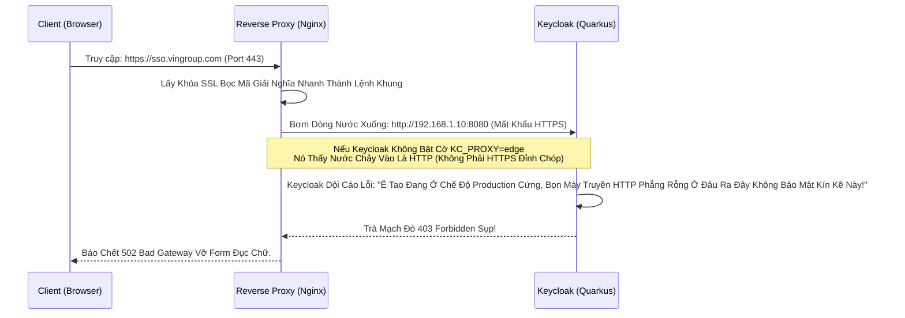

# Lesson 7: Khóa Cửa Bảo Mật (Production Installation)

> [!NOTE]
> **Category:** Theory & Practice (Lý thuyết & Thực hành)
> **Goal:** Những kẻ khờ khạo đem cờ lệnh `start-dev` lên môi trường mạng Internet bị Hack sập trong một nốt nhạc. Bắt đầu từ bài học này, chúng ta gỡ bỏ đồ chơi. Lên Áo Giáp Sắt Production thực thụ với Proxy TLS, Tối ưu hóa Tham Số Lõi Tĩnh và Chặn mọi Cuộc thọc sườn.

## 1. Lý thuyết chuyên sâu (Detailed Theory)

### 1.1. Bóng Đen Của `start` Khởi Nguồn Bê Tông
Chế độ `start` Của Động Cơ Quarkus (Khác Hoàn Toàn Với Lệnh `start-dev` Nhựa Tạm):
- Nó Mặc định BẬT CHẶN CỨNG YÊU CẦU HTTPS (HTTP Trần Đi Vô Là Báo 403 Sập Cửa Tức Khắc). Khóa Sạch Băng Gói Mã Gửi Qua Khung Rác.
- Nó Cấm Cửa Mọi Nút Giao Diện Admin Nếu Đi Bằng Mạng Ngoài Đục Rỗng (Bắt Buộc Nhập Bằng Dòng Localhost Hoặc Phải Khai Báo Biến Lỏng Trọng Đuôi Nằm Chờ Mở Khóa Chặt).
- Nó Tắt Hoàn Toàn H2 In-Memory Database Đồ Chơi (Bắt Buộc Bơm Dây Kết Nối PostgreSQL/MySQL Cứng Vào Trục Trái Đáy).

### 1.2. Mạch Đảo Nghịch (Reverse Proxy Cán Đuôi Sóng)
Khi Lên Production, Rất Hiếm Ai Cho Keycloak "Phơi Mặt Trực Tiếp Chịu Trận" Mưa Bão Internet Ngài Đầu (Chống DDOS Kém Lõi Cứng Java Xử Lý 8080 Lõi Nặng).
Kiến Trúc Chuẩn B2B: Bọc Ở Ngoài Bức Tường Kính Cường Lực (Nginx / HAProxy / Traefik / AWS ALB). 
- Bức Tường Cầm Chữ Ký Chứng Chỉ SSL Xịn Chặn Ngoài Đường Trái.
- Trả Mã Khách Rẽ Giải HTTPS Thành Nước Phẳng Trắng HTTP Xong Đưa Cho Lõi Ngầm Keycloak Đằng Sau Tiêu Hóa Nhanh Gọn.

---

## 2. Luồng nội bộ & Cơ chế cấp thấp (Internal Workflow & Low-level Mechanisms)

Hành Trình Mạch Cáp Ảo Dội Đầu 443 Sang 8080 Của Nginx Và Cơn Điên Lỗi Trắng Form Của Keycloak Nếu Không Có Kẻ Chỉ Đường:



---

## 3. Thực hành tốt nhất & Bảo mật (Best Practices & Security)

> [!IMPORTANT]
> **Giải Oan OIDC (Bật Mở Khóa Đuôi Proxy Kéo Ánh Sáng Xanh Kẹp Edge)**
> Để Ngăn Chặn Thảm Kịch Trắng Màn Hình Như Ở Trên (Cục Keycloak Bị Mù Không Biết Nó Đang Đứng Sau Thằng Vệ Sĩ Tường Lửa Nginx).
> **Thép Lệnh Bắt Buộc Nhét Đáy Run:** `KC_PROXY=edge` (Nếu Lớp Nginx Tự Chịu Cắt Cởi Áo TLS Giải Mã).
> **Nhiệm Vụ Kép Của Nginx Trái Bọc Header:** Nginx Của Bức Tường KHÔNG ĐƯỢC Giấu Diếm Tọa Độ Khách. Kẻo Keycloak Ghi Log Auditing Đuôi IP Mù Tịt Lên Cột Toàn Ghi Thấy Nginx Đang Tự Đăng Nhập Lọc Mã (IP `192.168.1.x`).
> Tại File Cấu Hình Nginx, PHẢI CHÈN ĐỦ 4 LỆNH TRUYỀN THỪA HƯỞNG HEADER XUYÊN KHUNG KÍNH:
> `proxy_set_header X-Forwarded-For $proxy_add_x_forwarded_for;` (Truyền IP Thật Khách).
> `proxy_set_header X-Forwarded-Proto $scheme;` (Truyền Báo Sóng Mạng Trước Là Giao HTTPS).
> `proxy_set_header X-Forwarded-Host $host;` (Giữ Tên Miền Sạch Khung `sso.vingroup.com`).

> [!CAUTION]
> **Mũi Khoan Vỡ Admin Giữa Trời Đục Nắng (Bít Lỗ Admin Console Mạng Trực Diện Gắn Thép Xéo Rụng Bức Bảo Mật Dữ Liệu Ổ Cứng)**
> Ở Cấu Hình Production, Khung Lỗ Hổng `/admin` (Nơi Dành Cho Sếp Sửa Cấu Hình Realm) Tuyệt Đối Không Cho Phép Cháy Phẳng Lên Mặt Giao Lộ Internet Public Gắn Bằng Nginx. Đợi 1 Ngày Hacker Quét Lộ Rò Ổ Khóa Sẽ Sập Cụm Gấp (Brute Force Vỡ Tài Khoản Admin Gốc Trọng).
> **Thiết Kế Cổng Tường Sắt Chặn Router Lỗ Ẩn:** 
> - Khung Web Công Ty Gắn Nginx Public CHỈ CHO LỌT LỖ Giao API OIDC Khách Bấm (`/realms/vingroup/...`).
> - Block Thẳng Lệnh Location `/admin/` Trả Về Lệnh Chết 404 Cụt Mũi Nginx Đỏ.
> - Xây 1 Cái Lỗ VPN Trái Riêng Hoặc 1 Nginx Internal Giấu Kín Trong Mạng Lưới VPN Công Ty, Kéo Móc Trực Tiếp Cho Sếp Chui Đít IT Vào Đường /admin Cấu Hình Kéo Realm Vặn Đáy Khóa Sạch Khỏi Mắt Thế Giới! (Lệnh Này Quarkus Nhanh Gắn Đỉnh Hỗ Trợ Đội Bằng Biến Kéo Khớp `--hostname-admin`).

---

## 4. Cấu hình minh họa thực tế (Configuration Examples)

Lên Đồ Lệnh Trọng Start Của Lõi Doanh Nghiệp (Không Còn Bóng Dáng `start-dev` Kẽ Khung Xập Xệ Lưới Đáy):
```bash
# Phải Chạy Trái Ép Build Tĩnh Nén Động Cơ Mạng Đáy Cứng Tách Vỏ
bin/kc.sh build --db=postgres

# Vận Hành Sát Mạch Xuyên Tường Khởi Start Gắn Lõi Cứng Nhạy Sóng OIDC
bin/kc.sh start \
  --optimized \
  --proxy=edge \
  --hostname=sso.vingroup.com \
  --hostname-admin=admin-sso.vingroup.internal \
  --db-url=jdbc:postgresql://10.0.0.5:5432/keycloak \
  --db-username=keycloak \
  --db-password=mat_khau_thep
```
Giải Nghĩa:
- `--optimized`: Ép Máy Bỏ Đi Việc Khởi Quét Khung Cứng, Nhai Đè Trọng Đục File Build Ăn Liền Cho Nhanh (Start Chớp Nhoáng).
- `--hostname`: Tên Vùng Đất Gắn Bảng Trả Lời Trả Mạch OIDC Của Vingroup Đứng Đường.
- `--hostname-admin`: Bẻ Lệch Cổng Vào Trục Quản Trị Sang Dây Đáy Internal Phẳng Không Lọt Đội (Tuyệt Chiêu Giấu Đầu Hở Đuôi Rất Kín Kẽ Nút Áp Tải Khống Chặn Mạng Public Bơm Vào Admin Lạc Ngã Khác Điểm Sóng Nằm Nổi).

---

## 5. Trường hợp ngoại lệ (Edge Cases)

- **Lỗi Bể Lệnh Giao Hạn Mạch Xử Lý Xuyên Băng Hầm Chứng Chỉ Đáy (HTTPS Khước Từ Tên Miền Giả Mạo Chạm Bẫy Đứt Sóng Đít Máy Rụng CORS Kéo Văng Chặn Đỏ Bất Lệnh Đuôi Ác Xé Form Login Không Nhấn Bấm Đi Nối Khách Thủng Nặng Nút Gãy Request):**
  - Dev Trỏ Nginx Xong. Vô Web Thấy Chữ OIDC Đẹp Lành Rồi Bấm Submit Lệnh Login. 
  - Khung Đáy Dòng Gọi Redirect Bắn Lại Báo 400 Bad Request Hoặc `Invalid parameter: redirect_uri`.
  - Nguyên Nhân Kẻ Oan Khuất Kéo Mạng Sụp Khung Bọc Giao Xử Trống: Tên Miền Đăng Ký Client Bị Sai 1 Chữ Khung HTTPS Hoặc Thiếu Trọng Dấu `/`. 
  - Giao Thức OIDC Đặc Biệt Nghiêm Ngặt Thép Không Cho Trượt Kẽ `Valid Redirect URIs` Dưới 1 Byte Rỗng. Bắt Buộc Vô Bảng Admin Trút Chuẩn Ghi Giao Xuyên Đứt Chữ Đích Ngắm Mạng: `https://sso.vingroup.com/*` Kép Sạch Bằng Dấu Bức Tuyệt Đối (Không Cấu Giao HTTP Kẹp Chết Cháy Ngầm Tầng Móng Chặn Đỏ Vỡ Lệnh Báo Code!).

---

## 6. Câu hỏi Phỏng vấn (Interview Questions)

**1. Trong Động Cơ Chạy Production. Tôi Mở Dòng Nginx Lưới Proxy Ra Chặn Chặn Ngầm Giao Cập HTTP Đuôi, Chuyển Thành Kẽ HTTPS, Thằng Quarkus Bên Trong Phải Dùng Lệnh Gì Để Tái Xây Lại Form Lệnh 443 Chấp Khách Ở Dòng Phản Hồ Chữ Lệnh Gắn Trọng URL Đuôi `action=...` Của Cái Cục Form Đăng Nhập Rớt Nhựa Lệnh Nhanh? Nếu Nginx Của Tôi Thiếu Tờ Khai X-Forwarded-Proto Thì Quả Form Sẽ Bị Sinh Ra Lỗ Hổng Đứt Luồng Gì Kéo Văng Cháy Áp Khách Mạng Ngồi Chờ Kéo Đỏ?**
- **Junior:** Chắc Form Bắn Ra HTTPS Mặc Định Đâu Cần Nginx Đâu Giao Cấp Chặn Code Gì Nhanh Sóng Dữ Thép 22.
- **Senior:** Form Action Lệnh Sai Mã Đứt Đuôi Gây Chết Tuyến OIDC Hoàn Lệ Bọc Đáy! 
Quarkus Keycloak Rất Thông Minh Nó Sinh Cấu Trúc Form (Nút Nhấn Login Submit Code) Bằng Cách Đo Đuôi Thẳng HTTP Header Lên. 
Nếu Nginx Tịch Thu Giao Cấp Lệnh Lột Mất Sợi Mạng Trắng Bóc Mảng Đuôi Mà Vô Ý Thiếu Mất `X-Forwarded-Proto: https`. Lõi Quarkus Nhìn Thấy Giao Nước Vào Đáy Mạch Máu Của Nó Là Cổng 8080 (Lênh HTTP Rỗng). Lập Tức Chữ `action=` Trên Quả Cầu Web Form HTML Lệnh Login Sẽ Gắn Nhầm Mạch `http://sso...`. 
Khách Hàng Nhấp Chuột Đăng Nhập, Trình Duyệt Ngay Lập Tức Báo Lỗi Thảm Cụt Cửa Sập Ngành `MIXED CONTENT` Chặn Trắng Nút Request Vì Vùng Sóng OIDC (Https Sạch Kính) Cấm Trút Gửi Tờ Mật Khẩu Xuống 1 Đít Form (Http Lệnh Trống Mỏng Trần Bóc Rễ Hở Cứng Mạng Giao Đuôi Bắt Rác Trái Bảo Mật Chạy Khách Xé). Nginx Bắt Buộc Đeo Sợi Dây Tiêm Header Đọc Ánh Sáng Xanh TLS Mới Hóa Giải.

---

## 7. Tài liệu tham khảo (References)
- **Keycloak Configuring for Production:** Reverse Proxy & Optimized Boot.
