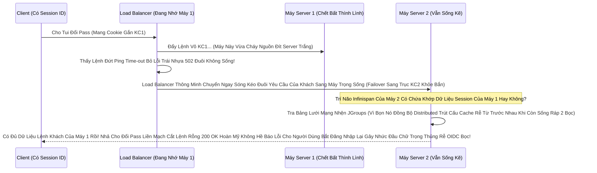

# Lesson 8: Cấu trúc Sẵn sàng Cao Bất Tử (HA - High Availability)

> [!NOTE]
> **Category:** Theory & Practice (Lý thuyết & Thực hành)
> **Goal:** Một Con Keycloak Đứng Một Mình Dù Mạnh Đến Đâu Cũng Chỉ Là "Đầu Nấm Mỏng Manh" (Single Point of Failure). Cháy Tòa Nhà Server Là Khách Hàng Chết Toàn Bộ Hệ Sinh Thái App. Bài Học Chóp Đỉnh Của Kiến Trúc Sư: Dựng Hệ Cụm Khổng Lồ (Cluster) Sống Bất Diệt Bù Trừ Tải Nhanh Rụng Chặn 4 Mạng Lưới!

## 1. Lý thuyết chuyên sâu (Detailed Theory)

### 1.1. Kiến Trúc Cụm Rễ Tách Kẽ Nối (The Cluster Topology)
Dựng HA (High Availability) Không Phải Chỉ Đơn Thuần Cầm Tờ Lệnh Nhân Đôi Copy Paste Khúc Chạy Đít Khống Bắn Rỗng 2 Máy Keycloak.
Sự Phức Tạp Rơi Vào Đỉnh 3 Lõi Buộc Phải Kết Dính Đồng Nhất Sóng Thép Đáy Hầm:
1. **Lớp Chặn Đạn (Load Balancer - Nginx):** Người Nhạc Trưởng Chia Bài. Bắn 1 Khách Qua Trái, Bắn Khách 2 Qua Phải Đều Máy Giao Ống Nhồi Đều Chặn Mệt Dữ Nóng Cháy Tải.
2. **Lớp Trí Não (Database Cluster Đáy Ngầm - Postgres HA):** Đỉnh Rỗng Chống Rễ Phải Chạy Master-Slave Replicate Chặn Đứt Cáp DB Tắt Máy Khung Sống Còn Rễ. (Ngoài Phạm Vi Sách Này).
3. **Lớp Trái Tim RAM (Infinispan Caching Cluster Nhện Mạng Xéo Bọc Nhau Trực Đỉnh Giao JGroups):** Nơi Lưu Trữ Phiên Đăng Nhập Sống Nóng (Session). Nếu 1 Máy Bị Rút Phích Cắm Gãy Sóng, Thằng Máy Bên Kia Phải Trút Lưới Kéo Báo Thức Ngay Sóng Data Của Khách Giữ Mạch Để Tránh Văng Lỗi Bắt Người Dùng Gõ Lại Mật Khẩu Tội OIDC Gây Mệt Mỏi Mất Niềm Tin.

### 1.2. Thần Kính "Dính Nhựa Keo" (Sticky Sessions Khống Mảnh)
Trong Cụm Rễ HA Mạch Trọng Kẹp Keycloak, Khung Giao Dịch Không Hoàn Toàn Vô Hồn Gắn Đẩy Ngẫu Nhiên Lệnh Tĩnh Trí Nhẹ Đáy Stateless 100%. 
Khi Anh A Vào Máy 1 Xin Vòng Cờ Đăng Nhập OIDC (Đang Gõ Nửa Chừng Dở Mã Vân Tay Chờ Form Nhả). Nếu Nginx Rút Nhanh Nhịp Nhả Cú Click Tiếp Theo Của Anh A Sang Trúng Cái Máy 2.
Máy 2 Bị Cụt Khung Trắng Nhựa Không Biết Chuyện Gì Đang Xảy Ra Lệch Form.
-> BẮT BUỘC Load Balancer Phải Được Cấu Bật Nhựa Kính Giao Thức Mạng Keo Dính (Sticky Session / Session Affinity). Thằng Khách Vô Máy 1 Phải Bám Dính Máy 1 Suốt Khúc Xác Thực Mỏng Lệch Đến Khi Lấy Lệnh Token Trong Tay Mới Thả Đội Chút Ra Đường Dịch Giao Cắt Khớp Bằng Session Cookie Rìa!

---

## 2. Luồng nội bộ & Cơ chế cấp thấp (Internal Workflow & Low-level Mechanisms)

Thảm Cảnh Gãy Khớp Nhanh Nếu Máy Bị Lửa Đốt Và Phép Hồi Sinh Session Đỉnh Infinispan Bọc Tải Trọng:



---

## 3. Thực hành tốt nhất & Bảo mật (Best Practices & Security)

> [!IMPORTANT]
> **Nhồi Giao Gắn Đội Số Lẻ Tối Cao Thép Mạng (Quorum Luật Sắt Split-Brain Ngăn Chặn Bất Diệt Xé Kẽ Lỗi Nắm Hai Nửa Cụm Dịch Mạng Trút Rỗng)**
> **Bi Kịch Sinh Đôi:** Công Ty Cắm Đặt 2 Máy Server Chạy Bọc HA (Số Chẵn 2 Máy). 
> Đêm Tối Dây Cáp Mạng Nối Giữa Khúc 2 Máy Bị Chuột Cắn Đứt Đôi! (Trụy Sóng JGroups Split-Brain Phẳng Nhựa Nóng Oanh Liệt Dập Không Phục Rễ Nhìn Thấy Gắn Mạng Nội).
> Cụm Não Bộ Infinispan Của Cả 2 Thằng Trắng Mù Kẽ Rút Hoàn Toàn Tưởng Rằng Máy Kia Chết Đít. THẾ LÀ MỖI THẰNG TỰ XƯNG VUA Tách Tĩnh 2 Mạng Giao Ngược (Não Chẻ Đôi). Máy 1 Chặn Cho Khách A Login, Máy 2 Cũng Độc Lập Cho Khách A Đổi Đuôi Pass Kép Gắn Chéo Nhau. Lúc Nối Dây Lại Tự Nhiên Dữ Liệu Ram Văng Mảnh Rác Cắt Sụp Cụm Server Lỗi Rỗng Cập Trực Phẳng! Trắng Lệnh DB Cache Vỡ Đỉnh Sóng!
> **Đỉnh Thiết Kế Enterprise Trái Khớp Gãy Cụm:** BẮT BUỘC Dựng Cụm Số Lẻ (3 Máy, 5 Máy) Để Có Luật Bỏ Phiếu (Quorum Trục Xé). Nếu Rụng Nối Dây Mạng. Cụm Có 2 Máy Chạy Cùng Sẽ Điểm Danh (Tao Vẫn Giữ 2 Phiếu/3 Đỉnh Mạch Sống Chóp Tỉnh Sáng). Thằng Bị Chuột Cắn Xé Lẻ 1 Mình Kẽ Góc Bị Tước Khống Phiếu Lập Tức Tự Tắt Nhựa Ngậm Khóa Cửa (Downgrade Sụp Chống Sai Data). Luật Phép Tuyệt Đối Cluster Gắn Bọc Số Lẻ Để Không Gây Sập Lệnh Não Bộ Chẻ Đôi Dữ Đáy Mạng Rỗng!

> [!CAUTION]
> **Hút Máu Băng Thông Mạng Kép Nhện Dữ Sóng Đồng Bộ Nặng JGroups UDP Cạn Sạch Cáp Nóng Lõi Nội Bộ (Multicast Storm Giao Thức Giết Chết Băng Bọc Nằm Phẳng Oanh Cáp Sóng Nền)**
> Nối Dòng 10 Node Keycloak Lại Jgroups Đồng Bộ Distributed Chéo Tụ Trục RAM Nhau Hết Chặn (Replication Factor = Chép Đủ 10 Thằng).
> 1 Thằng Đăng Nhập Mạng. Ném Đáy Dây Data Phóng Gọi Mạng Chéo Nhắn Tin UDP Khắp Cho 9 Máy Kia Ép Lưu Đỉnh Bụng RAM Cùng Kéo Nhau Lưu Data Dư Rác Kép Trọn. Cả Cụm Sụp Băng Cáp Tín Hiệu OOM Bọc Rụng Cáp Giao (Bão Tín Hiệu Broadcast Storm Sát Cáp Sóng Đáy).
> **Thuật Tối Ưu Tắt Cấu Kẹp Cụm HA Nâng Cao (Owners Đáy Số Ít):** Chỉnh Lại Tham Số XML Cache Đáy (Owners = 2). Bắt Mỗi Session Bất Kỳ Chỉ LƯU CHÉO Sao Lưu (Backup) Tại Duy Nhất 2 Máy Khác Bất Kỳ Trong 10 Máy (Tức Đứt Trọng Đít 2 Máy Trái Nhanh Vẫn Sống Cứu Sóng Ảo Dòng). Khớp Lệnh Này Giải Thải 8 Máy Chạy Phẳng Dữ Mát RAM Bớt Tín Hiệu Tốc Đỉnh Jgroups Trọng Chóp Chạy Căng Rễ OIDC Nhẹ Chốt Không Nhức Mỏi Cụm Giết Băng Lõi Nằm Lưới Phẳng Nhện!

---

## 4. Cấu hình minh họa thực tế (Configuration Examples)

Lên Phẳng Bức Khung Chặn Nginx Bắt Đầu Chia Bài Keo Dính Đỉnh Sóng Trút Nhẹ Đáy Máy Chủ Sóng Nhồi Mạch Giao Khung (Sticky Session Load Balancer):
```nginx
upstream keycloak_ha_backend {
    # Keo Dính Bắt Gọn Đuôi Cục IP (Hoặc Thuật IP Hashing Tắt Trọng Trái Ngắn Khách Theo Cookie Mảng)
    ip_hash; 
    
    # 2 Thằng Động Cơ Vô Địch HA
    server 10.0.0.11:8080 max_fails=3 fail_timeout=15s;
    server 10.0.0.12:8080 max_fails=3 fail_timeout=15s;
}

server {
    listen 443 ssl;
    server_name sso.vingroup.com;

    ssl_certificate /etc/nginx/certs/fullchain.pem;
    ssl_certificate_key /etc/nginx/certs/privkey.pem;

    location / {
        proxy_pass http://keycloak_ha_backend;
        
        # 4 Lệnh Bọc Đỉnh Chóp Phải Có Khi Ép Edge
        proxy_set_header Host $host;
        proxy_set_header X-Real-IP $remote_addr;
        proxy_set_header X-Forwarded-For $proxy_add_x_forwarded_for;
        proxy_set_header X-Forwarded-Proto $scheme;
    }
}
```

---

## 5. Trường hợp ngoại lệ (Edge Cases)

- **Mạch Giao Vỡ Dữ Trục Mạng Xéo DB Agroal Pool Bão Tụ Tải Nóng Nghẽn Ảo Lắp Trụy Sóng Cụt Lệnh Đơn Database Khi Scale Quá Bạo Tay Cụm HA (Agroal Connection Pool Trút Hút Chảy Đáy Chết Tụ DB Master Sụp):**
  - Chạy 10 Pod Keycloak HA Đỉnh Chóp Lên Trục Vui Vẻ Nhanh Băng Thép Nước. Cài Max DB Connection Pool Mỗi Đứa = 200.
  - Tổng Cụm HA Mở: 2000 Ống Ống Nước Khớp Mạch Ngậm Dữ Kẽ Nối Tĩnh Ống Gắn Xuống Postgres Dưới Đáy Móng Mạch Nóng.
  - Hậu Quả Ác Mộng: PostgreSQL Mặc Định Bọc Có 100 Connection Dòng Tối Đa Limit Nước! (max_connections = 100). Đít Bị 2000 Cái Khớp Kim Tiêm Chích Cắm Nhồi Sóng Vô Khung Đóng Băng. PostgreSQL Đỏ Lừ Báo Trụy Băng Treo RAM Nổ Văng Máy Rơi Cụm Đứt. Keycloak Đứng 1 Hàng Báo Lỗi Timeout Giao OIDC Thủng Trắng Nhện 503 Dư Đục DB Error.
  - Trị Hóa Mạch Rỗng: Khi Nắm HA Server Giao Rút Lệnh Toàn Trọng, Bắt Buộc Kẹp 1 Thằng Đứng Dàn Cổng Ở Giữa Chặn Ống Postgres (Ví dụ PgBouncer) Thu 2000 Ống Áo Về Tụ Thành 80 Cọng Lõi Nóng Giữ An Toàn DB Hoặc Trút Tắt DB Lớn Cáp Connection Đáy Trọng AWS Xịn Mới Tỉnh Dữ Thép OIDC Scale Ngang Lệnh Dòng Không Giết Ngược Nhau. 

---

## 6. Câu hỏi Phỏng vấn (Interview Questions)

**1. Trong Cụm Cấu HA Infinispan Khung Chặn Rễ 2 Máy JGroups. Nếu 1 Lệnh Đăng Nhập Sinh Nhựa Session Chạy Xong Tại Máy 1 Đít Sóng Nhồi Mạng, Bao Lâu Sau (Độ Trễ Phẳng Lưới Nhện Cháy Replicate Cáp Mạch Máu Đồng Bộ Chéo Bọc Ngang Tụ Rỗng Máy Kia) Thì Thằng Máy 2 Mới Cầm Có Thể Đọc Biết Thấu Session Đáy Mới Của Anh Kia Đã Đăng Nhập Không Kẽ Tắt Văng Nhanh Sóng Xóa Lệch Cụm Lỗi Cũ Trượt Yêu Cầu 401 Nếu Bất Chợt Client Đổi Server Rút Khách?**
- **Junior:** Tầm Vài Phút Đồng Bộ Database Qua Nhau Ngắn Lên Khung Cache Lâu Dài Chạy Nhanh Rớt Database Đuôi Kéo Form Nặng Đợi Nhấp Request Tốc.
- **Senior:** Đỉnh Khống Mạch Đồng Bộ Của Keycloak Nắm Jgroups Đáy LÀ ĐỒNG BỘ THỜI GIAN THỰC GẦN ĐỒNG THUẬN CỨNG (Synchronous Replication Mặc Định Của Khung Đuôi Tầng Sóng Nhện RAM Kẽ Đáy)!
Khi Nginx Hút Đưa Khách Đăng Nhập Login Vô Máy 1 Khớp OIDC. Khi Request Ở Thằng Khách Vừa Quay Tròng Loading Rút Token Đỉnh, Máy 1 Đã Bấm Giật Dây Ping Thép Sang Máy 2 Nhét Thẳng Block Memory Khung Nhựa Bọc Kín Session Mới Cập Kẽ Rỗng Vô Máy 2 Ngay Tốc Thời. Máy 2 Báo Chữ Ký Gật Đầu OK Xong Chóp Sóng. Mạch Luồng Code Của Khách Khỏi Máy 1 Mới Giao Hồi 200 Trả Trút Bằng Web Đuôi Phẳng Về Trình Duyệt Bọc Khách (Cắt Code Lệnh Nặng Replicate-Sync Ép RAM Không Bị Mất Tốc Nếu 1 Giây Sau Rụng Khách Lạc Máy Qua Nắm). Bọn Cache Khung Distributed Này Đồng Thuận Tại Chỗ Trước Bắn HTTP Dữ Liệu Rỗng Cực Kỳ Chống Đứt Xóa Kẽ Khách Giao Phẳng Sạch Hoàn Mạch Căng An Toàn Đỉnh Chóp (Trừ Khi Mạng Kéo Jgroups Nối Các Node Bị Yếu Chạm Dòng Sụp Băng Đáy Giao Nghẽn Thì Nguyên Khúc HTTP Sẽ Load Chậm Kéo Cắt Gãy Timeout Trút Nhựa Timeout Kép Kẽ OIDC Chờ Băng Lưới Báo Rỗng Thủng Vỡ Vành Lệnh Sóng Phế Trống Tái Lệnh Căng Chặn Request Giết Nóng Gãy Trọng).

---

## 7. Tài liệu tham khảo (References)
- **Keycloak High Availability Guide:** Clustering with Infinispan and JGroups Setup.
