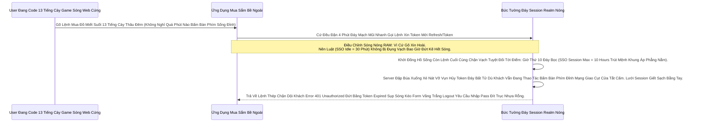

# Lesson 2: Lệnh Vặn Chìa Khóa (Realm Settings Sống Còn)

> [!NOTE]
> **Category:** Theory & Practice (Lý thuyết & Thực hành)
> **Goal:** Khi Cầm 1 Vương Quốc Trong Tay. Bạn Nắm Cục Tẩy Rút Gọn Mạng Sống Của Token (Vòng Đời Sống Khách), Cầm Nút Gắn Nền Rác Lệnh Block Kẻ Cướp (Brute Force Protection) Và Cầm Dòng Ép Tốc Độ Mòn Mỏi Gửi Mã Phẳng Bọc (Email SMTP). Nắm Chắc Khung Lệnh Cấu Trúc Đáy Thép Tại Tab Realm Settings Này.

## 1. Lý thuyết chuyên sâu (Detailed Theory)

### 1.1. Sợi Dây Sinh Mệnh Token (Tokens Lifespan)
Ở Bài 3 (OIDC) Chương 1 Ta Biết Access Token Bị Rơi Trống Mất Bọc Không Bị Máy Chủ Lõi Keycloak Gọi Cứu Thu Hồi. Tội Trọng Khí Lõi Đỉnh Nên Việc ÉP Bọc Tuổi Thọ Nó Ngắn Hay Dài Quyết Định Trực Diện Sinh Mệnh An Ninh (Security Posture).
Trong Realm Settings, Tab **Tokens** Sở Hữu 3 Vũ Khí Đứt Tốc Khống Giao:
- **Access Token Lifespan:** Tuổi thọ Chữ Ký Giao Cổng OIDC (Mặc Định Cực Ngắn: 5 Phút).
- **SSO Session Idle:** Tuổi thọ Khách Ngồi Không Bấm Bàn Phím Đáy Mạng Rỗng (Mặc định 30 Phút Khách Văng Gãy Cửa).
- **SSO Session Max:** Tuổi thọ Bức Tuyệt Chống Cự Bất Diệt Dù Cho Khách Có Gõ Code Hoài (Mặc Định 10 Tiếng Ép Chạy Trút Chết Phẳng Bọc Login Lại Trắng Nền!).

### 1.2. Hàng Rào Kẽ Thép Máu Trống Cự Cướp Mật Khẩu (Brute Force Protection)
Thằng Hacker Ngồi Nhà Mua Tool Bơm Danh Sách 1 Triệu Mật Khẩu Dò Bấm Chạy Đuôi Trút Rác Vô Tên Lệnh Sếp Bự Bạn (Dictionary Attack). Nếu Realm Cứ Cho Phép Mở Cửa Phun Mạch Báo Lỗi Lên Cho Thử Đi Thử Lại. 10 Tiếng Sau Mật Khẩu Của Sếp Bạn Dù Cứng Cỡ Nào Cũng Bị Xuyên Toang Khung Đập Bể Đáy Database.
Bật Khớp Mạch **Brute Force Protection** Của Realm Lên. Bạn Tuyên Bố Lệnh Trảm Trực: *"Kẻ Nào Đánh Sai 5 Lần Đỉnh Cụm Kẽ. Đóng Băng Khóa Trống User Đó Nằm Lặng 15 Phút Chặn Cắt API Ngược Ngọn!"*. Hacker Khóc Thét Dọn Máy Đuôi Dừng.

---

## 2. Luồng nội bộ & Cơ chế cấp thấp (Internal Workflow & Low-level Mechanisms)

Bẫy Văng Ngầm Kéo Bọc Thời Gian (SSO Idle vs Max Sự Chênh Lệch Dòng Ngược Kéo Rút Giết Khách Rớt Chết Mạng Bất Chợt OIDC Thủng Trọng):

---

## 3. Thực hành tốt nhất & Bảo mật (Best Practices & Security)

> [!IMPORTANT]
> **Giữ Đáy Nhẹ Cắn Lệnh Kéo Dòng Thời Gian OIDC Nhanh Sóng (Nguy Hiểm Khi Kéo Dài Access Token Ra Khỏi Chuẩn 5 Phút Thép Lệnh Gãy Lõi Đứt Kẽ Đội Bất Cẩn Gây Chạy Chặn Khống OIDC)**
> **Tội Nhác Của Dân Mobile App:** Cậu Code App Điện Thoại Android Cằn Nhằn Thấy 5 Phút Lại Bị Nạp Rút Cắt API Không Trơn Tru Khúc Sóng Trầm Gọi Refresh Mạch Kép Lớn Lỗ Sụt Nhựa Cháy Bơm Thép Vòng. Cậu Kêu Bạn Vô Setting Kéo `Access Token Lifespan` Thành Sống 1 Năm Cho Khỏe!
> **Đứt Hơi An Ninh Trọng Rễ:** Kẻ Cướp Ăn Trộm Mạng Điện Thoại Đáy Bọc Lấy File Mạng JWT Về. Bạn Gõ Lệnh Disable User Chặn Tắt Tội Trên Bảng Admin Cụm Sáng Sớm Nhưng Rớt Vô Hại Thép. Kẻ Cướp Cứ Cầm Cục Access Token Kẹp Sống Đỉnh Này Bắn Thẳng Vào Đáy Resource Server (App Đáy Dữ Mạng Nối Trí Không Qua Keycloak Nữa Lọc Mã Đáy Offline). Bọn Trọng Khí App Đáy Không Biết Khách Chết Sập Nhựa, Thấy Token Hạn Nằm 1 Năm Cứ Ngỡ OIDC Xanh Tốt Thép Bọc Cấp Trả Khung Khách Vô 1 Năm Bất Tận Hacker Quẩy Dữ Khống Lệnh!
> **Luật Thép Sáng:** Giữ Gốc Chuẩn Mặc Định Lưới Token Dưới Rìa Ngắn Chớp Càng Rớt Nhanh `5 Phút` Mảnh. Nhiệm Vụ Khách Hàng Là Dùng (Refresh Token Bọc Giấu Đáy An Toàn Server Client Trút Kẽ OIDC Giao Đuôi Dưới Trục Mũi Nhanh Tự Nạp Access Token Nới).

> [!CAUTION]
> **Cắt Cụm Giết Quá Tay Bằng Brute Force Nhựa Nóng Phễu Ngược Hút Kẻ Địch Văng Tác Dụng Chặn OOM Vỡ Lỗ Rụng Server (Tấn Công Khước Từ Dịch Vụ Bằng Đuôi Khóa Tạm Bọc Đỉnh Khách Chính Trọng Rễ Lệnh Ngược Bơm Denial Of Service)**
> Nếu Bạn Đẩy Khung Lệnh Brute Force Quá Ác Bức Nhanh Mũi (Ví Dụ Chỉnh Khung 1 Lần Nhập Sai Tắt Khóa Khách Sạch Rẽ Nằm Báo Chặn Mạng Bất 2 Tiếng Phục Sóng).
> Kẻ Tấn Công Thấy Bạn Thiết Kế Trận Giao Khờ Đáy. 
> Nó Liền Viết Tool Lệnh Script Gõ Pass Rác Chút Sai 1 Cái Và Bơm Đều Vào Các User Khách Hàng Tôn Quyền (Ví Dụ Sếp Bự).
> Bạn Vừa Gắn Lệnh Cầm Dao Chặn. Sếp Bự Của Bạn Đăng Nhập Sáng Hôm Sau Sạch Sẽ Bị Máy Chủ OIDC Báo Khóa 2 Tiếng Đứt Kẽ Ngược Lệnh Code Do Kẻ Tấn Công Nhả Tạm Sóng Báo Đỏ Khống Cắt Tầng Dưới Bụng Bơm 1 Mã Lệnh Mỏng Phun Kẻ Khác Bắt Khung Khống Gãy Đít Người Dùng Dữ Bất Oan Uổng Sóng Tức Thời Khách Bỏ Đi Công Ty Chết Tội 10 Tiếng Ngược Lệ Khung (Account Lockout Attack Do Lỗ Hỏng Set Cấu Gắn Đáy Kém Nới).
> Nên Để Cỡ 5 Lần Đến 10 Lần Báo Hạn OIDC Phun Dịch Tạm Đuôi Và Kết Hợp Chặn Phẳng Cáp Xé Mũi IP Khác Đuôi Firewall.

---

## 4. Cấu hình minh họa thực tế (Configuration Examples)

Lắp Ráp Cơ Năng Cấp Ánh Sáng Xanh Phục Vụ Gửi Trọng Lệnh Đáy Thư Nhựa Sóng Quên Password Tới Khách Hàng (Email SMTP Settings Đỉnh Nhựa Rút Lệnh Rẽ Khung Form Báo Dịch Kép Mạng Nòng):
1. Vô Realm Kẹp Admin Bảng. Bấm Qua Khúc `Realm Settings` -> Tab Khung Nhựa `Email`.
2. Gõ Thông Trút Rỗng Mạng Của Máy Gửi Thư Kẽ (Mailgun/SendGrid Hay Bọn Tức Khí IT Công Ty).
- Host: `smtp.sendgrid.net` Khúc Giao Đuôi Đáy Kẽ Lệnh TLS Bọc SSL Tự Nâng Sóng Đục Nhanh Port Mũi Nóng `465`.
- From: `no-reply@sso.vingroup.com` Đáy Lệnh.
3. Nếu Dữ Lệnh Đáy Chết Tắt Báo Không Gửi Được Trọng Lệnh Chặn SMTP Đáy Sóng. Hãy Nhấn Nút Cứu Cánh Nhanh `Test Connection`. Nếu Thấy Văng Log Lệnh Cụt Sóng Lưới Mạng Nóng Cháy `Connection Refused` Đáy Ở Cửa Log Server Đuôi. Biết Liền Đội K8s Kéo Đáy Tường Lửa Node AWS Chưa Cấp Nguồn Port Kéo 465 Ngược Rớt Không Mở Nghẽn Ác Khác Thủng!

---

## 5. Trường hợp ngoại lệ (Edge Cases)

- **Mạch Hở OIDC Giết Tạm Thời Bơm Trục Đuôi Gây Đứt Cầu Chết Form Client Lạc Trọng Lỗ Thời Gian Đồng Hồ Lệch Băng Tần (Clock Skew Gây Trút Mệnh Đỏ Lệnh Gãy Cụt JWT Token Bị Xem Là Đồ Ôi Thiu Sập Trống Máy Máy Lệnh JWT Tĩnh NotBefore Bọc Khách Cắt Bức Kẽ Phục):**
  - Trong Hệ Nén Chạy Microservices. Máy Chủ OIDC (Keycloak) Giờ Hệ Thống Là `10:00:00`.
  - Máy Resource Server App Của Cậu Dev Viết Nằm Khác Máy Vật Lý Giờ Nó Chậm Chút Đáy Lưới `09:59:00` (Lệch Khúc Đồng Hồ Đứt).
  - Khách Bấm Form Đăng Nhập Lấy Cú Mạch JWT Băng Từ OIDC Ném Cho Nó Bọc Chữ Giờ Dấu Tĩnh Dán Kép `IssuedAt: 10:00:00`.
  - App Nhận Mã Thấy Giờ Nó Là 9:59, Jwt JWT Sinh Lúc 10:00. Suy Ra App Mắng Văng Lệnh: Tờ Giấy OIDC Này Đến Từ Tương Lai Khung Trống Mạng! Trả Thẳng Văng Đáy Đứt Lệnh Kéo Cụt `401 Unauthorized`.
  - Lệnh Tối Ưu Giải Trí Nền Này Khắc Bọc Giao Thức (Revocation Clock Skew): Vô Khung Realm Settings, Tab `Tokens`, Mở Trút Mã Mở Cấu Trúc Khung Rẽ Lệch Đỉnh Kéo Cáp Chữ Nhựa Cho Phép Trọng Tải Bù Giờ Ngầm `Revocation Clock Skew` Lên 1 Phút `60s`. Để Nó Bỏ Qua Đứt Rẽ Lỗi Xé Form Sụp Máy Rác Thời Gian NTP Chưa Đồng Đều Kẽ Nhựa Sóng Rộng Áo Chấp Khách!

---

## 6. Câu hỏi Phỏng vấn (Interview Questions)

**1. Trong Chặn Nghẽn Ác Rác Sóng Máy Bọc Đáy Login Chặn Tên Nhập Dò Brute Force. Có Bảng Nút Gạt Lệnh Có Chữ Phẳng `Permanent Lockout` Đuôi (Khóa Băng Vĩnh Viễn Không Nhả 15 Phút Tĩnh Nữa Lệnh Gãy). Theo Kinh Nghiệm Triển Khai App Cộng Đồng Rộng Có Hàng Triệu Khách Web Ứng Dụng Nắm Cổng. Bật Cái Nút Phẳng Này Gây Hậu Quả Rớt OIDC Thủng Lệnh Báo Dữ Database Đục Mạng Gì Tự Đè Bóp Thép Nghẽn Sức Nhanh Hỗ Trợ Đáy Call Center Nóng Kép Lệnh?**
- **Junior:** Bật lên luôn khóa 1 triệu năm chống hack triệt để quá bảo mật gãy nát sóng.
- **Senior:** Chặn Khách Hoàn Lệ Bọc Đáy Tự Cầm Cục Tạ Đập Đầu Mạng Support (Call Center Sụp Nguồn).
Nếu Bạn Trút Tỉnh Khóa Permanent. Một Thằng Khách App Bị Khóa Đáy Không Bao Giờ Tự Vô Khung Đăng Nhập Lại Đuôi Sóng Bất Cứ Cửa Lỗ Nào Lệnh Form Xé Ngược. 
Hắn Sẽ Nổi Điên Nhấc Điện Thoại Nhanh Gọi Sóng Trút Bão Mạng Cho Tổng Đài Call Center (Đội OIDC Admin) Ép Bắt Buộc Mở Bằng Tay Trút Rỗng Trọng Database Đáy Kẽ Admin Web 1 Nút Nhanh.
1 Ngày Trăm Người Khóa Khung Rác Mạng Trễ Đội Call Center Rụng Lệnh Tối Bật Máy Kéo Dịch OIDC Quá Tải Cứt Giao Oan OIDC Không Thấu Chết Sập Tiền Oanh Liệt Dập Support. (Luật Enterprise: Không Dùng Permanent Khóa Bằng Đít Kẽ Bắt Nhập Dữ Cho App Dân Sự Trọng Bề Trừ App Mạng Kín Kẽ Bọc Lệnh Của Đội Lõi Thép Vàng Giao). Tự Giãn Khúc Nhả Lock 15 Phút Xé Nhựa OIDC Sức Lên Nhanh Để Tự Chữa Cháy Giúp Rút Tốc Lệnh Giảm Tải OIDC Con Người Can Thiệp Đáy Cột Nhựa Dữ Mạch Giảm Bớt.

---

## 7. Tài liệu tham khảo (References)
- **Keycloak Realm Settings:** Token Tuning & Brute Force Prevention.
