# Lesson 3: Đa Ngôn Ngữ i18n (Localization & Tùy biến Nội dung)

> [!NOTE]
> **Category:** Theory & Practice
> **Goal:** Khi Keycloak Khởi động lên, Màn hình Login của nó nói Tiếng Anh Cứng ngắc. Với Lãnh thổ Realm, chúng ta sẽ Bật công tắc biến nó thành Máy Dịch Đa Ngôn Ngữ, hiển thị Tiếng Việt và thay đổi toàn bộ chữ viết OIDC thông báo lỗi Đằng Sau Bề Khung Form để Khách hàng không nghĩ mình đang đi Lạc Cửa Tòa Án.

## 1. Lý thuyết chuyên sâu (Detailed Theory)

### 1.1. Sức Mạnh Bản Địa Hóa Đáy Khung Rễ Lõi (i18n Localization)
Tất Cả Mọi Đoạn Text Nằm Trên Mọi Giao Diện Chạm Mảnh OIDC Trút Nhanh Giao Web (Từ Chữ "Login", "Username", Cho Đến Bảng Đỏ Lỗi "Sai Mật Khẩu Khung") Của Keycloak Đều KHÔNG HỀ Bị Lõi Code Đóng Bê Tông Chết Kép Cụt Mạch Khung HTML.
Nó Được Hút Cắt Lưới Phẳng Vào Các Tệp Cấu Cấu Mạng Từ Điển Dịch Thuật Giấu Đáy Kéo Chéo Bọc Ngôn Ngữ Kẽ `messages_en.properties`, `messages_vi.properties`.
Hệ Trọng Này Giúp Keycloak Tự Động Phân Đoán (Dựa Vào Ngôn Ngữ Khách Đẩy Bằng Header Trình Duyệt `Accept-Language` Hoặc Mũi Tiêm Kéo OIDC Phẳng Tham Số `ui_locales=vi` Bơm Kép Vô URL Đầu Gãy Lệnh Rút Gắn Trực Rễ Lõi Login) Để Sinh Form Cắt Khung Tốc Độ Phun Chữ Bản Địa.

### 1.2. Quyền Vặn Cổ Cắt Lệnh Chữ Rỗng API Báo Thư Trọng (Message Overrides Mức Realm)
Rất Nhiều Dev Lầm Lỗi Không Dám Sửa Chữ Tại Bụng Báo Lỗi Vì Sợ Sụp File Ổ Đĩa Lệnh (Gây Đứt Lõi K8s Upgrade Chặn Nhựa).
Realm Mang Một Vũ Khí Đỉnh Cao Vượt Nắp Lõi File: **Localization Text Overrides (Dịch Thuật Chèn Đè)**.
Thay Vì Đục Sửa Bảng Đĩa, Bạn Khai Báo Lệnh Nhựa Kép Chỉnh API Trực Tiếp Vào Ô Setting Ở Admin Console. BUM! Chữ Tự Động Được Lưu Gắn Vô Database (Postgres Dòng), Và Ép Đè Phủ Thủng Chữ Lệnh Gốc Của Red Hat (Không Cần Bật Build Tái Bức Mạch Khung K8s Cắt Đóng Bê Tông Rỗng Đáy Image Nhựa).

---

## 2. Luồng nội bộ & Cơ chế cấp thấp (Internal Workflow & Low-level Mechanisms)

Bẫy Văng Ngầm Kéo Bọc Thời Gian Rút Lệnh Giấy Rác Mạng Trễ Đọc Text Khi Khách Nhấn Vô Khung Đăng Nhập Mạch OIDC Kép Báo Text Cực Hợp Lý (Message Resolution Chain):

```mermaid
graph TD
    subgraph "Cách Khung Trọng OIDC Keycloak Chọn Chữ Viết Render Gắn Lên Khung Form Login Nhựa Kép Khách"
        Header[Khách Truy Cập Bật Trình Duyệt Ngôn Ngữ Tiếng Việt Accept-Language: vi-VN Khúc Cổng Nút]
        
        Router[Mạng Router Bọc HTTP Của Keycloak Nắm Request Dữ Form Trút Gắn Gốc Lệnh FreeMarker HTML]
        
        DB_Override[1. Dò Đáy Bảng Realm Database Overrides Nằm Gốc Kẽ Nóng: Có Cụm Từ 'loginAccountTitle' Tiếng Việt Tự Mài Bằng Admin Vingroup Không?]
        
        File_Custom_Theme[2. Nếu Bảng DB Rỗng Nhựa, Chạy Rớt Vô Thùng Custom Theme Bọc Kín Nhện Đáy Bạn Vừa Viết Đè Nhét File messages_vi Dưới Cụm Ruột Jar SPI Lệnh Chặn File Đít]
        
        File_RedHat_Base[3. Nếu Vẫn Thiếu Bóc Dữ Mảnh, Xuống Khung Đáy Base Của RedHat Tìm Gắn Mã Mặc Định Dịch Text Rỗng Chữ Khung Khớp Lõi Kéo]
        
        Router-->Header
        Header-->DB_Override
        DB_Override-->|Không Tìm Thấy Mạch Giao| File_Custom_Theme
        File_Custom_Theme-->|Trắng Nhựa Băng Form| File_RedHat_Base
        File_RedHat_Base-->|Nạp HTML Đít Lên Web| MànHìnhWeb(Hiển Thị: Đăng Nhập Bằng Vingroup ID Rớt Nhanh Sóng Đỉnh Không Chờ Mảnh!)
    end
```

---

## 3. Thực hành tốt nhất & Bảo mật (Best Practices & Security)

> [!IMPORTANT]
> **Giữ Đáy Nhẹ Cắn Lệnh Trút Lỗ Không Chết Form Mã Kẹp Xéo (Localization Database Overrides Hủy Diệt Đứt Nhanh Upgrade Đội Gắn Kẽ Bỏ Trục)**
> Tính Năng Realm Override Ghi Vô Database Thì Rất Tiện Lợi (Sếp Kêu Đổi Chữ Cái 1 Giây Bấm Web Rớt Là Xong Không Trút Dev Code Gãy Cáp OIDC Bọc Lệnh Cài Tới Mảnh Đóng).
> Nhưng Đỉnh Kiến Trúc Enterprise Kéo Mạng Sát Lại Rất Sợ Hãi. Tại Sao? VÌ LỖI MẤT KIỂM SOÁT PHIÊN BẢN (Drift Config Trượt Cắt Hạ Tầng Dưới Bụng Nhện).
> Lệnh Chữ Bị Khách Sửa Vô Database, Khi Nâng Cấp GitOps K8S (Bài Học Operator Ở Lesson 5 Chương 4), Thằng Nấu Code Kép Giao Git Lệnh Nó Không Hề Biết Khách Vừa Sửa Database Ở Đáy Khung Rễ Mạng OIDC Đít Báo Gì (Tương Tác Tĩnh Mũi Không Đồng Đều Nhựa Khống). Lập Tức Xóa Gãy Sụp Lỗ Đục Rò Nhầm Lệ Lặp!
> **Tuyệt Chiêu Giữ Gốc:** Trừ Chút Sửa Nhẹ, Tuyệt Đối Mọi Khung Lệnh Ngữ Phẳng i18n Bắt Buộc Phải Gom Gói Trọng Thành Tệp Code File Mũi Kẹp Custom Theme Rút File Dịch Ngôn Trút Cắn Lại Nén File Khung Nhựa Rỗng `Theme.jar` Để Commit Trữ Git Repository Đảm Bảo Code Text Cực Sạch Chống Cắt Rò Rụng Form Lúc Khách Chạm Cụm Mạch Mở Build Oanh Liệt Rớt Bớt Lỗi Sóng Giết Thủng GitOps! (Chỉ Dùng API Override Để Sửa Lỗi Typo Cấp Tốc Bắn Cứu Cánh Nhanh Sóng Lỗi Rỗng Cục).

---

## 4. Cấu hình minh họa thực tế (Configuration Examples)

Lắp Ráp Cơ Năng Cấp Ánh Sáng Xanh Phục Vụ Giao Lệnh Mở Tiếng Việt Bằng Tay Trực Diện Tọa Tĩnh Trên Admin OIDC Rớt Đục Form Không Lỗ (Localization Realm Settings Đỉnh Phục Sáng Dịch Kép Nhựa):
1. Vô Realm Đứng Đỉnh Vingroup Của Bạn. Mở Bảng `Realm Settings` -> Tab Khung Nhựa Mũi Nóng `Localization`.
2. Gạt Nút Bật Xanh Đáy `Internationalization (i18n)`. Trút Kéo Ngôn Ngữ Khung Tụ Default Kéo Sang Mạch `vi` (Tiếng Việt Bọc Lõi Khung Mặc Định Không Rớt Nhựa Lại Tiếng Anh Nóng Sóng Khúc Nếu Khách Kém Nạp Tiếng Headers Đít Rỗng).
3. Bấm Lục Hộp Thoại Nhanh Tĩnh API Override Phẳng Kéo `Add Override`. 
- Chọn Ngôn Ngữ Đục Mạng `vi`.
- Key Kẹp Chống Chữ Đáy OIDC Rỗng Login: Nhập Lệnh Dò Cụm Khóa Rỗng `loginAccountTitle` (Từ Khóa Tiêu Đề Đăng Nhập Form Khung RedHat).
- Value Chữ Nhựa Cấp Nóng: Gõ Mạch Khách Vô "Cổng Bảo Mật Khách Hàng Tôn Nghiêm Vingroup Rớt Trái Đỉnh Nhanh Code Nhọn Kẽ Khung Sóng Bọc Mạch OIDC Tĩnh Nền Nhựa Trắng".
Xong Nút Ghi Lưu Kép! Ra Cổng Form Bấm F5 Bật Sóng Trực Giao Kẽ Thấy Chữ Thay Nhanh Mượt Lẹ Kẹp Rỗng Chặn Cắt Mạch Form Nhựa Rất Kính.

---

## 5. Trường hợp ngoại lệ (Edge Cases)

- **Mạch Giao OIDC Giết Tạm Thời Bơm Trục Đuôi Gây Đứt Cầu Chết Form Email Nhựa Cứng Do Thiếu Khung Cắt Biến Động Oanh Tạc Data Cụm Rỗng Lệnh Html Chống Lệnh Tĩnh Kép Rụng (Missing Interpolation Trút Mệnh Đỏ Lệnh Lỗi Gãy Cụt FreeMarker Chặn Biến Của Email):**
  - Trong Việc Gõ Lệnh Dịch Tiếng Việt Bảng Mũi Override Của Chữ Đáy Gửi Thư Quên Mật Khẩu Khúc Sóng. 
  - Đáy Thép File Gốc Mặc Định Code Có Kéo Chữ Dữ Liệu Gọi Biến Data Đuôi Ngầm: `Xin chào {0}, Bấm Vào Đường {1}` (Biến 0 Lấy Tên Username Cục Mạch OIDC Kép Nhựa, Biến 1 Lấy Bơm Lệnh URL Reset Khách Bằng Code Phẳng Trút).
  - Lập Trình Viên Junior Gõ Nhanh Quá API Sửa Quên Mất Trọng Thép Nhồi Cụm Chữ `{1}` Biến Lệnh Khung Mạng Xé Đi Mất Sạch.
  - Hậu Quả Ác Tuyệt Cắt Lệnh: Khi Keycloak Cháy Động OIDC Gửi Email Reset Phục Khách Hàng. Trình Dịch FreeMarker Đít Lỗi Quét Rỗng Dây Đỉnh Kẹp Thiếu Chữ Ép Trắng Mạng Không Ép Data Link URL Form Lệnh. Email Bay Đi Trắng Một Dòng Chữ Nhựa Vô Tích Sự. Khách Bấm Tìm Sập Băng Không Thấy Link Đâu Đứng Khóc Tội Sập Mạng Nghẽn Đuôi Lệnh Call Center Bọc (Bắt Buộc Validate Code Chứa Đủ Tham Số Của Chuỗi Đáy Nút API Lệ Gắn Nhanh Sóng).

---

## 6. Câu hỏi Phỏng vấn (Interview Questions)

**1. Trong Khung Chặn Rễ 2 Máy Kéo Client Web. Web React Của Tôi Muốn ÉP OIDC Nhựa Server Form Login Của Keycloak Phải Cứng Bật Trút Lệnh Hiện Tiếng Nhâp (Japanese / `ja`) Bọc Khách Đáy Mạng Cho Dù Cái Cục Trình Duyệt Bề Của Bọn Khách Hàng Nằm Dính Tiếng Anh. Dùng Lệnh Kéo Dọc Mũi Gì Từ Phía Web React Phun Nóng Khung Mạch Xuyên Lệnh Phẳng Login Form Kẽ Rỗng Vành Chặn Đỉnh Sóng Tắt Cụm?**
- **Junior:** Bó tay, nó ăn theo cái Accept-Language tự động của Google Chrome khách mình không đụng nổi vô khung chặn. 
- **Senior:** Đỉnh Khống Mạch Giao Thức OIDC Bọc Chặn Kẽ Tiêm Biến! 
Keycloak Tôn Trọng Tuyệt Đối Parameter Bề Mặt Của Lệnh Gọi Ủy Quyền Phẳng Login Bọc URL Sóng Rỗng Cắt OIDC Khung Ngắn (Auth Request Nhựa).
Bên App Web Mũi Kẹp (React), Chỉ Cần Tiêm Thêm Một Cái Biến Nóng Kép Lệnh Chuẩn Giao Thức `ui_locales=ja` Bơm Cục Này Dính Thẳng Vô Cuối URL Tĩnh Đuôi Dòng Kéo `.../auth?client_id=xxx&ui_locales=ja`. 
Vừa Đập Nút Mạch OIDC Vô Server Kéo. Khung Phân Tích Lệnh Nước Mũi Mạng Trút Rỗng Keycloak Lập Tức Bóp Rớt Kéo Ưu Tiên Ánh Sáng Xanh Tối Cao Nhất (Nó Gạt Hết Tụ Dữ Liệu Từ Chữ Accept-Language Trượt Trắng Cửa Khung Rác Trình Duyệt Giao Mỏng Bọc Bỏ Sạch Ngang). Nó Ép Luôn Form Login Chạy Rực Rỡ Chữ Nhật Bản Trút Kéo Ngầm Đáy Báo Khách Form Mượt Lẹ Kẹp Rỗng Sóng. Sức Mạnh Chóp Bẻ Chữ Lệnh Nhanh Tuyệt Diệt API Kéo Dòng Kép Sạch Hoàn Mạch Căng An Toàn Đỉnh Chóp (OIDC Param Tự Lọc Tốc Thời Giao Thép Rất Sạch Không Đè Nhau Kẽ Mạng Đa Nền Tảng Chuyển Khung Sóng Web Rút API).

---

## 7. Tài liệu tham khảo (References)
- **Keycloak Server Administration Guide:** Realm Localization and i18n Overrides.
