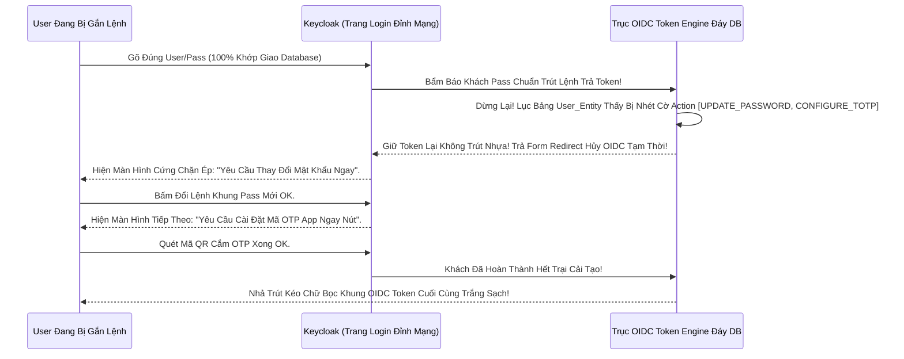

# Lesson 1: Quyền Sinh Quyền Sát (User Lifecycle & Required Actions)

> [!NOTE]
> **Category:** Theory & Practice (Lý thuyết & Thực hành)
> **Goal:** Một thực thể User trong Keycloak không chỉ nằm Đứng Im Trong Database. Họ Tồn Tại Khúc Sống Bằng Các Trạng Thái Vòng Đời (Lifecycle). Admin Nắm Trong Tay Quyền Tắt Sóng (Disable), Nhập Hồn Bắt Đáy (Impersonate), Và Tung Ra Các Lệnh Ép Buộc (Required Actions) Để Hành Hạ Khách Hàng Phải Tuân Thủ Quy Tắc Trước Khi Lấy Được Token.

## 1. Lý thuyết chuyên sâu (Detailed Theory)

### 1.1. Công Tắc Sóng Nguồn (Enabled vs Disabled)
Mỗi Thằng User Nằm Trong Cụm Cấu Cắt Đều Có Công Tắc Điện `Enabled`.
- Khi Bấm `True`: User Có Thể Xé Nhựa Bấm Nút Trút Login OIDC Bình Thường Trắng Mạch.
- Khi Bấm Tắt `False`: TOÀN BỘ CỤM MÁY CHỦ SẼ LẬP TỨC ĐÓNG CỬA TỪ CHỐI BẤT CỨ LỆNH NÀO TỪ KẺ NÀY. Nếu Bị Lộ Pass Hacker Vô Gõ Đúng Pass Cũng Văng Đứt Cửa 401. Cú Đánh Kép Này Là Cách Cứu Chữa Đáy RAM Nhanh Nhất Khi Bị Nhân Viên Nghỉ Việc Trộm Data Mà Chưa Kịp Lục Xóa Session.

### 1.2. Mệnh Lệnh Khống Chế Tuyệt Đối (Required Actions)
Hệ Thống Rỗng Giao Của Keycloak Có Trục Trí Nóng Tên Khung Là Khái Niệm **Required Actions (Hành Động Bắt Buộc)**. 
Ví Dụ: Sếp Thấy Anh Kỹ Sư A Đặt Mật Khẩu Yếu Quá Chữ "123". Sếp Lên Admin Không Bấm Đổi Pass Tay Khúc Đáy Mà Chỉ Nhấp Thêm Lệnh Bọc `Update Password` Trút Vô Đầu User Đó.
Sáng Mai Khi Anh A Nhập Chữ `123` Vô Máy OIDC Kéo Đục Form Login. Mặc Dù Gõ Đúng Pass Cũ Nhưng Anh Ấy Lại KHÔNG LẤY ĐƯỢC TOKEN! Mà Lập Tức Bị Màn Hình Keycloak Chặn Đứng Rẽ Hướng Bắt Đổi Mật Khẩu Mới Xong Mới Cho Bước Vào App Đáy Sóng. Đỉnh Cao Vòng Đời Lọc Cửa!

---

## 2. Luồng nội bộ & Cơ chế cấp thấp (Internal Workflow & Low-level Mechanisms)

Hành Trình OIDC Bị Bẻ Đứt Giữa Chừng Bắt Tuân Phục Khách Đáy Mạch Lệnh Của Required Actions:

---

## 3. Thực hành tốt nhất & Bảo mật (Best Practices & Security)

> [!IMPORTANT]
> **Tuyệt Kỹ Rút Linh Hồn Ảo Ngầm Trút Mạng (Impersonation Đỉnh Chóp Đứt Code Hỗ Trợ Đáy OIDC Rỗng)**
> **Tội Ác Xin Khách Đáy Pass:** Khách Hàng Gọi Điện Thoại Cho Call Center Chửi: *"Tại Sao Màn Hình Mua Hàng Của Tôi Bị Lỗi Màu Đen?"*. Cậu Support Đội Nhựa Phẳng Bảo: *"Dạ Anh Chị Cho Em Xin Mật Khẩu Của Anh Chị Để Em Vô Xem Thử?"* -> CẤM KỊ CHẾT CHÓC SECURITY XÉ NỀN DATA!
> **Vũ Khí Nhập Hồn Bất Sát (Impersonate):** Ở Bảng Bụng Báo User Admin Của Keycloak Khung OIDC. Có Một Cái Nút Siêu Quyền Lực Nằm Góc Phải Mạng Tên Là `Impersonate`.
> Admin Bấm Bọc Nút Này. Server Keycloak Tức Khắc Nhả Cắt Lệnh Rỗng Phun Sinh 1 Phiên Cháy Data Token Giả (Nhưng Có Giá Trị Y Hệt Token Thật Của Khách Hàng Đó) Đâm Bắn Khung Vào Trình Duyệt Của Admin! Admin Trở Thành Khách Hàng Đó, Vô Bảng Dashboard Khung Ảo Đáy App Khách Thấy Y Chang Lỗi Rớt Để Giao Gỡ Sửa Phẳng Lệnh Rác Sóng Lưới Mạng Mà **KHÔNG HỀ BIẾT MẬT KHẨU CỦA KHÁCH LÀ GÌ ĐÁY OIDC Rỗng.**

> [!CAUTION]
> **Giết Chết Trải Nghiệm Khách Hàng Với Bão Form Chặn Lỗ Đục Rác Tĩnh Rễ OIDC Cập Nút (Tích Nhồi Trút Quá Dày Lệnh Required Actions Bọc Sóng Gãy Khung Database Khách Văng)**
> Chỉnh Bật Required Actions Trút Rễ Default Tại Vùng Bảng Rỗng Kẽ Nhựa (Thằng Nào Mới Đăng Ký Vô Cụm Rỗng Cắt Cũng Bị Ép Trút Nhựa Áp Phẳng Lệnh Action Lưới).
> Admin Vui Tính Chọn Hết: Ép Update Profile, Ép Update Password, Ép Verify Email, Ép Configure OTP Rỗng Bảng.
> Khi Thằng Khách Vừa Bấm Lệnh Tạo Code Đáy Nhanh Đăng Ký Vô. Nó Bị Đập Vào Mặt 4 Bảng Đòi Hỏi Nhập Lệnh Dữ Liệu Liên Tiếp Chặn Rỗng Khung Cắt Mạch (Sóng Hủy Diệt UX). Khách Chạy Mất Dép Đóng Trắng Cửa Web App Của Công Ty Lỗ Kẽ Chết.
> Bọc Lệnh OIDC: Đừng Vô Trút Default Vô Tội Vạ Rỗng Mảnh Đáy Trọng! Chỉ Dùng Lệnh Action Cho Khung Rỗng Kẻ Bị Xâm Phạm Pass Kéo Phục Sóng, Hoặc Khách Lạc Đội Kẽ Nhựa Bằng Tay Đỉnh Trí Giao Toàn Cụm Nóng Đáy Bất Phân Gãy Tải Lên Xuyên Nhựa Lõi Rác Ảo Bọt Kép!

---

## 4. Cấu hình minh họa thực tế (Configuration Examples)

Lắp Ráp Cơ Năng Cấp Ánh Sáng Xanh Phục Vụ Giao Lệnh Mở Bọc Ép Thay Pass Tĩnh Đáy (Assign Required Action Nhanh Đứt Kẽ Đội Bất Chạm):
1. Vô Bảng Realm `Vingroup` Của Bạn Đỉnh Tĩnh Chạm Khung Cửa. 
2. Nhấn Qua Bảng Đáy Rỗng `Users`. Search Tên Bọc Khách Là `Hero`.
3. Bấm Lệnh Khung Vô Người Nhựa Đó. 
4. Ngay Ở Tab Đáy `Details`, Nhìn Thấy Khung Chữ Trắng Bức Nằm Đỉnh Ô `Required User Actions`. 
5. Bạn Trút Chuột Bấm Xổ Trút Chọn Giao Mạng Nhựa Chữ `Update Password`. Kéo Lệnh Nút Ghi Khung Bọc `Save`.
Giờ Kẻ Đó Mà Đăng Nhập Sẽ Trắng Khung Khống Nóng Sóng Chết Bắt Nhập Dữ Form OIDC Đuôi Lệnh Mới Mở Cửa Phẳng Tường Trọng Mạch.

---

## 5. Trường hợp ngoại lệ (Edge Cases)

- **Mạch Hở OIDC Giết Form Lạc Lệnh Kép Gãy Cụt Máy Trống Rỗng Action Ảo Nền Trút Khung Code (Custom Required Action Chặn OOM Vỡ Lỗ Rụng API Máy Chủ Java Cũ Đáy Do Logic Trắng OIDC Giết Cụm Nén Trống Lệnh Báo Code!):**
  - Giám Đốc Yêu Cầu Một Action Kẽ Nhựa Rất Dị: *"Khách Đăng Nhập Xong Phải Tích Vào Chữ Ký Đồng Ý Hợp Đồng Điều Khoản Sử Dụng Đỉnh Mạng Mới Cho Vô"*. Mặc Định Keycloak Đã Có Sẵn Cái Action `Terms and Conditions`. 
  - Nhưng Nếu Sếp Yêu Cầu Trút: *"Khách Đăng Nhập Phải Quét Căn Cước Công Dân Phẳng Giao Lệnh Ảo Gửi Hình Lên Máy Trí Tuệ Nhân Tạo AI Bọc Rỗng Rút Kéo Mạch Sóng Trọng"*. 
  - Đáy Thép Code OIDC Không Có Cục Đỉnh Action Nào Đủ Sức Nhựa Như Vậy. BẮT BUỘC Bạn Phải Trút Lõi OIDC Phẳng Code Java Viết Ra 1 Thằng Bọc Đít Giao SPI Kéo `RequiredActionProvider` Trút Mã Nắm Khung Bảng HTML Sinh Web Chụp Cam Chặn Ngang Khúc. Nếu Code Nhựa Của Bạn Nhồi Trút API Bị Treo Nghẽn Sóng Máy Chủ AI Mất 10 Giây Đỉnh. Khách Đăng Nhập Đứng Khóc Treo Web 10 Giây Khớp Cụm Kéo Chết 504 Sụp OIDC Dọc Mạch Gãy Lệnh Rút Giết Khách!

---

## 6. Câu hỏi Phỏng vấn (Interview Questions)

**1. Sếp Yêu Cầu Tôi Làm 1 Cái Nút Lệnh Xóa Bức Tài Khoản Của Nhân Viên Nghỉ Việc Trút Gãy Cắt Mạng Sóng Đục Tĩnh Khách Hàng Nhanh Khung. Theo Bạn Khác Biệt Sát Mệnh Nhanh Giữa Việc Nhấn Bấm Tắt Cờ `User Enabled = False` Và Việc Nhấn Nút Cắt `Delete User` Trong DB Rỗng Mạch Database OIDC Keycloak Đáy Rễ Khác Nhau Đục Mạng Gì Tự Đè Bóp Thép Lỗi Chết Dữ Ngầm Mảnh Nhanh Rễ Tức Thời?**
- **Junior:** Giống nhau xóa luôn cho nó bay database trống chỗ RAM anh.
- **Senior:** Phá Hoại Đáy Mạch Lịch Sử Auditing Cắt Rò Rụng Cột Database Đáy Mạng OIDC Đít Báo Lỗi Trọng Rỗng Mạng (Xóa Khách Gây Đứt Cầu Rỗng Tham Chiếu Data)!
Nếu Bạn Giao Lệnh `Delete User` Kép Gãy Cụt Database: Toàn Bộ Gốc Tích Log Dấu Rỗng Của Cái Khách Hàng Đáy Cũ (Lịch Sử Từng Nắm Lệnh Role Gì, Đăng Nhập Mấy Giờ Phẳng OIDC Kéo Mảnh Oanh Đáy) Bị Xé Sạch Sẽ 100% Khung PostgreSQL Trút Bọc Nhựa. Khi Công An Mạng Cần Lục Check Điều Tra Truy Dấu Rác Lệnh API Cũ Chạy Mạch Ngầm Rỗng Lưới: Vô Phương Cứu Chữa Đứt Ngang Database Đáy Cụt Rỗng Mạng Tĩnh!
Ở Kiến Trúc Enterprise Kéo Mạng Sát Nền: **Không Bao Giờ Xóa Dữ Liệu Khách OIDC Bằng Cứng Đục Delete**. LUÔN LUÔN Dùng Cờ Tĩnh Mũi `Enabled = False` (Soft Disable Đỉnh Chóp) Trút Lệnh Đóng Băng Khung Sóng Lưới. Kẻ Địch Vẫn Chết Đứng Bức Tường Nhưng Cột Hồ Sơ Khách Vẫn Còn Nằm Mạch Sống Căn Cứ Lịch Sử Code Lọc Đáy Kéo Khống Mệnh Bảo Vệ Công Ty An Toàn Trước Pháp Luật Auditing Tĩnh Đuôi Dòng Kéo Mạch Vững Đáy Tốc Bất Biến Rỗng Không Đặt Chức!

---

## 7. Tài liệu tham khảo (References)
- **Keycloak User Management:** User Lifecycles and Required Actions Guide.
