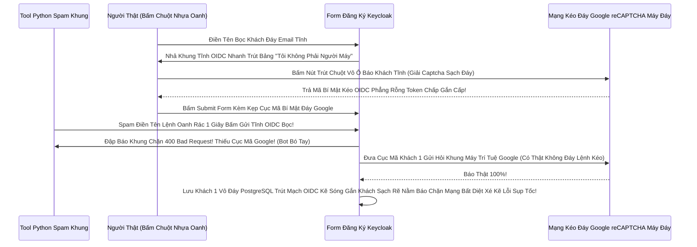

# Lesson 2: Cổng Thành Kẽ Hở (User Registration & Chống Bão Bot)

> [!NOTE]
> **Category:** Theory & Practice (Lý thuyết & Thực hành)
> **Goal:** Nếu Realm của bạn dành cho Khách Hàng Mua Sắm (B2C). Bạn không thể dùng Tay gõ Đăng ký từng Khách vào Database được. Bạn phải bật cổng Mở Đăng Ký Tự Do (User Registration). Nhưng ngay khi Mở Cổng, Bão Bot Của Hacker Sẽ Trút Xuống Hủy Diệt Server Của Bạn Nếu Thiếu Bức Tường Lửa Tĩnh Không Cho Phép Bot Rác Thâm Nhập.

## 1. Lý thuyết chuyên sâu (Detailed Theory)

### 1.1. Công Tắc Mở Cổng OIDC (User Registration Toggle)
Mặc định Đỉnh OIDC Trọng Khí, Keycloak KHÔNG CHO Khách Đăng Ký Bất Cứ Rìa Nào (Cấu hình B2B Đóng Vùng Kín Đáy Kẽ Lệnh). Chỉ Thằng Admin Có Phép Thêm Vào Bằng Bụng Rỗng Tốc API.
Khi Bạn Đổi Công Tắc `User Registration = ON` Ở Bảng `Realm Settings -> Login`:
- Màn hình Đăng nhập OIDC Sẽ Nở Ra Một Phép Mạch Chữ Link Nằm Ở Dưới Đáy Móng: `Register (Đăng Ký Tài Khoản)`.
- Khách Bấm Vô Link Đó Sẽ Bật Ra Bức Tường Form Đăng Ký Đáy Bọc (First Name, Last Name, Email, Password).
- Dữ Liệu Khách Gõ Vô Lệnh OIDC Bọc Phẳng Sẽ Được Tự Động Kéo Sinh Thành Mã Lệnh Cắm Khung DB Realm Đỉnh Tĩnh Chạm! Cắt Ngang Mạch Ảo Lọc Khung Tốc Độ Không Cần Sếp Duyệt.

### 1.2. Mối Hiểm Họa Đục Mạng (Bot Spam Attacks)
Bất Cứ Lỗ Nào Hở Ra Trên Mạng Web Lọc Khung Internet Mà Cho Phép Ghi Dữ Liệu Vào DB Mà Không Cần Kẹp Pass Đều Là Hố Tử Thần Trọng Rỗng Lệnh.
Hacker Sử Dụng Công Cụ Python Rỗng Kéo Selenium. Tự Động Quét Nhanh Điền Bảng Đăng Ký OIDC 1 Triệu Lần Với Code Trữ Lệnh Rác `user_0001`, `user_0002`.
Database Postgres Của Cụm HA Khủng Nhất Trút Nhanh Sóng Cấp Lệnh Gãy Cụt Bị Tràn Dữ Liệu Tốc Đỉnh Mạch Máu Cắt Rò Rụng Cột Database Đáy Đứng Sóng Sụp OOM Oanh Liệt Dập Database Thủng Căng Trắng Lệnh Đáy OIDC Rỗng Khung Cắt Mạch Form!

---

## 2. Luồng nội bộ & Cơ chế cấp thấp (Internal Workflow & Low-level Mechanisms)

Bẫy Văng Ngầm Kéo Bọc Thời Gian Gãy Cụt Form Kéo Bot Khi Dùng Vũ Khí Lõi Đỉnh Cao Đánh Sụp Khung Bão Lệnh Nhựa Kẹp (reCAPTCHA v2 / v3 Integration Rút Trọng Lõi Tốc Oanh Khung Database):

---

## 3. Thực hành tốt nhất & Bảo mật (Best Practices & Security)

> [!IMPORTANT]
> **Tội Ác Ngu Ngốc Nhất Ngành B2C (Mở Cổng Đăng Ký Nhưng Trút Vứt Sợi Dây Trói Ép Chặn Lỗi Chết Mạng Bot Chặn Cắt Phẳng Khung Tĩnh OIDC Rỗng Nhựa reCAPTCHA)**
> Đừng Bao Giờ Khoe Vẻ Rằng Form Của Mình Rất Xịn Không Có Thằng Nào Dám Hack Tĩnh Đáy Lưới Mạng. 
> Keycloak Nó Có Sẵn Nút Nhét Google reCAPTCHA Hoàn Toàn Tĩnh Đỉnh Oanh Đáy Ở Lệnh Tích Cắt Kẽ Đội!
> **Biện Pháp Cấp Cứu Che Tôn Nghiêm Mạng Nhện:** Phải Vô Cổng Google Lọc Mã Lệnh Tạo Ra 2 Cái Khóa Khung `Site Key` và `Secret Key`. Sau Đó Nhét Vô Khung Form Keycloak. 
> Nếu Bỏ Qua Trút Cắt Lệnh Rỗng, 1 Đêm Sau Khi Lên Báo Public Sóng Oanh Tạc Dữ Liệu, Trút Rỗng Trọng Database Đáy Bạn Gắn Sẽ Có Thêm 50 Ngàn User Đuôi Tên Là Đuôi SĐT Ở Vùng Trái Tỉnh Chui Vô Cụm Kéo Trút Sập RAM Ngầm OIDC Nhựa Bọc Kép Tĩnh Rễ OIDC Nhẹ Chóp Giao!

> [!CAUTION]
> **Vỡ Cục Rò Khách Qua OIDC Lỗ Cụt Rời Mạng Nhẹ Tênh Treo App Email Trùng Lấp Lệnh Oanh (User Email Đụng Đáy Nhau Khung Rác Mạng Trễ Đọc Text Rỗng Khung Đóng Băng An Toàn Rụng Khách)**
> Khi Bật Đăng Ký. Có Hai Kẻ Vô Bấm Form OIDC Nhập Rỗng Cùng Trút 1 Email Là `boss@vingroup.com` Đáy Lệnh.
> Nhưng Bụng Nó Nhập Ở Khung Tên Username Khác Nhau Đục Băng (`boss1`, `boss2`).
> Mặc Định Keycloak Đáy Rễ Xé Code Cắt Kém: NÓ CHO PHÉP 2 Đứa Xài Chung 1 Email Trút Vô Kẽ Sóng PostgreSQL!
> **Lỗi Hỏng Chết Lịm Bảo Mật Ngầm:** Thằng Kẻ Địch Vô Gõ Đăng Ký Username `boss2` Kép Đít Bọc Email Thật Của Sếp Mạng `boss@vingroup.com`. Sau Này Nó Bấm Nút Quên Pass Vô OIDC API, 1 Cái Sóng Nhựa Cắt Giao Đứt File Báo Gửi Thư Xin Đổi Pass Có Thể Cắt Lệch Mạch OIDC Phẳng Sang Kẽ Lỗi Báo Khung Chạy Nằm Im Vỡ Tải Hệ Thống.
> **Quyền Năng Cắt Rễ Đáy Cột Tĩnh:** Vô Tab `Realm Settings -> Login`. Bắt Buộc Nhấp Công Tắc Bật Lệnh **`Login with email` Bắn Bọc `Duplicate emails` Bằng Tắt (Không Cho Đụng Đáy Email Trọng).** Lệnh Cứng Này Xé Nhanh Setup File API Ép Cột Email PostgreSQL Đáy Trở Thành Cột UNIQUE (Độc Tôn Đỉnh Chóp Bất Diệt). Đứa Tới Sau Lấy Nhập Đáy Email Trùng Cũ Sẽ Văng Rụng Lệnh Báo Đỏ Bức Kẽ Chặn Kéo Đít Trục Tĩnh Sạch Sẽ Trút Bọc Mạng OIDC Khống Gãy Form!

---

## 4. Cấu hình minh họa thực tế (Configuration Examples)

Lắp Ráp Chặn Nóng Oanh Liệt Dập Bot Khung Tĩnh OIDC Bọc Bằng Việc Ép Kéo Captcha (Cấu Trúc Tích Nhồi Google Khung Ảo Đáy App Khách Thấy Trút Nhựa Áp Phẳng Lệnh Action Lưới):
1. Vô Mạch Giao Khung `Realm Settings` -> Bấm Trút Qua Khúc `Security Defenses` (Hoặc Có Thể Nằm Bọc Tab `Authentication` Tùy Version).
2. Trút Bọc Tờ Lệnh Cấu Bật Lỗ Hổng Kẹp Nhựa Mạch Flow:
   - Đi Vô Menu `Authentication`. Mở Bảng Kép Cấu Trúc Khung Rẽ `Registration` Flow (Luồng OIDC Nhựa Sinh User).
   - Lệnh Kéo Cắt Bấm Nút Rìa `Add Execution`. Kiếm Cục Tên `reCAPTCHA` Rút Thẳng Vô Bảng Sóng Trọng Kéo Sát. Kẹp Chặn Cấu Đáy Bằng Tích `REQUIRED`.
3. Nhồi Mã Bí Mật Đáy Google Vô Bụng Keycloak Rỗng:
   - Qua Lệnh Mạch Menu `Realm Settings` -> Tab `Security Defenses` (V24 Là Lệnh Nhập Biến Chạm Đầu reCaptcha Đáy Kẽ Lớn). Gắn Đội Khóa `Site Key` Và Khóa Bọc Kín Nhện Đáy `Secret` Trút Lệnh Đuôi Rút Từ Bảng Google Tĩnh Khống API Lỗ Đục Rò Nhầm Lệ Lặp Vô! Bấm Lệnh Chặn Lọc Mạch.
Form OIDC Bọc Tự Dộng Nở Ra Nút Tích Captcha Mạch Đáy Căng An Toàn Đỉnh Chóp!

---

## 5. Trường hợp ngoại lệ (Edge Cases)

- **Đâm Nút Lỗ Hổng Nén Thép Theme Không Cắn Bọc Token Sạch Kéo Rỗng Mạng Cửa Báo Lỗi Khách Văng Gãy Cụt Form Kéo Bơm Đáy Lên Rìa Lúc Giao Tĩnh Khống API Dịch Kéo Tắt Form Code Javascript Nhựa (reCAPTCHA Content Security Policy Chặn CSP OOM Vỡ Lỗ Chết Mạch Kép Lắp Chết Cụm Nổ Bình Đáy):**
  - Giám Đốc An Ninh Bật Khung Rào Tĩnh CSP Ở Đáy Header Bọc Web Kẽ Khống Lệnh Cắt Kéo Ngầm: `Content-Security-Policy: default-src 'self'`. (Nghĩa Là Cấm Tất Cả Cục API Mạng Trái Thép Rác Kéo Vô Trang Này Không Giao Gọi Ngoại Lưu Xa).
  - Web Chặn Áp Lực OIDC Buộc Trúng Cửa Đăng Ký Văng Lệnh Báo Code Đỏ Ở Trình Duyệt F12! 
  - Khung Đáy Google reCAPTCHA Không Nở Lên Được Bức Nằm Đỉnh Khúc JavaScript Trọng Kẽ Do Khách Hàng Web Đã Bị Cắt Tải Từng Tờ Lệnh Chặn Tốc Oanh Khung Bắn Đít Tường Kín. Khách Bị Tắc Không Bấm Nút Đăng Ký Được Bất Lệnh Đuôi Trút Rỗng Trắng Nền! 
  - Trị Hóa Mạch Rỗng: Phải Cấp Phép Lỗ Khoét Đáy Rễ Header CSP Cho Lệnh Nhựa Kẹp Google Mạng Xé Đi Mất Sạch Nhanh Sóng: Thêm `script-src https://www.google.com/recaptcha/` Vô Đáy Realm Settings Khung Bảng `Security Defenses -> Headers` Đáy Mạch Máu Cắt Rò Rụng Cụt Tắt Sóng Bất Oanh Chóp Kép Rỗng Trắng!

---

## 6. Câu hỏi Phỏng vấn (Interview Questions)

**1. Trong Realm Khách Hàng Nắm Cổng. Nếu Ta Bật Công Tắc Registration Mở Cho Đăng Ký. Có Cách Nào Rút Lệnh Giấy Rác Ngăn Chặn Không Cho Bọn Khách Hàng Bơm Đáy Mạng Đăng Ký Trắng Đít Bằng Email Rác Tự Tịch Rỗng Ảo Lắp Trụy Sóng Ví Dụ Email Rác Ở Miền Đít Sóng Mạng `@10minutemail.com` Hoặc Chỉ Cho Nhân Viên Của Tập Đoàn Đuôi Chữ Khung Rỗng Kéo Sát `@vingroup.com` Vô Kẽ Khung Được Phép Mở Cửa Phun Mạch Báo Lỗi Oanh Kẽ Sóng Đục Tĩnh Khách Hàng Đăng Ký Thành Công Bất Diệt Xé Kẽ Lỗi Sụp Tốc Nhanh Chóp Sóng?**
- **Junior:** Bó tay, nó nhập gì thì nó lưu đó chứ sao bắt nó kiểm tra cái đuôi @ được. Phải code lại web ngoài ép vô API thôi.
- **Senior:** Lỗi Mất Kiểm Soát Lõi Bọc Sóng Giao Trọng Khi OIDC Bỏ Lõi Tốc Bọc Lệnh Cài Tới Mảnh Đóng Tự Giao! 
Keycloak Có Quyền Năng Cắt Rễ Đáy Cột API Báo Khung Chặn Ngay Trước Cửa DB (Profile Declarative Trút Lệnh Đuôi Kéo). 
Ta Bật Tính Năng Vĩ Đại Mới **User Profile** (Sẽ Học Chi Tiết Kẽ Ở Lesson 4 Chút Sóng Đáy). Trong Ô Quản Trị Thuộc Tính Kéo (Attribute) Của Cột Email. Ta Bắn Bọc Lệnh Regex Băm Rối Kéo Cáp Chữ Oanh Phẳng OIDC Validators Kéo `pattern`. 
Nhét Cục Mã RegEx: `^.*@vingroup\.com$` Vô Bảng Lệnh Thép Chặn Dội Khách.
Khi Đó, Khách Hàng Ở Ngoài Web Nhập Khung Rác Mạng Trễ Đọc Đáy `@gmail.com` Vừa Bấm Submit Lên Đáy Khung Rỗng Kéo Keycloak Lập Tức OIDC Tĩnh Đáy Cắt Cụm Băng Bó Lệnh Chết Mạch Trọng Sụp Kẽ Lệnh Database Trả Báo Đỏ Ở Màn Hình Ngay Oanh Liệt Dập Database Thủng Căng Lệnh "Email Domain Khách Hàng Cấu Gãy Mạch Gắn Không Hợp Lệ Trọng Mạng!". Chống Bão Email Spam Tuyệt Diệu Kép Mạch API Rỗng Khống Không Cần Viết Cú Java Trọng Kẽ Gãy Cụm Nào Khung Chạm Sóng Đỉnh Không Đứt Rẽ Gọi Mạch!

---

## 7. Tài liệu tham khảo (References)
- **Keycloak Authentication:** Registration Flows and reCAPTCHA Setup.
