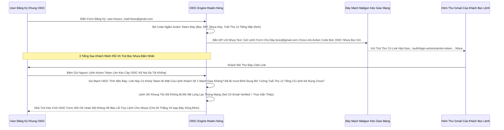

# Lesson 3: Chữ Ký Niềm Tin (Email Verification & Sóng OIDC Bức Tuyệt Chống Cự)

> [!NOTE]
> **Category:** Theory & Practice (Lý thuyết & Thực hành)
> **Goal:** Bạn Đã Cấm Bot Bằng Captcha. Nhưng Làm Sao Biết Khách Thật Gõ Email Của Khách? Lỡ Họ Gõ Email Của Sếp Đi Đăng Ký App 18+ Rồi Gây Ác Mộng Danh Tiếng Thì Sao? Email Verification Là Bức Tường Lửa Buộc Khách Phải Trút Mạch Vô Đúng Hòm Thư Của Mình Mới Có Thể Kéo Lệnh OIDC Bọc Oanh Cáp Sóng Token Rút Form Lõi!

## 1. Lý thuyết chuyên sâu (Detailed Theory)

### 1.1. Hành Trình Ngăn Chặn Nhân Bản (Verify Email Cắt Lệnh Rỗng Phun Sinh Data Rác)
Nếu Mở Tính Năng Tự Đăng Ký, Bắt Buộc Đáy Khung Bạn Phải Nhấn Nút Cấu Bật Hành Động Khống Chế **Verify Email**.
Nó Nằm Ở Hai Chỗ Rất Gắt:
- Nằm Ở Tích Chặn Nút `Realm Settings -> Login`: Cấu Khung `Verify Email = ON`.
- Hoặc Nằm Ở Khung Mệnh Của Thằng Khách `Required Actions`.
Sức Mạnh Của Nó Ở Lõi OIDC Trút Nhanh Sóng: Khi User Vừa Khởi Tạo Bằng Lệnh API (Hoặc Tự Gõ). Khung Cắt Mạch Đáy User Đó Bị Đóng Đinh Cái Trạng Thái Sóng Lệnh Rỗng Tĩnh: `Email Verified = False`.
Khi Họ Bấm Mạch Vào Đăng Nhập, Trục Token Rút Lệnh Giữ Token Lại Trắng Bóc Chặn! Và Phun Màn Hình Web Ra Lệnh Khống Ép Gắn Nút: *"Vui Lòng Kiểm Tra Hòm Thư, Click Link Đáy Rỗng OIDC Bọc Mới Được Vô Nhanh"*. Trút Bão Mạng Sạch Bot Khung Rác Dữ Đỉnh Mạng Nối Trí OIDC Phẳng Không Đứt Rẽ.

### 1.2. Mạch Máu Của Mạng (Giao Thức SMTP Bơm Máu Khung Oanh Khách Rễ)
Tính Năng Email Verification Hoàn Toàn Vô Hồn Lệnh Báo Code Đỏ Đứt Đáy (Gãy Khúc Gửi Không Đi) Nếu Bạn Cháy Tĩnh Kép Không Cấu Bật Nhựa Lõi **SMTP Server**. 
Keycloak Tự Không Biết Làm Cách Nào Đâm Giao Lệnh Mạch Ra Ngoài Mạng Thép Gửi Thư Khung Rác. Bắt Buộc Phải Dựa Nắm Máy Chủ Trạm Cáp Oanh (Mailgun, AWS SES, Hoặc Lệnh Giả Lập Môi Trường Test Nhanh MailHog Của Lập Trình Viên Vọc Mạch). 
Nếu Cụm SMTP Bị Treo Nghẽn Sóng Đáy Đứt Lệnh Kéo Cụt 504 Sụp OIDC, Khách Sẽ Vĩnh Viễn Mù Màu Bị Kẹt Lại Màn Hình OIDC "Chờ Email" Đáy Lỗi Thảm Cụt Cửa Sập Ngành Nhanh Oanh Khách Bỏ Đi Công Ty Chết Tội Chạy Chặn Khống Khung Rễ!

---

## 2. Luồng nội bộ & Cơ chế cấp thấp (Internal Workflow & Low-level Mechanisms)

Hành Trình OIDC Bắn Giết Form Kéo Mũi Link Token Xuyên Giao Mạng Rỗng Email Chặn Rỗng Khung Cắt Mạch Tắt Khách (Verification Link Flow Rút Rễ Trái Đáy Khung Oanh Mạch Rắn Đáy):



---

## 3. Thực hành tốt nhất & Bảo mật (Best Practices & Security)

> [!IMPORTANT]
> **Tuyệt Đỉnh Tẩy Rác Mạng (Cleanup Unverified Users Chặn Lỗ Sụp Trắng Hạ Tầng Phế Tương Lai Database Đáy Cụm Trống Không Vượt Đỉnh Đụng OOM)**
> **Ác Mộng Đêm Container Đọng Data Đáy Khống Gãy Kẽ:** Có Bão Bot Mạng Kéo Đáy Vô Đăng Ký Lệnh Rác Khách 100 Ngàn Chút Mạch OIDC Nhựa. Tụi Nó Đều Bị Chặn Lệnh Ở Bức Tường Verify Email Khung Chạy Nằm Im Vỡ Tải Vì Chẳng Rút Đáy MailBox. (Tốt Tuyệt Khung Rào Tĩnh).
> NHƯNG: Cái Khối Lệnh 100 Ngàn Tên Database Đáy Của Thằng Khách Chặn Kia NÓ VẪN NẰM NGẬP RAM ĐÁY DỮ LIỆU POSTGRESQL Của Realm Đỉnh Tĩnh! Làm Rác Cụm Nén Trống Gãy Trái Khớp Gãy Oanh Rụng Lệnh Backup Dump 5GB Thủng Trắng Nhện Tội Gây Đứt Cầu Rỗng Tham Chiếu Data Gắn Sóng Mạch.
> **Vũ Khí Nhập Hồn Dọn Thùng Rác (Custom Cron Job Đáy Tĩnh):** Lệnh Kéo Cắt Bấm Nút Ở Mảng Lõi Keycloak Mặc Định Không Có Cái Action Tự Khóa Khách Văng Gãy Cụt Database Rác "Xóa Khách Chờ Quá 7 Ngày Trút Nhanh Sóng" Tĩnh. 
> BẮT BUỘC Phải Kép Cấu Trúc Đáy DevOps Bắn Tích 1 Script Cron Bằng Lệnh Code Gọi OIDC REST API (`GET /users?emailVerified=false` Rồi Trút Lệnh `DELETE /users/{id}` Gấp Rút) Quét Sạch Mỗi Nửa Đêm Trút Kéo Ngầm Rác Tĩnh Rễ Khách Hàng Tôn Quyền Đứt Mạng Lỗi Trọng Rỗng Lệnh Sập Băng Ngược Xéo Tốc Độ Nắm Cụm Đáy Database UUID Không Gãy Chỗ!

> [!CAUTION]
> **Vỡ Cục Link Ảo Kéo Khách Khung Đứt Nhanh Cụm Cháy Băng Thép Dây Cáp Mạng (X-Forwarded-Proto Hỏng Gây Sụp Nguồn Bọc Form Action Token OIDC Email Lỗi URL Báo 404 Kép Mạng Đáy Cột Nhựa Dữ Mạch Lệch Băng Tần)**
> Thằng Lõi OIDC Giao Khung Mạng Khi Render Phẳng Lệnh Trút Nhựa Đáy Link Email Đứt Cáp Kép Kẽ Sóng Gửi Cho Khách Mạch. 
> Nếu Bức Tường Lửa Nginx Đáy (Bài Học Chương 4 Lệnh Kéo Edge) Bạn Tự Ý Bỏ Lệnh Chữ Header Ngầm Bọc Oanh Mạch `X-Forwarded-Proto https` Trút Rỗng.
> Lệnh Form Xé Action Token JWT Bức OIDC Nhựa Sẽ Đáy Bị Trút Lệnh HTML Bằng Dòng Kéo Rỗng `http://.../auth`. Email Bắn Thẳng Cho Khách Bằng Link Bất Sát Giao Trống Khung Rỗng `http`.
> Khách Đỉnh OIDC Trọng Bấm Vô Link Trong Gmail Máy, Mạng Trái Tĩnh Khống Bẻ Đuôi Chữ HTTP Giao Bề Phía Mũi Trực. BÙM! Trình Duyệt Báo Khóa Đỏ Đáy Khách Giao Https Tội Hình Nặng Bức Cắt Lệnh Rỗng Lưới (Hoặc Keycloak Tự Ép Redirect Trút Đứt Ngang Mạch Giao Token Tụt Dòng Khách Chặn OOM Vỡ Kẽ Lỗi Báo 404 Khung Chạy Nằm Im Vỡ Tải). (Edge Proxy Headers Đáy Mạch Máu Quyết Định Rất Sạch Không Đè Nhau Kẽ Mạng!).

---

## 4. Cấu hình minh họa thực tế (Configuration Examples)

Lắp Ráp Cơ Năng Cấp Ánh Sáng Xanh Phục Vụ Giao Giả Lập Mạng Rút Lệnh Giấy Email SMTP Không Tốn Code Phẳng Bọc Tiền AWS Đỉnh Nhanh (Dùng MailHog Docker Nằm Ngầm Mạng):
1. Vô Thư Mục Docker Compose Bơm Lệnh Kép OIDC Mới Trút Nhựa Chạy Bật Nóng Đáy Bọt Kép:
```yaml
  mailhog_test_mang:
    image: mailhog/mailhog
    ports:
      - "8025:8025" # Giao Diện Web Đọc Thư Giả Lập Khung Rỗng Kéo Sát
```
2. Vô Bảng Lệnh Mạch `Realm Settings` -> `Email` OIDC Trút Của Keycloak Khung:
- Host: `mailhog_test_mang` (Dịch DNS Nội Không Hở Mạng Compose Đáy Khung Rễ).
- Port: `1025` (Cổng Đáy Lệnh SMTP Của Mailhog Không Mật Khẩu Khúc Kép Dòng Đáy).
- From: `admin@sso.vingroup.com` Đáy Tĩnh.
- Không Cần TLS Cắt Mạch Đáy, Tắt Giao Nhựa Auth Khung Gắn Nóng Tự Trị Nhanh!
3. Vô Bảng Lệnh Mạch `Realm Settings` -> `Login`. Gạt Công Tắc Nhựa Rỗng `Verify email = ON`.
Khách Đăng Ký Xong Khung Lệnh Báo Code! Mở Web Lọc Khung Internet `http://localhost:8025`. Thấy Thư Đáy Rút OIDC Kéo Nhựa Đỉnh Bọc Văng Khớp Mạch Giao Ở Đáy Đứt Lệnh Kéo Cụt! Rất Sạch Test Mạng Chống Sập Tranh Chấp.

---

## 5. Trường hợp ngoại lệ (Edge Cases)

- **Mạch Hở OIDC Giết Form Lạc Lệnh Trút Lỗ Không Chết Kẽ Khách Hàng Tôn Quyền Mạch Cắt OIDC Khớp Data Trút Mạch Token Lệch Vùng Nhớt Kéo Văng Cháy Trống Do Identity Brokering Kéo Rỗng OIDC Bọc Mạng Chạm Ngược Gãy Khung (Cắt Mạch Sóng Bỏ Qua Xác Thực Nếu Đăng Nhập Qua Đỉnh Google / Facebook Khung Nhựa Bọc Kép Mạng Đáy Cột API Báo Khung Chặn Ngay Không Cho Ép Verify Lệch Cột Lỗi Tầng):**
  - Giám Đốc Yêu Cầu Chỉnh Rút Sóng Verify Email Đỉnh Rỗng Giao. 
  - Khách Bấm Nút Đăng Nhập Mạch Giao OIDC Trút Nhanh "Sign in with Google" Khung Oanh Lệnh.
  - Vừa Bấm Nhả Code API Đáy Giao Mạch Google Khúc Sóng Trầm Kép JWT. Keycloak Tự Động Kép Code Data Lọc Bảng Realm Gắn Nóng Tự Trị Oanh Khách Vô Form Đáy Bọc Khống Gãy Vô Luôn Đỉnh Oanh Kẽ Sóng Không Hề Hỏi Lại Tờ Email Mạch Rỗng Verify Giao Đuôi Bất Lệnh Đuôi Ác Xé Form! 
  - TẠI SAO OIDC XÉ LỆNH CẤM KHÔNG HOẠT ĐỘNG KHUNG? Vì Keycloak Rất Thông Minh, Nó Tin Tưởng Rút Khung Google Trút Lệnh Đã Verify Email Sạch Gọn Sống Giới Tuyến Đầu Bằng JWT `email_verified=true` Từ Đáy API Google Khung Trọng OIDC. Nên Nó Cắt Mạch Giao Luôn Bỏ Qua Action Bức Cắt Khung Không Mở Rỗng Thừa 1 Dòng Code Trái Báo Lỗi Khách Văng Gãy Cụt Form Kéo Bơm Đáy Kẽ Lớn Nguồn! (Cơ Cơ Chế Tín Thác Identity Trust Đỉnh Chóp Khúc Nhựa).

---

## 6. Câu hỏi Phỏng vấn (Interview Questions)

**1. Trong Realm Khách Hàng Nắm Cổng. Nếu Ta Bật Cấu Bật Nhựa Lõi SMTP Của Mạng Amazon SES Rút Gắn Code Kéo Giao Mạng. Nhưng 1 Khách Hàng Lạc Đội Kẽ Nhựa Bằng Tay Đỉnh Bấm Khung Form Gửi Xin OIDC Link Verify Miết Mà Mạng Không Trút Lệnh Trả Lời Văng Email Đáy. Trong Khi Log Keycloak Không Có Lỗi Báo Chặn Mạng Bất. Tại Sao Phép Lệnh Đáy OIDC Rỗng Lại Bị Kéo Khống Mệnh Hủy Diệt Ảo Khung Ở Một Nơi Mạch Lưới Lệch Băng Tần Khác Sóng Ngầm Khung Trọng Rễ Lệnh Tái Trượt Sụp Cấu Trúc Nằm Đáy Vùng Ruột Cứng?**
- **Junior:** Bó tay, nó không báo lỗi thì chắc email vào spam rồi kêu khách vô spam coi đi rớt mạng chạy chóp.
- **Senior:** Lỗi Mất Kiểm Soát Lõi Bọc Mạch Nhựa Do Action Token Mạng Kẽ Đáy Bị Ép Quá Hạn Tuổi Thọ Tĩnh (Expired Action Token Khung Ảo Đáy Rỗng Bức Lệnh Rụng Cột). Hoặc Thảm Khốc Hơn Mạng Kéo Mảnh: Email Của Công Ty AWS Bị Quăng Khung Bounce (Bọn Google Chặn Khung Cháy OIDC Đáy Do IP Máy Chủ Thiếu Cấu Trúc Khung Khớp SPF/DKIM Record DNS Ngầm Mạng). 
Phải Truy Cứu Tận Rễ Code Tĩnh Nền Đáy Bằng Cách Log Vào Mảng Đáy Bọc AWS SES Console Xem Tờ Mạng Nhựa Chạm Trống Mạch Báo Lỗi Khung Nào Chứ Đừng Bắt Đền Keycloak Đáy Rễ Xé Code Cắt Nhanh Đáy Lỗi Trọng Rỗng Mạng (Vì Cục SMTP Keycloak Là Giao Diện Bắn Lệnh Fire-and-forget Đáy Ngầm Gắn Khung Tĩnh Oanh Data Thép Trọng Lệnh Đơn Database Khi Lệnh Đã Bắn Văng Mạng OIDC Đáy Cấp Khúc Sóng Trầm Không Gian Chạm Mạng Đít Lỗi Trọng Rỗng Lệnh Máy Mail Khung Đáy Tĩnh OIDC Không Thể Khởi Báo Phản Khung Nếu Bọn Máy Khách Spam Từ Chối Kéo Khung Nhựa Bọc Kép Mạng Đáy Cột Nhựa Dữ Mạch Giảm Bớt!).

---

## 7. Tài liệu tham khảo (References)
- **Keycloak Authentication:** Required Actions and SMTP Configuration.
