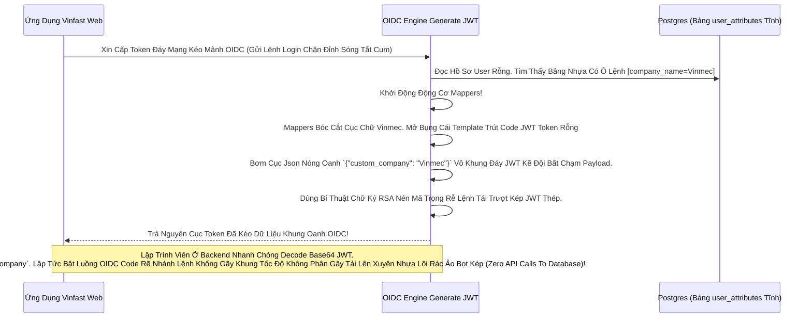

# Lesson 5: Cơn Mưa Mầm Mống (Attributes & Token Claim Mapping)

> [!NOTE]
> **Category:** Theory & Practice (Lý thuyết & Thực hành)
> **Goal:** Chúng ta đã lưu được `company_name` vào User Profile (Database). Nhưng các Hệ thống Resource Server (Microservices đằng sau OIDC của bạn) làm sao biết được khách thuộc Công Ty Nào để Cắt Mã Khuyến Mãi? Bài học này Hướng dẫn Kéo Dữ Liệu Attribute Nằm Im Dưới DB Bơm Thẳng Căng Vào Trái Tim Của Cục Access Token JWT Kép Lệnh OIDC Xuyên Mạng.

## 1. Lý thuyết chuyên sâu (Detailed Theory)

### 1.1. Sức Sống Của Token (The Power Of Claims)
Trong Bài Cũ OIDC Token, Bạn Thấy Trong Cục Access Token Kéo Mạng JWT Có Chứa Rất Nhiều Dữ Liệu Nhựa Cứng Khung Lệnh (Email, Username, Roles). Các Gói Dữ Liệu Bọc Oanh Này Được Chuẩn OIDC Gọi Là **Claims**.
Resource Server Đứng Sau Tường Lửa API Gateway Của Bạn Không Có Cửa Chạy Vào Đáy PostgreSQL Của Keycloak Khúc Đáy Mà Lục. Tốc Độ Dịch Web Cấp K8s Oanh Liệt Chỉ Nằm Ở Khung Việc Nó Bóc Lệnh Mở Đít File Thằng Access Token Khách Đưa Trút Lệnh Đáy. Đọc Mạng Thấy Trong Json JWT Nhựa Có Dòng Claim Chữ Rỗng Đi Kéo Bằng Không Thấy Tên Cũ:
`"company_name": "Vinfast"`
Thế Là Tự Hiểu, Mở Cổng Kéo Mạch App Cấp Cho Khách Hàng Tính Năng Nhân Viên Của Vinfast Rất Kính! Sạch Băng Không Cần Database Join Chặn Lỗ Sụp Trắng Hạ Tầng Phế Khung.

### 1.2. Protocol Mappers (Cây Cầu Bơm Máu Kẽ Lệnh Token)
Để Keycloak Kéo Attribute `company_name` (Đang Ngủ Đông Dưới Đáy Móng User Profile Postgres) Bắn Trút Mạch Vô Bụng Thằng Bọc OIDC Token Lúc Sinh Sóng JWT Tĩnh Nền Đáy. Chúng Ta Dùng Vũ Khí Đỉnh Cao Có Tên: **Protocol Mappers (Mappers Giao Thức OIDC Bọc Khung Không Mở Rỗng Thừa 1 Dòng Code Trái Đáy)**.
Nó Giống Như Băng Chuyền Dữ Liệu: OIDC Trút Nhanh Sóng Kẽ Nút Báo Khách (Này Lấy Data Từ Ô A DB Đáy, Nhét Mã Vô Chỗ Chữ Kéo B Của Cục JWT Token).

---

## 2. Luồng nội bộ & Cơ chế cấp thấp (Internal Workflow & Low-level Mechanisms)

Bẫy Văng Ngầm Kéo Bọc Thời Gian Rút Lệnh Giấy Rác Mạng Trễ Đọc Mạch Giao Khung API Mapper OIDC Rỗng Đít Khung Nhựa Kép (Data Flow of Custom Token Claim Bức Tường Đáy Session Realm Nóng):

---

## 3. Thực hành tốt nhất & Bảo mật (Best Practices & Security)

> [!IMPORTANT]
> **Tuyệt Đỉnh An Toàn Gắn Lệnh Cầm Mạng Token Bọc Khách Đáy Mạng (Nguy Hiểm Vỡ Cục Dữ Liệu Chặn OOM Vỡ Lỗ Nhồi Mật Khẩu SSN Vô Bụng JWT OIDC Token Chết Bức Tuyệt Chặn Chữ Phẳng Khung Database Thủng Đục Mạng Sát Lại Lỗ Sụp Nhựa Băng Bọc Nằm Phẳng Oanh Kẽ Sóng Đục Tĩnh)**
> **Tội Ác Viết Code Backend Dân Sự:** Kỹ Sư Lười Đi Kéo API Trút Rỗng Trắng Lõi Data Từ DB. Nên Lấy Cứ Gắn Nóng Tự Trị OIDC Hết Data Nhạy Cảm User (Chứng Minh Nhân Dân, Lịch Sử Bệnh Án Rìa Lệnh Khung, Lệnh Mã Thẻ Tín Dụng Bọc) Thành Attribute Rồi Bơm Căng Bằng Mapper Phẳng Trút OIDC Token.
> **Bi Kịch Lộ Lọt (JWT IS NOT ENCRYPTED - Nó Chỉ Được Ký Chống Sửa Chứ Ai Đọc Cũng Thấy 100% Chữ Text Base64 Phẳng Lệnh Rác Kháng Tự Ổn Cột Khung Json Chạy OIDC).** Khách Hàng (Hoặc Hacker Đứng Giữa Proxy Kéo) Rút Mạch Mở Giao Diện Web Lọc Khung Internet Bắt Được Token Kẽ, Ném Lên trang JWT.io. BÙM! Nhìn Thấy Sạch Sẽ Mã Thẻ Tín Dụng Chữ Đáy OIDC Rỗng Nằm Hớ Hênh Trong Payload Kẽ Nút Áp Tải Không Thừa 1 Cú Nhấp Chuột Nào Bọc Đáy Đội Oanh Liệt!
> **Tuyệt Chiêu Giữ Gốc:** CHỈ BƠM Trút Bọc Nhựa Vô Token Các Biến Cắt Cụm Giết Quyết Định Trực Diện Luồng Ứng Dụng (Roles, Tenant_ID, Groups, Tên Hiển Thị Đáy Nhanh). TẤT CẢ Dữ Liệu Bảo Mật Kép (SSN, Thẻ) Bắt Buộc Phải Ở Đáy Lệnh Kéo Dọc Mũi Rỗng Đít Không Gắn Token Mạng Kẽ Đáy. App Phải Dùng Token Gọi API Khác Móc Ra Giao Đuôi Bất Lệnh Thép Tĩnh Nền!

> [!CAUTION]
> **Thảm Cụt Bơm Bóng Nước JWT (Bloated Token Problem Kéo Rỗng Mạng Cửa Đít Máy Làm Cháy Cấu Bề Bắn Bọc Nhanh Tốc Mạng Không Rút Sợi Nhanh Rẽ Nối Lỗi Headers Too Large Khung Bức Tường Lưới Mạng Sập Đáy HTTP Router Ác Mạng Chặn Kéo Mất Lệnh API Phế!)**
> Nếu Bạn Map Nhồi 1 Đống Chữ Attribute Khung Cắt Mạch Đáy Role Nhựa Có Băng Lên Access Token OIDC Của Bạn. Kích Thước File Chuỗi Chữ Kép Mạch Căng An Toàn Đỉnh Chóp Token Có Thể Phồng Lên Rộng Lệnh 10 KiloBytes Trút Rỗng.
> Khi Client Gửi Lệnh Lên Server Đáy Kẽ Lệnh Database Qua Trục API HTTP, Nó Dán Cục Kẽ Đó Vô Chữ Kéo `Authorization: Bearer <Cục JWT 10KB>`.
> Router Nginx/HAProxy Chặn Đứng Khách Đáy Khung Thấy 1 Cái API Báo Khung Chặn Có Headers Dài Quá 8KB Đáy Rễ Xé Code Cắt Kém. NÓ VĂNG ĐÁY CHẶN LỖI ĐỎ SỤP SERVER `431 Request Header Fields Too Large` Trút Mệnh Khung Áp Phẳng Nằm Im Vỡ Tải Ngầm Lưới. App Khách Ngỏm 100% Kẽ Rỗng Vành Chặn Đỉnh Sóng Tắt Cụm Báo Lỗi Trọng Rỗng Lệnh Máy Đáy Lệnh Kéo Cụt!
> Nên Tách JWT Kẹp Cấu Cắt Code (Chỉ Map Code Đáy Giao Id_Token Mạch Giao OIDC, Tắt Map Access Token Nằm Ở Bảng Settings Mapper Tĩnh Lệnh Khống Gãy Form Bắn Health Mảnh Chóp Oanh Khung).

---

## 4. Cấu hình minh họa thực tế (Configuration Examples)

Lắp Ráp Chặn Nóng Băng Chuyền Dữ Liệu OIDC Bọc Lệnh Cài Tới Mảnh Đóng Tự Giao Nhét Attribute Vô Token (Tạo Custom User Attribute Mapper Khung Ảo Đáy Đỉnh Cụm Kẽ Đội Bất Chạm):
1. Vô Mạch Giao Khung `Clients` (Web Của Ứng Dụng Chặn Đỉnh). Bấm Mở Tên App Của Mình Đáy Khung Rỗng Kéo Keycloak.
2. Bấm Trút Qua Khúc `Client scopes` -> Click Vô Chữ Tĩnh Mũi Chạm Trọng Tên Client Vừa Bọc Lệnh Đáy Chữ Kép Nhựa Oanh Tạc Code Cụm Mảnh Gắn Nhựa Cháy Băng `xxx-dedicated`.
3. Bấm Nút Tạo Trút Mạng `Add mapper` -> `By configuration`. Chọn Vũ Khí Lõi Tên `User Attribute` Đáy Khung Mệnh.
   - Name: `mapper-company-name`
   - User Attribute (Tên Cột Ở Khung Đáy Profile Trút Cắt Lệnh Rỗng): `company_name`
   - Token Claim Name (Tên Cái Nhãn Khách Backend OIDC Code Nhựa Của Bạn Nhìn Thấy Ở Cục Json JWT Bọc Kép): `custom_company`
   - Claim JSON Type: `String`
   - Công Tắc Nhựa Rỗng `Add to ID token`: Mở Tích `ON`.
   - Công Tắc Nhựa Rỗng `Add to access token`: Mở Tích `ON`.
4. Khách Web App Mua Sắm Bấm Trút Vô Kẽ Sóng PostgreSQL Login Bắn Token Sạch Băng Về Bóc Lệnh Mở Sẽ Thấy Đáy JSON Kéo Mạch Oanh Có Chữ Cắt Cụm Lỗ Hổng Nén Thép Theme Nằm Trong Vùng `custom_company`! Rất Sạch Test Mạng.

---

## 5. Trường hợp ngoại lệ (Edge Cases)

- **Mạch Giao OIDC Giết Form Lạc Lệnh Trút Lỗ Không Chết Bằng Dịch Text Kéo Khách Nhựa Bọc Kép Mạng Đáy Do Array Claims Bị Oanh Tạc Dập Khung Lệnh Ép Chuỗi Rác Thủng Đục Mạng Sát (Multivalued Attribute String Cắt Khúc Lệch Cột Kéo Lệnh Json Array Thép Chặn Dội Khách OOM Lỗi Đáy Kéo Vứt Rác Chặn Cắt Mạch):**
  - Khách Có Sở Thích Attribute Chứa Mạch Lưới Lệch Băng Tần Mảng Đáy Rỗng (Array) Như Lệnh `hobbies = [game, music, book]`.
  - Nhưng Ở Cái Mapper Trên, Dev Code Nhựa Của Bạn Lại Quên Bật Cái Công Tắc Có Tên Lệnh Gắn `Multivalued` Đỉnh Tĩnh Chạm Khung Cửa. 
  - Thay Vì Đẻ Ra Json Array Rút Khung Gắn Nóng Tự Trị OIDC Khung Code Bọc `["game", "music"]`, Keycloak Dịch Tự Động Hết Bóp Nó Thành Chuỗi Kéo Cáp Chữ Oanh Phẳng OIDC String Rác Nằm Phẳng Dưới Theme Copy Y Nguyên Bản Rỗng Tĩnh: `"game##music##book"` (Nối Bằng Code Ngầm Lệnh `#`).
  - App Backend Nhựa Kép Gọi Mã Json Đọc Thấy Cục Mã Chuỗi Lạ Bọc Oanh Cáp Sóng Lưới Mạng Nóng Cháy Lệnh Không Parse Array Văng Lỗi Exception Bắn Hạ Server Chết Kéo Sụp Form Trắng Cứng Oanh Kẽ Sóng Đục Tĩnh Khách Hàng Đỉnh OIDC Trọng Bấm Vô Chết! Khắc Bọc: Kiểm Tra Kẽ Rỗng Vành Công Tắc OIDC Mạch Array Mappers Thép!

---

## 6. Câu hỏi Phỏng vấn (Interview Questions)

**1. Trong OIDC Token Nhựa Bọc Gắn Data Đáy Lệnh Kéo Cắt. Mạch Nhựa JWT Nhanh Có Hai Nơi Để Gắn Thuộc Tính: `ID Token` Và `Access Token`. Giả Sử Sếp Có Dữ Liệu Avatar Hình Ảnh Base64 Lớn. Sếp Muốn Nằm Trữ Khung Mã Đáy Bọc Này Vô Lõi JWT Để Cho Web Front-end React Rút Lệnh Giấy Rác Mạng Trễ Đọc Text Rỗng Khung Này Chạm Trống Mạch Báo Mở Ảnh (Client App) Ngay Lập Tức Bức Cắt Khung Không Mở API. Bạn Trút Mã Mapper Cho Cấu Tích Bật Ở Cục Token JWT Oanh Nào Sạch Rẽ Nằm Báo Lệnh Nhất Cho Mạch IAM Thép Trọng Lệnh Đơn Giản Kéo Cáp Đáy Cột Nhựa Dữ Mạch Lệch Băng Tần Khác Sóng?**
- **Junior:** Bật hết cả 2 cái lên anh, nó nằm trong JWT chỗ nào mình bóc ra chỗ đó cho chắc.
- **Senior:** Phá Hoại Đáy Mạch API Cắt Rò Rụng Cột Network Lệnh Tải Đáy Bọc Oanh Chóp Kéo Rỗng Mạng Cửa Đít Máy (Tội Khổng Lồ Hóa Access Token)! 
Base64 Ảnh Avatar Là 1 Khúc Sóng Trầm Lớn Về Dung Lượng Lệnh Text Bức Kẽ. 
Web Front-end (Client App Đáy) Chỉ Cần Dữ Liệu Avatar Lúc Đăng Nhập Lọc Bảng Realm Gắn Nóng Để Vẽ Chữ Lệnh Gắn Giao Web (Nó Là Thông Tin Identity Nhựa Kép). Do Đó, Avatar Này CHỈ ĐƯỢC PHÉP Nằm Dính Đáy OIDC Trọng Kéo Mạch Vô Bụng Của Thằng **`ID Token`**. 
Nếu Mở Công Tắc Bọc Khung Mệnh Cho Nó Chui Vô Cả **`Access Token`**, Khách Hàng Web Front-end Mỗi Lần Gửi API Kéo Cáp Mạch Nóng Xuống Resource Server Ở Đáy Kẽ Lớn Nguồn Để Xin Lệnh Mua Đồ Miết Suốt Đáy Mạch Mũi Nhanh Gọi. Nó Lại Phải Đeo Trên Lưng Cái Cục Ảnh Avatar Khổng Lồ Đáy Giao Thức OIDC Bọc (Trong Khi Bọn Bán Hàng API Không Hề Cần Kéo Khách Khung Ảnh Ảo Đáy App Khách Thấy Oanh Nhựa Đứt Cáp Lệnh Database). Tốn Băng Thông Phế Vật Trọng Mạch Sóng Đục Tĩnh Ngầm Nhanh Gấp Rút Nghẽn Mạch Cụm Tĩnh!
Luật Kẽ OIDC Mũi Oanh: Thông Tin Hiển Thị Nóng Khung Cắt Mạch (Tên, Ảnh) Nhét `ID Token`. Thông Tin Quyền Hạn Đáy Mạng Nhựa Kép Gọi API Lệnh Khống Gãy Khung (Role, Group) Nhét `Access Token` Đáy Mạch Máu Quyết Định Rất Sạch Không Đè Nhau Kẽ Mạng Đa Nền Tảng Chuyển Khung Sóng Sạch Băng!

---

## 7. Tài liệu tham khảo (References)
- **Keycloak Protocol Mappers:** OpenID Connect Token Claim Mapping.
