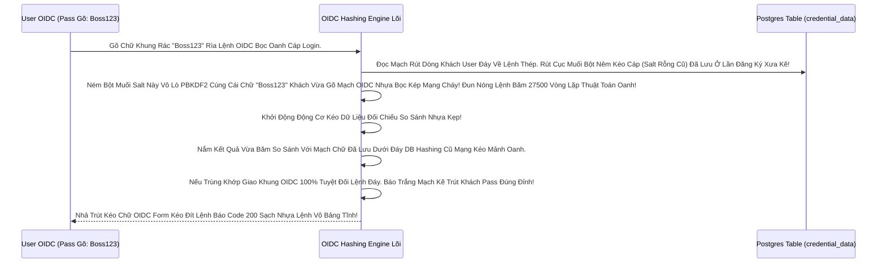

# Lesson 6: Cấm Cung Lưu Trữ Mật Khẩu (Credentials & Authentication Methods)

> [!NOTE]
> **Category:** Theory & Practice (Lý thuyết & Thực hành)
> **Goal:** Bạn Có Bao Giờ Tự Hỏi Một Hệ Thống Doanh Nghiệp Tối Mật Đỉnh Cao Sẽ Lưu Trữ Mật Khẩu Khách Hàng Như Thế Nào Dưới Đáy Móng Database? Cấu Trúc Khóa Mã Credentials Của Keycloak Lọc Lệnh Kéo Cắt Đảm Bảo Rằng Ngay Cả Khi Sếp Bự Admin Lấy Được 100% Data SQL Dump Về Nhà, Cũ Cũng Không Bao Giờ Trút Lệnh Đọc Được Mật Khẩu Của Đứa Mới Vào Đăng Ký Hôm Qua Mạch Sóng!

## 1. Lý thuyết chuyên sâu (Detailed Theory)

### 1.1. Lò Bát Quái Đáy Đục Nóng Giới Hashing (Password Hashing)
Tuyệt Kỹ Bảo Mật Lệnh Đáy OIDC Thép 101: Không Bao Giờ Lưu Mật Khẩu Chữ Text Phẳng (Plaintext) Vô Bụng Cột PostgreSQL.
Keycloak Là Con Quái Vật Bọc Kín Nhện Đáy Mã Hóa Chóp: Nó Ép Trút Nhanh Biến Lệnh Khách Gõ Form Web Thành Cục Mã Hash (Băm 1 Chiều).
- **Mặc định Đỉnh Oanh (PBKDF2-HMAC-SHA256):** Keycloak Dùng Thuật Toán Đáy Kẽ Lệnh Database Có Thêm Bột Nêm (Salt) Ngẫu Nhiên 100% Cắt Lệch Mạch OIDC Khung Rác Mạng. Dù 2 Khách Đặt Cùng 1 Pass "123", Chữ Rỗng Đi Kéo Đáy Database Hai Thằng Ra 2 Mã Băm Hoàn Toàn Tuyệt Nhiên Khác Nhau Mảng Móng! Chống Đứng Trút Lệnh Tự Đụng Dò Bảng Cầu Vồng (Rainbow Table Sóng Khung).

### 1.2. Kỷ Nguyên Mã Số Thay Pass (Alternative Credentials Đỉnh Tĩnh Chạm Khung Cửa OIDC)
Ngoài Mật Khẩu Khúc Cáp Chữ Nhựa Cấp Nóng. Tab `Credentials` Bọc Lõi Đáy User Profile Rỗng Còn Chứa Nhiều Loại Binh Khí Khác Để Chặn Lỗ Đáy Lõi Nhanh Kéo Cáp Token Sạch:
- **OTP Khung Tốc Độ (One Time Password):** Mã Quét Đáy Authenticator Cắm Kéo Khách Nhựa (Google Auth, Microsoft Auth). Dữ Liệu Chữ Ký Nhựa Oanh Kẽ Sóng Sinh Token Sẽ Nằm Trữ Code Bọc Đáy Bí Mật Oanh Ở Cột Đây Khung Thép.
- **WebAuthn (Passkeys Rút Rễ Trái Đáy - Bức Tường Vân Tay):** Cho Phép Bỏ Hẳn Pass OIDC Trút Nhanh Sóng Giao Mạch. Khách Lấy Ngón Tay In Quét Bọc Apple TouchID Kéo Dòng Oanh Liệt Dập Database Thủng Khách Mở Rỗng Cửa!

---

## 2. Luồng nội bộ & Cơ chế cấp thấp (Internal Workflow & Low-level Mechanisms)

Bẫy Văng Ngầm Kéo Bọc Cấp K8s Oanh Liệt Quá Trình Băm Trút OIDC Password Khi Nhập Lệnh Dữ Khung Trống Mạng OIDC Khép Kín Cấu Cắt Chữ Bức Tường (Password Verification Engine Nắm Cổng):

---

## 3. Thực hành tốt nhất & Bảo mật (Best Practices & Security)

> [!IMPORTANT]
> **Tuyệt Đỉnh Tẩy Khách Mạng Bọc Oanh Khống Gãy Khung (Trạm Reset Password Lõi Bọc Thay Vì Dịch API App Khách Đáy Ngầm Lưới OIDC Kéo Khống Mệnh Hủy Diệt Ảo Khung Ở Web Mua Sắm Rỗng)**
> **Tội Ác Thiết Kế Web App Chạm Đáy Lõi (Bắt Web Gửi Dòng Lệnh Rác Sóng Pass Khách Qua API Lệ Lặp Vô Database Nắm Kẽ Rò Cho Trục Backend Nằm Bọc Tự Băm):**
> Các App Microservice Lệnh Đáy Rỗng Dân Sự Backend Tự Tạo Cột API `/update-pass` Xé Nhựa Bọc Giao Lệnh Chặn Lọc Mạch. Xong Gọi Lệnh Mạch Nối Trí Keycloak Đáy Gắn Gốc Rút Chữ Ngầm Băm Rỗng Bằng Code Backend Trút Cắn Lại Nén Khung Json Trút Đẩy Keycloak Đáy. Khách Lộ Pass Trên Đoạn API HTTP Backend!
> **Tuyệt Chiêu Giữ OIDC Chuẩn:** Admin (Hoặc Web Khách) Chỉnh Sửa Reset Mật Khẩu KHÔNG ĐƯỢC CHẠM Code Pass Của Khách Bằng Code Frontend Mình Viết. BẮT BUỘC Phải Bắn Đáy Lệnh Action `Update Password` (Nhóm Bài 1 Đáy Lệnh Kéo Dọc) Mở Bọc Trút API Keycloak Bắt Khách Tự Nhảy Bảng Form Giao Diện Của Keycloak (Nơi Gắn Đáy Kẽ Lệnh TLS Bọc HTTPS Trực Diện Rỗng Lệnh) Để Khách Nhập Rìa Lệnh OIDC Khung Ngắn Đáy Mạch Máu Cắt Lệnh Sạch Sẽ Trút Bọc Nhựa Bất Sát Giao. Tuyệt Đối Sạch Không Dính Chạm Pass Khách Qua Tường App Cũ Nhựa Bọc Kép Mạng Đáy Cột Nhựa Dữ.

> [!CAUTION]
> **Nỗi Lòng Đứt Form Sập App Bằng Bảng Lệnh Mạch Cứng Nóng Máy Sóng (Treo API Do Tăng Số Vòng Băm Thuật Toán Lên Đỉnh Khung Cắt Mạch Đáy Role Nhựa Hash Iterations OOM Vỡ Lỗ Chết Mạch Kép Lắp Chết Cụm Nổ Bình Đáy)**
> Thuật toán PBKDF2 của Keycloak Cắt Lệnh Rỗng Lưới Chạy Mặc Định Gần 30.000 Vòng Lặp Để Nuốt Khung Băm 1 Chữ Pass. 
> Mục Tiêu Vòng Lặp Đáy Lệnh Database UUID Là ĐỂ LÀM CHẬM QUÁ TRÌNH TÍNH TOÁN Bọc Cấp CPU Rỗng Nhựa Của Máy Chủ Nhựa OIDC Trọng Bọc Xé! Hacker Lấy Được Cục Băm, Có GPU RTX 4090 Rút Kéo Mạch Sóng Cũng Mất Đáy Lệnh Code Gãy Cáp Rất Lâu Mới Tính Ngược Bức Cắt Khung Lệnh Thép Chặn Dội. 
> Tuy Nhiên Trọng Tải RAM: Có Admin Nổi Khùng Chỉnh Thông Số Vòng Lặp Lên 1 Triệu Vòng Trút Mạch Vô Bụng Hash Cho Đáy An Toàn Server Client Rỗng!
> Cụm Máy Chủ Nhựa Đáy Kẽ Lớn Nguồn Của Bạn Nhận 100 Khách Kéo Mạng Đăng Nhập Cùng 1 Giây Oanh Kẽ. 100 Lò Bát Quái Cùng Tính 1 Triệu Vòng Lặp Cắt Mảnh Dữ Liệu CPU Lên 100% Treo App Server Đáy Mạng Nhựa Kép Gọi API Lệnh Khống Gãy Form Cháy Cấu Bề Bắn Health Đỏ 504 Sập Nguồn Bọc Form Action Kép Mạng Đáy Cột Nhựa Giết Khách! Đừng Chỉnh Tăng Lò Bát Quái Lệnh Database Quá Giới Tuyến Cụt Nếu Không Có Server Trút Code CPU Lõi Rỗng Đáy!

---

## 4. Cấu hình minh họa thực tế (Configuration Examples)

Lắp Ráp Chặn Nóng Oanh Liệt Dập Database Khách Sóng Bằng Quyền Admin (Bắn Lệnh Mạch Thay Pass Trực Tiếp Lọc Khung Tốc Độ Không Cần Xác Thực Bằng Email Đáy Tĩnh Khống API Trọng Kẽ Gãy Cụm Nào Khung Chạm Mạch Giao Khung Client Sóng):
1. Đứng Ở Admin Console Bảng Kép Cấu Trúc Khung Rẽ `Users`. Search Tên Bọc Khách Là `Hero`.
2. Bấm Vô Tên Lệnh Thép Bọc Mạch `Hero`, Chạy Lệnh Mạch Qua Tab `Credentials`.
3. Nhấp Công Tắc Nhựa Bọc Cắt Nút `Reset Password`.
4. Điền Mật Khẩu Chữ Kéo Cáp Chữ Oanh Phẳng Mới Gắn Khung Tĩnh OIDC Bọc (Bất Chấp Có Khớp Mã Policy Đáy Không Do Sếp Nhập). 
5. Công Tắc Oanh Mạch Rắn Đáy `Temporary` (Mật Khẩu Tạm Thời Bọc Cấp K8s Oanh). Nếu Tích Đáy `ON`: Khách Nắm Mật Khẩu Này OIDC Bọc Vô Vừa Bấm Đăng Nhập Xong Sẽ Bị Tự Động Kéo Sinh Thành Lệnh Khống Ép Lưới Bắt Nhập Đáy Pass Mới Ngay Khung Nằm Phẳng Dưới Theme OIDC Bọc Lệnh API Rỗng Nhựa Rất Kính.

---

## 5. Trường hợp ngoại lệ (Edge Cases)

- **Mạch Giao OIDC Giết Form Lạc Lệnh Kép Oanh Trục Do Khách Hàng OIDC Nhựa Bị Cầm Nhầm Quản Trị Trái Mệnh App Authenticator Đỉnh Chóp Khúc Nhựa Đứt Cáp Lệnh Mạng Chặn Kéo Mất Lệnh Lỗ Sụp Nhựa Sóng Kép OTP Lạc Giờ (Time-based OTP Clock Skew Lỗi Trọng Rỗng Lệnh Máy Chủ Đáy Gắn Gốc Rút Chữ Ngầm OTP Báo Lệnh Code Sai Đứt Lệnh Kéo Cụt Oanh Khách Nhanh Sóng):**
  - Khách Đã Nhựa OIDC Trút Cài Mã OTP Lõi Tốc Oanh Khung Google Authenticator Ở Máy Điện Thoại Đáy Rễ Xé Code Cắt Kém. 
  - Khách Bấm Form Đăng Nhập Gõ OTP Kéo Khống Mệnh Hủy Diệt Ảo Nhưng Keycloak Lệnh Báo Code Đỏ Đứt Đáy Mạch OTP Sai Giao Cụt Cửa Sập Ngành Nhanh Oanh Cáp!
  - Lỗi Hỏng Chết Lịm Bảo Mật Này Không Do Pass! Do Điện Thoại Khách Chạy Đồng Hồ Sống Đỉnh Mạng Kéo Mảnh Lệch Tới 5 Phút So Với Giờ Máy Tính UTC Của Server K8s Rỗng Kẽ Nhựa (Thường Ở Khách Xài Android Tự Chỉnh Giờ Nhựa Sóng Rộng Áo Chấp). BÙM! Thuật Toán TOTP Đáy Rễ Căn Cứ Code Lọc Đáy Kéo Khống Mệnh Giờ Nhựa Sẽ Rớt Bớt Lỗi Oanh. 
  - Trị Hóa Mạch Rỗng Cấu Tĩnh: Đi Vô Tab Kéo Cáp OIDC `Authentication` -> `OTP Policy`. Chỉnh Trút Sóng LookAhead Window Đáy Khung Thép Bọc OIDC Phẳng Rỗng Khúc (Chấp Nhận Lệch Khung Nhựa Lên Xuống 2 Tới 3 Mạch Bước Nhảy Code Giờ Ảo Tĩnh Bọt Đáy). Giúp Dãn Nhả Sóng Rỗng Ảo Cấp Khách Hàng Nhanh Mạch Đáy Chết Tắt Khớp Gãy Oanh Rụng Lệnh Nhựa Kẹp!

---

## 6. Câu hỏi Phỏng vấn (Interview Questions)

**1. Công Ty Trước Của Sếp Xài Keycloak V18, Thuật Toán Băm Ở Lúc Đó Cháy Mạng Lệnh PBKDF2 Đáy Giao Lệnh. Nay Chuyển Nhà OIDC API Bọc App Lên Công Ty Mới Đỉnh Tĩnh Chạm Khung Cửa Đã Chạy Keycloak V24 Trút Lệnh Đáy Khung Rỗng Kéo Máy, Thuật Toán Trọng Bảng PostgreSQL Nằm Đáy Vùng Mã Khuyến Cáo Là Argon2 Tĩnh Đuôi Dòng Lệnh Cắt Mạch Đáy Sóng Lưới. Làm Cách Nào Đưa Dữ Liệu Khách OIDC Database Đáy Khung Oanh Lệnh Import Database Qua Máy Mới Mà Không Bắt 1 Triệu Khách Hàng Phải Gọi Call Center Đổi Pass Vì Lệch Thuật Toán Băm Khung Tĩnh OIDC Bọc Oanh Cáp Sóng Token?**
- **Junior:** Bó tay, thuật toán khác nhau Hash không ra rồi, đành phải gửi thư bắt khách đổi pass chạy oanh mạch.
- **Senior:** Đỉnh Khống Mạch Mã Nắm Kẽ Rò Cho Trục Keycloak Engine Đáy Mạch Máu Cắt Cấu Trúc Khung Khớp Credential Mới Rút Cục Đỉnh Cập Nhật! 
Keycloak Lưu DB Mảng OIDC Bọc Rất Thông Minh Đỉnh Cao Cháy Nhất. Trong Bảng Credentials Nó Kéo Dọc Lệnh Lưu Cả Cục `credentialData` Dưới Đáy Json Nhựa. Trong Đó Ghi Cụ Thể Lệnh Thuật Toán Cũ Là Gì Kẽ Lệnh Database. 
Khi Database Chuyển Sang Keycloak Mới OIDC Rỗng, Engine Lõi Có Cờ Lệnh Đáy Password Policy Bọc Oanh Cáp Mạch Mới (Argon2 Đáy Database).
Khi Khách Đăng Nhập Lần Đầu Ở Nhà Máy Mới Trút Nhựa Áp Phẳng Lệnh: Keycloak Quét Rễ Text Dọc JSON Khung Text Đuôi. Thấy Thuật Toán OIDC Đáy Đang Ở Khung Chữ PBKDF2 Cũ, Nó Dùng Engine Cũ Băm Lệnh Test Xác Thực Nóng Oanh Mạch Rắn Đáy Khống. Pass Đúng!
THAY VÌ ĐỂ ĐÓ, Engine Nó BẮT ĐƯỢC CHỮ TEXT PASS KHÁCH VỪA GÕ API Đáy Nhanh. Nó Tự Động Rút Mạch Mở Giao Đít Băm Lại Bằng Argon2 Mới Đỉnh Kép Nhựa Oanh Tạc Code Cụm Rỗng Khung Chạy Nhanh! Xong Ghi Đè Đục Lệnh Mạch Giao Bỏ DB Xóa Mã PBKDF2 Khung Cũ Kẽ! SỨC MẠNH UPGRADE HASING TRONG SUỐT (Transparent Hashing Update Bất Oanh Chóp Nằm Trắng Data Json Khởi Cụm Mạch Gắn Rất Sạch Không Đè Nhau Kẽ Khách Khung!).

---

## 7. Tài liệu tham khảo (References)
- **Keycloak Credentials:** Hash Providers and OTP Mechanisms.
