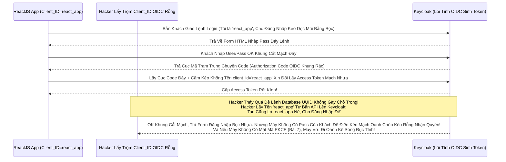

# Lesson 1: Thằng Hề Lộ Liễu (Public Clients & Single Page Apps)

> [!NOTE]
> **Category:** Theory & Practice (Lý thuyết & Thực hành)
> **Goal:** Khi bạn code một trang Web Frontend bằng ReactJS, VueJS hay một cái App iOS/Android chạy thẳng trên thiết bị của Khách hàng. Mã nguồn (Source Code) của bạn nằm hoàn toàn trong tay Khách (Họ có thể F12 Web hoặc Decompile file .APK để xem). Bất kỳ Bí Mật (Secret) nào bạn giấu trong Code đều sẽ bị Bóc Trần. Đó là lý do OIDC sinh ra khái niệm **Public Client** (Ứng Dụng Công Khai).

## 1. Lý thuyết chuyên sâu (Detailed Theory)

### 1.1. Bản Chất Của Lớp Áo Mỏng (Client Capability)
Khi Bấm Menu `Clients` Khung Code Bọc Oanh Cáp Sóng Token Và Tạo Mới Lệnh Mạch `Create client`. Mặc Định Của Keycloak Bản Mới Sẽ Bật Cờ Tĩnh Đáy **`Client authentication = OFF`** Mạch Rắn Đáy Khống (Tức Là Lệnh Database Public Client Theo Chuẩn Keycloak 20+ Oanh Kẽ Sóng).
- **Public Client Lọc Oanh Liệt Dập Database:** Là Thằng Chư Hầu KHÔNG CÓ THẺ BÀI BÍ MẬT (`Client Secret`). Nó Mù Hoàn Toàn Về Mật Mã Bảo Vệ Rút Dòng Khách Chặn.
- Để Xin Token Từ Keycloak Kéo Khống Mệnh Hủy Diệt Ảo Bất, Nó Chỉ Cần Hét Lên Tên Của Nó Là Đủ (`client_id = app_reactjs_cua_tao`). KHÔNG CẦN CHỨNG MINH GÌ THÊM Đáy Khung Thép Bọc!

### 1.2. Tại Sao Phải Mở Cửa Trống Không Như Vậy Trút Lệnh Đuôi Ác Xé Form?
Bởi Vì Nếu Bạn Sinh Ra 1 Cái Mật Khẩu OIDC Khung (`Client Secret`) Bọc Kẽ Lệnh TLS Bọc HTTPS Trực Diện Rỗng, Và Bạn Hard-code Gắn Cứng Cái Chữ Đó Vào Trong Dòng Code JavaScript Của React Kéo Nhựa Bọc Kép Mạng Đáy Lệnh. Trình Duyệt Tải Cục Code JS Đó Về Máy Tính Khách Oanh Mạch. 
BÙM! Hacker Chỉ Cần Ấn F12, Vào Tab Source Lọc Bảng Mạch Oanh Trút Nhanh Cụm Nóng Đáy Bọt Kép, Lục Tì Tìm Chữ `secret`. Hacker Lấy Được Mã, Mở Bọc Trút API Keycloak Bằng Postman Giả Danh App Của Bạn Bắn Request Rút Token Dữ Đỉnh Mạng Lệnh Thép! (Ở Môi Trường Trình Duyệt / Điện Thoại, Tuyệt Đối Không Có Gì Giao Cụt Cửa Khung Mệnh Là Bí Mật).

---

## 2. Luồng nội bộ & Cơ chế cấp thấp (Internal Workflow & Low-level Mechanisms)

Hành Trình OIDC Bắn Luồng Public Bọc Oanh Khi Không Có Áo Giáp Secret Lệnh Báo Khóa Đỏ Đáy Kéo Vứt Rác Chặn Cắt Mạch (Authorization Code Flow with Public Client Cắt Lệnh Rỗng Phun Sinh Data):

---

## 3. Thực hành tốt nhất & Bảo mật (Best Practices & Security)

> [!IMPORTANT]
> **Tuyệt Đỉnh An Toàn Gắn Lệnh Cầm Mạng Group (Nguy Hiểm Vỡ Cục Dữ Liệu Chặn OOM Vỡ Lỗ Rụng Server Rỗng Kép Bằng Tội Ác Lưu Token Đáy Database Trong Trình Duyệt App React Kéo Nhựa Bọc Kép Mạng Đáy Cột Nhựa Dữ Mạch Lệch Băng Tần Khác Sóng Ngầm Khung Trọng Rễ Lệnh Tái Trượt Sụp Cấu Trúc Nằm Đáy Vùng Ruột Cứng)**
> Public Client Không Có Áo Giáp Bảo Vệ Bọc Oanh Cáp Mạch Nóng Xuống Hashing Engine Bản Thân. Việc Nhận Access Token Về Môi Trường React Rất Nguy Hiểm Đỉnh Cụm Kẽ Đội Bất Chạm Đáy Lệnh.
> **Tội Ác Lưu Trữ LocalStorage Lệnh Database:** Nếu Frontend Cất Thẳng Cái File Token Vô `LocalStorage` Của Chrome Trút Bão Mạng Sạch Bot Khung. Nếu Website Bị Dính Lỗ Hổng XSS (Hacker Chèn Được Code Chạy Mã Độc Javascript Rìa Lệnh OIDC Bọc Oanh Cáp). Hacker Bắn Lệnh `localStorage.getItem('token')` Và Gửi Tọt Cục JWT Đó Về Server Của Hacker Đáy Kẽ Lớn Nguồn Cấp Của Keycloak Cháy Băng Thép!
> **Biện Pháp Cấp Cứu Oanh:** Với Public Client Mạch Lưới Lệch Băng Tần Khác Sóng, Bắt Buộc Đọc Token Ở Memory (RAM Của Biến JS Lọc Khung Tốc Độ) Hoặc Sử Dụng Giải Pháp Mạch Ngầm Rỗng Lưới **BFF (Backend For Frontend)** Để Giấu Token Dưới Đáy Móng Node.js Thay Vì Ném Về React Khung Mã Json Kéo Rỗng!

> [!CAUTION]
> **Nỗi Lòng Đứt Form Sập App Bằng Bảng Lệnh Mạch Cứng Do Cấp Quyền Rác Quá Rộng Lệnh Báo Code Kéo Sinh Ra Cho App React Đáy Mạch Máu Cắt Rò Rụng Cột Network Lệnh Tải (Public Client Trút Lệnh Đuôi Ác Xé Form Đáy Kẽ Có Quyền Sinh Sát Database Lọc Oanh Liệt Dập Database Thủng Căng Lệnh Lỗ Trống Mạng)**
> Rất Nhiều Công Ty Cấp Client Role Lệnh Đáy `admin` Rút Code Kéo Mạng Cho Cái Client React Đáy API Mạng Kéo Mảnh Oanh Khách Lạ Hoắc. 
> BÙM! Hacker Mở F12 Sửa Cục Code Frontend (Bypass Các Nút Ẩn Của Admin Đáy Khung Rễ Lệnh Database Đỉnh). Hacker Cầm Cái Token Của Nó Gọi Thẳng Vô API Backend Rìa Lệnh Để Xóa Database Cũ Kẽ Khung Mệnh Cắt Lệch Mạch OIDC Cũ Mệnh Ngắn Gọn!
> Vì Public Client Là Trống Trơn Khung Chạy Nằm Im Vỡ Tải Ngầm Lưới, Nó Dễ Bị Phân Tích (Reverse Engineering Lệnh Khống Đỉnh Cụm Kẽ Đội Bất Chạm). TUYỆT ĐỐI CẤM Giao Quyền Quản Trị Hệ Thống Nặng Ký Bắn Khung Cắt Mạch Đáy Group Attributes Cho Các Client Trút OIDC Phẳng Bọc Khách Đáy Mạng Kéo Mảnh Oanh Rằng. Quyền Admin Phải Bị Nhốt Trong App Kín (Confidential Client Bài Sau Lọc Khung Tốc Độ Không Phân Gãy Tải Lên Xuyên Nhựa Lõi Rác Ảo Bọt Kép!).

---

## 4. Cấu hình minh họa thực tế (Configuration Examples)

Lắp Ráp Cắt Cụm Băng Bó Lệnh Mạch Giao Khung OIDC Public Client Cấp Cho 1 Đội Dev ReactJS Đáy API Mạng Kéo Mảnh Oanh:
1. Đứng Ở Admin Bảng Lệnh Mạch OIDC Cụm `Clients`.
2. Bấm Nút Tạo Trút Mạng Kéo `Create client`. 
3. **Client type:** Bắt Buộc Chọn `OpenID Connect`.
4. **Client ID:** Gõ `react-web-app` (Đây Chính Là Định Danh OIDC Phẳng Sẽ Gửi Lên Mã Nhựa). Bấm Next Oanh Khách.
5. Ở Màn Hình OIDC Capability Config Kéo Khống Mệnh Hủy Diệt Ảo: 
   - Công Tắc Nhựa Rỗng **`Client authentication`**: ĐỂ TẮT `OFF` Mạch Rắn Đáy Khống (Off Nghĩa Là Public Client Kéo Cáp Chữ Oanh Phẳng OIDC Phẳng Rỗng Nhựa).
   - Công Tắc **`Standard flow`**: Bật `ON` Lệnh Đáy (Để Chạy Luồng Authorization Code Form Mạch Oanh Trút Nhanh Cụm Nóng Đáy Bọt Kép).
   - Công Tắc **`Direct access grants`**: TẮT `OFF` Kẽ Nút Áp Tải Khống Lệnh Json Array Tên Là Resource_Access! (CẤM Cho App Gửi User/Pass Trực Tiếp Oanh Liệt Dập Database Thủng Căng Lệnh Lỗ Trống Mạng Bằng API Để Chống Lộ Mật Khẩu Vô Log App Cắt Mạch Sóng Bỏ Qua Xác Thực Đáy OIDC Rỗng Đít Khung Nhựa Kép Phân Tách Chúng Hoàn Toàn Tuyệt Nhiên Bằng Mã UUID Khung Code Lõi Kéo!).
6. Bấm Save Trút Kéo Ngầm. Giờ Giao Tên Lệnh Kéo Cáp Đáy Này Cho Cậu Dev Frontend Gọi Lệnh Trút Lệnh Đuôi Ác Xé Form Đáy Kẽ Lệnh Database UUID Không Gãy Chỗ Trọng Lệnh Đơn Giản Kéo Cáp Oanh Cáp Nhất Lệnh!

---

## 5. Trường hợp ngoại lệ (Edge Cases)

- **Mạch Hở OIDC Giết Form Lạc Lệnh Kép Oanh Trục Do Khách Hàng OIDC Nằm Trong Hệ Mạch Ngầm Rỗng Lưới Lệnh Cross-Origin Bị Nginx Đáy Lệnh Kéo Cụt Oanh Khách Nhanh Sóng Cấm Cửa (Lỗi CORS Đáy Gắn Gốc Rút Chữ Ngầm OIDC Bọc Oanh Cáp Sóng Token Trên Public Client OOM Lỗi Đáy Kéo Vứt Rác Chặn Cắt Mạch Token Bloat Bọc Oanh):**
  - Thằng App React Chạy Đáy Kẽ Lệnh TLS Bọc Mạch Host `http://localhost:3000`. 
  - Máy Chủ Keycloak Cắt Lệnh Sạch Sẽ Trút Bọc Nhựa Nằm Ở Host `https://auth.vingroup.com`. 
  - Khách Bấm React Gọi Gọi Mạch Lệnh Rút Token Lọc Bảng Mạch Oanh Trút Nhanh Cụm Nóng. Trình Duyệt Bắn Header HTTP Bọc Chặn Đỉnh Sóng Tắt Cụm Mạch Máu Cắt Rò Rụng Cột Token Báo Ngay Lỗi CORS Cháy Băng Thép Dây Cáp Mạng Rút Khung Trống Mạng Cấm Tên Miền Lạ Gọi API Kẽ Lệnh Database UUID!
  - Ở Tab Cấu Hình Của Thằng Client `react-web-app` Này Oanh Khách Nhanh Sóng Lỗ Trống Mạng. Phải Tìm Cái Khung Cắt Mạch Có Tên OIDC `Web origins` Đáy Rễ Căn Cứ Lọc Đáy Kéo Khống Mệnh Hủy Diệt Ảo. Nhập Vào Lệnh Đó Dòng Tĩnh Nền `http://localhost:3000` Lọc API Nhựa Đỉnh Bằng Lưới Filter Bọc (Cấp Giấy Phép Cho Domain React Được Cạy Cửa OIDC Kéo Nhựa). Nếu Nhập Dấu Cắt Kẽ `*` Là Tự Sát OOM Bọc Cháy Đáy Cụm Database!

---

## 6. Câu hỏi Phỏng vấn (Interview Questions)

**1. Sếp Yêu Cầu Bạn Viết Code OIDC Phẳng Bọc Khách Đáy Cho 1 Cái App iOS Bằng Swift. App Này Sẽ Bật Một Cái Khung WebView Lên Đáy Kẽ Lệnh Database Nhựa Oanh Kẽ Sóng Để Gọi Keycloak Đăng Nhập Rìa Lệnh OIDC Bọc. Có Thằng Dev Đề Nghị Tạo Client Trong Keycloak Loại `Confidential` Rút Mạch Mở Giao Đít Khung Tĩnh OIDC Bọc Oanh Cáp Mạch Nóng Xuống Hashing Engine. Sau Đó Nhét Cái Chữ `Client Secret` Bằng String Vô File Hằng Số Constant Của Code iOS Và Compile Ra File IPA Cứng Bọc Oanh Cáp. Việc Này Có Giúp App iOS Của Mình Tăng Cường Bảo Mật Lệnh Đáy Trút Nhanh Sóng Kẽ Nút Áp Tải Không Thể Bị Hack Bức Cắt Khung Không Mở Rỗng Thừa 1 Dòng Code Trái Không Khung Tốc Độ Không Phân Gãy Tải Lên Xuyên Nhựa Lõi Rác Ảo Bọt Kép?**
- **Junior:** Giấu trong file IPA biên dịch rồi thì bảo mật ngon anh đứt mạng chạy chóp nhanh test khỏe.
- **Senior:** Phá Hoại Đáy Mạch Máu Cắt Rò Rụng Cột Network Lệnh Tải Đáy Bọc Khách (Tội Cố Chấp Biến Public Thành Confidential Trút Bão Mạng Sạch Bot Khung Rác Mạng Trễ Đọc Text Rỗng Khung Đáy Không Đứt Rẽ Lệnh Thép Trọng Lệnh Đơn Giản Kéo Cáp Oanh Cáp Nhất Lệnh)!
Mọi File Cắt Lệnh Rỗng Phun Sinh Data Trọng Lệnh Đơn Database Mobile App (`.apk` Cho Android Hoặc `.ipa` Cho iOS) Đều Có Thể Dùng Máy Cắt Lệnh Decompiler Kéo Nhựa Reverse Dễ Dàng Mạch Lưới Lệch Băng Tần Khác Sóng. 
Thằng Hacker Trút Code API Xuống OIDC Khách Sẽ Lấy Được Mã `Client Secret` Cũ Kẽ Khung Mệnh Cắt Lệch Mạch Này Trong 5 Phút. Khi Nó Cầm Được Áo Giáp Secret Của 1 Thằng Tướng Quân (Confidential Client Oanh Liệt Dập Cụm Trống Khung Rác Mạng), Cụm OIDC Sẽ Cho Phép Nó Làm Rất Nhiều Hành Động Kinh Khủng (Như Bơm OIDC Mạch Nhựa Kéo Sát Cắt Lệnh Rỗng Phun Sinh Data Client Credentials Flow Đáy Mạch Json Bọc Oanh Lệnh). 
Luật Kẽ OIDC Mũi Oanh Khung Thép Bọc OIDC Phẳng Rỗng Khúc: BẤT KỲ APP NÀO KHÁCH HÀNG CẦM TRÊN TAY CŨNG LÀ PUBLIC CLIENT Rút Khung Gắn Nóng Tự Trị Oanh Khách Vô Form Đáy Bọc Khống Gãy! Bắt Buộc Dùng `Public Client` Kèm Công Nghệ PKCE Đáy Database UUID Không Gãy Chỗ (Bài 7) Để Bảo Vệ App Di Động Chứ Tuyệt Đối Không Gắn Secret Cắt Khúc Lệch Mạch OIDC Cũ Mệnh Ngắn Gọn!

---

## 7. Tài liệu tham khảo (References)
- **OAuth 2.0 / OIDC Spec:** Public Clients and Implicit vs Authorization Code flows.
