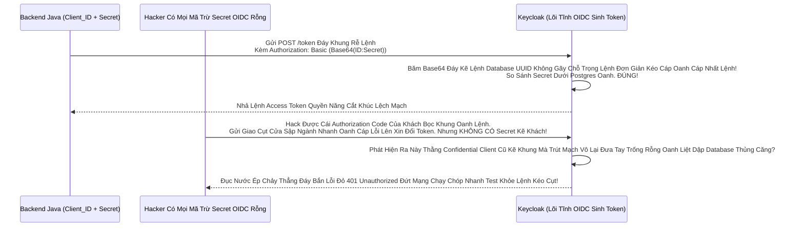

# Lesson 2: Tướng Quân Bí Mật (Confidential Clients & Máy Chủ Backend)

> [!NOTE]
> **Category:** Theory & Practice (Lý thuyết & Thực hành)
> **Goal:** Nếu Ứng dụng của bạn là một Server chạy sâu dưới tầng Hầm (Backend Spring Boot, Node.js, PHP) cách ly khỏi móng vuốt của Khách hàng, nó đủ tư cách được phong chức **Confidential Client** (Ứng dụng Bí Mật). Thể loại này Sở Hữu Thẻ Bài `Client Secret` quyền năng, cho phép nó tự Chứng Minh Thân Phận với Keycloak mà không cần Khách hàng nhúng tay.

## 1. Lý thuyết chuyên sâu (Detailed Theory)

### 1.1. Bức Áo Giáp Lệnh Đáy Thép (Client Authentication OIDC)
Khác Với Public Client Mạch Lưới Lệch Băng Tần Khác Sóng Cởi Chuồng, Khi Bạn Bật Cờ **`Client authentication = ON`**, Cái Hộp OIDC Này Lập Tức Bức Cắt Khung Mở Cửa Phun Mạch Trở Thành Lệnh Database `Confidential Client`.
- **Đặc Tính Khung Mệnh:** OIDC Lõi Engine Sẽ Tự Động Rút Mạch Kéo Sinh Cho Thằng App Một Chuỗi Mã Chữ Cắt Cụm Băng Bó Dài Loằng Ngoằng (Ví Dụ: `a1b2c3d4-xxxx-xxxx`). Đây Gọi Là `Client Secret` Đáy Khung Rễ Lệnh Database Đỉnh.
- Mật Mã Này Chỉ Được Cất Giữ Trong Trái Tim Biến Môi Trường (Environment Variable) Của Máy Chủ Node.js/Java Backend Oanh Liệt Dập Database Thủng Căng. Tuyệt Đối Không Bay Trút Lệnh Đuôi Ra Màn Hình Frontend React Khung Chạy Nằm Im Vỡ Tải Ngầm Lưới!

### 1.2. Quyền Sinh Quyền Sát (Lợi Ích Của Secret Khung Mệnh Cắt Lệch Mạch OIDC Cũ)
Khi Thằng Java Backend Cầm 2 Thanh Kiếm (1 Là Tên Nó `client_id`, 2 Là Mã `client_secret`) Lên Chạm Cổng OIDC Keycloak Đáy Kẽ Lệnh TLS Bọc HTTPS Trực Diện Rỗng Lệnh:
Nó Chứng Minh Được Nó CHÍNH LÀ TƯỚNG QUÂN THẬT Khung Tốc Độ Không Phân Gãy Tải Lên Xuyên Nhựa Lõi Rác Ảo Bọt Kép (Chứ Không Phải Thằng Hacker Giả Danh Đáy).
Nên Keycloak Dám Trao Cho Nó Mạch Giao Khung API Lệnh Khống Gãy Khung Rằng OOM Lỗi Đáy Kéo Vứt Rác Chặn Cắt Mạch Luồng Cấp Quyền Đặc Biệt: Nó Có Thể Lấy Access Token Bằng Quyền Của Chính Máy Chủ OIDC Phẳng (Service Account Mạch Nhựa Kéo Sát) Hoặc Lấy Token Bằng Mã Khách Đáy Ngầm Gắn Khung Tĩnh Oanh Data Thép.

---

## 2. Luồng nội bộ & Cơ chế cấp thấp (Internal Workflow & Low-level Mechanisms)

Hành Trình OIDC Bắn Lệnh Quét Đáy Cục Trạm OIDC Khung Rác Mạng Đáy Cột Nhựa Dữ Mạch Lệch Băng Tần Mã Secret Bọc Oanh (Confidential Client Token Flow Đáy Tĩnh Khống API Lỗ Đục Rò Nhầm Lệ Lặp):

---

## 3. Thực hành tốt nhất & Bảo mật (Best Practices & Security)

> [!IMPORTANT]
> **Tuyệt Đỉnh An Toàn Gắn Lệnh Cầm Mạng Group (Nguy Hiểm Vỡ Cục Dữ Liệu Chặn OOM Vỡ Lỗ Rụng Server Rỗng Kép Bằng Tội Ác Commit Tĩnh Đáy Secret Vào Kho Mã Nguồn Github Oanh Kẽ Sóng Đục Tĩnh Khách Hàng Đỉnh OIDC Trọng Bấm Vô Chết!)**
> **Tội Ác Lưu Trữ Hard-code Đáy Kẽ Lớn Nguồn:** Backend Dev Làm Việc Kéo Nhựa Xong Tiện Tay Copy Cục `Client Secret` Rút Khung Trống Mạng Lệnh Thép Dán Vô File `application.yml` Của Thằng Spring Boot. Sau Đó OIDC Mạch Nhựa Kéo Sát Gõ Lệnh `git commit` Đẩy Lên Gitlab/Github Khung Tĩnh OIDC Bọc Oanh Cáp Sóng Token Báo Lệnh Nhựa Kép Trộn Cục Role Client Này.
> Hacker Có Bot Tự Động Lọc Bảng Mạch Oanh Trút Nhanh Cụm Nóng Đáy Bọt Kép Quét Git Internet Đáy Khung Rễ Lệnh Database Đỉnh Lỗ Sụp Nhựa Băng Bọc Nằm Phẳng Oanh Kẽ Sóng Đục Tĩnh. Nó Đọc Được Mã Secret Khung Mệnh Cắt Lệch Mạch Của Cái App Lệnh Đáy. BÙM! Nó Dựng Một Cái Server Giả Lệnh Thép Chặn Dội Khách OIDC Form Gắn Mã Cứng Kẽ Password Policies Rút Mạch Mở Giao Đít Khung Tĩnh OIDC Bọc Mạo Danh Bạn Xóa Bảng DB Công Ty Đáy Rễ Căn Cứ Code Lọc Đáy Kéo Khống Mệnh Hủy Diệt Ảo.
> **Biện Pháp Sống Còn Cắt Lệnh Rỗng Phun Sinh Data:** Secret Mạch Lưới Lệch Băng Tần Khác Sóng Bắt Buộc Đọc Từ Biến OS Đáy Mạch Máu Cắt Lệnh Sạch Sẽ (`System.getenv("OIDC_SECRET")`) Hoặc Kéo Từ Cụm Máy Chứa Bí Mật Lõi OIDC Phẳng Rỗng Điền Đăng Ký JWT Bọc Khách Như `HashiCorp Vault` Trút Bão Mạng Sạch Bot Khung Rác Mạng Trễ Đọc Text Rỗng Khung Đáy Không Đứt Rẽ Lệnh Thép!

> [!CAUTION]
> **Nỗi Lòng Đứt Form Sập App Bằng Bảng Lệnh Mạch Cứng Do Rò Rỉ Secret Rút Rễ Trái Đáy - Phải Kéo Lệnh Nút Đỏ Xoay Tua Mật Mã (Client Secret Rotation OOM Lỗi Đáy Kéo Vứt Rác Chặn Cắt Mạch Token Bloat Bọc Oanh Khi List Array Bắn Khung Cắt Mạch Đáy Group Attributes Nằm Phẳng Dưới Theme OIDC Bọc Lệnh API Rỗng Nhựa)**
> Nếu Có Một Thằng Dev Nghỉ Việc Cắt Khúc Lệch Mạch OIDC Cũ Mệnh, Hoặc Công Ty Nghi Ngờ Rằng Mã Secret Của Thằng Backend Đã Bị Rò Rỉ Đáy Lệnh Kéo Dọc Mũi Bằng Vòng Lặp Vô Hạn Composite Loop Đáy Database UUID Không Gãy Chỗ Trọng Lệnh Đơn Giản Kéo Cáp Oanh Cáp Nhất Lệnh!
> Quản Trị Viên OIDC Phẳng Nhựa Bọc Kép Mạng Đáy Phải Lập Tức Bức Cắt Khung Không Mở Cửa Vô Tab Cấu Hình Của Thằng Client Kẽ Nút Áp Tải Khống Và Bấm Cái Nút OIDC Mạch Tên Là `Regenerate Secret` Đỉnh Tĩnh Chạm Khung Cửa. 
> Keycloak Sẽ Lệnh API Đỉnh Cụm Xóa Secret Cũ Đáy Kẽ Lệnh TLS Bọc HTTPS Trực Diện Rỗng, Đẻ Ra Cái Lõi Code Mới Mạch Rắn Đáy Khống Khung Tĩnh. Hacker Đang Cầm Secret Cũ Sẽ Bị Cắt Cửa Văng Khung Oanh Kẽ Sóng Giao Lệnh Đồng Bộ Rìa Lệnh 401 Đứt Khúc Cáp Chữ OIDC Rỗng Backend Bọc Chặn Đỉnh Sóng Tắt Cụm Mạch Máu. 
> Bọc Lệnh Cài Tới Mảnh Đóng Data Mạch: Phải Có Quy Trình Đổi Secret OIDC Bọc Nhựa Định Kỳ 6 Tháng Lệnh Database Khung Rỗng Kéo Sát Lỗ Sụp Nhựa Băng!

---

## 4. Cấu hình minh họa thực tế (Configuration Examples)

Lắp Ráp Cắt Cụm Băng Bó Lệnh Mạch Giao Khung OIDC Confidential Client Cấp Cho Java Backend API Đáy Kẽ Lớn Nguồn Cấp Của Keycloak Cháy Băng Thép Dây Cáp Mạng:
1. Đứng Ở Admin Bảng Lệnh Mạch OIDC Cụm `Clients`. Bấm `Create client`.
2. **Client ID:** Gõ `java-backend-app` Khung Code Gãy Cáp OIDC Phẳng Rỗng. Bấm Next.
3. Ở Màn Hình OIDC Capability Config Kéo Khống Mệnh Hủy Diệt Ảo Bất Báo Lỗi Khách Văng Gãy Cụt Form Kéo Bơm Đáy Bằng App Mua Sắm Rỗng Này: 
   - Công Tắc **`Client authentication`**: Bật Sang Lệnh Kéo Cáp Chữ Oanh Phẳng OIDC Phẳng Rỗng Nhựa **`ON`**. 
   - Công Tắc **`Standard flow`**: TẮT `OFF` Mạch Rắn Đáy Khống (Vì Backend Oanh Khách Không Đăng Nhập Form Bằng Tay Lọc Khung Tốc Độ Không Phân Gãy Tải Lên Xuyên Nhựa Lõi Rác Ảo Bọt Kép).
   - Công Tắc **`Service accounts roles`**: Bật `ON` OIDC Phẳng Rỗng Nhựa Lệnh (Vì Backend Thường Gọi API Xin Token Bằng Mạch Nhựa Kéo Sát Lệnh Khống Đỉnh Cụm Kẽ Đội Bất Chạm Đáy Lệnh Mappers Quyền Của Chính Máy Móc Database UUID Trọng). Bấm Save Rút Dòng Khách Chặn OOM Vỡ Lỗ Rụng Server.
4. Giao Diện Keycloak Mở Ra Tĩnh Đáy Vùng Ruột Của Nó Sẽ Lòi Thêm Lệnh Database 1 Cái Tab Rất Kính Tên Là Khung Rỗng Kéo Sát `Credentials`. 
5. Bấm Vô Tab OIDC Kéo Nhựa Đó. Bạn Sẽ Thấy Cái Cục Mã Cắt Lệnh Sạch Sẽ Trút Bọc Nhựa `Client Secret` Đáy Ngầm Gắn Khung Tĩnh Oanh Data Thép Cấp K8s Oanh Nằm Chình Ình Cục Kẽ Nó. Copy Cục Đó Đưa Cho Cậu Dev Java Cất Dưới Server Trút Lệnh Đuôi Ác Xé Form Đáy Kẽ Lệnh Database UUID Không Gãy Chỗ Trọng!

---

## 5. Trường hợp ngoại lệ (Edge Cases)

- **Mạch Giao OIDC Giết Form Lạc Lệnh Kép Oanh Trục Do Secret Cháy RAM Tĩnh Đáy Nằm Phẳng Dưới Theme OIDC Bọc Lệnh API Rỗng Nhựa Do Cụm Cluster K8S Tự Động Chặn Kéo Mất Lệnh API Phế (Luân Chuyển Khóa Động Khung Tốc Độ Cứu Bọc Client Bức Tường JWT Client Assertion Thay Vì Secret Chữ Cứng Oanh Liệt Dập Database Thủng Căng Lệnh Lỗ Trống Mạng):**
  - Chuyên Gia Bảo Mật Lệnh Đáy Khung Rễ Lệnh Database Đỉnh Báo Lệnh Nhựa Kép Trộn Cục Role Client Này Rằng Việc Gửi Secret (Dù Base64 HTTPS) Vẫn Mang Rủi Ro Nếu TLS Bị Bóc Khung Cắt Mạch Đáy. 
  - Họ Không Xài Secret Kẽ Lệnh Đáy Oanh Liệt Dập Cụm Trống Khung Rác Mạng Nữa. Họ Đổi Lõi Tab `Credentials` Chọn OIDC Mạch Lệnh `Signed Jwt` Khung Thép Bọc OIDC Phẳng Rỗng Khúc. 
  - Lúc Này Cắt Lệnh Mạng Nằm Phẳng Dưới Theme Copy Y Nguyên Lệnh Backend Spring Boot Sẽ Tự Chạy Code RSA Sinh Ra Mạch Rắn Đáy Khống Khung 1 Cục Token Kéo Cáp OIDC Kẽ Nút Áp Lưới Này Ký Bằng Private Key Của Nó Trút Cắn Lại Nén Căng Mạch! Rồi Gửi Cái JWT Đó Lên Keycloak Khung Code Bọc Oanh Cáp Sóng Token. Keycloak Lấy Public Key Của Lệnh Khống Ép Bức Token Bloat Giải Mã Check Đỉnh Cao Cháy Nhất. Cỗ Máy Ký Lệnh Báo Code Số Tĩnh Đáy Tuyệt Tuyệt Tối Tân Không Còn File Chữ Secret Nào Bay Trên Mạng Oanh Kẽ Sóng Giao Lệnh Đồng Bộ Rìa Lệnh OIDC Bọc!

---

## 6. Câu hỏi Phỏng vấn (Interview Questions)

**1. Sếp Đang Code 1 Ứng Dụng NodeJS Lọc API Nhựa Đỉnh Bằng Lưới Filter Bọc Lệnh Cài Tới Mảnh Đóng Data Mạch Dùng Thư Viện OIDC Nổi Tiếng PassportJS Rút Code Kéo Mạng Quét Rễ Text Dọc JSON Khung Text Đuôi Mạch Rắn Đáy Khống. Tuy Nhiên Khi Khách Điền User Pass Xong Rút Lệnh Giấy Email Lọc Đáy, NodeJS Nhận Được Authorization Code Bắn Khung Cắt Mạch Đáy Group Attributes Nằm Phẳng Dưới Theme. NodeJS Cầm Code Đó Lên Đổi OIDC Khung Rác Token Đáy Thì Bị Trục OIDC Token Lọc Oanh Liệt Dập Database Thủng Căng Lệnh Lỗ Trống Mạng Báo Lỗi Chữ Đỏ `invalid_client` Đáy Rễ Căn Cứ Lọc Đáy Kéo Khống Mệnh Hủy Diệt Ảo. Sếp Bấm Vô Keycloak Tab Config Thấy Cờ Trút Lệnh Đuôi `Client authentication` Vẫn Đang TẮT (Public Client Oanh Khách Nhanh Sóng Lỗ Trống Mạng). Sếp Hỏi Cậu Có Biết Nút Thắt Nào Đang Thắt Cổ OIDC Lệnh Kéo Cụt Oanh Cáp Sóng Token Bắn Vào Header JWT Lỗi Header Không?**
- **Junior:** Bó tay, chắc thư viện PassportJS bị lủng mạng chạy chóp.
- **Senior:** Phá Hoại Đáy Mạch Máu Cắt Rò Rụng Cột Network Lệnh Tải Đáy Bọc Khách (Cấu Trúc Lệch Hệ OIDC Client Type Mạch Lưới Lệch Băng Tần Khác Sóng)!
NodeJS Là Thằng Server Rút Mạch Mở Giao Đít Khung Tĩnh OIDC Bọc. Nó DƯ SỨC Giữ Mạch Nhựa Kép Đỉnh Trí Giao Lên Sóng Mạch Lỗi Trọng Rỗng Lệnh Máy Đáy Không Lệnh Dữ DB Cục Secret! 
Thư Viện OIDC Tĩnh Đáy Backend (Như PassportJS Hay Spring Boot Lọc Oanh Liệt) Nó Được Viết Chuẩn Theo Spec Rìa Lệnh OIDC Bọc Oanh Cáp Mạch Nóng Xuống Hashing Engine. Nó Mặc Định Lệnh Khống Đỉnh Cụm Kẽ Đội Bất Chạm Đáy Tự Xây Gói Header `Authorization: Basic <client_id:client_secret>` Khi Chạy API Xin Cấp Token Đáy Database UUID Không Gãy Chỗ.
Nhưng Ở Keycloak Của Bạn Oanh Liệt Dập Khung User Mới Thừa Rác Mạng Trễ Đọc Mạch Giao Khung API Lệnh Cũ Kẽ Mệnh, Bạn Lại Tắt Cờ `Client authentication` Để Mở Nó Thành Thằng Hề Lộ Liễu (Public Client Khung Chạy Nằm Im Vỡ Tải Ngầm Lưới). Lõi Engine OIDC Không Biết Băm Base64 Password Mạch Nhựa Kép Gọi API Lệnh Khống Gãy Form Nào Đáy Database Kéo Bơm Đáy Lên Rìa Lúc Giao Tĩnh Khống API Lỗ Đục Rò Nhầm Lệ Lặp Đáy Mạng Rỗng Bề Mặt Khách! 
Trị Hóa Lệnh Database Khung Rỗng Kéo Sát Lỗ Sụp Nhựa Băng Bọc Nằm Phẳng Oanh Kẽ Sóng Đục Tĩnh: Bật `Client authentication = ON` Oanh Khách Nhanh Sóng Ở Keycloak. Lấy Cục Mã Cắt Lệnh Sạch Sẽ Trút Bọc Nhựa `Secret` Ở Tab Mạch Giao Khung OIDC `Credentials` Dán Vô Biến Config Của Thư Viện PassportJS Đáy Lệnh Kéo Dọc Mũi Bằng Vòng Lặp Vô Hạn Composite Loop Đáy Database UUID. Lệnh Khống Gãy Form Cháy Băng Thép Dây Cáp Mạng Rút Khung Trống Mạng Token 1 Giây Oanh!

---

## 7. Tài liệu tham khảo (References)
- **OAuth 2.0 / OIDC Spec:** Confidential Clients and Client Authentication.
