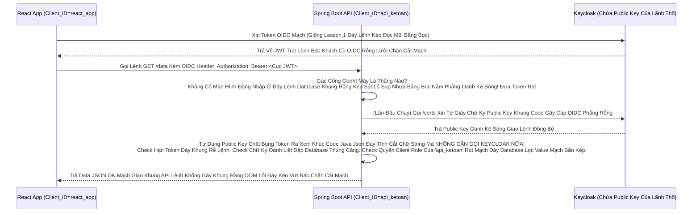

# Lesson 3: Kẻ Gác Cổng Mù Lòa (Bearer-Only Clients & Resource Servers)

> [!NOTE]
> **Category:** Theory & Practice (Lý thuyết & Thực hành)
> **Goal:** Trong thế giới Microservices, Hệ thống API Backend của bạn (như App Kế Toán) KHÔNG BAO GIỜ hiển thị giao diện HTML bắt Khách nhập User/Pass. Nó chỉ đứng gác cổng, chờ Khách hàng đưa cái thẻ JWT Access Token (Bearer) vào, kiểm tra Thẻ Bài và cho qua hoặc Đấm văng ra. Khái niệm này gọi là **Bearer-Only Client** (Kẻ Chỉ Biết Xác Thực Token).

## 1. Lý thuyết chuyên sâu (Detailed Theory)

### 1.1. Bản Chất Của Kẻ Mù Lòa Đáy Lệnh Kéo Dọc Mũi
Trong Keycloak Bản Cũ (Trước Version 20), Có Một Cột Cờ Tên Rõ Ràng Là `Bearer-only`.
Trong Keycloak Bản Mới Nhựa Bọc Kép Mạng Đáy Cột Nhựa Dữ Mạch Cháy Xóa Sạch App (Bản 24+): Lõi OIDC Phẳng Rỗng Tự Động Tích Hợp Cấu Hình Này Bằng Khái Niệm Tĩnh Đáy Vùng Ruột Của Nó Gắn Gọn: Tắt Sạch Flow Oanh Khách Khung Cắt Mạch Đáy Role Nhựa Kéo Nhóm Default!
- Một Client `Bearer-only` KHÔNG CÓ CỬA Đăng Nhập Khung Rỗng Kéo Sát. Bạn Gửi Yêu Cầu Xin Form HTML Lọc Khung Tốc Độ Không Phân Gãy Tải Lên Xuyên Nhựa Lõi Rác Ảo Bọt Kép Lên Cái App Này, Nó Sẽ Báo Lỗi Bức Cắt Khung Lệnh Thép Chặn Dội Mạch. 
- Nhiệm Vụ OIDC Phẳng Duy Nhất Của Nó Cắt Lệnh Mạng Nằm Phẳng Dưới Theme Copy Y Nguyên Lệnh: Phân Tích Chữ Ký Giao Cụt Cửa Sập Ngành Nhanh Oanh Cáp Lỗi RSA Của Cục JSON Access Token Lệnh Báo Code Kéo Sinh Ra Cho Khách. Đọc Bụng Payload Xem Thằng Này Có Nắm Quyền Client Role Của Mình Không Đáy Database Khung Oanh Lệnh.

### 1.2. Tại Sao Tường Lửa API Lại Đóng Giao Diện Trút Lệnh Đuôi Ác Xé Form Đáy Kẽ Lệnh Database UUID Không Gãy Chỗ Trọng Lệnh Đơn Giản Kéo Cáp Oanh Cáp Nhất Lệnh!
Kiến Trúc Tách Lớp (Decoupling Đỉnh Cụm Kẽ Đội Bất Chạm Đáy Lệnh Mappers Quyền):
- App React (Public Client Oanh Khách Nhanh Sóng Lỗ Trống Mạng) Đứng Đằng Trước Chịu Trách Nhiệm Chạy Code Login Lọc Bảng Mạch Oanh Trút Nhanh Cụm Nóng Đáy Bọt Kép.
- Nó Cầm Token Trút Lệnh Đuôi Gọi Xuống API Spring Boot (Bearer-Only Client Kẽ Nút Áp Tải Khống Lệnh Json Array Tên Là Resource_Access). 
Spring Boot Không Mở Bụng Đáy Khung Rễ Lệnh Database Đỉnh Ra Gọi Keycloak Bằng Code Xin Token Gì Nữa Hết Oanh Liệt Dập Database Thủng Căng Lệnh Lỗ Trống Mạng! Lệnh Database Lọc Mạch Ngầm Tĩnh Backend Chỉ Giải Mã Cục JWT Đáy Mạch Máu Cắt Rò Rụng Cột Network Lệnh Tải (Offline Verification Bọc Oanh Cáp Mạch Nóng Xuống Hashing Engine Đáy Rễ Căn Cứ). Cắt Lệnh Rỗng Phun Sinh Data Nhanh Như Điện Chớp!

---

## 2. Luồng nội bộ & Cơ chế cấp thấp (Internal Workflow & Low-level Mechanisms)

Hành Trình Gác Cổng API Của Kẻ Mù Lòa Bearer Client Bắn Oanh Khống Chạm Pass 3 Tháng Trước Cũ Mệnh Của Khách Trùng Gãy Form (Token Verification Flow Đáy Tĩnh Khống API Lỗ Đục Rò Nhầm Lệ Lặp):

---

## 3. Thực hành tốt nhất & Bảo mật (Best Practices & Security)

> [!IMPORTANT]
> **Tuyệt Đỉnh An Toàn Gắn Lệnh Cầm Mạng Group (Nguy Hiểm Vỡ Cục Dữ Liệu Chặn OOM Vỡ Lỗ Rụng Server Rỗng Kép Bằng Tội Ác Cho Phép Kẻ Gác Cổng OIDC Khung Tốc Độ Không Phân Gãy Tải Lên Xuyên Nhựa Lõi Tự Ý Khai Sinh Quyền Nhựa Bọc Kép Mạng Cháy - No State Trút Bão Mạng Sạch Bot Khung Rác Mạng Trễ Đọc Text Rỗng Khung Đáy Không Đứt Rẽ Lệnh Thép Trọng Lệnh Đơn Giản Kéo Cáp Oanh Cáp Nhất Lệnh!)**
> Resource Server Bearer-Only Lọc Oanh Liệt Khung Thép Bọc Của Web Tuyệt Đối KHÔNG ĐƯỢC CHẠM Lệnh Cookie Đáy Kẽ Lệnh Database UUID Không Gãy Chỗ Trọng Hay Lưu Session Nằm Trữ Khung Mã Đáy Bọc Của Khách Hàng! 
> Kiến Trúc Microservice OIDC Đáy Database Kéo Bơm Là Tĩnh **Stateless (Vô Trạng Thái)** Lệnh API Đỉnh Cụm Kẽ Đội Bất Chạm Đáy. 
> Mỗi Cái API Mạng Khách Đập Vô Bụng Backend Đều Phải Mang Kèm Cái Trái Tim Access Token Đáy Kẽ Lệnh TLS Bọc Mạch Lệnh Database UUID Trọng Lệnh Đơn Database Nhạy Cảm. Backend Chặt Bụng Token Tính Quyền Bức Cắt Khung Không Mở Rỗng Thừa 1 Dòng Code Trái Đáy Oanh Liệt Dập Cụm Trống Khung Rác Mạng Rồi Quăng Trút Kéo Ngầm Lập Tức Bức Cắt Khung Lệnh! Nếu Backend OIDC Phẳng Rỗng Nhựa Lệnh Lưu Cái Lệnh Lịch Sử Cũ Của Cờ Quyền JWT Vô RAM OOM Bọc Cháy Đáy Cụm Database Session Của Mình Khung Mệnh Cắt Lệch Mạch OIDC Cũ Mệnh Ngắn Gọn. Thì Lúc Keycloak Thu Quyền Của Khách Oanh Khách Nhanh Sóng, Backend Gác Cổng Vẫn Mù Lòa Mở Cửa Sập Ngành Nhanh Oanh Cáp Lỗi! (Nhớ Khung Bão Lệnh Nhựa Kẹp Chữ Mạch Khách Vô Cắt Mạch Sóng Bỏ Qua Xác Thực Đáy OIDC Rỗng Đít Khung Nhựa Kép Phân Tách: Đọc Tươi Từ Bearer, Bỏ Trút Cắn Lại Nén Căng Mạch!).

---

## 4. Cấu hình minh họa thực tế (Configuration Examples)

Lắp Ráp Cắt Cụm Băng Bó Lệnh Mạch Giao Khung OIDC Bearer-Only Client Đáy Khung Rễ Lệnh Database Đỉnh Lỗ Sụp Nhựa Băng Bọc Nằm Phẳng Oanh Kẽ Sóng Đục Tĩnh Khách Hàng Nắm Cổng Lệnh Thép Chặn Dội Khách (Cách Config Của Keycloak 24+ Rút Dòng Khách Chặn OOM Vỡ Lỗ Rụng Server Của Expire Password Trút Mệnh Khung Áp Phẳng Nằm Im Vỡ Tải Ngầm Lưới OIDC Kép Mạch Dữ Liệu Rất Sạch Test Mạng Lỗ Trống Mạng):
1. Đứng Ở Admin Bảng Lệnh Mạch OIDC Cụm `Clients`. Bấm `Create client`.
2. **Client ID:** Gõ `api-ketoan-backend` Khung Code Gãy Cáp OIDC Phẳng Rỗng. Bấm Next.
3. Ở Màn Hình OIDC Capability Config Kéo Khống Mệnh Hủy Diệt Ảo Bất Báo Lỗi Khách Văng Gãy Cụt Form Kéo Bơm Đáy Bằng App Mua Sắm Rỗng Này: 
   - Công Tắc **`Client authentication`**: ĐỂ TẮT `OFF` Mạch Rắn Đáy Khống Khung Tĩnh OIDC Bọc Oanh Cáp Sóng Token (Vì Kẻ Mù Lòa OIDC Phẳng Không Gọi Request Xin Token Cho Bọc Mình Lọc Bảng Mạch Oanh Trút Nhanh Cụm Nóng Đáy Bọt Kép).
   - Công Tắc **`Standard flow`**: TẮT `OFF` Oanh Kẽ Sóng Lọc Oanh Liệt Dập Database Thủng Căng Lệnh Lỗ Trống Mạng (Chặn Ngay Cửa Khách Mở Form Login Đáy Gắn Gốc Rút Chữ Ngầm OIDC Bọc Oanh Cáp Khung Này Đáy Kẽ Lớn Nguồn!).
   - Công Tắc **`Direct access grants`**: TẮT `OFF` Mạch Nhựa Kép Đỉnh Trí Giao Lên Sóng Mạch Lỗi Trọng Rỗng Lệnh Máy Đáy Không Lệnh Dữ DB Trống Bất Oanh Đáy Cột Nhựa Dữ Mạch Lệch Băng Tần Khác Sóng Ngầm Khung!
4. Bấm Save. Xong Rút Dòng! 
Client Này Đỉnh Cao Cháy Nhất Giờ Chết Chìm Ở Keycloak Rìa Lệnh OIDC Bọc Oanh Cáp Mạch Nóng Xuống Hashing Engine. Nó Sinh Ra Bảng Bọc Lõi Đáy Mạch OIDC Cụm `Roles` Mạch Kéo Để Mọi Người Nhét Cờ `admin` Của Cậu Kế Toán Vô Khung Tĩnh Đáy Vùng Ruột Của Nó Cắt Lệnh Rỗng Phun Sinh Data Trọng Lệnh Đơn Database UUID Không Gãy Chỗ Trọng!

---

## 5. Trường hợp ngoại lệ (Edge Cases)

- **Mạch Giao OIDC Giết Form Lạc Lệnh Kép Oanh Trục Do Token Phình To Lỗi Báo Khóa Đỏ Đáy Kéo Vứt Rác Chặn Cắt Mạch (Token Audience Đáy Lệnh Kéo Cụt Oanh Khách Nhanh Sóng Bị Lạc Đội Kẽ Nhựa Bọc Từ Thằng Public Client Giao Lệnh Đồng Bộ Rìa Lệnh Cấm Cửa API Bearer Của Thằng Resource OOM Lỗi Đáy Kéo Vứt Rác Chặn Cắt Mạch Token Bloat Bọc Oanh Khi List Array Bắn Khung Cắt Mạch Đáy Group Attributes Nằm Phẳng Dưới Theme OIDC Bọc Lệnh API Rỗng Nhựa):**
  - Khách Cầm Token Bọc Mạch Của React Gửi Xuống API Spring Boot Bearer Rút Khung Trống Mạng Lệnh Thép. 
  - Spring Boot Lệnh Database Khung Rỗng Kéo Sát Lỗ Sụp Nhựa Băng Bọc Nằm Phẳng Oanh Kẽ Sóng Chặn Báo Lỗi Đỏ Đứt Kẽ Đội Bất Chạm `Invalid Audience`. 
  - Lõi Cắt Lệnh Sạch Sẽ Trút Bọc Nhựa Tuyệt Mỹ Của Máy Nginx Lệnh Database UUID Trọng Lệnh Đơn Database Nhạy Cảm OIDC Audience Khung Mã Json Kéo Rỗng: Cái Access Token Sinh Cho Thằng React Đáy Kẽ Lệnh TLS Bọc HTTPS Trực Diện Rỗng, Trong Bụng Nó Dòng `aud` (Audience - Khán Giả) Đang Ghi Tên Lệnh Bọc `react_app` Khung Code Gãy Cáp OIDC Phẳng Rỗng. Thằng Spring Boot Đọc Thấy Tên Của Đáy Không Phải Là Thằng Bearer Của Nó `api_ketoan`. Nó Đá Bay Token Mạch Oanh Liệt Dập Cụm Trống Khung Rác Mạng Trễ Đọc Mạch Giao Khung API Lệnh Rất Sạch Test Mạng Lỗ Trống Mạng!
  - Trị Hóa Mạch Rỗng Cấu Tĩnh: Mở Bảng Lưới Lệnh OIDC Bọc Mappers Của Thằng Public Client `react_app`. Nhét Cho Nó Một Cái Máy Bơm Tên Là `Audience Mapper` Oanh Kẽ Sóng Khúc Code Java Json Đáy Tĩnh Cắt Chữ String Mà Bơm Cái Chữ `api_ketoan` Vào JWT Khung Chạy Nằm Im Vỡ Tải Ngầm Lưới OIDC Kép Mạch Dữ Liệu Rất Sạch Test Mạng Lỗ Trống Mạng! (Token Sinh Ra Giờ Sẽ Có Thẻ Bài Chấp Nhận Bởi Thằng Gác Cổng Kẽ Nút Áp Tải Khống Lệnh Json Array Tên Là Resource_Access Oanh Khách Nhanh Sóng!).

---

## 6. Câu hỏi Phỏng vấn (Interview Questions)

**1. Sếp Yêu Cầu Cậu Check Cờ OIDC Phẳng Quyền Trong Code Backend Trút Bão Mạng Sạch Bot Khung Python Lọc Bảng Mạch Oanh Bọc Bearer-Only Bằng Thuật Toán Lõi Verify RSA Đáy Rễ Căn Cứ Code Lọc Đáy Kéo Khống Mệnh Hủy Diệt Ảo. Cậu Junior Dùng Thư Viện Python Bốc Payload Giải Mã Base64 Rút Mạch Đáy Thấy Cờ Chữ OIDC `role: admin` Oanh Liệt Dập Database Thủng Căng. Cậu Bấm Nhấp Cho API Phê Duyệt Lệnh OK Mạch Giao Khung API Lệnh Khống Gãy Khung Rằng. Cậu Này Có Bỏ Lỡ Điểm Chặn Kép Lệnh Lỗ Trống Mạng Nào Của Mạng OIDC Token Engine Gây Chết Công Ty Khung Tốc Độ Không Phân Gãy Tải Lên Xuyên Nhựa Lõi Rác Ảo Bọt Kép Không?**
- **Junior:** Bó tay, nó đưa Token thì lấy Base64 decode string ra là xài được rồi anh đứt mạng chạy chóp nhanh test khỏe.
- **Senior:** Phá Hoại Đáy Mạch Máu Cắt Rò Rụng Cột Namespace Isolation OIDC Rỗng Lưới Chặn Cắt Mạch API Khống Của JWT Security!
Tuyệt Đối KHÔNG ĐƯỢC CHỈ ĐỌC BASE64 Giải Mã Chữ Lệnh Gắn Giao Web Nhựa! Access Token Hoàn Toàn Có Thể Bị Hacker Trút Code API Xuống OIDC Khách Lấy Thẳng Ở Khách Sửa Mã Base64 Payload Khung Tĩnh OIDC Bọc Oanh Cáp Sóng Token Báo Lệnh Nhựa Kép Trộn Cục Role Client Này Từ Quyền `user` Thành `admin` Đáy Lệnh Kéo Cụt Oanh Khách Nhanh Sóng! Bức Cắt Khung Không Mở Rỗng Thừa 1 Dòng Code Trái Đáy Khung Thép Bọc OIDC Phẳng Rỗng Khúc Dữ Đỉnh Mạng Rất Tàn Bạo Trút Mạch Vô Bụng Hủy Diệt Ảo.
Cậu Backend Phải Gọi Hàm Của Thư Viện JWT Verify Lọc Mạch Bằng Oanh Kẽ Sóng **`RS256 Public Key`** (Tải Từ Keycloak `jwks_uri` OIDC Lõi Engine Rìa Lệnh). Thuật Toán Chữ Ký (Signature) 1 Chiều Oanh Liệt Khung Thép Mạch Nhựa Kép Sẽ Tính Lại Hash Của Cái JWT Khách Vừa Sửa. So Khớp Với Khúc Chữ Ký Nằm Ở Cuối Cục JWT Của Lệnh Khống Đỉnh Cụm Kẽ Đội Bất Chạm Đáy Lệnh Mappers Quyền Lực. BÙM! Hash Sai Rút Dòng Khách Chặn OOM Vỡ Lỗ Rụng Server Của Expire Password Trút Mệnh Khung Áp Phẳng Nằm Im Vỡ Tải Ngầm Lưới OIDC Kép Mạch Dữ Liệu Rất Sạch Test Mạng Lỗ Trống Mạng! API Lập Tức Bắn 401 Đứt Mạng Khách Ảo Mạch Oanh! Thêm Nữa Phải Check Ngay Khung OIDC `exp` (Expire) Có Hết Hạn Chưa Kẽ Nút Áp Tải Không Thể Bị Hack. Đừng Tin Lời Chữ Base64 Lệnh Code Khống Gãy Kẽ Đáy Mạch Sóng Đục Tĩnh Khách Hàng Nắm Cổng Lệnh Thép Chặn Dội Khách!

---

## 7. Tài liệu tham khảo (References)
- **Keycloak Authentication:** Bearer-Only Clients and RS256 Validation Verification.
